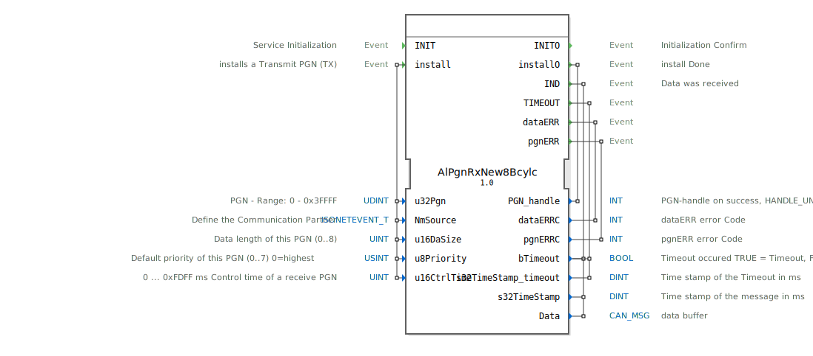

# AlPgnRxNew8Bcylc

```{index} single: AlPgnRxNew8Bcylc
```


* * * * * * * * * *
## Einleitung
Der Funktionsblock `AlPgnRxNew8Bcylc` dient dem zyklischen Empfang von Daten über ein ISOBUS-Netzwerk gemäß dem Parameter Group Number (PGN) Protokoll. Er ermöglicht die Konfiguration und Überwachung von Empfangskanälen für spezifische PGNs, inklusive der Handhabung von Timeouts und Fehlerzuständen. Der Block ist für den Einsatz in Steuerungssystemen konzipiert, die eine zuverlässige und überwachte Kommunikation mit anderen ISOBUS-Geräten erfordern.



## Schnittstellenstruktur

### **Ereignis-Eingänge**
*   **INIT**: Initialisiert den Funktionsblock.
*   **install**: Installiert einen neuen Empfangskanal für eine spezifische PGN. Löst die Konfiguration mit den zugehörigen Daten-Eingängen aus.

### **Ereignis-Ausgänge**
*   **INITO**: Bestätigt die abgeschlossene Initialisierung.
*   **installO**: Signalisiert den Abschluss einer Installationsanfrage. Liefert den zugewiesenen `PGN_handle`.
*   **IND**: Wird ausgelöst, wenn neue Daten für die konfigurierte PGN empfangen wurden.
*   **TIMEOUT**: Signalisiert, dass für die konfigurierte PGN ein Timeout aufgetreten ist.
*   **dataERR**: Zeigt einen Fehler bei den empfangenen Daten an.
*   **pgnERR**: Zeigt einen Fehler im Zusammenhang mit der PGN-Konfiguration oder -Verarbeitung an.

### **Daten-Eingänge**
*   **u32Pgn** (UDINT): Die zu empfangende Parameter Group Number (PGN). Gültiger Bereich: 0 bis 0x3FFFF.
*   **NmSource** (isobus::pgn::ISONETEVENT_T): Definiert den Kommunikationspartner (Netzwerk-Management-Quelle).
*   **u16DaSize** (UINT): Die zu erwartende Datenlänge der PGN in Bytes (0..8).
*   **u8Priority** (USINT): Die Standard-Priorität dieser PGN (0..7, wobei 0 die höchste Priorität ist). Initialwert: 7.
*   **u16CtrlTime** (UINT): Die Kontrollzeit (Timeout-Zeit) für den Empfang dieser PGN in Millisekunden (0 ... 0xFDFF ms). Ein Wert von 0 deaktiviert die Timeout-Überwachung.

### **Daten-Ausgänge**
*   **PGN_handle** (INT): Ein Handle, das den erfolgreich installierten Empfangskanal identifiziert. Im Fehlerfall wird `HANDLE_UNVALID` ausgegeben.
*   **dataERRC** (INT): Fehlercode, der bei Auslösung des `dataERR`-Ereignisses gesetzt wird.
*   **pgnERRC** (INT): Fehlercode, der bei Auslösung des `pgnERR`-Ereignisses gesetzt wird.
*   **bTimeout** (BOOL): Zeigt an, ob ein Timeout aufgetreten ist (`TRUE` = Timeout, `FALSE` = kein Timeout). Initialwert: `FALSE`.
*   **s32TimeStamp_timeout** (DINT): Zeitstempel des aufgetretenen Timeouts in Millisekunden.
*   **s32TimeStamp** (DINT): Zeitstempel der zuletzt empfangenen Nachricht in Millisekunden. Initialwert: -1.
*   **Data** (isobus::pgn::CAN_MSG): Puffer, der die empfangenen Nutzdaten enthält.

### **Adapter**
Dieser Funktionsblock verwendet keine Adapter.

## Funktionsweise
1.  **Initialisierung**: Durch das `INIT`-Ereignis wird der Funktionsblock betriebsbereit gemacht. Die Bestätigung erfolgt über `INITO`.
2.  **Kanalinstallation**: Ein Empfangskanal wird durch das `install`-Ereignis konfiguriert. Die dazugehörigen Parameter (`u32Pgn`, `NmSource`, `u16DaSize`, `u8Priority`, `u16CtrlTime`) definieren den gewünschten Datenstrom. Bei Erfolg wird ein eindeutiger `PGN_handle` zurückgegeben (`installO`). Bei Fehlern werden `pgnERR` oder `dataERR` ausgelöst.
3.  **Zyklischer Empfang**: Sobald ein Kanal installiert ist, lauscht der Block auf Nachrichten der konfigurierten PGN von der angegebenen Quelle. Bei Empfang einer gültigen Nachricht werden die Daten im `Data`-Ausgang bereitgestellt und das `IND`-Ereignis ausgelöst. Der `s32TimeStamp` wird aktualisiert.
4.  **Timeout-Überwachung**: Ist `u16CtrlTime` > 0, überwacht der Block die Zeit zwischen empfangenen Nachrichten. Wird innerhalb dieses Zeitfensters keine neue Nachricht empfangen, wird das `TIMEOUT`-Ereignis ausgelöst, `bTimeout` auf `TRUE` gesetzt und `s32TimeStamp_timeout` aktualisiert.
5.  **Fehlerbehandlung**: Protokollfehler oder ungültige Konfigurationen führen zur Auslösung der entsprechenden Fehlerereignisse (`dataERR`, `pgnERR`) mit zugehörigem Fehlercode.

## Technische Besonderheiten
*   Der Block unterstützt die spezifischen Datentypen `isobus::pgn::CAN_MSG` und `isobus::pgn::ISONETEVENT_T` aus der ISOBUS-PGN-Bibliothek.
*   Die Timeout-Überwachung ist optional und kann durch Setzen von `u16CtrlTime` auf 0 deaktiviert werden.
*   Der `PGN_handle` dient als Referenz für den installierten Kanal und kann für spätere Verwaltungsoperationen (z.B. Deinstallation) notwendig sein.

## Zustandsübersicht
1.  **Nicht initialisiert**: Nach dem Start. Auf `INIT` wartend.
2.  **Bereit**: Nach erfolgreicher Initialisierung (`INITO`). Kann `install`-Anfragen entgegennehmen.
3.  **Empfangsbereit (Kanal aktiv)**: Nach erfolgreicher Installation eines Kanals (`installO`). Überwacht den Bus auf die konfigurierte PGN und löst `IND` bei Empfang oder `TIMEOUT` bei Überschreitung der Kontrollzeit aus.
4.  **Fehlerzustand**: Wird durch die Ereignisse `pgnERR` oder `dataERR` signalisiert. Der genaue Fehler ist dem jeweiligen Fehlercode zu entnehmen. Der Block kann in der Regel nach Behebung der Ursache weiter verwendet werden.

## Anwendungsszenarien
*   **Landmaschinensteuerung**: Empfang von Arbeitsgerätedaten (z.B. Drillmaschinen-Status) von einem Anbaugerät am ISOBUS.
*   **Fahrzeugdiagnose**: Zyklischer Empfang von Motordaten (Drehzahl, Temperatur) zur Anzeige und Überwachung im Terminal.
*   **Implement Control**: Empfang von Sollwerten (z.B. Soll-Tiefe) von einer Bedienkonsole für einen hydraulischen Unterlenker.

## ⚖️ Vergleich mit ähnlichen Bausteinen
Im Gegensatz zu generischen CAN-Empfangsblöcken ist `AlPgnRxNew8Bcylc` speziell auf das ISOBUS-PGN-Protokoll zugeschnitten. Er bietet höhere Abstraktion durch direkte PGN-Adressierung, integrierte Partnererkennung (`NmSource`) und automatische Timeout-Verwaltung. Einfache Empfangsblöcke würden diese Protokollschicht und Verwaltungsfunktionen nicht bereitstellen.


## 🛠️ Zugehörige Übungen

* [Uebung_131](../../../../../training1/Ventilsteuerung/4diacIDE-workspace/test_B/Uebungen_doc/Uebung_131.md)

## Fazit
Der `AlPgnRxNew8Bcylc` ist ein essentieller Baustein für robuste ISOBUS-Anwendungen, die zyklische Daten von anderen Netzwerkteilnehmern empfangen müssen. Durch seine integrierten Funktionen zur Kanalverwaltung, Zeitüberwachung und Fehlererkennung vereinfacht er die Entwicklung zuverlässiger Kommunikationsschnittstellen erheblich und entlastet den Applikationsentwickler von niedriglegigen Protokolldetails.