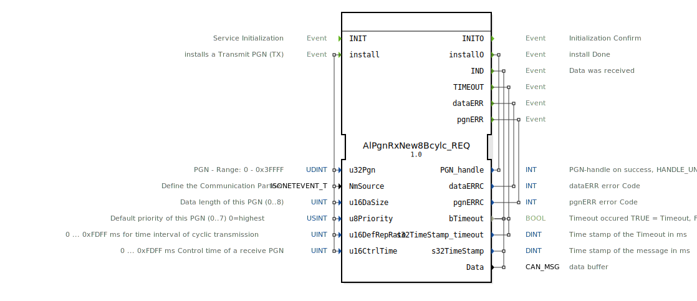

# AlPgnRxNew8Bcylc_REQ

```{index} single: AlPgnRxNew8Bcylc_REQ
```


* * * * * * * * * *
## Einleitung
Der Funktionsblock `AlPgnRxNew8Bcylc_REQ` dient zur zyklischen Anforderung von Daten über ein CAN-Netzwerk gemäß dem ISOBUS-Standard (ISO 11783). Sein Hauptzweck ist die Installation und Verwaltung von Empfangsparametern für spezifische Parameter Group Numbers (PGNs). Der Baustein ermöglicht die Konfiguration eines zyklischen Empfangs und überwacht den Datenfluss, indem er bei erfolgreichem Empfang, bei Timeouts oder bei Fehlern entsprechende Ereignisse auslöst.



## Schnittstellenstruktur

### **Ereignis-Eingänge**
*   **INIT**: Initialisiert den Funktionsblock.
*   **install**: Löst die Installation einer Empfangs-PGN (RX) mit den zugehörigen Konfigurationsparametern aus. Die mitgeführten Daten sind: `u32Pgn`, `NmSource`, `u16DaSize`, `u8Priority`, `u16DefRepRate`, `u16CtrlTime`.

### **Ereignis-Ausgänge**
*   **INITO**: Bestätigt die abgeschlossene Initialisierung.
*   **installO**: Signalisiert den Abschluss des Installationsvorgangs. Führt den `PGN_handle` als Ergebnis mit.
*   **IND**: Wird ausgelöst, wenn neue Daten empfangen wurden. Führt `bTimeout`, `s32TimeStamp` und `Data` mit.
*   **TIMEOUT**: Wird bei einem Kontrollzeit-Timeout ausgelöst. Führt `bTimeout` und `s32TimeStamp_timeout` mit.
*   **dataERR**: Zeigt einen Fehler bei den empfangenen Daten an. Führt den Fehlercode `dataERRC` mit.
*   **pgnERR**: Zeigt einen Fehler bei der PGN-Verarbeitung an. Führt den Fehlercode `pgnERRC` mit.

### **Daten-Eingänge**
*   **u32Pgn** (UDINT): Die zu empfangende Parameter Group Number (PGN). Gültiger Bereich: 0 bis 0x3FFFF.
*   **NmSource** (isobus::pgn::ISONETEVENT_T): Definiert den Kommunikationspartner (z.B. eine bestimmte Node-Adresse).
*   **u16DaSize** (UINT): Die zu erwartende Datenlänge der PGN in Bytes (0..8).
*   **u8Priority** (USINT): Die Standard-Priorität für diese PGN (0..7, wobei 0 die höchste Priorität ist). Initialwert: 7.
*   **u16DefRepRate** (UINT): Das erwartete zyklische Sendeintervall der Quell-PGN in Millisekunden (0 ... 0xFDFF ms).
*   **u16CtrlTime** (UINT): Die Kontrollzeit in Millisekunden (0 ... 0xFDFF ms), nach deren Überschreitung ohne Empfang ein `TIMEOUT`-Ereignis generiert wird.

### **Daten-Ausgänge**
*   **PGN_handle** (INT): Ein Handle (Bezeichner) für die erfolgreich installierte PGN. Im Fehlerfall wird ein ungültiger Handle (HANDLE_UNVALID) zurückgegeben.
*   **dataERRC** (INT): Fehlercode, der bei einem `dataERR`-Ereignis ausgegeben wird.
*   **pgnERRC** (INT): Fehlercode, der bei einem `pgnERR`-Ereignis ausgegeben wird.
*   **bTimeout** (BOOL): Statusflag für einen aufgetretenen Timeout. `TRUE` = Timeout ist eingetreten, `FALSE` = kein Timeout. Initialwert: `FALSE`.
*   **s32TimeStamp_timeout** (DINT): Zeitstempel in Millisekunden, zu dem der Timeout erkannt wurde.
*   **s32TimeStamp** (DINT): Zeitstempel in Millisekunden des zuletzt empfangenen gültigen Datensatzes. Initialwert: -1.
*   **Data** (isobus::pgn::CAN_MSG): Puffer, der die empfangenen CAN-Nachrichtendaten enthält.

### **Adapter**
Dieser Funktionsblock verwendet keine Adapter-Schnittstellen.

## Funktionsweise
1.  **Initialisierung**: Durch das `INIT`-Ereignis wird der Baustein in einen betriebsbereiten Grundzustand versetzt, was durch `INITO` quittiert wird.
2.  **PGN-Installation**: Das `install`-Ereignis konfiguriert eine neue Empfangs-PGN. Alle notwendigen Parameter (PGN, Quelle, Datenlänge, etc.) werden übergeben. Bei erfolgreicher Konfiguration antwortet der Block mit `installO` und liefert einen gültigen `PGN_handle`. Bei Fehlern werden `pgnERR` oder `dataERR` ausgelöst.
3.  **Zyklischer Empfang**: Nach erfolgreicher Installation überwacht der Baustein den CAN-Bus auf Nachrichten der konfigurierten PGN und Quelle.
4.  **Datenindikation**: Bei Empfang einer gültigen Nachricht wird das `IND`-Ereignis ausgelöst. Die Daten (`Data`), ein Zeitstempel (`s32TimeStamp`) und der Timeout-Status (`bTimeout=FALSE`) werden ausgegeben.
5.  **Timeout-Überwachung**: Überschreitet die Zeit seit dem letzten empfangenen Paket die konfigurierte `u16CtrlTime`, wird das `TIMEOUT`-Ereignis ausgelöst. `bTimeout` wird auf `TRUE` gesetzt und ein Zeitstempel (`s32TimeStamp_timeout`) bereitgestellt.
6.  **Fehlerbehandlung**: Treten Protokoll- oder Datenfehler auf, werden die Ereignisse `pgnERR` bzw. `dataERR` mit den entsprechenden Fehlercodes generiert.

## Technische Besonderheiten
*   Der Baustein ist speziell für den Einsatz in ISOBUS-Umgebungen (Landtechnik) vorgesehen und nutzt typsichere Datentypen aus der `isobus::pgn`-Bibliothek (`CAN_MSG`, `ISONETEVENT_T`).
*   Die Timeout-Überwachung (`u16CtrlTime`) ist unabhängig vom erwarteten Sendeintervall (`u16DefRepRate`) und dient der Robustheit, um ausgefallene Kommunikationspartner zu erkennen.
*   Der `PGN_handle` ermöglicht die eindeutige Identifikation und spätere Verwaltung (z.B. Deinstallation) einer konfigurierten PGN-Instanz innerhalb einer Applikation.

## Zustandsübergangsübersicht
1.  **Nicht initialisiert**: Nach dem Start. Auf `INIT` wartend.
2.  **Bereit**: Nach `INITO`. Kann `install`-Anfragen entgegennehmen.
3.  **Installiert**: Nach erfolgreichem `installO`. Überwacht aktiv den CAN-Bus auf die konfigurierte PGN.
    *   Bei Empfang: Übergang in Zustand "Daten verfügbar" (löst `IND` aus), danach Rückkehr zu "Installiert".
    *   Bei Timeout: Löst `TIMEOUT` aus, bleibt im Zustand "Installiert" (weitere Überwachung).
    *   Bei Fehler: Löst `pgnERR`/`dataERR` aus, bleibt im Zustand "Installiert".

## Anwendungsszenarien
*   **ISOBUS-Implementierungen**: Empfang von zyklischen Daten (z.B. Drehzahl, Druck, Position) von einem Steuergerät (ECU) eines Anbaugeräts im Traktor.
*   **Überwachungsfunktionen**: Kontinuierliche Überprüfung, ob eine kritische Komponente (z.B. Motorsteuerung) noch "lebendig" ist und Daten sendet (mittels `CtrlTime`).
*   **Datenlogger**: Zyklisches Sammeln von Prozessdaten aus dem CAN-Netzwerk für Analyse- oder Speicherzwecke.

## ⚖️ Vergleich mit ähnlichen Bausteinen
*   **E_CTU vs. AlPgnRxNew8Bcylc_REQ**: Ein einfacher Zähler (`E_CTU`) hat keine Netzwerkfunktionalität. Dieser Baustein ist ein spezialisierter, anwendungsnaher Kommunikationsblock für ein bestimmtes Protokoll (ISOBUS).
*   **Generische CAN-RX-Blöcke**: Im Gegensatz zu Blöcken, die rohe CAN-IDs und Daten empfangen, arbeitet dieser Block auf der höheren, standardisierten PGN-Ebene des ISOBUS und übernimmt die protokollspezifische Dekodierung und Parameterverwaltung.


## 🛠️ Zugehörige Übungen

* [Uebung_133](../../../../../training1/Ventilsteuerung/4diacIDE-workspace/test_B/Uebungen_doc/Uebung_133.md)

## Fazit
Der `AlPgnRxNew8Bcylc_REQ` ist ein essentieller Baustein für die Implementierung von ISOBUS-konformen Empfangsfunktionalitäten in 4diac. Er abstrahiert die Komplexität der CAN-Kommunikation und bietet eine saubere, ereignisgesteuerte Schnittstelle zur zuverlässigen, zyklischen Datenerfassung mit integrierter Fehler- und Timeout-Erkennung. Seine Verwendung erhöht die Wiederverwendbarkeit und Robustheit von Steuerungsapplikationen in der Landtechnik.