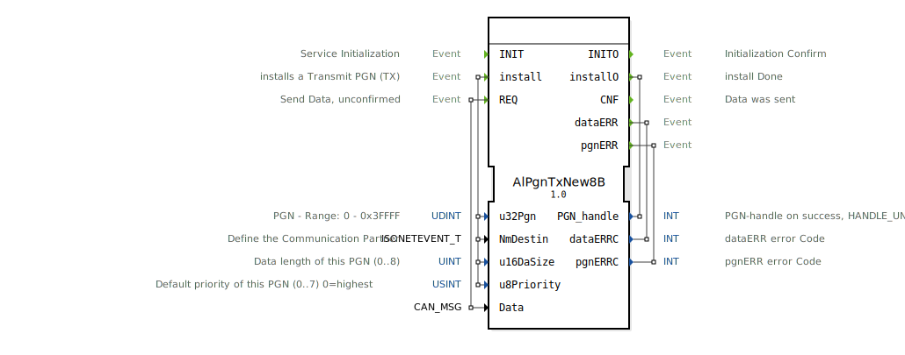

# AlPgnTxNew8B

```{index} single: AlPgnTxNew8B
```


* * * * * * * * * *
## Einleitung
Der Funktionsblock `AlPgnTxNew8B` dient zum Senden von Daten über ein CAN-Netzwerk gemäß dem ISOBUS-Standard (ISO 11783). Sein Hauptzweck ist die Installation und Verwaltung von Parameter Group Numbers (PGNs) für die Übertragung (TX) und das anschließende Senden von Datenpaketen, sobald ein lokales Sendeereignis (`REQ`) eintritt. Er ist für Anwendungen konzipiert, die eine unbestätigte (unconfirmed) Datenübertragung erfordern.



## Schnittstellenstruktur

### **Ereignis-Eingänge**
*   **`INIT`**: Startet die Initialisierung des Funktionsblocks.
*   **`install`**: Löst die Installation einer neuen Transmit-PGN (TX-PGN) aus. Die Installation wird mit den über `With` verknüpften Daten-Eingängen (`u32Pgn`, `NmDestin`, `u16DaSize`, `u8Priority`) konfiguriert.
*   **`REQ`**: Löst den Sendevorgang für die zuvor installierte PGN aus. Die zu sendenden Daten werden über den mit `With` verknüpften Daten-Eingang `Data` bereitgestellt.

### **Ereignis-Ausgänge**
*   **`INITO`**: Bestätigt den erfolgreichen Abschluss der Initialisierung (`INIT`).
*   **`installO`**: Bestätigt den Abschluss der PGN-Installation. Liefert über `PGN_handle` einen Handle für die installierte PGN oder einen Fehlerwert.
*   **`CNF`**: Bestätigt, dass die Daten erfolgreich gesendet wurden (Antwort auf `REQ`).
*   **`dataERR`**: Zeigt einen Fehler im Zusammenhang mit den zu sendenden Daten (`Data`) an. Liefert einen Fehlercode über `dataERRC`.
*   **`pgnERR`**: Zeigt einen Fehler im Zusammenhang mit der PGN-Installation oder -Verwendung an. Liefert einen Fehlercode über `pgnERRC`.

### **Daten-Eingänge**
*   **`u32Pgn`** (UDINT): Die zu installierende Parameter Group Number (PGN). Gültiger Bereich: 0 bis 0x3FFFF (dezimal 262143).
*   **`NmDestin`** (isobus::pgn::ISONETEVENT_T): Definiert den Kommunikationspartner (z.B. Broadcast, spezifische Adresse).
*   **`u16DaSize`** (UINT): Die Datenlänge der PGN in Bytes. Gültiger Bereich: 0 bis 8.
*   **`u8Priority`** (USINT): Die Priorität der Nachricht auf dem CAN-Bus. Bereich: 0 (höchste) bis 7 (niedrigste). Standardwert: 7.
*   **`Data`** (isobus::pgn::CAN_MSG): Die zu sendenden Daten, strukturiert als CAN-Nachricht.

### **Daten-Ausgänge**
*   **`PGN_handle`** (INT): Ein Handle (Bezeichner) für die erfolgreich installierte PGN. Im Fehlerfall wird der Wert `HANDLE_UNVALID` ausgegeben.
*   **`dataERRC`** (INT): Numerischer Fehlercode, der bei Auslösen des `dataERR`-Ereignisses gesetzt wird.
*   **`pgnERRC`** (INT): Numerischer Fehlercode, der bei Auslösen des `pgnERR`-Ereignisses gesetzt wird.

### **Adapter**
Dieser Funktionsblock verwendet keine Adapter-Schnittstellen.

## Funktionsweise
1.  **Initialisierung**: Durch das Ereignis `INIT` wird der Funktionsblock in einen betriebsbereiten Zustand versetzt. Die Bestätigung erfolgt über `INITO`.
2.  **PGN-Installation**: Das `install`-Ereignis konfiguriert eine spezifische PGN für die Datenübertragung. Dabei werden PGN-Nummer, Zieladresse, Datenlänge und Priorität festgelegt. Bei Erfolg wird ein `PGN_handle` über `installO` zurückgegeben. Bei einem Fehler (z.B. ungültige Parameter) wird das Ereignis `pgnERR` ausgelöst.
3.  **Datenversand**: Sobald ein `REQ`-Ereignis eintritt, versucht der Block, die im `Data`-Eingang bereitgestellte CAN-Nachricht unter Verwendung der zuvor installierten PGN-Konfiguration zu senden. Bei Erfolg wird das `CNF`-Ereignis ausgelöst. Tritt ein Fehler beim Senden auf (z.B. ungültige Daten), wird `dataERR` ausgelöst.

## Technische Besonderheiten
*   Der Block ist für die Übertragung von Datenpaketen mit einer maximalen Länge von 8 Byte ausgelegt (typisch für klassische CAN-Frames).
*   Er implementiert das unbestätigte Senden: Ein `CNF` bedeutet lediglich, dass die Nachricht zur Übertragung an die untere Protokollschicht übergeben wurde, nicht zwingend, dass sie den Empfänger erreicht hat.
*   Die Fehlerbehandlung ist in zwei Kategorien unterteilt: PGN-bezogene Fehler (`pgnERR`) und Datenbezogene Fehler (`dataERR`), was die Fehlerdiagnose erleichtert.
*   Der Block verwendet spezifische ISOBUS-Datentypen (`isobus::pgn::CAN_MSG`, `isobus::pgn::ISONETEVENT_T`).

## Zustandsübersicht
Der Block durchläuft implizit folgende Hauptzustände:
1.  **Nicht initialisiert**: Nach dem Start. Nur der `INIT`-Eingang ist aktiv.
2.  **Initialisiert / Bereit**: Nach `INITO`. Der Block kann nun PGNs installieren (`install`).
3.  **PGN installiert**: Nach erfolgreichem `installO`. Der Block ist bereit, Daten zu senden (`REQ`).
4.  **Sendeaktiv**: Während der Verarbeitung eines `REQ`. Übergang zu Zustand 3 nach `CNF` oder zu einem Fehlerzustand nach `dataERR`/`pgnERR`.

## Anwendungsszenarien
*   **Landmaschinensteuerung (ISOBUS)**: Senden von Maschinendaten (z.B. Arbeitsgeschwindigkeit, Zapfwellendrehzahl) an ein Terminal oder andere Steuergeräte im Traktor.
*   **Nutzfahrzeugkommunikation**: Übertragung von Fahrzeugdaten (z.B. Drehmoment, Verbrauch) innerhalb eines Truck-Bussystems.
*   **Industrielle Automatisierung**: Senden von Steuerbefehlen oder Statusinformationen über CAN-Netzwerke in Maschinen.

## Vergleich mit ähnlichen Bausteinen
*   **`E_SEND` (Standard 61499)**: Ein generischer Sende-Baustein. `AlPgnTxNew8B` ist spezialisiert auf ISOBUS/CAN mit PGN-Verwaltung, Priorisierung und Zieladressierung, während `E_SEND` protokollagnostisch ist und eine Adapterverbindung benötigt.
*   **Bestätigte Sende-Bausteine**: `AlPgnTxNew8B` sendet unbestätigt (`CNF`). Für bestätigte Kommunikation (Request/Response) wären andere, spezifischere TX-PGN-Blöcke oder Protokollstapel erforderlich.

## Fazit
Der `AlPgnTxNew8B` ist ein spezialisierter Funktionsblock für die zuverlässige, konfigurierbare und unbestätigte Datenübertragung in ISOBUS-Umgebungen. Seine klare Trennung von Konfiguration (`install`) und Operation (`REQ`) sowie die differenzierte Fehlerrückmeldung machen ihn gut wartbar und einfach in übergeordnete Applikationslogiken zu integrieren. Er ist die erste Wahl, wenn CAN-Nachrichten nach ISOBUS-Standard mit einer festen PGN gesendet werden müssen.