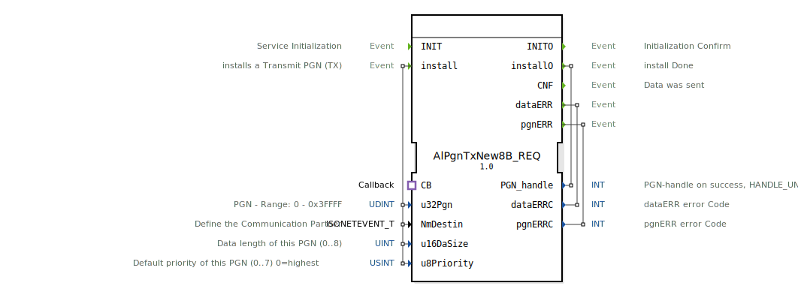

# AlPgnTxNew8B_REQ

```{index} single: AlPgnTxNew8B_REQ
```


* * * * * * * * * *
## Einleitung
Der Funktionsblock `AlPgnTxNew8B_REQ` dient zur Konfiguration und Steuerung der Übertragung von Parameter-Gruppen-Nummern (PGN) in einem ISOBUS-Netzwerk (J1939). Sein Hauptzweck ist die Installation eines neuen Transmit-PGN (TX-PGN) im Netzwerk. Der Baustein reagiert auf ein REQ-Ereignis (J1939-Netzwerkereignis) und bietet eine Callback-Schnittstelle zur asynchronen Rückmeldung über den Status der Datenübertragung. Er ist Teil einer spezialisierten Bibliothek für ISOBUS-Kommunikation.



## Schnittstellenstruktur

### **Ereignis-Eingänge**
*   **INIT**: Initialisiert den Funktionsblock. Muss vor der ersten Nutzung ausgelöst werden.
*   **install**: Löst die Installation eines neuen Transmit-PGN (TX) aus. Die Installation wird mit den an diesem Ereignis gebundenen Datenparametern (`u32Pgn`, `NmDestin`, `u16DaSize`, `u8Priority`) konfiguriert.

### **Ereignis-Ausgänge**
*   **INITO**: Bestätigt die erfolgreiche Initialisierung des Bausteins.
*   **installO**: Signalisiert den Abschluss der Installationsanfrage. Liefert den zugewiesenen `PGN_handle` oder im Fehlerfall einen ungültigen Handle.
*   **CNF**: Bestätigt, dass Daten erfolgreich gesendet wurden. Wird typischerweise über den Callback-Adapter ausgelöst.
*   **dataERR**: Zeigt einen Fehler im Zusammenhang mit den zu sendenden Daten an. Liefert einen Fehlercode über `dataERRC`.
*   **pgnERR**: Zeigt einen Fehler im Zusammenhang mit der PGN-Konfiguration oder -Verwaltung an. Liefert einen Fehlercode über `pgnERRC`.

### **Daten-Eingänge**
*   **u32Pgn** (UDINT): Die zu installierende Parameter-Gruppen-Nummer (PGN). Gültiger Bereich: 0 bis 0x3FFFF (dezimal 262143).
*   **NmDestin** (isobus::pgn::ISONETEVENT_T): Definiert den Kommunikationspartner (Zieladresse) für die PGN. Der genaue Typ wird durch die ISOBUS-Bibliothek definiert.
*   **u16DaSize** (UINT): Die Länge der Nutzdaten für diese PGN in Bytes. Gültiger Bereich: 0 bis 8.
*   **u8Priority** (USINT): Die Standard-Priorität für diese PGN. Gültiger Bereich: 0 (höchste) bis 7 (niedrigste). Initialwert: 7.

### **Daten-Ausgänge**
*   **PGN_handle** (INT): Ein Handle (Bezeichner) für die installierte PGN. Bei erfolgreicher Installation enthält er einen gültigen, positiven Wert. Im Fehlerfall wird ein ungültiger Handle (z.B. `HANDLE_UNVALID`) ausgegeben.
*   **dataERRC** (INT): Der spezifische Fehlercode, wenn ein `dataERR`-Ereignis auftritt.
*   **pgnERRC** (INT): Der spezifische Fehlercode, wenn ein `pgnERR`-Ereignis auftritt.

### **Adapter**
*   **CB** (Typ: `isobus::pgn::tx::Callback`): Ein Socket-Adapter, der eine Callback-Schnittstelle bereitstellt. Über diesen Adapter werden asynchrone Rückmeldungen (wie das `CNF`-Ereignis) vom zugrunde liegenden ISOBUS-Treibersystem an den Funktionsblock gemeldet. Dieser muss mit einem entsprechenden Plug-Adapter verbunden werden, um die Rückmeldungen zu empfangen.

## Funktionsweise
1.  **Initialisierung**: Zuerst muss das `INIT`-Ereignis ausgelöst werden, um den Baustein betriebsbereit zu machen. Dies führt zur Ausgabe von `INITO`.
2.  **PGN-Installation**: Das `install`-Ereignis startet den Konfigurationsvorgang. Der Baustein übergibt die Parameter `u32Pgn`, `NmDestin`, `u16DaSize` und `u8Priority` an das ISOBUS-Protokoll-Stack, um eine neue Sende-PGN zu registrieren.
3.  **Rückmeldung**: Nach der Verarbeitung der Installationsanfrage antwortet der Baustein mit dem `installO`-Ereignis und liefert den `PGN_handle`. Dieser Handle muss für spätere Sendeoperationen (z.B. mit einem separaten Sende-Baustein) verwendet werden.
4.  **Asynchrone Betriebsrückmeldungen**: Während des Betriebs, wenn Daten für die konfigurierte PGN gesendet werden, erfolgt die Bestätigung (`CNF`) oder Fehlermeldung (`dataERR`, `pgnERR`) asynchron über die jeweiligen Ereignisausgänge. Die Auslösung des `CNF`-Ereignisses wird typischerweise durch den Callback-Adapter (`CB`) gesteuert.

## Technische Besonderheiten
*   Der Baustein ist spezifisch für ISOBUS/J1939-Netzwerke und nutzt typsichere Datenstrukturen (`isobus::pgn::ISONETEVENT_T`).
*   Die Fehlerbehandlung ist aufgeteilt in `dataERR` (Datenfehler) und `pgnERR` (PGN-Konfigurationsfehler), was eine präzise Fehlerdiagnose ermöglicht.
*   Die Kommunikation mit dem eigentlichen Netzwerk-Stack erfolgt über eine Callback-Schnittstelle (`CB`-Adapter), die eine lose Kopplung und asynchrone Benachrichtigung ermöglicht.
*   Der `PGN_handle` dient als abstrakter Verweis auf die intern verwaltete PGN-Instanz.

## Zustandsübersicht
Der Baustein durchläuft implizit folgende Hauptzustände:
1.  **Nicht initialisiert**: Vor dem ersten `INIT`-Ereignis.
2.  **Bereit**: Nach erfolgreicher Initialisierung (`INITO` empfangen). Der Baustein kann nun `install`-Anfragen entgegennehmen.
3.  **Installation läuft**: Nach Auslösen von `install`. Der Baustein wartet auf die Antwort vom Protokoll-Stack.
4.  **Betriebsbereit**: Nach erfolgreichem `installO`. Die PGN ist im Stack registriert und kann für den Versand genutzt werden. Asynchrone Ereignisse (`CNF`, `dataERR`, `pgnERR`) können nun auftreten.

## Anwendungsszenarien
*   **Landmaschinensteuerung**: Einarbeitung eines neuen Steuergeräts in ein ISOBUS-Netzwerk, das regelmäßig Betriebsdaten (z.B. Drehzahl, Temperatur) senden muss.
*   **Anbaugeräte**: Dynamische Konfiguration der Kommunikation zwischen einem Traktor und einem spezifischen Anbaugerät, das eine individuelle PGN für seine Daten benötigt.
*   **Diagnosetools**: Ein Diagnosegerät, das temporär eine PGN im Netzwerk installiert, um bestimmte Daten anzufordern oder Befehle zu senden.

## ⚖️ Vergleich mit ähnlichen Bausteinen
*   **`E_SEND` / `E_RCV` (Standard 61499)**: Diese generischen Kommunikationsbausteine sind protokollunabhängig. `AlPgnTxNew8B_REQ` ist hingegen spezialisiert auf ISOBUS/J1939 und übernimmt die protokollspezifische Konfiguration (PGN, Priorität, Zieladresse), die bei den Standardbausteinen manuell in den Datenparametern abgebildet werden müsste.
*   **Einfache TX-Bausteine**: Andere ISOBUS-Sendebausteine erwarten oft einen bereits konfigurierten `PGN_handle`. `AlPgnTxNew8B_REQ` ist der vorgelagerte Baustein, der genau diesen Handle durch die Installation einer neuen PGN bereitstellt.


## 🛠️ Zugehörige Übungen

* [Uebung_125](../../../../../training1/Ventilsteuerung/4diacIDE-workspace/test_B/Uebungen_doc/Uebung_125.md)

## Fazit
Der `AlPgnTxNew8B_REQ` ist ein essentieller Konfigurationsbaustein für die ISOBUS-Kommunikation in 4diac. Er abstrahiert die komplexe Einrichtung einer Sende-PGN in einem J1939-Netzwerk hinter einer klaren, ereignisgesteuerten Schnittstelle. Die Trennung von Installation (`install`/`installO`) und Betrieb (`CNF`/`*ERR`) sowie die Nutzung eines Callback-Adapters machen ihn robust und gut integrierbar in größere Steuerungsanwendungen für die mobile Arbeitsmaschinenkommunikation.