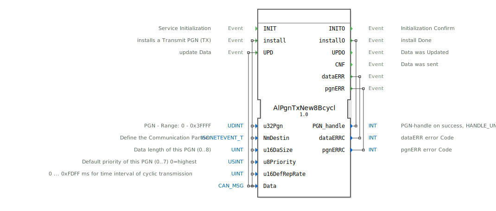

# AlPgnTxNew8Bcycl

```{index} single: AlPgnTxNew8Bcycl
```


* * * * * * * * * *
## Einleitung
Der Funktionsblock `AlPgnTxNew8Bcycl` dient der zyklischen Übertragung von Daten über ein CAN-Netzwerk gemäß dem ISOBUS-Standard (ISO 11783). Sein Hauptzweck ist die Installation, Konfiguration und regelmäßige Aussendung von Parameter Group Numbers (PGNs). Er ermöglicht die Definition von Kommunikationseigenschaften wie Zieladresse, Priorität und Sendeintervall und stellt sicher, dass Daten zuverlässig und im konfigurierten Rhythmus versendet werden.



## Schnittstellenstruktur

### **Ereignis-Eingänge**
*   **INIT**: Initialisiert den Funktionsblock.
*   **install**: Installiert eine neue zu sendende PGN (TX) mit den zugehörigen Konfigurationsdaten. Löst die Verarbeitung der mitgeführten Daten-Eingänge (`u32Pgn`, `NmDestin`, `u16DaSize`, `u8Priority`, `u16DefRepRate`, `Data`) aus.
*   **UPD**: Aktualisiert die Nutzdaten (`Data`) für die zuvor installierte PGN, um sie beim nächsten zyklischen Sendevorgang zu verwenden.

### **Ereignis-Ausgänge**
*   **INITO**: Bestätigt den Abschluss der Initialisierung.
*   **installO**: Signalisiert, dass der Installationsvorgang abgeschlossen ist. Führt den `PGN_handle` als Ausgabewert mit.
*   **UPDO**: Bestätigt, dass die Aktualisierung der Nutzdaten (`UPD`) erfolgreich verarbeitet wurde.
*   **CNF**: Bestätigt, dass ein Datensatz erfolgreich gesendet wurde.
*   **dataERR**: Zeigt einen Fehler im Zusammenhang mit den Nutzdaten (`Data`) an. Führt den Fehlercode `dataERRC` mit.
*   **pgnERR**: Zeigt einen Fehler im Zusammenhang mit der PGN-Konfiguration oder -Verwaltung an. Führt den Fehlercode `pgnERRC` mit.

### **Daten-Eingänge**
*   **u32Pgn** (UDINT): Die zu sendende Parameter Group Number (PGN). Gültiger Bereich: 0 bis 0x3FFFF.
*   **NmDestin** (isobus::pgn::ISONETEVENT_T): Definiert den Kommunikationspartner (Zieladresse) für die Nachricht.
*   **u16DaSize** (UINT): Die Länge der zu sendenden Daten in Bytes. Gültiger Bereich: 0 bis 8.
*   **u8Priority** (USINT): Die Priorität der Nachricht auf dem CAN-Bus (0=höchste, 7=niedrigste). Standardwert: 7.
*   **u16DefRepRate** (UINT): Das zyklische Sendeintervall in Millisekunden (0 ... 0xFDFF ms). Ein Wert von 0 deaktiviert die zyklische Übertragung. Standardwert: 0.
*   **Data** (isobus::pgn::CAN_MSG): Die Nutzdaten, die als PGN gesendet werden sollen.

### **Daten-Ausgänge**
*   **PGN_handle** (INT): Ein Handle (Bezeichner) für die erfolgreich installierte PGN. Im Fehlerfall wird ein ungültiger Handle-Wert (`HANDLE_UNVALID`) zurückgegeben.
*   **dataERRC** (INT): Ein Fehlercode, der detaillierte Informationen zu einem aufgetretenen `dataERR` liefert.
*   **pgnERRC** (INT): Ein Fehlercode, der detaillierte Informationen zu einem aufgetretenen `pgnERR` liefert.

### **Adapter**
Dieser Funktionsblock verwendet keine Adapter-Schnittstellen.

## Funktionsweise
1.  **Initialisierung**: Nach dem Eintreffen des `INIT`-Ereignisses wird der Block betriebsbereit gemacht. Die Bestätigung erfolgt über `INITO`.
2.  **Installation**: Das `install`-Ereignis löst die Konfiguration einer neuen zyklischen PGN-Übertragung aus. Alle zugehörigen Parameter (`u32Pgn`, `NmDestin`, etc.) werden ausgewertet und intern gespeichert. Bei Erfolg wird ein `PGN_handle` generiert und mit dem `installO`-Ereignis zurückgegeben. Bei Fehlern (z.B. ungültige Parameter) wird das `pgnERR`-Ereignis ausgelöst.
3.  **Zyklische Übertragung**: Ist die PGN installiert und `u16DefRepRate` > 0, beginnt der Block automatisch, die in `Data` hinterlegten Nutzdaten in dem definierten Intervall zu senden. Jeder erfolgreiche Sendevorgang wird durch das `CNF`-Ereignis quittiert.
4.  **Datenaktualisierung**: Das `UPD`-Ereignis erlaubt es, die Nutzdaten (`Data`) für die aktive PGN-Übertragung zu ändern. Die neuen Daten werden bei der nächsten zyklischen Aussendung verwendet. Der Empfang der neuen Daten wird mit `UPDO` bestätigt. Fehlerhafte Daten führen zum Auslösen von `dataERR`.

## Technische Besonderheiten
*   Der Block ist für die Verwendung in ISOBUS-Umgebungen (Landtechnik) vorgesehen und nutzt spezifische ISOBUS-Datentypen (`ISONETEVENT_T`, `CAN_MSG`).
*   Die zyklische Übertragung kann durch Setzen von `u16DefRepRate` auf 0 deaktiviert werden, was einen bedarfsgesteuerten Betrieb ermöglicht.
*   Die Fehlerbehandlung ist über dedizierte Ereignisse (`dataERR`, `pgnERR`) strukturiert, was eine robuste Integration in übergeordnete Steuerungen ermöglicht.
*   Die Rückgabe eines `PGN_handle` erlaubt die Verwaltung mehrerer installierter PGNs innerhalb eines Systems.

## Zustandsübersicht
1.  **Nicht initialisiert**: Block ist nach dem Start im Ruhezustand.
2.  **Initialisiert / Bereit**: Nach `INIT`/`INITO`. Block wartet auf Konfigurations- oder Steuerereignisse.
3.  **PGN installiert**: Nach erfolgreichem `install`/`installO`. Die PGN ist konfiguriert und der interne Zustand für die (zyklische) Übertragung ist aktiv.
4.  **Senden aktiv**: Wenn `u16DefRepRate` > 0, sendet der Block zyklisch Daten und feuert bei jedem Erfolg `CNF`.
5.  **Fehlerzustand**: Bei Auftreten eines Fehlers (`pgnERR` oder `dataERR`). Der Block kann je nach Fehlerart in einem wartenden Zustand sein oder versuchen, die Operation erneut durchzuführen (soweit im Algorithmus implementiert).

## Anwendungsszenarien
*   **ISOBUS-konforme Maschinensteuerung**: Zyklisches Senden von Maschinendaten (z.B. Drehzahl, Druck, Position) von einem Steuergerät (ECU) an ein Terminal oder andere Teilnehmer im Netzwerk.
*   **Diagnose- und Überwachungssysteme**: Regelmäßige Übertragung von Status- und Betriebsparametern zu Überwachungszwecken.
*   **Implementierung von ISOBUS-"Fast-Packet"-Protokollen**: Für PGNs, die mehr als 8 Byte Daten transportieren und daher in mehreren CAN-Botschaften übertragen werden müssen (unterstützt durch den `CAN_MSG`-Datentyp).

## ⚖️ Vergleich mit ähnlichen Bausteinen
*   **Gegenüber einfachen `E_CYC`-Blöcken**: `AlPgnTxNew8Bcycl` ist spezialisiert auf ISOBUS-PGNs und bietet integrierte Handhabung von Priorität, Zieladressierung und Fehlermanagement, während ein generischer zyklischer Event-Generator (`E_CYC`) nur Timing bereitstellt.
*   **Gegenüber generischen CAN-Sendeblöcken**: Dieser Block abstrahiert die niedrigleveligen CAN-Details (Identifier-Berechnung, Datenrahmen) und arbeitet direkt auf der logischeren PGN-Ebene gemäß ISOBUS-Standard.


## 🛠️ Zugehörige Übungen

* [Uebung_127](../../../../../training1/Ventilsteuerung/4diacIDE-workspace/test_B/Uebungen_doc/Uebung_127.md)

## Fazit
Der `AlPgnTxNew8Bcycl` ist ein spezialisierter und leistungsstarker Funktionsblock für die zyklische Datenkommunikation in ISOBUS-Netzwerken. Durch seine klare Schnittstelle, die umfassende Konfigurierbarkeit und die integrierte Fehlerrückmeldung eignet er sich ideal für die zuverlässige Implementierung von Sendediensten in komplexen, verteilten Steuerungssystemen der Landtechnik.