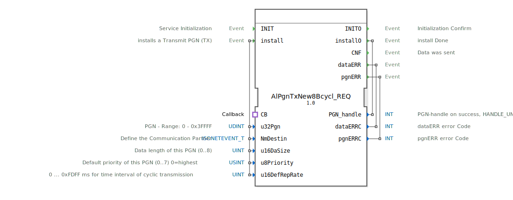

# AlPgnTxNew8Bcycl_REQ

```{index} single: AlPgnTxNew8Bcycl_REQ
```


* * * * * * * * * *
## Einleitung
Der Funktionsblock `AlPgnTxNew8Bcycl_REQ` dient zur zyklischen Übertragung von Daten über ein ISOBUS-Netzwerk. Sein Hauptzweck ist die Installation und Verwaltung eines Parameter Group Number (PGN)-Transmit-Objekts (TX), das Daten in einem definierten Zeitintervall sendet. Ein zentrales Merkmal ist die Integration eines Callback-Adapters, der eine flexible Datenbereitstellung ermöglicht.



## Schnittstellenstruktur

### **Ereignis-Eingänge**
*   **INIT**: Initialisiert den Funktionsblock.
*   **install**: Startet den Installationsvorgang für ein neues zyklisches Transmit-PGN. Löst die Konfiguration mit den anliegenden Daten aus.

### **Ereignis-Ausgänge**
*   **INITO**: Bestätigt den erfolgreichen Abschluss der Initialisierung.
*   **installO**: Bestätigt den Abschluss der PGN-Installation. Liefert den generierten `PGN_handle`.
*   **CNF**: Wird ausgelöst, wenn Daten erfolgreich gesendet wurden.
*   **dataERR**: Zeigt einen Fehler im Zusammenhang mit den zu sendenden Daten an. Liefert einen Fehlercode.
*   **pgnERR**: Zeigt einen Fehler im Zusammenhang mit der PGN-Konfiguration oder -Verwaltung an. Liefert einen Fehlercode.

### **Daten-Eingänge**
*   **u32Pgn** (UDINT): Die zu verwendende Parameter Group Number (PGN). Gültiger Bereich: 0 bis 0x3FFFF.
*   **NmDestin** (isobus::pgn::ISONETEVENT_T): Definiert den Kommunikationspartner (Zieladresse) für die Übertragung.
*   **u16DaSize** (UINT): Die Länge der zu übertragenden Nutzdaten in Bytes. Maximal 8 Bytes (0..8).
*   **u8Priority** (USINT): Die Priorität der Nachricht auf dem Bus (0..7), wobei 0 die höchste Priorität ist. Standardwert: 7 (niedrigste).
*   **u16DefRepRate** (UINT): Das zyklische Sendeintervall in Millisekunden (0 ... 0xFDFF ms). Ein Wert von 0 deaktiviert die zyklische Übertragung. Standardwert: 0.

### **Daten-Ausgänge**
*   **PGN_handle** (INT): Ein eindeutiges Handle, das die installierte PGN-Instanz identifiziert. Im Fehlerfall enthält es den Wert `HANDLE_UNVALID`.
*   **dataERRC** (INT): Fehlercode, der bei Auslösen des `dataERR`-Ereignisses gesetzt wird.
*   **pgnERRC** (INT): Fehlercode, der bei Auslösen des `pgnERR`-Ereignisses gesetzt wird.

### **Adapter**
*   **CB** (Typ: `isobus::pgn::tx::Callback`): Ein Socket-Adapter, der eine Callback-Schnittstelle bereitstellt. Über diesen Adapter fordert der Funktionsblock bei jedem zyklischen Sendevorgang die aktuellen Nutzdaten vom übergeordneten Steuerungsalgorithmus an.

## Funktionsweise
1.  **Initialisierung**: Das `INIT`-Ereignis bereitet den Funktionsblock für den Betrieb vor. Nach Abschluss wird `INITO` ausgelöst.
2.  **PGN-Installation**: Das `install`-Ereignis triggert die Konfiguration einer neuen zyklischen Sende-PGN. Die an den Daten-Eingängen (`u32Pgn`, `NmDestin`, etc.) anliegenden Werte werden verwendet, um die PGN im ISOBUS-Stack zu registrieren.
3.  **Handle-Rückgabe**: Bei erfolgreicher Installation wird das `installO`-Ereignis ausgelöst und der generierte `PGN_handle` am Datenausgang bereitgestellt. Dieser Handle muss für spätere Operationen (z.B. Deinstallation, Änderung) gespeichert werden.
4.  **Zyklischer Sendebetrieb**: Ist `u16DefRepRate` > 0, beginnt der Funktionsblock, Daten im definierten Intervall zu senden.
    *   Vor jedem Sendevorgang fordert der Block über den `CB`-Adapter die aktuellen Nutzdaten an.
    *   Nach erfolgreicher Übertragung wird das `CNF`-Ereignis ausgelöst.
5.  **Fehlerbehandlung**: Tritt ein Fehler auf (z.B. ungültige Konfiguration, Kommunikationsproblem), wird entweder `dataERR` oder `pgnERR` ausgelöst und der entsprechende Fehlercode gesetzt.

## Technische Besonderheiten
*   **Datenlänge**: Unterstützt die Übertragung von maximal 8 Byte Nutzdaten pro PGN, was einer typischen ISOBUS-Datenlänge entspricht.
*   **Callback-Mechanismus**: Die Nutzdaten werden nicht intern gespeichert, sondern bei Bedarf dynamisch über den Adapter angefordert. Dies ermöglicht eine effiziente und aktuelle Datenbereitstellung.
*   **Fehlerhandling**: Separate Fehlerereignisse für Daten- (`dataERR`) und PGN-bezogene (`pgnERR`) Probleme erlauben eine differenzierte Fehlerdiagnose.
*   **Initialwert**: Die Priorität (`u8Priority`) und das Sendeintervall (`u16DefRepRate`) haben definierte Initialwerte (7 bzw. 0).

## Zustandsübersicht
Der Funktionsblock durchläuft implizit folgende Hauptzustände:
1.  **Nicht initialisiert**: Der Block ist nach dem Start inaktiv.
2.  **Initialisiert (Bereit)**: Nach erfolgreichem `INIT`/`INITO` wartet der Block auf eine Installationsanforderung.
3.  **PGN installiert (Aktiv)**: Nach erfolgreichem `install`/`installO` ist die PGN konfiguriert. Bei `u16DefRepRate` > 0 sendet der Block zyklisch Daten und löst dabei `CNF` aus. Er reagiert weiterhin auf Fehlerbedingungen.

## Anwendungsszenarien
*   **Zyklische Statusmeldungen**: Regelmäßiges Senden von Maschinenstatusdaten (z.B. Drehzahl, Temperatur, Betriebsstunden) an ein Display oder ein übergeordnetes Managementsystem.
*   **Implementierung von ISOBUS-"Fast-Packet"-Protokollen**: Für PGNs, die mehr als 8 Byte Daten umfassen und über mehrere CAN-Telegramme verteilt werden, kann dieser Block die zyklische Übertragung der einzelnen Pakete steuern.
*   **Datenlogging**: Zyklische Übertragung von Prozessdaten zu einem Datensammler oder Gateway.

## Vergleich mit ähnlichen Bausteinen
*   **Vs. Einmal-Sende-Blöcke (z.B. `AlPgnTx_REQ`)**: Dieser Block ist für **wiederholtes, periodisches** Senden ausgelegt, während einfache TX-Blöcke typischerweise ein einmaliges Senden pro Auslöseereignis durchführen.
*   **Vs. Blöcke mit interner Datenspeicherung**: Die Verwendung eines **Callback-Adapters** unterscheidet diesen Block von solchen, bei denen die Daten direkt an einem Eingang bereitgestellt werden. Dies macht ihn flexibler, wenn sich die Daten häufig ändern oder aus komplexen Quellen stammen.


## Zugehörige Übungen

* [Uebung_126](../../../../../training1/Ventilsteuerung/4diacIDE-workspace/test_B/Uebungen_doc/Uebung_126.md)
* [Uebung_126b](../../../../../training1/Ventilsteuerung/4diacIDE-workspace/test_B/Uebungen_doc/Uebung_126b.md)
* [Uebung_126b2](../../../../../training1/Ventilsteuerung/4diacIDE-workspace/test_B/Uebungen_doc/Uebung_126b2.md)

## Fazit
Der `AlPgnTxNew8Bcycl_REQ` ist ein spezialisierter Funktionsblock für zuverlässige, zyklische Datenkommunikation in ISOBUS-Umgebungen. Seine Stärken liegen in der klaren Trennung von Konfiguration (`install`), dynamischer Datenbeschaffung (Callback-Adapter) und robustem Fehlerfeedback. Er ist ideal geeignet für Anwendungen, die regelmäßige Statusupdates oder Prozessdatenstreams erfordern.