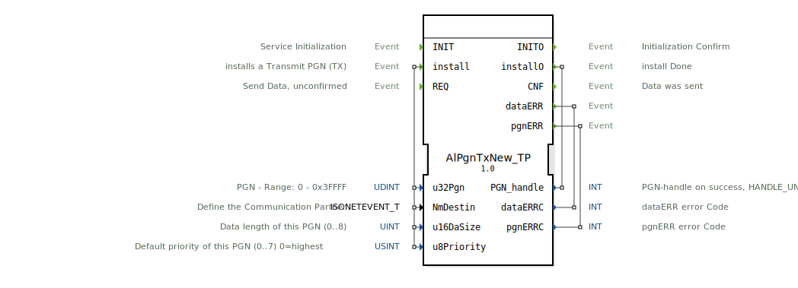

# AlPgnTxNew_TP

* * * * * * * * * *

## Einleitung
Der Funktionsbaustein **AlPgnTxNew_TP** dient der Übertragung von Daten über den ISOBUS/CAN-Bus basierend auf Parameter Group Numbers (PGN). Er ermöglicht die Registrierung einer spezifischen PGN und das anschließende versenden von Datenpaketen, wann immer ein lokales Anforderungsereignis (REQ) auftritt. Der Baustein ist Teil des Pakets `isobus::pgn::tx` und ist speziell für die Handhabung von Transportprotokollen oder generischen PGN-Übertragungen ausgelegt.

## Schnittstellenstruktur

### **Ereignis-Eingänge**
*   **INIT** (Type: `EInit`): Initialisierung des Dienstes. Setzt den Baustein in den Ausgangszustand.
*   **install** (Type: `Event`): Installiert bzw. registriert eine Sendere-PGN (Transmit PGN). Hierbei werden Parameter wie PGN-Nummer, Ziel, Datengröße und Priorität übernommen.
*   **REQ** (Type: `Event`): Fordert das Senden von Daten an (unbestätigter Sendevorgang). Nutzt den im `Data`-Eingang bereitgestellten Puffer.

### **Ereignis-Ausgänge**
*   **INITO** (Type: `EInit`): Bestätigung der Initialisierung.
*   **installO** (Type: `Event`): Bestätigung, dass der Installationsvorgang abgeschlossen wurde. Liefert das `PGN_handle` zurück.
*   **CNF** (Type: `Event`): Bestätigung, dass die Daten erfolgreich gesendet wurden (Confirmation).
*   **dataERR** (Type: `Event`): Signalisiert einen Fehler bei der Datenübertragung oder beim Zugriff auf die Daten.
*   **pgnERR** (Type: `Event`): Signalisiert einen Fehler bezüglich der PGN-Konfiguration oder Registrierung.

### **Daten-Eingänge**
*   **u32Pgn** (Type: `UDINT`): Die zu sendende Parameter Group Number (PGN). Der Bereich liegt zwischen 0 und 0x3FFFF.
*   **NmDestin** (Type: `isobus::pgn::ISONETEVENT_T`): Definiert den Kommunikationspartner bzw. das Ziel im Netzwerk (Network Management Destination).
*   **u16DaSize** (Type: `UINT`): Die Länge der Daten für diese PGN in Bytes (typischerweise 0 bis 8 für Standard-CAN, kann aber je nach Protokoll variieren).
*   **u8Priority** (Type: `USINT`): Die Standardpriorität dieser PGN (0 bis 7), wobei 0 die höchste Priorität darstellt. Standardwert ist 7.

### **Daten-Ausgänge**
*   **PGN_handle** (Type: `INT`): Rückgabewert nach der Installation. Ein gültiges Handle bei Erfolg, oder `HANDLE_UNVALID` im Fehlerfall.
*   **dataERRC** (Type: `INT`): Fehlercode, der ausgegeben wird, wenn das Ereignis `dataERR` ausgelöst wird.
*   **pgnERRC** (Type: `INT`): Fehlercode, der ausgegeben wird, wenn das Ereignis `pgnERR` ausgelöst wird.

### **InOut-Variablen**
*   **Data** (Type: `BYTE`, ArraySize: `*`): Ein Zeiger auf den Datenpuffer (Byte-Array variabler Größe). Hier werden die zu sendenden Nutzdaten abgelegt. Durch die Deklaration als `InOut` wird eine effiziente Speicherverwaltung ohne unnötige Kopieroperationen ermöglicht.

### **Adapter**
*   Dieser Funktionsbaustein verwendet keine expliziten Adapter-Schnittstellen.

## Funktionsweise
Der Baustein arbeitet in zwei wesentlichen Phasen:

1.  **Konfiguration (Installation):**
    *   Zunächst muss der Baustein über `INIT` initialisiert werden.
    *   Anschließend wird über das Ereignis `install` die PGN konfiguriert. Dabei werden die PGN-ID (`u32Pgn`), das Ziel (`NmDestin`), die Größe (`u16DaSize`) und die Priorität (`u8Priority`) festgelegt.
    *   Nach erfolgreicher Installation wird das Ereignis `installO` ausgelöst und ein `PGN_handle` bereitgestellt. Dieses Handle repräsentiert die registrierte PGN im System.

2.  **Datenübertragung:**
    *   Sobald Daten gesendet werden sollen, müssen diese im `Data`-Array bereitgestellt werden.
    *   Das Ereignis `REQ` triggert den Sendevorgang.
    *   Bei erfolgreichem Versand wird `CNF` ausgelöst.
    *   Treten Probleme auf (z.B. ungültige Datenlänge oder Busfehler), wird `dataERR` mit einem entsprechenden Fehlercode `dataERRC` ausgelöst.

## Technische Besonderheiten
*   **Variable Array-Größe:** Der `Data`-Eingang ist als `InOut`-Variable mit `ArraySize="*"` definiert. Dies bedeutet, dass der Baustein mit Datenpuffern unterschiedlicher Größe arbeiten kann, was ihn flexibel für verschiedene PGN-Typen macht.
*   **Fehlertrennung:** Der Baustein unterscheidet explizit zwischen Fehlern bei der PGN-Einrichtung (`pgnERR`) und Fehlern bei der Laufzeit-Datenübertragung (`dataERR`). Dies erleichtert das Debugging erheblich.
*   **ISOBUS-Typen:** Der Baustein importiert spezifische ISOBUS-Datentypen (`isobus::pgn::ISONETEVENT_T`), was eine enge Integration in entsprechende ISOBUS-Stacks voraussetzt.

## Zustandsübersicht
Der Baustein besitzt intern implizite Zustände, die durch die Verfügbarkeit eines gültigen `PGN_handle` definiert sind:
*   **Nicht Initialisiert:** Vor `INIT`.
*   **Initialisiert, nicht Installiert:** Nach `INIT`, aber vor erfolgreichem `install`. Sendeanforderungen (`REQ`) würden hier fehlschlagen.
*   **Installiert / Betriebsbereit:** Ein gültiges Handle wurde erzeugt. Daten können via `REQ` gesendet werden.

## Anwendungsszenarien
*   **ISOBUS-Geräteentwicklung:** Implementierung von Virtual Terminals oder Task Controllern, die spezifische PGNs senden müssen.
*   **Sensor-Datenübertragung:** Ein Sensor-Modul sendet zyklisch oder ereignisbasiert Messwerte an den CAN-Bus.
*   **Steuerbefehle:** Senden von Steuerungsnachrichten an Aktoren im Netzwerk (z.B. Ventile oder Motoren) mit definierter Priorität.

## ⚖️ Vergleich mit ähnlichen Bausteinen
*   **AlPgnTx vs. AlPgnTxNew_TP:** Während ältere oder einfachere Versionen eventuell nur statische PGNs unterstützen, deutet der Zusatz "New_TP" auf eine überarbeitete Version hin, die möglicherweise Transportprotokolle (TP) besser unterstützt oder eine modernere Speicherverwaltung (via `InOut` Variablen) nutzt.
*   **Standard CAN_WRITE:** Im Vergleich zu einem generischen `CAN_WRITE`-Baustein abstrahiert `AlPgnTxNew_TP` die Komplexität der PGN-Verwaltung (Priorität, Datenlänge, Handle-Management) und ist spezifischer auf das J1939/ISOBUS-Protokoll zugeschnitten.

## 🛠️ Zugehörige Übungen

* [Uebung_128b](../../../../../training1/Ventilsteuerung/4diacIDE-workspace/test_B/Uebungen_doc/Uebung_128b.md)

## Fazit
Der **AlPgnTxNew_TP** ist ein spezialisierter und robuster Funktionsbaustein für das Senden von Nachrichten in ISOBUS-Netzwerken. Durch die Trennung von Konfiguration (`install`) und Übertragung (`REQ`) sowie die Nutzung von Referenz-Datenpuffern (`InOut`) eignet er sich hervorragend für ressourceneffiziente Steuerungsanwendungen, die eine präzise Kontrolle über PGN-Parameter erfordern.