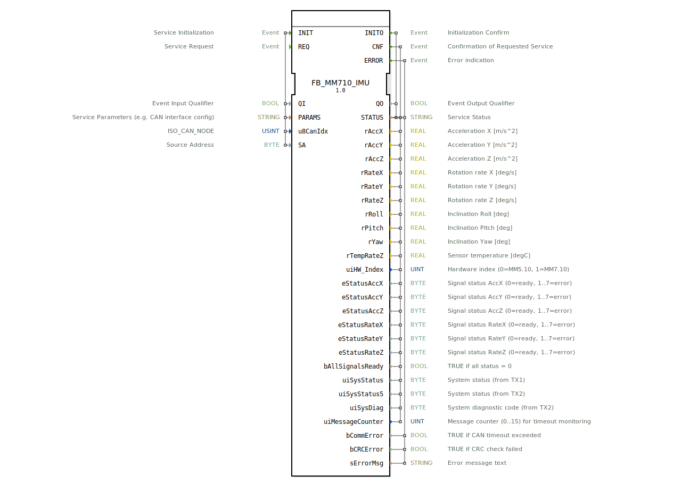

# FB_MM710_IMU

* * * * * * * * * *

## Einleitung
Der Funktionsblock **FB_MM710_IMU** ist ein serviceorientierter Baustein (SIFB) zur Anbindung des Bosch MM7.10 IMU‑Sensors über CAN/J1939. Er ermöglicht das Auslesen von Beschleunigungs‑, Drehraten‑ und Neigungswerten sowie die Überwachung von System‑ und Fehlerzuständen. Der FB kapselt die gesamte CAN‑Kommunikation und Signalverarbeitung und stellt die Daten standardisiert über Ereignis‑ und Datenausgänge zur Verfügung.

## Schnittstellenstruktur

### **Ereignis‑Eingänge**
| Ereignis | Typ | Beschreibung |
|----------|-----|--------------|
| INIT | EInit | Initialisierung des Bausteins. Mit diesem Ereignis werden die CAN‑Parameter (Index, Source‑Address) sowie der Aktivierungs‑Qualifier QI gesetzt. |
| REQ | Event | Auslösen einer erneuten Messwertabfrage. Nach erfolgreicher Initialisierung können die Sensordaten zyklisch oder ereignisgesteuert angefordert werden. |

### **Ereignis‑Ausgänge**
| Ereignis | Typ | Beschreibung |
|----------|-----|--------------|
| INITO | EInit | Bestätigung der erfolgreichen Initialisierung (QO = TRUE) oder Fehlermeldung. |
| CNF | Event | Bestätigung einer Messwertanforderung. Liefert die aktuellen Sensordaten und Statusinformationen. |
| ERROR | Event | Tritt bei Kommunikations‑ oder CRC‑Fehlern auf. Enthält detaillierte Fehlerinformationen. |

### **Daten‑Eingänge**
| Variable | Typ | Beschreibung |
|----------|-----|--------------|
| QI | BOOL | Aktivierungs‑Qualifier: Nur bei QI = TRUE wird die Initialisierung (INIT) ausgeführt. |
| PARAMS | STRING | Service‑Parameter, z. B. CAN‑Interface‑Konfiguration (optional). |
| u8CanIdx | USINT | CAN‑Node‑Index (Standard‑Initialwert: `INVALID`). |
| SA | BYTE | Source‑Address für J1939‑Kommunikation (Initialwert: `16#DA`). |

### **Daten‑Ausgänge**
| Variable | Typ | Beschreibung |
|----------|-----|--------------|
| QO | BOOL | Quittierung der Initialisierung (TRUE = erfolgreich). |
| STATUS | STRING | Statusmeldung (z. B. „Initialized“, „Error“). |
| rAccX, rAccY, rAccZ | REAL | Beschleunigungswerte in X‑, Y‑ und Z‑Richtung [m/s²]. |
| rRateX, rRateY, rRateZ | REAL | Drehraten um die jeweilige Achse [deg/s]. |
| rRoll, rPitch, rYaw | REAL | Neigungswinkel (Roll, Pitch, Yaw) [deg]. |
| rTempRateZ | REAL | Sensortemperatur [°C]. |
| uiHW_Index | UINT | Hardware‑Index (0 = MM5.10, 1 = MM7.10). |
| eStatusAccX … eStatusAccZ | BYTE | Signalqualität der Beschleunigung (0 = bereit, 1 .. 7 = Fehler). |
| eStatusRateX … eStatusRateZ | BYTE | Signalqualität der Drehraten (0 = bereit, 1 .. 7 = Fehler). |
| bAllSignalsReady | BOOL | TRUE, wenn alle Signal‑Status 0 sind. |
| uiSysStatus | BYTE | Systemstatus aus TX‑Nachricht 1. |
| uiSysStatus5 | BYTE | Systemstatus aus TX‑Nachricht 2. |
| uiSysDiag | BYTE | Systemdiagnosecode (aus TX2). |
| uiMessageCounter | UINT | Nachrichtenzähler (0..15) zur Timeout‑Überwachung. |
| bCommError | BOOL | TRUE bei CAN‑Timeout. |
| bCRCError | BOOL | TRUE bei fehlerhafter CRC‑Prüfung. |
| sErrorMsg | STRING | Fehlertext (z. B. „CAN timeout“). |

### **Adapter**
Keine Adapter definiert.

## Funktionsweise
Der FB_MM710_IMU initialisiert beim Eintreffen von **INIT** mit QI = TRUE die CAN‑Kommunikation und den internen Empfangspuffer. Nach erfolgreicher Initialisierung wird **INITO** mit QO = TRUE gesetzt. Durch jeden **REQ‑Impuls** wird eine Messwertabfrage ausgelöst – der Baustein wartet dann auf die CAN‑Antwort des Sensors. Sind gültige Daten empfangen, wird **CNF** ausgegeben und alle Datenausgänge aktualisiert. Tritt ein Kommunikations‑ oder CRC‑Fehler auf oder überschreitet der Nachrichtenzähler einen Timeout, wird stattdessen **ERROR** gesetzt. Der Baustein kann mehrfach hintereinander zyklisch mit REQ getriggert werden.

Die Signal‑Status (eStatus*) ermöglichen eine Einzelfehleranalyse für jede Achse. Der Hardware‑Index unterscheidet zwischen älteren MM5.10 und aktuellen MM7.10 Sensoren.

## Technische Besonderheiten
- **CAN/J1939‑Protokoll** – Verwendung einer festen Source‑Address (Standard: `16#DA`).
- **Time‑out‑Überwachung** – Der `uiMessageCounter` (0‑15) wird bei jeder gültigen Nachricht hochgezählt; bleibt er aus, wird nach 16 fehlenden Nachrichten ein Kommunikationsfehler gemeldet.
- **Signal‑Status‑Bits** – Liefern granularere Informationen als einfache „ready/error“-Flags.
- **CRC‑Prüfung** – Fehlerhafte CAN‑Frames werden erkannt und über `bCRCError` und **ERROR** gemeldet.
- **Hardware‑Unterscheidung** – `uiHW_Index` erlaubt adaptives Verhalten für unterschiedliche Sensor‑Versionen.

## Zustandsübersicht
Der Baustein durchläuft folgende Zustände (nicht explizit als ECC, aber aus dem Verhalten ableitbar):
1. **Inaktiv** – Nach dem Start, wartet auf INIT.
2. **Initialisieren** – Nach INIT‑Ereignis; Aufbau der CAN‑Kommunikation.
3. **Bereit** – Nach erfolgreichem INITO; auf REQ wartend.
4. **Anforderung gesendet** – Nach REQ; auf Antwort wartend (CAN‑Message).
5. **Daten empfangen** – Nach erfolgreicher CAN‑Antwort; CNF wird gesendet.
6. **Fehler** – Bei Timeout oder CRC‑Fehler; ERROR wird gesendet (Rückfall in Bereit nach Fehlerbehandlung).

## Anwendungsszenarien
- **Mobile Arbeitsmaschinen** – Neigungs‑ und Beschleunigungsüberwachung von Baggern, Kränen oder Gabelstaplern.
- **Fahrzeugdynamik** – Erfassung von Roll‑, Pitch‑ und Yaw‑Winkeln für Stabilitätskontrollen.
- **Industrieroboter** – Überwachung von Vibrationen und unerwarteten Bewegungen.
- **IoT‑Sensorknoten** – Einbindung in übergeordnete Steuerungen mittels CAN‑Bus.

## Vergleich mit ähnlichen Bausteinen
Gegenüber einfachen IMU‑Treibern (z. B. per SPI/I²C) bietet dieser FB eine direkte Integration in J1939‑Netzwerke. Die Signal‑Status‑Bits ermöglichen eine Diagnose, die bei Standard‑Bausteinen oft fehlt. Der integrierte Hardware‑Index (MM5.10 / MM7.10) erlaubt eine einfache Migration. Andere CAN‑IMU‑Bausteine verwenden ggf. proprietäre Nachrichtenformate, während dieser FB auf dem offenen J1939‑Standard basiert.

## Fazit
Der FB_MM710_IMU ist ein mächtiger Baustein für die zuverlässige Erfassung von IMU‑Daten in CAN‑basierten Automatisierungssystemen. Seine umfangreichen Status‑ und Fehlerinformationen unterstützen eine lückenlose Diagnose, und die einfache Parametrisierung über INIT und REQ macht ihn flexibel einsetzbar. Besonders in sicherheitskritischen Anwendungen mit J1939 ist er eine optimale Wahl.