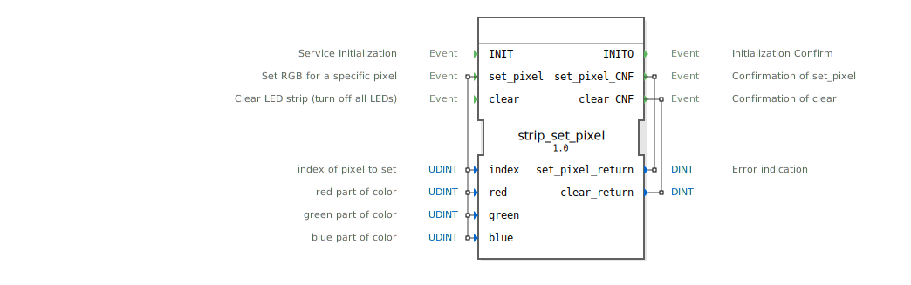

# strip_set_pixel

```{index} single: strip_set_pixel
```


* * * * * * * * * *
## Einleitung
Der Funktionsblock `strip_set_pixel` dient zur Steuerung einer RGB-LED-Leiste. Seine Hauptaufgabe ist es, die Farbe eines einzelnen Pixels (einer einzelnen LED) auf der Leiste zu setzen oder die gesamte Leiste auszuschalten. Er ist für den Einsatz in Steuerungssystemen konzipiert, die eine präzise, pixelweise Ansteuerung von RGB-LEDs erfordern.



## Schnittstellenstruktur
### **Ereignis-Eingänge**
*   **INIT**: Initialisiert den Funktionsblock. Muss vor der ersten Nutzung ausgelöst werden.
*   **set_pixel**: Löst den Befehl aus, die Farbe eines spezifischen Pixels zu setzen. Wird mit den Daten `index`, `red`, `green` und `blue` verknüpft.
*   **clear**: Löst den Befehl aus, alle LEDs der Leiste auszuschalten (zu löschen).

### **Ereignis-Ausgänge**
*   **INITO**: Bestätigt die erfolgreiche Initialisierung des Funktionsblocks.
*   **set_pixel_CNF**: Bestätigt die Ausführung des `set_pixel`-Befehls. Ist mit dem Datenausgang `set_pixel_return` verknüpft.
*   **clear_CNF**: Bestätigt die Ausführung des `clear`-Befehls. Ist mit dem Datenausgang `clear_return` verknüpft.

### **Daten-Eingänge**
*   **index** (UDINT): Der Index (Position) des Pixels auf der LED-Leiste, das gesetzt werden soll. Die Zählung beginnt typischerweise bei 0.
*   **red** (UDINT): Der Rotanteil der Farbe (Wertebereich abhängig von der Hardware, z.B. 0-255).
*   **green** (UDINT): Der Grünanteil der Farbe (Wertebereich abhängig von der Hardware, z.B. 0-255).
*   **blue** (UDINT): Der Blauanteil der Farbe (Wertebereich abhängig von der Hardware, z.B. 0-255).

### **Daten-Ausgänge**
*   **set_pixel_return** (DINT): Gibt einen Fehlerstatus nach Ausführung des `set_pixel`-Befehls zurück. Ein Wert ungleich 0 deutet auf einen Fehler hin (z.B. ungültiger Pixel-Index).
*   **clear_return** (DINT): Gibt einen Fehlerstatus nach Ausführung des `clear`-Befehls zurück. Ein Wert ungleich 0 deutet auf einen Fehler hin.

### **Adapter**
Dieser Funktionsblock verfügt über keine Adapterschnittstellen.

## Funktionsweise
Der FB arbeitet ereignisgesteuert. Bei einem eingehenden `INIT`-Ereignis wird die zugrundeliegende Hardware (LED-Leiste) initialisiert und das `INITO`-Ereignis generiert.

Das `set_pixel`-Ereignis löst den Hauptbefehl aus. Die zu diesem Zeitpunkt an den Daten-Eingängen `index`, `red`, `green` und `blue` anliegenden Werte werden ausgelesen und an die LED-Leiste gesendet, um die entsprechende LED auf die gewünschte Farbe zu setzen. Anschließend wird das `set_pixel_CNF`-Ereignis zusammen mit einem Statuscode (`set_pixel_return`) ausgegeben.

Das `clear`-Ereignis setzt alle Pixel der Leiste auf Schwarz (aus), was einem Löschen des aktuellen Musters entspricht. Danach wird das `clear_CNF`-Ereignis mit Status (`clear_return`) ausgegeben.

## Technische Besonderheiten
*   Die Daten-Eingänge für die Farbwerte sind vom Typ `UDINT` (unsigned double integer), was einen großen Wertebereich ermöglicht. Die tatsächlich wirksame Auflösung (z.B. 8-Bit = 0-255) hängt von der angeschlossenen Hardware ab.
*   Die Daten-Ausgänge für die Rückmeldungen sind vom vorzeichenbehafteten Typ `DINT`, um positive und negative Fehlercodes darstellen zu können.
*   Der FB folgt dem typischen IEC 61499 Service Interface Pattern mit separaten Bestätigungsereignissen (`CNF`) für jeden Befehl.

## Zustandsübersicht
1.  **Nicht initialisiert**: Nach dem Start. Nur das `INIT`-Ereignis ist gültig.
2.  **Initialisiert / Bereit**: Nach erfolgreichem `INITO`. Die Befehle `set_pixel` und `clear` können empfangen und verarbeitet werden. Nach jedem Befehl kehrt der FB in diesen Zustand zurück.

## Anwendungsszenarien
*   **Statusanzeigen**: Einzelne LEDs können als Status- oder Warnlichter genutzt werden (z.B. Maschine in Betrieb, Fehler an Position X).
*   **Einfache Lichteffekte**: Durch sequentielles Setzen einzelner Pixel können Lauflicht- oder Blinkeffekte realisiert werden.
*   **Visualisierung von Prozessdaten**: Die Farbe oder Helligkeit eines Pixels kann einen Prozesswert (z.B. Temperatur, Füllstand) repräsentieren.

## ⚖️ Vergleich mit ähnlichen Bausteinen
Im Vergleich zu Bausteinen, die ganze Farbmuster oder Bilder auf eine LED-Matrix übertragen (z.B. `strip_show` oder `matrix_display`), arbeitet `strip_set_pixel` auf einer sehr granularen, pixelweisen Ebene. Er bietet maximale Kontrolle über jede einzelne LED, ist für die Übertragung komplexer Bilder jedoch weniger effizient. Bausteine wie `strip_fill` setzen typischerweise einen ganzen Bereich oder alle LEDs auf einmal auf eine Farbe, während `strip_set_pixel` individuell adressiert.


## 🛠️ Zugehörige Übungen

* [Uebung_031](../../../../../training1/Ventilsteuerung/4diacIDE-workspace/test_B/Uebungen_doc/Uebung_031.md)

## Fazit
Der `strip_set_pixel`-Funktionsblock ist ein grundlegender und essentieller Baustein für die Ansteuerung von adressierbaren RGB-LED-Leisten innerhalb von 4diac. Durch sein einfaches, ereignisbasiertes Interface ermöglicht er eine präzise und direkte Kontrolle über jedes einzelne Pixel. Seine Stärke liegt in der Einfachheit für punktuelle Steueraufgaben, während für komplexere Animationen die Kombination mit übergeordneten, sequenzierenden Bausteinen empfohlen wird.