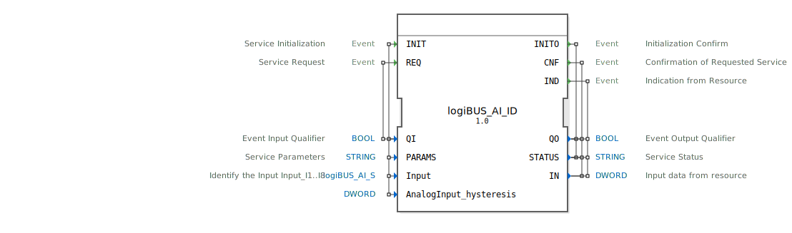

# logiBUS_AI_ID

```{index} single: logiBUS_AI_ID
```


* * * * * * * * * *

## Einleitung
Der logiBUS_AI_ID ist ein Service Interface Function Block für die Verarbeitung von Double-Word-Eingabedaten. Dieser Baustein dient als Schnittstelle für analoge Eingänge und bietet Funktionen zur Initialisierung, Abfrage und Indikation von Eingabedaten.



## Schnittstellenstruktur

### **Ereignis-Eingänge**
- **INIT**: Service-Initialisierungsereignis
- **REQ**: Service-Anfrageereignis

### **Ereignis-Ausgänge**
- **INITO**: Initialisierungsbestätigung
- **CNF**: Bestätigung der angeforderten Service-Operation
- **IND**: Indikation vom Resource

### **Daten-Eingänge**
- **QI** (BOOL): Event Input Qualifier - Aktiviert/Deaktiviert den Service
- **PARAMS** (STRING): Service-Parameter für Konfiguration
- **Input** (logiBUS_AI_S): Identifiziert den Eingang (I1..I8) mit Initialwert "Invalid"
- **AnalogInput_hysteresis** (DWORD): Hysterese-Wert für analoge Eingänge

### **Daten-Ausgänge**
- **QO** (BOOL): Event Output Qualifier - Status des Service-Ausgangs
- **STATUS** (STRING): Service-Statusinformationen
- **IN** (DWORD): Eingabedaten vom Resource

### **Adapter**
Keine Adapter-Schnittstellen vorhanden.

## Funktionsweise
Der Function Block ermöglicht die Kommunikation mit analogen Eingabegeräten über das logiBUS-System. Bei der INIT-Initialisierung werden die Service-Parameter konfiguriert und der Eingang identifiziert. Über REQ können Daten abgefragt werden, während IND asynchrone Datenankündigungen vom Resource verarbeitet. Die Hysterese-Funktion unterstützt bei der Filterung von Signalrauschen.

## Technische Besonderheiten
- Verwendet spezielle Datentypen aus dem logiBUS::io::AI-Package
- Unterstützt Hysterese-Funktionalität für analoge Signale
- Bietet sowohl synchrone (CNF) als auch asynchrone (IND) Betriebsmodi
- Initialisiert Eingänge mit einem definierten "Invalid"-Zustand

## Zustandsübersicht
Der Baustein verfügt über folgende Betriebszustände:
- Nicht initialisiert (vor INIT)
- Initialisiert und bereit (nach INITO)
- Datenabfrage aktiv (bei REQ/CNF)
- Indikationsmodus (bei IND)

## Anwendungsszenarien
- Industrielle Automatisierungssysteme mit analogen Sensoren
- Prozessleittechnik mit Hysterese-Anforderungen
- Embedded-Systeme mit logiBUS-Kommunikation
- Anlagen mit mehreren analogen Eingängen (I1-I8)

## ⚖️ Vergleich mit ähnlichen Bausteinen
Im Vergleich zu einfachen analogen Eingangsbausteinen bietet logiBUS_AI_ID erweiterte Funktionen wie Hysterese-Steuerung, detaillierte Statusrückmeldungen und eine strukturierte Initialisierungsprozedur. Die Integration in das logiBUS-System ermöglicht eine standardisierte Kommunikation.


## 🛠️ Zugehörige Übungen

* [Uebung_028](../../../../../training1/Ventilsteuerung/4diacIDE-workspace/test_B/Uebungen_doc/Uebung_028.md)
* [Uebung_034](../../../../../training1/Ventilsteuerung/4diacIDE-workspace/test_B/Uebungen_doc/Uebung_034.md)

## Fazit
Der logiBUS_AI_ID Function Block stellt eine robuste und flexible Lösung für die Anbindung analoger Eingabegeräte in industriellen Steuerungssystemen dar. Durch die umfangreiche Parametrierungsmöglichkeit und die integrierte Hysterese-Funktionalität eignet er sich besonders für anspruchsvolle Automatisierungsanwendungen.