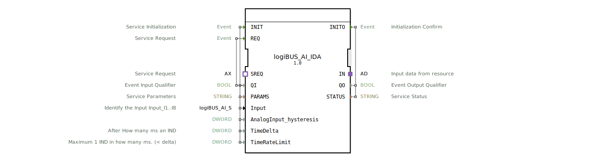

# logiBUS_AI_IDA

* * * * * * * * * *

## Einleitung

Der Funktionsblock `logiBUS_AI_IDA` ist ein zusammengesetzter Baustein (Composite FB) zur Verarbeitung analoger Doppelwort-Eingangsdaten. Er dient als Schnittstelle zwischen einer logiBUS-Ressource und der Applikation, indem er einheitliche analoge Eingangswerte über einen Adapter bereitstellt und Statusinformationen (QO, STATUS) an die aufrufende Instanz zurückmeldet. Der Baustein unterstützt sowohl initialisierungs- als auch ereignisgesteuerte Verarbeitung.

## Schnittstellenstruktur

### **Ereignis-Eingänge**

| Ereignis | Typ    | Mit   | Beschreibung |
|----------|--------|-------|--------------|
| INIT     | EInit  | QI, PARAMS, Input, AnalogInput_hysteresis, TimeDelta, TimeRateLimit | Service-Initialisierung: Konfiguration des analogen Eingangs und Start der Datenbereitstellung. |
| REQ      | Event  | QI    | Service-Anforderung: Auslösen einer sofortigen Verarbeitung oder eines Status-Updates. |

### **Ereignis-Ausgänge**

| Ereignis | Typ    | Mit   | Beschreibung |
|----------|--------|-------|--------------|
| INITO    | EInit  | QO, STATUS | Bestätigung der Initialisierung mit Qualitäts- und Statusinformationen. |

### **Daten-Eingänge**

| Name                  | Typ    | Initialwert | Beschreibung |
|-----------------------|--------|-------------|--------------|
| QI                    | BOOL   | –           | Qualifier für Ereignisse (z. B. Freigabe der Verarbeitung). |
| PARAMS                | STRING | –           | Dienstparameter (z. B. Konfigurationsstrings). |
| Input                 | logiBUS::io::AI::logiBUS_AI_S | Invalid   | Auswahl des analogen Eingangs (z. B. Input_I1…I8). |
| AnalogInput_hysteresis| DWORD  | –           | Hysterese für die Änderungserkennung. Bei Wert 0 muss TimeDelta ungleich 0 sein. |
| TimeDelta             | DWORD  | 250         | Zykluszeit in ms für zyklische Verarbeitung (16#FFFFFFFF = nur auf Änderung). |
| TimeRateLimit         | DWORD  | 100         | Mindestabstand in ms zwischen zwei Ereignissen (IND) (< TimeDelta). |

### **Daten-Ausgänge**

| Name   | Typ    | Beschreibung |
|--------|--------|--------------|
| QO     | BOOL   | Ausgangsqualifier (z. B. gültiger Zustand nach INIT). |
| STATUS | STRING | Statusmeldung (z. B. Initialisierungsfehler oder OK). |

### **Adapter**

| Richtung | Name | Typ | Beschreibung |
|----------|------|-----|--------------|
| Plug     | IN   | adapter::types::unidirectional::AD | Empfängt die analogen Eingangsdaten von der Ressource. |
| Socket   | SREQ | adapter::types::unidirectional::AX | Ermöglicht die externe Anforderung eines Dienstes (Service-Request). |

## Funktionsweise

Der Baustein kapselt den internen FB `logiBUS_AI_ID`, der die eigentliche Logik zur analogen Eingangsverarbeitung enthält. Das interne Netzwerk verbindet:

- **INIT** → **AI.INIT** startet die Ressourcenkonfiguration.
- **AI.INITO** → **INITO** gibt die Initialisierungsbestätigung zurück.
- **REQ** → **AI.REQ** löst eine sofortige Verarbeitung aus.
- **SREQ.E1** (externes Service-Request-Ereignis) wird über den **E_R_TRIG** (Flankenerkennung) auf **AI.REQ** geleitet – dadurch kann auch ein externer Adapter eine Verarbeitung anstoßen.
- **AI.IND** und **AI.CNF** – beide verbinden auf **IN.E1** (den Plug-Ausgang) und signalisieren nach außen, dass neue Daten am Adapter `IN` anliegen.
- Die Daten‑Eingänge (QI, PARAMS, Input, Hysterese, TimeDelta, TimeRateLimit) werden direkt an den internen Baustein weitergeleitet.
- Die Ausgänge QO und STATUS kommen vom internen Baustein.

Die zyklische Verarbeitung erfolgt gemäß `TimeDelta`. Wenn `TimeDelta = 16#FFFFFFFF` gesetzt ist, wird nur bei einer Änderung des analogen Werts (unter Berücksichtigung der Hysterese) ein Ereignis erzeugt.

## Technische Besonderheiten

- **Hysterese (`AnalogInput_hysteresis`)**: Ist der Wert 0, muss die Zykluszeit (`TimeDelta`) zwingend ungleich 0 sein, da sonst keine Ereignisse ausgelöst werden können.
- **Zeitsteuerung**: Mit `TimeDelta` und `TimeRateLimit` kann das Verhalten feinabgestimmt werden – z. B. zyklische Abfrage (TimeDelta > 0) oder reine Änderungsbenachrichtigung (TimeDelta = 0xFFFFFFFF).
- **Externer Service-Request**: Über den Socket `SREQ` kann eine andere Komponente (z. B. ein übergeordneter Steuerungsbaustein) ein Update anfordern.
- **Composite-Architektur**: Der Baustein ist als Composite realisiert, was eine Wiederverwendung des bewährten `logiBUS_AI_ID` ermöglicht und gleichzeitig die Schnittstelle erweitert.

## Zustandsübersicht

Der Baustein selbst besitzt keinen expliziten Zustandsautomaten, da das Verhalten durch den internen FB `logiBUS_AI_ID` bestimmt wird. Folgende grundlegende Abläufe lassen sich identifizieren:

1. **Initialisierungsphase**  
   - Ereignis `INIT` → interner FB wird konfiguriert → Bestätigung `INITO` mit QO/STATUS.
2. **Datenbereitstellung (zyklisch / änderungsbasiert)**  
   - Nach INIT sendet der interne FB regelmäßig oder bei Wertänderung Ereignisse über `IND` (oder `CNF`) an den Plug `IN`.
3. **Manueller Request**  
   - Durch `REQ` oder über `SREQ` wird die aktuelle Verarbeitung angestoßen; Ergebnisse werden ebenfalls über `IN` ausgegeben.

## Anwendungsszenarien

- **Analoge Sensorerfassung**: Einloggen von analogen Sensoren (z. B. Temperatur, Druck, Füllstand) mit konfigurierbarer Hysterese und Abtastrate.
- **Überwachung mit minimaler Buslast**: Durch Setzen von `TimeDelta = 0xFFFFFFFF` werden nur bei relevanten Änderungen Ereignisse gesendet.
- **Sicherheitskritische Anwendungen**: Kombination von zyklischer Abfrage (z. B. 250 ms) mit einem schnellen Änderungsalarm (`TimeRateLimit` begrenzt die Ereignisfrequenz).
- **Steuerungsbus-Anbindung**: Der Baustein eignet sich als generische Schnittstelle für logiBUS-kompatible analoge Eingangsmodule mit einheitlichem Adapterprotokoll.

## Vergleich mit ähnlichen Bausteinen

- **logiBUS_AI_ID** (interner FB): Bietet die Kernlogik, hat aber keinen zusätzlichen Socket für externe Service-Requests. `logiBUS_AI_IDA` erweitert dies durch `SREQ` und die indirekte Triggerung über `E_R_TRIG`.
- **logiBUS_AI_S** (Datenstruktur): Dient als reiner Datentyp zur Identifikation des analogen Kanals; `logiBUS_AI_IDA` verwendet ihn als Eingangsparameter.
- **Andere Composite-FBs für digitale Eingänge**: Im Unterschied zu digitalen Bausteinen liegt der Fokus auf analoger Wandlung, Hysterese und zeitgesteuerter Änderungserkennung.

## Fazit

Der `logiBUS_AI_IDA` bietet eine flexible und erweiterte Schnittstelle zur Verarbeitung analoger Eingänge in logiBUS-basierten Automatisierungssystemen. Durch die Konfigurationsmöglichkeiten (Hysterese, Zeitparameter, externe Service-Requests) eignet er sich für vielfältige Anwendungen – von einfacher zyklischer Erfassung bis hin zu effizienter änderungsbasierter Kommunikation. Die Composite-Struktur ermöglicht eine klare Trennung von Kernlogik und Anpassungen der Ereignisbehandlung.