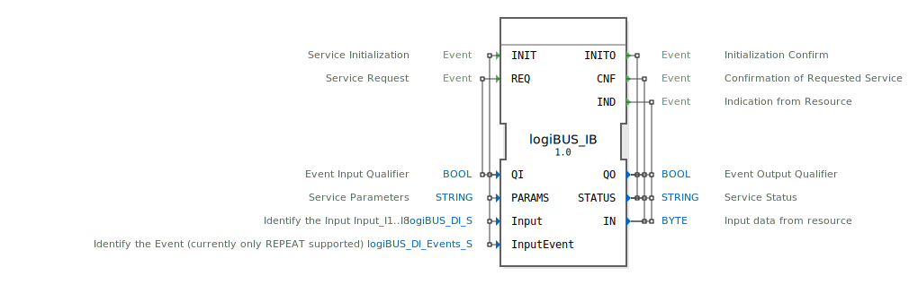

# logiBUS_IB

```{index} single: logiBUS_IB
```


* * * * * * * * * *

## Einleitung
Der logiBUS_IB ist ein Service Interface Function Block für die Verarbeitung von Byte-Eingabedaten. Dieser Baustein dient als Eingabeschnittstelle für logiBUS-Systeme und ermöglicht die Kommunikation mit digitalen Eingängen. Er unterstützt spezielle Ereignisbehandlungen wie Tastendruck-Wiederholungen und bietet eine standardisierte Schnittstelle für die Initialisierung und den Betrieb von Eingabegeräten.



## Schnittstellenstruktur

### **Ereignis-Eingänge**
- **INIT**: Service-Initialisierungsereignis
  - Verknüpft mit: QI, PARAMS, Input, InputEvent
- **REQ**: Service-Anfrageereignis
  - Verknüpft mit: QI

### **Ereignis-Ausgänge**
- **INITO**: Initialisierungsbestätigung
  - Verknüpft mit: QO, STATUS
- **CNF**: Bestätigung der angeforderten Service-Operation
  - Verknüpft mit: QO, STATUS, IN
- **IND**: Indikation vom Ressourcen-Interface
  - Verknüpft mit: QO, STATUS, IN

### **Daten-Eingänge**
- **QI** (BOOL): Event Input Qualifier - Steuert die Ausführung der Service-Operationen
- **PARAMS** (STRING): Service-Parameter für die Konfiguration
- **Input** (logiBUS_DI_S): Identifiziert den Eingang (I1..I8), Initialwert: Invalid
- **InputEvent** (logiBUS_DI_Events_S): Identifiziert das Ereignis (aktuell nur REPEAT unterstützt), Initialwert: Invalid

### **Daten-Ausgänge**
- **QO** (BOOL): Event Output Qualifier - Status der Service-Operation
- **STATUS** (STRING): Service-Statusinformationen
- **IN** (BYTE): Eingabedaten von der Ressource

### **Adapter**
Keine Adapter-Schnittstellen vorhanden.

## Funktionsweise
Der logiBUS_IB Function Block arbeitet als Eingabeservice-Interface für logiBUS-Systeme. Bei der Initialisierung (INIT-Event) werden die Service-Parameter konfiguriert und die Eingänge definiert. Der Baustein kann sowohl auf explizite Anfragen (REQ-Event) als auch auf asynchrone Ereignisse von der Hardware reagieren. Besondere Unterstützung bietet er für wiederholte Tastendruck-Ereignisse (BUTTON_PRESS_REPEAT).

## Technische Besonderheiten
- Unterstützt spezielle Ereignistypen wie BUTTON_PRESS_REPEAT und BUTTON_PRESS_REPEAT_DONE
- Byte-basierte Dateneingabe (8-Bit)
- Flexible Eingangskonfiguration über PARAMS-String
- Separate Ereignisausgänge für Bestätigungen (CNF) und Hardware-Indikationen (IND)
- Initialwert "Invalid" für nicht konfigurierte Eingänge

## Zustandsübersicht
Der Baustein verfügt über folgende Betriebszustände:
- **Nicht initialisiert**: Vor INIT-Event
- **Initialisiert**: Nach erfolgreicher INIT-Operation
- **Bereit**: Für REQ-Anfragen und IND-Ereignisse
- **Fehlerzustand**: Bei fehlerhaften Operationen (über STATUS meldbar)

## Anwendungsszenarien
- Digitale Eingabebaugruppen mit 8 Eingängen
- Tastatur-Interface mit Wiederholfunktion
- Allgemeine digitale Eingabeschnittstellen in logiBUS-Systemen
- Hardware-nahe Eingabeoperationen mit Event-Behandlung

## ⚖️ Vergleich mit ähnlichen Bausteinen
Im Vergleich zu einfachen digitalen Eingabebausteinen bietet logiBUS_IB erweiterte Service-Funktionalität mit:
- Parametrierbarer Konfiguration
- Ereignisbasierter Kommunikation
- Statusrückmeldungen
- Spezieller Unterstützung für Tastendruck-Wiederholungen


## 🛠️ Zugehörige Übungen

* [Uebung_006c](../../../../../training1/Ventilsteuerung/4diacIDE-workspace/test_B/Uebungen_doc/Uebung_006c.md)
* [Uebung_011a](../../../../../training1/Ventilsteuerung/4diacIDE-workspace/test_B/Uebungen_doc/Uebung_011a.md)

## Fazit
Der logiBUS_IB Function Block stellt eine leistungsfähige und flexible Lösung für Byte-Eingabedaten in logiBUS-Systemen dar. Durch seine Service-orientierte Architektur und die Unterstützung spezieller Ereignistypen eignet er sich besonders für Anwendungen, die erweiterte Eingabefunktionalitäten wie Tastendruck-Wiederholungen benötigen.