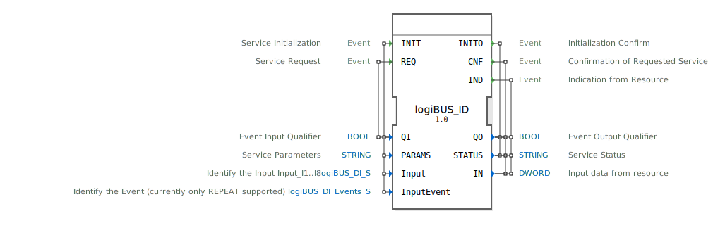

# logiBUS_ID

```{index} single: logiBUS_ID
```


* * * * * * * * * *
## Einleitung
Der logiBUS_ID Funktionsblock ist ein Eingabe-Service-Interface-Baustein für Doppelwort-Eingabedaten (DWORD). Er dient als Schnittstelle für die Kommunikation mit logiBUS-Eingabegeräten und ermöglicht die Verarbeitung von digitalen Eingangssignalen in 4diac-Steuerungssystemen.



## Schnittstellenstruktur

### **Ereignis-Eingänge**
- **INIT**: Service-Initialisierung - Initialisiert den Funktionsblock mit Parametern und Konfiguration
- **REQ**: Service-Anfrage - Löst eine Abfrage der aktuellen Eingabedaten aus

### **Ereignis-Ausgänge**
- **INITO**: Initialisierungsbestätigung - Bestätigt die erfolgreiche Initialisierung
- **CNF**: Bestätigung der angeforderten Service - Bestätigt eine REQ-Anfrage
- **IND**: Indikation von der Ressource - Signalisiert asynchrone Ereignisse vom Eingabegerät

### **Daten-Eingänge**
- **QI**: Event-Input-Qualifier (BOOL) - Aktiviert/Deaktiviert den Service
- **PARAMS**: Service-Parameter (STRING) - Konfigurationsparameter für den Service
- **Input**: Eingabe-Identifikation (logiBUS_DI_S) - Identifiziert den Eingang (I1..I8)
- **InputEvent**: Ereignis-Identifikation (logiBUS_DI_Events_S) - Identifiziert das Ereignis (aktuell nur REPEAT unterstützt)

### **Daten-Ausgänge**
- **QO**: Event-Output-Qualifier (BOOL) - Status des Service-Ausgangs
- **STATUS**: Service-Status (STRING) - Statusinformationen über den Service
- **IN**: Eingabedaten von der Ressource (DWORD) - Aktuelle Eingabedaten vom Gerät

### **Adapter**
Keine Adapter-Schnittstellen vorhanden.

## Funktionsweise
Der logiBUS_ID Funktionsblock dient als Bridge zwischen dem 4diac-System und logiBUS-Eingabegeräten. Bei der Initialisierung (INIT) werden die Geräteparameter konfiguriert. Der Block kann sowohl synchrone Abfragen (REQ/CNF) als auch asynchrone Ereignisse (IND) verarbeiten. Die Eingabedaten werden als 32-Bit-Doppelwort (DWORD) bereitgestellt.

## Technische Besonderheiten
- Unterstützt Doppelwort-Eingabedaten (32-Bit)
- Verwendet spezifische logiBUS-Datentypen für Eingabe- und Ereigniskonfiguration
- Bietet sowohl synchrone als auch asynchrone Kommunikationsmodi
- Initialwerte für Eingabeparameter sind als "Invalid" definiert

## Zustandsübersicht
Der Funktionsblock verfügt über folgende Betriebszustände:
- Nicht initialisiert (vor INIT)
- Initialisiert und bereit (nach erfolgreichem INITO)
- Abfrage-Modus (bei REQ/CNF-Zyklus)
- Ereignis-Modus (bei IND-Signalisierung)

## Anwendungsszenarien
- Anbindung von logiBUS-Eingabegeräten in Automatisierungssystemen
- Verarbeitung digitaler Eingangssignale in Steuerungsanwendungen
- Integration von Tasteneingaben (BUTTON_PRESS_UP, BUTTON_LONG_PRESS_HOLD, BUTTON_LONG_PRESS_UP)
- Überwachung von Zustandsänderungen an digitalen Eingängen

## ⚖️ Vergleich mit ähnlichen Bausteinen
Im Vergleich zu standardmäßigen digitalen Eingangsblöcken bietet logiBUS_ID:
- Spezifische logiBUS-Integration
- Erweiterte Ereignisbehandlung
- Konfigurierbare Parameter über STRING-Params
- Asynchrone Ereignisindikation


## 🛠️ Zugehörige Übungen

* [Uebung_011a2](../../../../../training1/Ventilsteuerung/4diacIDE-workspace/test_B/Uebungen_doc/Uebung_011a2.md)

## Fazit
Der logiBUS_ID Funktionsblock stellt eine spezialisierte Schnittstelle für logiBUS-Eingabegeräte in 4diac-Systemen dar. Durch seine flexible Konfiguration und Unterstützung verschiedener Betriebsmodi eignet er sich ideal für Anwendungen, die eine zuverlässige Verarbeitung digitaler Eingangssignale mit erweiterter Ereignisbehandlung erfordern.