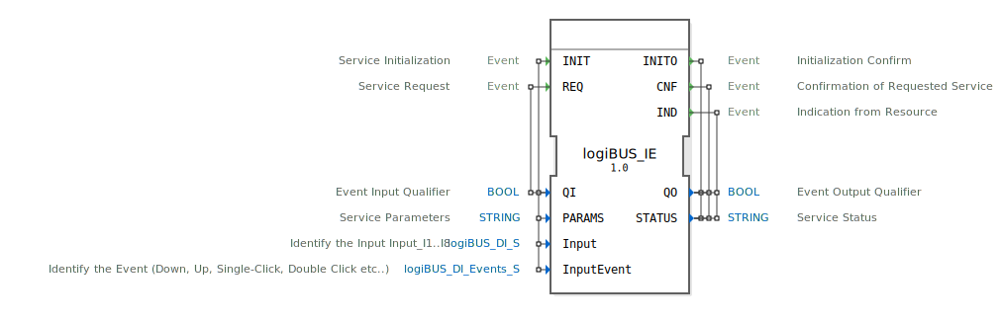

# logiBUS_IE

* * * * * * * * * *

## Einleitung
Der logiBUS_IE Funktionsblock ist ein Eingabeservice-Schnittstellenbaustein für Ereigniseingabedaten. Er dient als Interface zwischen dem logiBUS-System und der 4diac-Laufzeitumgebung zur Verarbeitung von digitalen Eingangssignalen mit erweiterten Ereigniserkennungsfunktionen.

## Schnittstellenstruktur

### **Ereignis-Eingänge**
- **INIT**: Service-Initialisierung
  - Verknüpft mit: QI, PARAMS, Input, InputEvent
- **REQ**: Service-Anfrage
  - Verknüpft mit: QI

### **Ereignis-Ausgänge**
- **INITO**: Initialisierungsbestätigung
  - Verknüpft mit: QO, STATUS
- **CNF**: Bestätigung der angeforderten Services
  - Verknüpft mit: QO, STATUS
- **IND**: Indikation von der Ressource
  - Verknüpft mit: QO, STATUS

### **Daten-Eingänge**
- **QI** (BOOL): Ereignis-Eingangsqualifizierer
- **PARAMS** (STRING): Service-Parameter
- **Input** (logiBUS_DI_S): Identifiziert den Eingang (I1..I8)
  - Initialwert: Invalid
- **InputEvent** (logiBUS_DI_Events_S): Identifiziert das Ereignis (Down, Up, Single-Click, Double-Click etc.)
  - Initialwert: Invalid

### **Daten-Ausgänge**
- **QO** (BOOL): Ereignis-Ausgangsqualifizierer
- **STATUS** (STRING): Service-Status

### **Adapter**
Keine Adapter-Schnittstellen vorhanden.

## Funktionsweise
Der Funktionsblock ermöglicht die Verarbeitung digitaler Eingangssignale mit erweiterter Ereigniserkennung. Über die INIT-Initialisierung können spezifische Parameter konfiguriert werden. Der Baustein erkennt verschiedene Eingabeereignisse wie Tastendrücke, Loslassen, Einzelklicks und Doppelklicks und signalisiert diese über die entsprechenden Ausgangsereignisse.

## Technische Besonderheiten
- Unterstützt multiple Ereignistypen (Down, Up, Single-Click, Double-Click)
- Flexible Eingangskonfiguration über PARAMS-String
- Statusrückmeldung über STATUS-Ausgang
- Initialisierung mit Invalid-Werten für sicheren Start

## Zustandsübersicht
Der Baustein verfügt über einen initialisierten und einen Betriebszustand. Nach erfolgreicher INIT-Initialisierung wechselt er in den Betriebszustand, in dem Ereignisverarbeitung und Service-Anfragen verarbeitet werden können.

## Anwendungsszenarien
- Bedienpanel-Steuerungen
- Tastatureingabe-Verarbeitung
- Mechanische Schalter-Überwachung
- Benutzerinteraktionssysteme
- Industrielle Steuerungstaster

## ⚖️ Vergleich mit ähnlichen Bausteinen
Im Vergleich zu einfachen digitalen Eingangsbausteinen bietet logiBUS_IE erweiterte Ereigniserkennungsfunktionen und kann komplexe Eingabemuster wie Doppelklicks erkennen. Die parametrierbare Konfiguration ermöglicht eine flexible Anpassung an verschiedene Hardware-Schnittstellen.

## 🛠️ Zugehörige Übungen

* [Uebung_004a](../../../../../Uebungen/test_B/Uebungen_doc/Uebung_004a.md)
* [Uebung_004a2](../../../../../Uebungen/test_B/Uebungen_doc/Uebung_004a2.md)
* [Uebung_004a2_2](../../../../../Uebungen/test_B/Uebungen_doc/Uebung_004a2_2.md)
* [Uebung_004a2_3](../../../../../Uebungen/test_B/Uebungen_doc/Uebung_004a2_3.md)
* [Uebung_004a2_AX](../../../../../Uebungen/test_AX/Uebungen_doc/Uebung_004a2_AX.md)
* [Uebung_004a3](../../../../../Uebungen/test_B/Uebungen_doc/Uebung_004a3.md)
* [Uebung_004a3_AX](../../../../../Uebungen/test_AX/Uebungen_doc/Uebung_004a3_AX.md)
* [Uebung_004a4](../../../../../Uebungen/test_B/Uebungen_doc/Uebung_004a4.md)
* [Uebung_004a4_AX](../../../../../Uebungen/test_AX/Uebungen_doc/Uebung_004a4_AX.md)
* [Uebung_004a5](../../../../../Uebungen/test_B/Uebungen_doc/Uebung_004a5.md)
* [Uebung_004a5_AX](../../../../../Uebungen/test_AX/Uebungen_doc/Uebung_004a5_AX.md)
* [Uebung_004a6](../../../../../Uebungen/test_B/Uebungen_doc/Uebung_004a6.md)
* [Uebung_004a6_AX](../../../../../Uebungen/test_AX/Uebungen_doc/Uebung_004a6_AX.md)
* [Uebung_004a7](../../../../../Uebungen/test_B/Uebungen_doc/Uebung_004a7.md)
* [Uebung_004a7_AX](../../../../../Uebungen/test_AX/Uebungen_doc/Uebung_004a7_AX.md)
* [Uebung_004a8](../../../../../Uebungen/test_B/Uebungen_doc/Uebung_004a8.md)
* [Uebung_004a8_AX](../../../../../Uebungen/test_AX/Uebungen_doc/Uebung_004a8_AX.md)
* [Uebung_004a9](../../../../../Uebungen/test_B/Uebungen_doc/Uebung_004a9.md)
* [Uebung_004a9_AX](../../../../../Uebungen/test_AX/Uebungen_doc/Uebung_004a9_AX.md)
* [Uebung_004a_AX](../../../../../Uebungen/test_AX/Uebungen_doc/Uebung_004a_AX.md)
* [Uebung_004b](../../../../../Uebungen/test_B/Uebungen_doc/Uebung_004b.md)
* [Uebung_004b2](../../../../../Uebungen/test_B/Uebungen_doc/Uebung_004b2.md)
* [Uebung_004b3](../../../../../Uebungen/test_B/Uebungen_doc/Uebung_004b3.md)
* [Uebung_004b_AX](../../../../../Uebungen/test_AX/Uebungen_doc/Uebung_004b_AX.md)
* [Uebung_004b_AX_ASR](../../../../../Uebungen/test_AX/Uebungen_doc/Uebung_004b_AX_ASR.md)
* [Uebung_004b_AX_ASR_X](../../../../../Uebungen/test_AX/Uebungen_doc/Uebung_004b_AX_ASR_X.md)
* [Uebung_004c1](../../../../../Uebungen/test_B/Uebungen_doc/Uebung_004c1.md)
* [Uebung_004c1_AX](../../../../../Uebungen/test_AX/Uebungen_doc/Uebung_004c1_AX.md)
* [Uebung_004c2](../../../../../Uebungen/test_B/Uebungen_doc/Uebung_004c2.md)
* [Uebung_004c2_AX](../../../../../Uebungen/test_AX/Uebungen_doc/Uebung_004c2_AX.md)
* [Uebung_004c3](../../../../../Uebungen/test_B/Uebungen_doc/Uebung_004c3.md)
* [Uebung_004c3_AX](../../../../../Uebungen/test_AX/Uebungen_doc/Uebung_004c3_AX.md)
* [Uebung_004c4](../../../../../Uebungen/test_B/Uebungen_doc/Uebung_004c4.md)
* [Uebung_004c4_AX](../../../../../Uebungen/test_AX/Uebungen_doc/Uebung_004c4_AX.md)
* [Uebung_004c5](../../../../../Uebungen/test_B/Uebungen_doc/Uebung_004c5.md)
* [Uebung_004c5_AX](../../../../../Uebungen/test_AX/Uebungen_doc/Uebung_004c5_AX.md)
* [Uebung_006](../../../../../Uebungen/test_B/Uebungen_doc/Uebung_006.md)
* [Uebung_006_AX](../../../../../Uebungen/test_AX/Uebungen_doc/Uebung_006_AX.md)
* [Uebung_006a](../../../../../Uebungen/test_B/Uebungen_doc/Uebung_006a.md)
* [Uebung_006a2](../../../../../Uebungen/test_B/Uebungen_doc/Uebung_006a2.md)
* [Uebung_006a2_AX](../../../../../Uebungen/test_AX/Uebungen_doc/Uebung_006a2_AX.md)
* [Uebung_006a3](../../../../../Uebungen/test_B/Uebungen_doc/Uebung_006a3.md)
* [Uebung_006a3_AX](../../../../../Uebungen/test_AX/Uebungen_doc/Uebung_006a3_AX.md)
* [Uebung_006a4](../../../../../Uebungen/test_B/Uebungen_doc/Uebung_006a4.md)
* [Uebung_006a4_AX](../../../../../Uebungen/test_AX/Uebungen_doc/Uebung_006a4_AX.md)
* [Uebung_006a_AX](../../../../../Uebungen/test_AX/Uebungen_doc/Uebung_006a_AX.md)
* [Uebung_006b](../../../../../Uebungen/test_B/Uebungen_doc/Uebung_006b.md)
* [Uebung_006b_AX](../../../../../Uebungen/test_AX/Uebungen_doc/Uebung_006b_AX.md)
* [Uebung_006d](../../../../../Uebungen/test_B/Uebungen_doc/Uebung_006d.md)
* [Uebung_006d_AX](../../../../../Uebungen/test_AX/Uebungen_doc/Uebung_006d_AX.md)
* [Uebung_007a1](../../../../../Uebungen/test_B/Uebungen_doc/Uebung_007a1.md)
* [Uebung_007a1_AX](../../../../../Uebungen/test_AX/Uebungen_doc/Uebung_007a1_AX.md)
* [Uebung_007a2](../../../../../Uebungen/test_B/Uebungen_doc/Uebung_007a2.md)
* [Uebung_007a2_AX](../../../../../Uebungen/test_AX/Uebungen_doc/Uebung_007a2_AX.md)
* [Uebung_007a3](../../../../../Uebungen/test_B/Uebungen_doc/Uebung_007a3.md)
* [Uebung_007a3_AX](../../../../../Uebungen/test_AX/Uebungen_doc/Uebung_007a3_AX.md)
* [Uebung_009a](../../../../../Uebungen/test_B/Uebungen_doc/Uebung_009a.md)
* [Uebung_019](../../../../../Uebungen/test_B/Uebungen_doc/Uebung_019.md)
* [Uebung_019a](../../../../../Uebungen/test_B/Uebungen_doc/Uebung_019a.md)
* [Uebung_019b](../../../../../Uebungen/test_B/Uebungen_doc/Uebung_019b.md)
* [Uebung_019c](../../../../../Uebungen/test_B/Uebungen_doc/Uebung_019c.md)
* [Uebung_020f3](../../../../../Uebungen/test_B/Uebungen_doc/Uebung_020f3.md)
* [Uebung_020f3_AX](../../../../../Uebungen/test_AX/Uebungen_doc/Uebung_020f3_AX.md)
* [Uebung_020h](../../../../../Uebungen/test_B/Uebungen_doc/Uebung_020h.md)
* [Uebung_020h_AX](../../../../../Uebungen/test_AX/Uebungen_doc/Uebung_020h_AX.md)
* [Uebung_020i](../../../../../Uebungen/test_B/Uebungen_doc/Uebung_020i.md)
* [Uebung_020i_AX](../../../../../Uebungen/test_AX/Uebungen_doc/Uebung_020i_AX.md)
* [Uebung_031](../../../../../Uebungen/test_B/Uebungen_doc/Uebung_031.md)
* [Uebung_034b](../../../../../Uebungen/test_B/Uebungen_doc/Uebung_034b.md)
* [Uebung_035](../../../../../Uebungen/test_B/Uebungen_doc/Uebung_035.md)
* [Uebung_035a](../../../../../Uebungen/test_B/Uebungen_doc/Uebung_035a.md)
* [Uebung_035a1_AX](../../../../../Uebungen/test_AX/Uebungen_doc/Uebung_035a1_AX.md)
* [Uebung_035a1b_AX](../../../../../Uebungen/test_AX/Uebungen_doc/Uebung_035a1b_AX.md)
* [Uebung_035a2](../../../../../Uebungen/test_B/Uebungen_doc/Uebung_035a2.md)
* [Uebung_035a2_AX](../../../../../Uebungen/test_AX/Uebungen_doc/Uebung_035a2_AX.md)
* [Uebung_035a3](../../../../../Uebungen/test_B/Uebungen_doc/Uebung_035a3.md)
* [Uebung_035a3_AX](../../../../../Uebungen/test_AX/Uebungen_doc/Uebung_035a3_AX.md)
* [Uebung_035b](../../../../../Uebungen/test_B/Uebungen_doc/Uebung_035b.md)
* [Uebung_035c](../../../../../Uebungen/test_B/Uebungen_doc/Uebung_035c.md)
* [Uebung_036](../../../../../Uebungen/test_B/Uebungen_doc/Uebung_036.md)
* [Uebung_037](../../../../../Uebungen/test_B/Uebungen_doc/Uebung_037.md)
* [Uebung_038](../../../../../Uebungen/test_B/Uebungen_doc/Uebung_038.md)
* [Uebung_038_AX](../../../../../Uebungen/test_AX/Uebungen_doc/Uebung_038_AX.md)
* [Uebung_039](../../../../../Uebungen/test_B/Uebungen_doc/Uebung_039.md)
* [Uebung_039a](../../../../../Uebungen/test_B/Uebungen_doc/Uebung_039a.md)
* [Uebung_040](../../../../../Uebungen/test_B/Uebungen_doc/Uebung_040.md)
* [Uebung_040_2](../../../../../Uebungen/test_B/Uebungen_doc/Uebung_040_2.md)
* [Uebung_040_AX](../../../../../Uebungen/test_AX/Uebungen_doc/Uebung_040_AX.md)
* [Uebung_041](../../../../../Uebungen/test_B/Uebungen_doc/Uebung_041.md)
* [Uebung_042](../../../../../Uebungen/test_B/Uebungen_doc/Uebung_042.md)
* [Uebung_043](../../../../../Uebungen/test_B/Uebungen_doc/Uebung_043.md)
* [Uebung_080](../../../../../Uebungen/test_B/Uebungen_doc/Uebung_080.md)
* [Uebung_080b](../../../../../Uebungen/test_B/Uebungen_doc/Uebung_080b.md)
* [Uebung_080c](../../../../../Uebungen/test_B/Uebungen_doc/Uebung_080c.md)
* [Uebung_081](../../../../../Uebungen/test_B/Uebungen_doc/Uebung_081.md)
* [Uebung_082](../../../../../Uebungen/test_B/Uebungen_doc/Uebung_082.md)
* [Uebung_083](../../../../../Uebungen/test_B/Uebungen_doc/Uebung_083.md)
* [Uebung_083_AX](../../../../../Uebungen/test_AX/Uebungen_doc/Uebung_083_AX.md)
* [Uebung_084](../../../../../Uebungen/test_B/Uebungen_doc/Uebung_084.md)
* [Uebung_085](../../../../../Uebungen/test_B/Uebungen_doc/Uebung_085.md)
* [Uebung_087](../../../../../Uebungen/test_B/Uebungen_doc/Uebung_087.md)
* [Uebung_087a1](../../../../../Uebungen/test_B/Uebungen_doc/Uebung_087a1.md)
* [Uebung_091](../../../../../Uebungen/test_B/Uebungen_doc/Uebung_091.md)
* [Uebung_093](../../../../../Uebungen/test_B/Uebungen_doc/Uebung_093.md)
* [Uebung_093b](../../../../../Uebungen/test_B/Uebungen_doc/Uebung_093b.md)
* [Uebung_094](../../../../../Uebungen/test_B/Uebungen_doc/Uebung_094.md)
* [Uebung_094a](../../../../../Uebungen/test_B/Uebungen_doc/Uebung_094a.md)
* [Uebung_094a_AX](../../../../../Uebungen/test_AX/Uebungen_doc/Uebung_094a_AX.md)
* [Uebung_095](../../../../../Uebungen/test_B/Uebungen_doc/Uebung_095.md)
* [Uebung_095_AX](../../../../../Uebungen/test_AX/Uebungen_doc/Uebung_095_AX.md)
* [Uebung_110](../../../../../Uebungen/test_B/Uebungen_doc/Uebung_110.md)
* [Uebung_111](../../../../../Uebungen/test_B/Uebungen_doc/Uebung_111.md)
* [Uebung_124](../../../../../Uebungen/test_B/Uebungen_doc/Uebung_124.md)
* [Uebung_127](../../../../../Uebungen/test_B/Uebungen_doc/Uebung_127.md)
* [Uebung_128](../../../../../Uebungen/test_B/Uebungen_doc/Uebung_128.md)
* [Uebung_128b](../../../../../Uebungen/test_B/Uebungen_doc/Uebung_128b.md)
* [Uebung_132](../../../../../Uebungen/test_B/Uebungen_doc/Uebung_132.md)
* [Uebung_150_AX](../../../../../Uebungen/test_AX/Uebungen_doc/Uebung_150_AX.md)
* [Uebung_151_AX](../../../../../Uebungen/test_AX/Uebungen_doc/Uebung_151_AX.md)
* [Uebung_152](../../../../../Uebungen/test_B/Uebungen_doc/Uebung_152.md)
* [Uebung_153](../../../../../Uebungen/test_B/Uebungen_doc/Uebung_153.md)
* [Uebung_160b](../../../../../Uebungen/test_B/Uebungen_doc/Uebung_160b.md)
* [Uebung_160b_AX](../../../../../Uebungen/test_AX/Uebungen_doc/Uebung_160b_AX.md)
* [Uebung_171_AX](../../../../../Uebungen/test_AX/Uebungen_doc/Uebung_171_AX.md)
* [Uebung_179](../../../../../Uebungen/test_B/Uebungen_doc/Uebung_179.md)
* [Uebung_180](../../../../../Uebungen/test_B/Uebungen_doc/Uebung_180.md)

## Fazit
Der logiBUS_IE Funktionsblock stellt eine leistungsstarke Schnittstelle für digitale Eingabegeräte mit erweiterter Ereigniserkennung bereit. Seine flexible Konfigurierbarkeit und die Unterstützung verschiedener Ereignistypen machen ihn ideal für Anwendungen, die komplexe Benutzerinteraktionen erfordern.