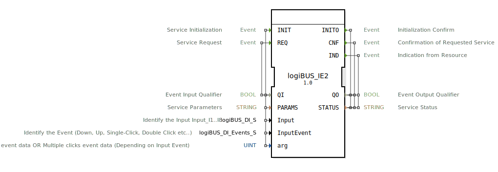

# logiBUS_IE2

```{index} single: logiBUS_IE2
```


* * * * * * * * * *

## Einleitung
Der logiBUS_IE2 ist ein Eingabeservice-Schnittstellen-Funktionsblock für Ereigniseingabedaten. Er dient als Interface für die Verarbeitung von Eingabeereignissen in logiBUS-Systemen und ermöglicht die Verarbeitung verschiedener Eingabeereignistypen wie Tastendrücke, Klicks und zeitbasierte Ereignisse.



## Schnittstellenstruktur

### **Ereignis-Eingänge**
- **INIT** (Service Initialization) - Initialisiert den Service mit folgenden Daten:
  - QI
  - PARAMS
  - Input
  - InputEvent
  - arg

- **REQ** (Service Request) - Fordert einen Service an mit:
  - QI

### **Ereignis-Ausgänge**
- **INITO** (Initialization Confirm) - Bestätigt die Initialisierung mit:
  - QO
  - STATUS

- **CNF** (Confirmation of Requested Service) - Bestätigt den angeforderten Service mit:
  - QO
  - STATUS

- **IND** (Indication from Resource) - Meldung von der Ressource mit:
  - QO
  - STATUS

### **Daten-Eingänge**
- **QI** (BOOL) - Event Input Qualifier
- **PARAMS** (STRING) - Service Parameters
- **Input** (logiBUS_DI_S) - Identifiziert den Eingang Input_I1..I8 (Initialwert: Invalid)
- **InputEvent** (logiBUS_DI_Events_S) - Identifiziert das Ereignis (Down, Up, Single-Click, Double Click etc.) (Initialwert: Invalid)
- **arg** (UINT) - Langdruck-Zeitereignisdaten ODER Mehrfachklick-Ereignisdaten (abhängig vom Input Event) (Initialwert: 65535)

### **Daten-Ausgänge**
- **QO** (BOOL) - Event Output Qualifier
- **STATUS** (STRING) - Service Status

### **Adapter**
Keine Adapter-Schnittstellen vorhanden.

## Funktionsweise
Der logiBUS_IE2 Funktionsblock verarbeitet Eingabeereignisse von logiBUS-Eingängen und wandelt diese in standardisierte Ereignismeldungen um. Er unterstützt verschiedene Ereignistypen wie Tastendrücke (Down/Up), Einzelklicks, Doppelklicks und zeitbasierte Ereignisse wie Langdruck. Der Block kann über den INIT-Eingang konfiguriert werden und liefert über die Ausgänge Statusinformationen und Bestätigungen zurück.

## Technische Besonderheiten
- Unterstützt multiple Eingänge (I1 bis I8)
- Verarbeitet verschiedene Ereignistypen über die InputEvent-Variable
- Kann zeitbasierte Ereignisse (Langdruck) und zählbasierte Ereignisse (Mehrfachklicks) verarbeiten
- Initialisierung mit spezifischen Parametern über PARAMS-Eingang
- Liefert detaillierte Statusinformationen über STATUS-Ausgang

## Zustandsübersicht
Der Funktionsblock verfügt über einen Initialisierungszustand (INIT/INITO) und operative Zustände für Service-Anfragen (REQ/CNF) sowie asynchrone Ereignismeldungen (IND). Die genaue Zustandsmaschine ist implementierungsabhängig.

## Anwendungsszenarien
- Bedienpanel-Steuerungen mit Tasteneingaben
- Maschinensteuerung mit Ereignis-basierten Eingaben
- Systeme mit komplexen Tasteneingabe-Sequenzen
- Anwendungen mit Langdruck- und Mehrfachklick-Erkennung

## ⚖️ Vergleich mit ähnlichen Bausteinen
Im Vergleich zu einfachen digitalen Eingabeblöcken bietet logiBUS_IE2 erweiterte Funktionalität für komplexe Ereigniserkennung und unterstützt verschiedene Eingabeereignistypen mit konfigurierbaren Parametern.


## 🛠️ Zugehörige Übungen

* [Uebung_004c6](../../../../../training1/Ventilsteuerung/4diacIDE-workspace/test_B/Uebungen_doc/Uebung_004c6.md)
* [Uebung_004c6_AX](../../../../../training1/Ventilsteuerung/4diacIDE-workspace/test_AX/Uebungen_doc/Uebung_004c6_AX.md)
* [Uebung_004c7](../../../../../training1/Ventilsteuerung/4diacIDE-workspace/test_B/Uebungen_doc/Uebung_004c7.md)
* [Uebung_004c7_AX](../../../../../training1/Ventilsteuerung/4diacIDE-workspace/test_AX/Uebungen_doc/Uebung_004c7_AX.md)

## Fazit
Der logiBUS_IE2 ist ein leistungsstarker Funktionsblock für die Verarbeitung von Ereigniseingabedaten in logiBUS-Systemen, der durch seine Flexibilität bei der Ereigniserkennung und umfangreiche Konfigurationsmöglichkeiten für anspruchsvolle Steuerungsanwendungen geeignet ist.