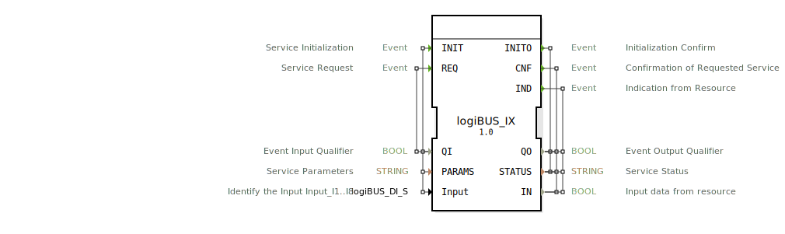

# logiBUS_IX

* * * * * * * * * *

## Einleitung
Der logiBUS_IX Funktionsblock ist ein Eingabeservice-Interface für boolesche Eingangsdaten, der speziell für die Kommunikation mit logiBUS-Eingabemodulen entwickelt wurde. Er dient als Schnittstelle zwischen der Steuerungslogik und physischen Eingabesignalen und ermöglicht die Abfrage von digitalen Eingangswerten.

## Schnittstellenstruktur

### **Ereignis-Eingänge**
- **INIT**: Service-Initialisierungsereignis
- **REQ**: Service-Anfrageereignis

### **Ereignis-Ausgänge**
- **INITO**: Initialisierungsbestätigung
- **CNF**: Bestätigung der angeforderten Service-Anfrage
- **IND**: Anzeige vom Ressourcen-Interface

### **Daten-Eingänge**
- **QI**: Ereignis-Eingangsqualifizierer (BOOL)
- **PARAMS**: Service-Parameter (STRING)
- **Input**: Identifiziert den Eingang I1..I8 (logiBUS_DI_S) - Initialwert: Invalid

### **Daten-Ausgänge**
- **QO**: Ereignis-Ausgangsqualifizierer (BOOL)
- **STATUS**: Service-Status (STRING)
- **IN**: Eingangsdaten von der Ressource (BOOL)

### **Adapter**
Keine Adapter-Schnittstellen vorhanden.

## Funktionsweise
Der Funktionsblock initialisiert sich über das INIT-Ereignis und kann anschließend über das REQ-Ereignis Eingangsdaten anfordern. Bei erfolgreicher Initialisierung gibt er das INITO-Ereignis zurück. Die tatsächlichen Eingangswerte werden über den IN-Ausgang bereitgestellt, während der STATUS-Ausgang Informationen über den aktuellen Betriebszustand liefert.

## Technische Besonderheiten
- Unterstützt bis zu 8 digitale Eingänge (I1..I8)
- Verwendet spezielle logiBUS-Datentypen für die Eingangsidentifikation
- Bietet umfangreiche Statusrückmeldungen über den STATUS-Ausgang
- Initialisiert mit einem ungültigen Eingangswert (Invalid)

## Zustandsübersicht
Der Funktionsblock durchläuft typischerweise folgende Zustände:
1. **Nicht initialisiert**: Vor der INIT-Anforderung
2. **Initialisiert**: Nach erfolgreicher INIT-Verarbeitung
3. **Bereit**: Kann REQ-Anfragen verarbeiten
4. **Aktiv**: Verarbeitet gerade eine Service-Anfrage

## Anwendungsszenarien
- Abfrage von digitalen Eingangssignalen in Automatisierungssystemen
- Integration von logiBUS-Eingabemodulen in 4diac-basierte Steuerungen
- Überwachung von Schalterzuständen und Sensorsignalen
- Industrielle E/A-Steuerung mit Statusüberwachung

## ⚖️ Vergleich mit ähnlichen Bausteinen
Im Vergleich zu einfachen digitalen Eingangsblöcken bietet logiBUS_IX:
- Erweiterte Statusinformationen
- Parametrierbare Service-Parameter
- Spezifische logiBUS-Hardware-Integration
- Umfangreichere Initialisierungs- und Bestätigungsmechanismen

## 🛠️ Zugehörige Übungen

* [Uebung_001](../../../../../Uebungen/test_B/Uebungen_doc/Uebung_001.md)
* [Uebung_001c](../../../../../Uebungen/test_B/Uebungen_doc/Uebung_001c.md)
* [Uebung_002](../../../../../Uebungen/test_B/Uebungen_doc/Uebung_002.md)
* [Uebung_002a](../../../../../Uebungen/test_B/Uebungen_doc/Uebung_002a.md)
* [Uebung_002a2](../../../../../Uebungen/test_B/Uebungen_doc/Uebung_002a2.md)
* [Uebung_002a3](../../../../../Uebungen/test_B/Uebungen_doc/Uebung_002a3.md)
* [Uebung_002a4](../../../../../Uebungen/test_B/Uebungen_doc/Uebung_002a4.md)
* [Uebung_002a5b](../../../../../Uebungen/test_B/Uebungen_doc/Uebung_002a5b.md)
* [Uebung_002b2](../../../../../Uebungen/test_B/Uebungen_doc/Uebung_002b2.md)
* [Uebung_002b3](../../../../../Uebungen/test_B/Uebungen_doc/Uebung_002b3.md)
* [Uebung_003](../../../../../Uebungen/test_B/Uebungen_doc/Uebung_003.md)
* [Uebung_003a0](../../../../../Uebungen/test_B/Uebungen_doc/Uebung_003a0.md)
* [Uebung_003a_sub](../../../../../Uebungen/test_B/Uebungen_doc/Uebung_003a_sub.md)
* [Uebung_003b_sub](../../../../../Uebungen/test_B/Uebungen_doc/Uebung_003b_sub.md)
* [Uebung_003c_sub](../../../../../Uebungen/test_B/Uebungen_doc/Uebung_003c_sub.md)
* [Uebung_003d](../../../../../Uebungen/test_B/Uebungen_doc/Uebung_003d.md)
* [Uebung_005](../../../../../Uebungen/test_B/Uebungen_doc/Uebung_005.md)
* [Uebung_006e1](../../../../../Uebungen/test_B/Uebungen_doc/Uebung_006e1.md)
* [Uebung_006e2](../../../../../Uebungen/test_B/Uebungen_doc/Uebung_006e2.md)
* [Uebung_019c](../../../../../Uebungen/test_B/Uebungen_doc/Uebung_019c.md)
* [Uebung_020a](../../../../../Uebungen/test_B/Uebungen_doc/Uebung_020a.md)
* [Uebung_020b](../../../../../Uebungen/test_B/Uebungen_doc/Uebung_020b.md)
* [Uebung_020c](../../../../../Uebungen/test_B/Uebungen_doc/Uebung_020c.md)
* [Uebung_020c2](../../../../../Uebungen/test_B/Uebungen_doc/Uebung_020c2.md)
* [Uebung_020c3](../../../../../Uebungen/test_B/Uebungen_doc/Uebung_020c3.md)
* [Uebung_020d](../../../../../Uebungen/test_B/Uebungen_doc/Uebung_020d.md)
* [Uebung_020e](../../../../../Uebungen/test_B/Uebungen_doc/Uebung_020e.md)
* [Uebung_020e2](../../../../../Uebungen/test_B/Uebungen_doc/Uebung_020e2.md)
* [Uebung_020f](../../../../../Uebungen/test_B/Uebungen_doc/Uebung_020f.md)
* [Uebung_020f2](../../../../../Uebungen/test_B/Uebungen_doc/Uebung_020f2.md)
* [Uebung_020g](../../../../../Uebungen/test_B/Uebungen_doc/Uebung_020g.md)
* [Uebung_020i](../../../../../Uebungen/test_B/Uebungen_doc/Uebung_020i.md)
* [Uebung_028](../../../../../Uebungen/test_B/Uebungen_doc/Uebung_028.md)
* [Uebung_029](../../../../../Uebungen/test_B/Uebungen_doc/Uebung_029.md)
* [Uebung_030](../../../../../Uebungen/test_B/Uebungen_doc/Uebung_030.md)
* [Uebung_032](../../../../../Uebungen/test_B/Uebungen_doc/Uebung_032.md)
* [Uebung_033_sub](../../../../../Uebungen/test_B/Uebungen_doc/Uebung_033_sub.md)
* [Uebung_049](../../../../../Uebungen/test_B/Uebungen_doc/Uebung_049.md)
* [Uebung_051](../../../../../Uebungen/test_B/Uebungen_doc/Uebung_051.md)
* [Uebung_052](../../../../../Uebungen/test_B/Uebungen_doc/Uebung_052.md)
* [Uebung_053](../../../../../Uebungen/test_B/Uebungen_doc/Uebung_053.md)
* [Uebung_054](../../../../../Uebungen/test_B/Uebungen_doc/Uebung_054.md)
* [Uebung_055](../../../../../Uebungen/test_B/Uebungen_doc/Uebung_055.md)
* [Uebung_056](../../../../../Uebungen/test_B/Uebungen_doc/Uebung_056.md)
* [Uebung_085](../../../../../Uebungen/test_B/Uebungen_doc/Uebung_085.md)
* [Uebung_086](../../../../../Uebungen/test_B/Uebungen_doc/Uebung_086.md)
* [Uebung_087](../../../../../Uebungen/test_B/Uebungen_doc/Uebung_087.md)
* [Uebung_087a1](../../../../../Uebungen/test_B/Uebungen_doc/Uebung_087a1.md)
* [Uebung_087a2](../../../../../Uebungen/test_B/Uebungen_doc/Uebung_087a2.md)
* [Uebung_088](../../../../../Uebungen/test_B/Uebungen_doc/Uebung_088.md)
* [Uebung_089](../../../../../Uebungen/test_B/Uebungen_doc/Uebung_089.md)
* [Uebung_090a1](../../../../../Uebungen/test_B/Uebungen_doc/Uebung_090a1.md)
* [Uebung_090a1_AX](../../../../../Uebungen/test_AX/Uebungen_doc/Uebung_090a1_AX.md)
* [Uebung_090a2](../../../../../Uebungen/test_B/Uebungen_doc/Uebung_090a2.md)
* [Uebung_090a2_AX](../../../../../Uebungen/test_AX/Uebungen_doc/Uebung_090a2_AX.md)
* [Uebung_094](../../../../../Uebungen/test_B/Uebungen_doc/Uebung_094.md)
* [Uebung_094a](../../../../../Uebungen/test_B/Uebungen_doc/Uebung_094a.md)
* [Uebung_095](../../../../../Uebungen/test_B/Uebungen_doc/Uebung_095.md)
* [Uebung_160](../../../../../Uebungen/test_B/Uebungen_doc/Uebung_160.md)
* [Uebung_160b2](../../../../../Uebungen/test_B/Uebungen_doc/Uebung_160b2.md)
* [Uebung_177](../../../../../Uebungen/test_B/Uebungen_doc/Uebung_177.md)
* [Uebung_178](../../../../../Uebungen/test_B/Uebungen_doc/Uebung_178.md)

## Fazit
Der logiBUS_IX Funktionsblock stellt eine robuste und flexible Lösung für die Integration von logiBUS-Eingabemodulen in 4diac-basierte Steuerungssysteme dar. Seine umfangreiche Statusrückmeldung und parametrierbare Schnittstelle machen ihn besonders geeignet für industrielle Anwendungen, bei denen zuverlässige E/A-Kommunikation erforderlich ist.