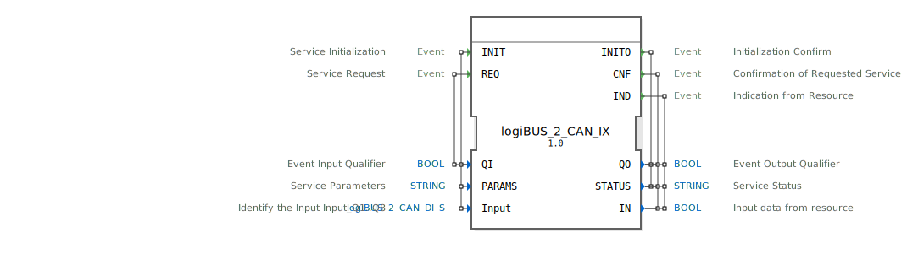

# logiBUS_2_CAN_IX

```{index} single: logiBUS_2_CAN_IX
```


* * * * * * * * * *

## Einleitung
Der Funktionsblock `logiBUS_2_CAN_IX` ist ein Service-Interface-Funktionsblock für boolesche Eingangsdaten, der speziell für die Integration von logiBUS-Systemen mit CAN-Bus-Kommunikation entwickelt wurde. Er dient als Eingabeschnittstelle für digitale Signale und ermöglicht die Kommunikation zwischen dem Steuerungssystem und angeschlossenen CAN-fähigen Geräten.



## Schnittstellenstruktur

### **Ereignis-Eingänge**
- **INIT**: Service-Initialisierungsereignis
  - Verknüpft mit: QI, PARAMS, Input
- **REQ**: Service-Anfrageereignis
  - Verknüpft mit: QI

### **Ereignis-Ausgänge**
- **INITO**: Initialisierungsbestätigung
  - Verknüpft mit: QO, STATUS
- **CNF**: Bestätigung der angeforderten Service-Anfrage
  - Verknüpft mit: QO, STATUS, IN
- **IND**: Indikation von der Ressource
  - Verknüpft mit: QO, STATUS, IN

### **Daten-Eingänge**
- **QI**: BOOL - Ereignis-Eingangsqualifikator
- **PARAMS**: STRING - Service-Parameter
- **Input**: logiBUS_2_CAN_DI_S - Identifiziert den Eingang Input_Q1..Q8
  - Initialwert: logiBUS_2_CAN_DI::Invalid

### **Daten-Ausgänge**
- **QO**: BOOL - Ereignis-Ausgangsqualifikator
- **STATUS**: STRING - Service-Status
- **IN**: BOOL - Eingangsdaten von der Ressource

### **Adapter**
Keine Adapter-Schnittstellen vorhanden.

## Funktionsweise
Der Funktionsblock arbeitet als Eingabeservice-Interface für digitale CAN-Signale. Bei Initialisierung (INIT-Event) werden die Service-Parameter konfiguriert und der Eingangskanal identifiziert. Über das REQ-Event können Service-Anfragen gestellt werden, während IND-Events eingehende Daten von der Ressource signalisieren. Der Block verwaltet den Status der Kommunikation und liefert die empfangenen booleschen Eingangsdaten über den IN-Ausgang.

## Technische Besonderheiten
- Spezielle Datentypen für logiBUS-CAN-Integration
- Initialisierung mit Invalid-Zustand als Standard
- Separate Bestätigungs- und Indikations-Events für unterschiedliche Betriebszustände
- String-basierte Statusrückmeldung für detaillierte Fehlerdiagnose

## Zustandsübersicht
Der Funktionsblock durchläuft folgende Hauptzustände:
1. **Nicht initialisiert**: Vor INIT-Event
2. **Initialisiert**: Nach erfolgreicher INITO-Bestätigung
3. **Service-Bereit**: Kann REQ- und IND-Events verarbeiten
4. **Fehlerzustand**: Bei Kommunikationsproblemen (über STATUS signalisiert)

## Anwendungsszenarien
- Integration von logiBUS-I/O-Modulen in 4diac-Steuerungen
- CAN-basierte digitale Eingangssignalverarbeitung
- Industrielle Automatisierungssysteme mit verteilten I/Os
- Robotersteuerungen mit CAN-Peripherie

## Vergleich mit ähnlichen Bausteinen
Im Vergleich zu standardmäßigen digitalen Eingangsblöcken bietet `logiBUS_2_CAN_IX` spezielle CAN-Integration und erweiterte Statusrückmeldungen. Während einfache DI-Blöcke nur direkte Signalverarbeitung bieten, unterstützt dieser Block komplexere Protokollhandhabung und Fehlerbehandlung für industrielle CAN-Netzwerke.

## Fazit
Der `logiBUS_2_CAN_IX` Funktionsblock stellt eine robuste und zuverlässige Schnittstelle für die Integration von CAN-basierten digitalen Eingangssignalen in 4diac-Steuerungssysteme dar. Seine erweiterte Fehlerbehandlung und Statusrückmeldung machen ihn besonders geeignet für anspruchsvolle industrielle Anwendungen, wo zuverlässige Kommunikation mit verteilten I/O-Systemen erforderlich ist.