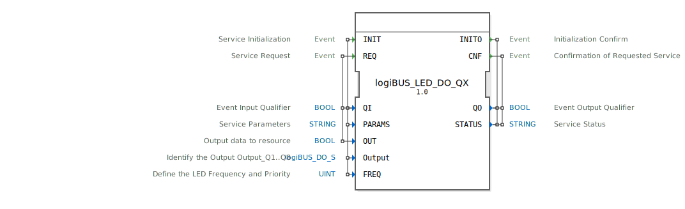

# logiBUS_LED_DO_QX

```{index} single: logiBUS_LED_DO_QX
```


* * * * * * * * * *

## Einleitung
Der Funktionsblock logiBUS_LED_DO_QX ist ein Ausgabeservice-Interface-Funktionsblock für boolesche Ausgabedaten. Er dient zur Ansteuerung von LED-Ausgängen über das logiBUS-System und bietet spezielle Funktionen zur Frequenzsteuerung der LEDs.



## Schnittstellenstruktur

### **Ereignis-Eingänge**
- **INIT**: Service-Initialisierung mit den zugehörigen Variablen QI, PARAMS, Output und FREQ
- **REQ**: Service-Anforderung mit den zugehörigen Variablen QI und OUT

### **Ereignis-Ausgänge**
- **INITO**: Initialisierungsbestätigung mit den zugehörigen Variablen QO und STATUS
- **CNF**: Bestätigung der angeforderten Service-Durchführung mit den zugehörigen Variablen QO und STATUS

### **Daten-Eingänge**
- **QI**: Ereignis-Eingangsqualifizierer (BOOL)
- **PARAMS**: Service-Parameter (STRING)
- **OUT**: Ausgabedaten an die Ressource (BOOL)
- **Output**: Identifiziert den Ausgang Output_Q1..Q8 (logiBUS::io::DQ::logiBUS_DO_S) - Initialwert: Invalid
- **FREQ**: Definiert die LED-Frequenz und Priorität (UINT) - Initialwert: LED_FREQ::LED_OFF

### **Daten-Ausgänge**
- **QO**: Ereignis-Ausgangsqualifizierer (BOOL)
- **STATUS**: Service-Status (STRING)

### **Adapter**
Keine Adapter-Schnittstellen vorhanden.

## Funktionsweise
Der Funktionsblock ermöglicht die Ansteuerung von LED-Ausgängen mit konfigurierbaren Frequenzeinstellungen. Über den INIT-Ereigniseingang wird der Service initialisiert, wobei der spezifische Ausgang (Output_Q1 bis Q8) und die LED-Frequenz konfiguriert werden können. Der REQ-Ereigniseingang löst die eigentliche Ausgabeoperation aus, bei der der boolesche Wert an den konfigurierten Ausgang gesendet wird.

## Technische Besonderheiten
- Unterstützt Frequenzsteuerung für LED-Betrieb (Blinken)
- Initialisierung mit Invalid-Wert für den Output
- Vordefinierte Frequenzkonstanten (LED_FREQ::LED_OFF als Standard)
- Spezifische Ausgangsidentifikation über den Output-Parameter

## Zustandsübersicht
Der Funktionsblock durchläuft typische Service-Interface-Zustände:
1. Nicht initialisierter Zustand
2. Initialisierungsphase nach INIT-Ereignis
3. Betriebsbereiter Zustand nach erfolgreicher Initialisierung
4. Aktiver Betriebszustand während REQ-Verarbeitung

## Anwendungsszenarien
- Ansteuerung von Status-LEDs in Automatisierungssystemen
- Visualisierung von Prozesszuständen mit blinkenden Signalen
- Integration in logiBUS-basierte Steuerungssysteme
- Prioritätsgesteuerte LED-Anzeigen

## ⚖️ Vergleich mit ähnlichen Bausteinen
Im Vergleich zu einfachen digitalen Ausgabeblöcken bietet logiBUS_LED_DO_QX erweiterte Funktionen zur Frequenzsteuerung und spezifische LED-Optimierungen. Während Standard-DO-Blöcke nur einfache Ein/Aus-Steuerung bieten, ermöglicht dieser Block komplexere Blinkmuster und Prioritätssteuerung.


## 🛠️ Zugehörige Übungen

* [Uebung_029](../../../../../training1/Ventilsteuerung/4diacIDE-workspace/test_B/Uebungen_doc/Uebung_029.md)

## Fazit
Der logiBUS_LED_DO_QX Funktionsblock stellt eine spezialisierte Lösung für die LED-Ausgabesteuerung in logiBUS-Systemen dar. Durch die integrierte Frequenzsteuerung und die flexible Konfiguration der Ausgänge eignet er sich besonders für Anwendungen, die erweiterte Visualisierungsfunktionen erfordern.