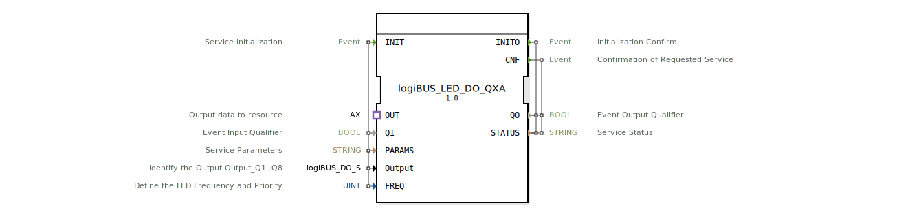

# logiBUS_LED_DO_QXA

* * * * * * * * * *
## Einleitung
Der **logiBUS_LED_DO_QXA** ist ein zusammengesetzter Funktionsblock (Composite FB), der die Ansteuerung einer einzelnen LED über das logiBUS-System vereinfacht. Er nimmt einen booleschen Wert (z. B. von einer Steuerlogik) entgegen und konfiguriert den gewünschten LED-Ausgang (Q1 – Q8) mit einer einstellbaren Frequenz und Priorität. Der FB kapselt die Kommunikation mit dem zugrunde liegenden Hardwaretreiber und stellt eine standardisierte Schnittstelle zur Verfügung.

## Schnittstellenstruktur
### **Ereignis-Eingänge**
- **INIT** (EInit): Initialisiert die gesamte Funktionslogik.  
  Mitverkabelte Daten: `QI`, `PARAMS`, `Output`, `FREQ`

### **Ereignis-Ausgänge**
- **INITO** (EInit): Bestätigung der erfolgreichen Initialisierung.  
  Mitverkabelte Daten: `QO`, `STATUS`
- **CNF** (Event): Quittierung eines abgeschlossenen Service-Auftrags (z. B. nach einer Wertänderung).  
  Mitverkabelte Daten: `QO`, `STATUS`

### **Daten-Eingänge**
- *QI* (BOOL): Ereignisqualifikator – schaltet die Verarbeitung des Eingangsereignisses frei.  
- *PARAMS* (STRING): Service-Parameter, typischerweise Adress‑ oder Konfigurationsdaten für den logiBUS‑Knoten.  
- *Output* (logiBUS::io::DQ::logiBUS_DO_S): Identifikation des physischen Ausgangs (z. B. Q1 … Q8). Initialwert: `Invalid`.  
- *FREQ* (UINT): Definiert die gewünschte LED‑Frequenz und Priorität. Initialwert: `LED_FREQ::LED_OFF`.

### **Daten-Ausgänge**
- *QO* (BOOL): Ausgangsqualifikator – gibt den Zustand der letzten Verarbeitung an.  
- *STATUS* (STRING): Meldung über den aktuellen Dienstzustand (z. B. Fehlercode oder „OK“).

### **Adapter**
- **OUT** (adapter::types::unidirectional::AX): Unidirektionaler Adapter zur Übergabe des booleschen Wertes an die Ressource.  
  - *E1* (Ereignis): Signalisiert eine neue Datenanforderung.  
  - *D1* (BOOL): Der zu übertragende Wert (LED ein/aus).

## Funktionsweise
1. **Initialisierung**  
   Der FB wird durch ein INIT-Ereignis gestartet. Die mitgelieferten Daten (`QI`, `PARAMS`, `Output`, `FREQ`) werden an den inneren FB `logiBUS_LED_DO_QX` weitergeleitet, der die eigentliche logiBUS-Kommunikation durchführt. Bei Erfolg wird `INITO` mit den Ausgangsdaten `QO` und `STATUS` gesendet.

2. **Betrieb**  
   Nach der Initialisierung wartet der FB auf das Ereignis `OUT.E1`. Dieses wird von der angeschlossenen Ressource ausgelöst, sobald ein neuer boolescher Wert (`OUT.D1`) anliegt. Das Ereignis wird als `REQ` an den inneren Baustein weitergegeben. Dieser aktualisiert daraufhin den LED‑Ausgang gemäß der konfigurierten `Output`‑Identifikation und der angegebenen `FREQ`.

3. **Bestätigung**  
   Nach erfolgreicher Verarbeitung sendet der innere FB ein `CNF`-Ereignis, das als `CNF` nach außen gegeben wird. Die Ausgänge `QO` und `STATUS` zeigen den aktuellen Zustand an.

## Technische Besonderheiten
- **Composite‑FB** – Der Baustein vereinfacht die Nutzung des komplexen Treiber-FBs `logiBUS_LED_DO_QX` durch eine reduzierte Schnittstelle.
- **Adapter‑Gestaltung** – Der Adapter `OUT` ermöglicht eine lose Kopplung zwischen Steuerlogik und Ausgabekanal. Der boolesche Wert wird ereignisgesteuert übergeben.
- **LED‑Frequenz** – Der Parameter `FREQ` nutzt eine vordefinierte Enumeration (`LED_FREQ`), um Blinkmuster oder Prioritäten festzulegen (z. B. `LED_OFF`, `LED_ON`, `BLINK_1HZ`, …).
- **Fehlerbehandlung** – Der Ausgang `STATUS` gibt detaillierte Meldungen (z. B. von `logiBUS::io::DQ::logiBUS_DO::Invalid`) zurück.

## Zustandsübersicht
Der FB besitzt keine expliziten Zustandsautomaten im XML‑Netzwerk. Die Zustandslogik wird durch das Zusammenspiel von INIT und den Ereignis-/Datenverbindungen realisiert:

- **Ruhezustand** – Nach erfolgreicher Initialisierung wartet der FB auf Ereignisse vom Adapter.
- **Verarbeitung** – Ein `OUT.E1`-Ereignis löst eine Aktualisierung des LED-Ausgangs aus.
- **Fehlerzustand** – Bei fehlgeschlagener Initialisierung oder Kommunikationsfehler wird `STATUS` entsprechend gesetzt.

## Anwendungsszenarien
- **Land‑ und Agrartechnik** – Ansteuerung von Kontrollleuchten an Maschinen, Anzeige von Betriebszuständen über logiBUS.
- **Automatisierung** – Einfache Ein‑/Aus‑Signale auf verteilte I/O‑Module, z. B. Schaltschrank‑LEDs.
- **Kabellose Anbindung** – Nutzung des logiBUS‑Protokolls zur Überbrückung größerer Distanzen zwischen Steuerung und Aktor.

## Vergleich mit ähnlichen Bausteinen
Gegenüber dem direkten Treiber-FB `logiBUS_LED_DO_QX` bietet `logiBUS_LED_DO_QXA` eine schlankere Schnittstelle und integriert die Initialisierung in einem Schritt. Andere Composite-FBs der `logiBUS_DO`‑Familie fokussieren auf digital‑binäre Ausgänge, während dieser Baustein speziell für LED‑Anwendungen (mit Frequenzunterstützung) ausgelegt ist.

## Fazit
Der `logiBUS_LED_DO_QXA` ist ein komfortabler Composite-FB für die LED‑Ausgabe über logiBUS. Er reduziert die Implementierungskomplexität auf wenige Parameter und einen Ereignis‑Adapter. Durch seine klare Struktur eignet er sich besonders für wiederkehrende Schaltaufgaben in verteilten Steuerungen.