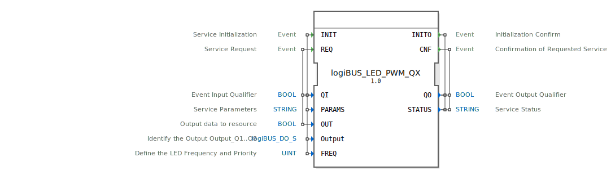

# logiBUS_LED_PWM_QX

```{index} single: logiBUS_LED_PWM_QX
```


* * * * * * * * * *

## Einleitung
Der logiBUS_LED_PWM_QX ist ein Ausgabeservice-Interface-Funktionsblock für boolesche Ausgabedaten mit PWM-Funktionalität für LED-Ansteuerung. Der Baustein ermöglicht die Ansteuerung von LED-Ausgängen mit konfigurierbaren Frequenzen und bietet eine standardisierte Schnittstelle für die Kommunikation mit logiBUS-I/O-Ressourcen.



## Schnittstellenstruktur

### **Ereignis-Eingänge**
- **INIT**: Service-Initialisierung mit Parametern QI, PARAMS, Output und FREQ
- **REQ**: Service-Anforderung mit Parametern QI und OUT

### **Ereignis-Ausgänge**
- **INITO**: Initialisierungsbestätigung mit Parametern QO und STATUS
- **CNF**: Bestätigung der angeforderten Service-Operation mit Parametern QO und STATUS

### **Daten-Eingänge**
- **QI**: BOOL - Ereignis-Eingangsqualifizierer
- **PARAMS**: STRING - Service-Parameter
- **OUT**: BOOL - Ausgabedaten zur Ressource
- **Output**: logiBUS_DO_S - Identifiziert den Ausgang (Output_Q1..Q8), Initialwert: Invalid
- **FREQ**: UINT - Definiert die LED-Frequenz und Priorität, Initialwert: LED_FREQ::LED_OFF

### **Daten-Ausgänge**
- **QO**: BOOL - Ereignis-Ausgangsqualifizierer
- **STATUS**: STRING - Service-Status

### **Adapter**
Keine Adapter-Schnittstellen vorhanden.

## Funktionsweise
Der Funktionsblock verwaltet die PWM-Ansteuerung von LED-Ausgängen über das logiBUS-System. Bei der Initialisierung (INIT-Event) werden die Ausgangskonfiguration, Frequenzeinstellungen und Service-Parameter übergeben. Über das REQ-Event können Ausgabedaten (OUT) gesendet werden, die dann mit der konfigurierten PWM-Frequenz auf den spezifizierten Ausgang (Output) angewendet werden.

## Technische Besonderheiten
- Unterstützt verschiedene LED-Frequenzen über den FREQ-Parameter
- Integrierte Fehlerbehandlung durch STATUS-Ausgabe
- Typisierte Ausgangsidentifikation über logiBUS_DO_S-Datentyp
- Initialisierung mit Invalid-Zustand für nicht konfigurierte Ausgänge
- Frequenzprioritätssteuerung für LED-Ansteuerung

## Zustandsübersicht
Der Baustein verfügt über folgende Betriebszustände:
- **Nicht initialisiert**: Vor INIT-Event, Ausgänge inaktiv
- **Initialisiert**: Nach erfolgreicher INIT-Verarbeitung, bereit für REQ-Operationen
- **Aktiv**: Während der PWM-Signalgenerierung
- **Fehler**: Bei ungültigen Parametern oder Konfigurationsfehlern

## Anwendungsszenarien
- Ansteuerung von Status-LEDs in industriellen Steuerungssystemen
- PWM-gesteuerte Beleuchtungssysteme
- Visuelle Signalgebung mit variabler Helligkeitssteuerung
- Prioritätsgesteuerte LED-Anzeigen in logiBUS-basierten Anwendungen

## ⚖️ Vergleich mit ähnlichen Bausteinen
Im Vergleich zu einfachen digitalen Ausgangsbausteinen bietet logiBUS_LED_PWM_QX erweiterte PWM-Funktionalität mit Frequenzsteuerung und prioritätsbasierter Ansteuerung. Die Integration in das logiBUS-Ökosystem ermöglicht eine standardisierte Kommunikation mit I/O-Ressourcen.


## 🛠️ Zugehörige Übungen

* [Uebung_030](../../../../../training1/Ventilsteuerung/4diacIDE-workspace/test_B/Uebungen_doc/Uebung_030.md)

## Fazit
Der logiBUS_LED_PWM_QX ist ein spezialisierter Funktionsblock für anspruchsvolle LED-Ansteuerungsanwendungen in industriellen Automatisierungssystemen. Durch die PWM-Funktionalität, konfigurierbare Frequenzen und die Integration in das logiBUS-System bietet er eine leistungsstarke Lösung für visuelle Ausgabeszenarien mit hohen Anforderungen an Flexibilität und Zuverlässigkeit.