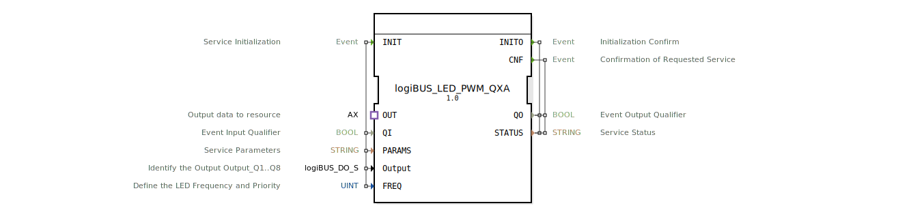

# logiBUS_LED_PWM_QXA

* * * * * * * * * *
## Einleitung
Der Funktionsblock `logiBUS_LED_PWM_QXA` ist ein Composite-Baustein zur Steuerung einer PWM-gesteuerten LED über den logiBUS. Er fasst die Konfiguration und Ausgabe eines LED-PWM-Signals zusammen und stellt eine einheitliche Schnittstelle für Initialisierung, Parametrierung und Betrieb bereit.

## Schnittstellenstruktur
### **Ereignis-Eingänge**
| Ereignis | Typ | Mit Variablen | Beschreibung |
|----------|-----|---------------|--------------|
| `INIT`   | EInit | `QI`, `PARAMS`, `Output`, `FREQ` | Service-Initialisierung; startet den FB mit den angegebenen Parametern |

### **Ereignis-Ausgänge**
| Ereignis | Typ | Mit Variablen | Beschreibung |
|----------|-----|---------------|--------------|
| `INITO`  | EInit | `QO`, `STATUS` | Bestätigung der erfolgreichen Initialisierung |
| `CNF`    | Event | `QO`, `STATUS` | Bestätigung eines angeforderten Dienstes (z. B. nach Datenanforderung über den Adapter) |

### **Daten-Eingänge**
| Variable   | Typ                                  | Initialwert  | Beschreibung |
|------------|--------------------------------------|--------------|--------------|
| `QI`       | BOOL                                 | –            | Qualifikator für den Ereigniseingang (Aktivierung) |
| `PARAMS`   | STRING                               | –            | Service-Parameter für die Bus-Konfiguration |
| `Output`   | `logiBUS::io::DQ::logiBUS_DO_S`      | `Invalid`    | Auswahl des physikalischen Ausgangs Q1..Q8 |
| `FREQ`     | UINT                                 | `LED_OFF`    | Frequenz und Priorität der LED-PWM (z. B. aus Enumeration `LED_FREQ`) |

### **Daten-Ausgänge**
| Variable   | Typ    | Beschreibung |
|------------|--------|--------------|
| `QO`       | BOOL   | Qualifikator für den Ereignisausgang (Aktivierungsquittung) |
| `STATUS`   | STRING | Dienststatus (Fehler-/Erfolgsmeldung) |

### **Adapter**
| Adapter | Typ | Beschreibung |
|---------|-----|--------------|
| `OUT`   | `adapter::types::unidirectional::AX` | Ausgangs-Adapter für die Datenübertragung zur logiBUS-Ressource (über Event `E1` und Data `D1`) |

## Funktionsweise
Der Baustein ist als Composition realisiert und enthält intern den Sub-FB `logiBUS_LED_PWM_QX`, der die eigentliche PWM‑Ansteuerung umsetzt.

1. **Initialisierung (INIT):**  
   Der FB wird durch das Ereignis `INIT` gestartet. Dabei werden die Parameter `QI`, `PARAMS`, `Output` und `FREQ` an den Sub-Baustein weitergeleitet. Nach erfolgreicher Initialisierung gibt der Sub-Baustein `INITO` und die Ausgangsdaten `QO` und `STATUS` zurück.

2. **Betrieb:**  
   Der Adapter `OUT` empfängt von der Ressource ein Ereignis an `E1`. Dieses wird als `REQ` an den Sub-FB durchgeschaltet. Der Sub-FB verarbeitet die Anfrage und sendet über den Adapter-Datenkanal `OUT.D1` die Ausgangsdaten (den aktuellen PWM-Wert sowie das Status-Signal) an die Ressource. Die Bestätigung `CNF` des Sub-FBs wird als `CNF` des Composite-FBs ausgegeben.

3. **Fehlerbehandlung:**  
   Treten während der Initialisierung oder im Betrieb Fehler auf, wird der Status über die Variable `STATUS` gemeldet. Die Ausgangs-Validierung erfolgt über `QO`.

## Technische Besonderheiten
- **Composite-Baustein**: Der FB kapselt die Komplexität der PWM-Ausgabe und bietet eine einfache Schnittstelle für den Anwender.
- **Typisierte Ausgangsauswahl**: Der Eingang `Output` vom Typ `logiBUS_DO_S` erlaubt die explizite Zuordnung zu einem logiBUS-Digitalausgang Q1..Q8. Der Initialwert `Invalid` erzwingt vor der ersten Nutzung eine gültige Auswahl.
- **Frequenzvorgabe**: Über `FREQ` (Typ UINT) kann die PWM-Frequenz und Priorität definiert werden. Der Initialwert `LED_OFF` schaltet die LED standardmäßig aus.
- **Adapterbasierte Kommunikation**: Der unidirektionale Adapter `AX` überträgt Ereignisse und Daten zwischen dem FB und der übergeordneten logiBUS-Ressource. Der FB selbst wartet auf externe Anfragen (`E1`) und liefert Daten zurück.

## Zustandsübersicht
Da es sich um einen Composite-Baustein handelt, besitzt er keine expliziten eigenen Zustände. Der interne Sub-FB `logiBUS_LED_PWM_QX` kann jedoch Zustände wie „Initialisierung“, „Bereit“ oder „Fehler“ durchlaufen. Diese werden indirekt über die Ereignisausgänge und die Statusvariable widergespiegelt:

- **Nach INIT**: Der FB befindet sich im initialisierten Zustand (sofern `QO = TRUE` und `STATUS = „OK“`).
- **Nach CNF**: Eine angeforderte Aktion (z. B. Aufruf über Adapter) wurde bestätigt. Der FB bleibt betriebsbereit.
- **Fehlerzustand**: Falls `STATUS` einen Fehlertext enthält, muss der FB erneut initialisiert werden. Eine Wiederholung des `INIT`-Ereignisses setzt alle Parameter zurück.

## Anwendungsszenarien
- **PWM-gesteuerte Beleuchtung**: Einsatz in landwirtschaftlichen Maschinen oder Automatisierungssystemen zur Einstellung der Helligkeit von LED-Arbeitsleuchten.
- **Lichtsignalanlagen**: Steuerung mehrerer LED-Ausgänge mit unterschiedlichen Frequenzen (z. B. Blinklicht, Dauerlicht).
- **Dimmen über logiBUS**: Einbettung in ein logiBUS-Netzwerk, bei dem die PWM-Werte zentral oder dezentral berechnet werden.

## Vergleich mit ähnlichen Bausteinen
- **logiBUS_DO_S** (direkter Digitalausgang): Dieser Baustein schaltet nur binäre Ausgänge (Ein/Aus) ohne PWM. `logiBUS_LED_PWM_QXA` bietet dagegen eine PWM-Funktion für gedimmte LEDs.
- **logiBUS_LED_PWM_QX**: Dies ist der interne Sub-Baustein, der die reine PWM-Logik ausführt. Der Composite-FB `QXA` erweitert ihn um den Adapteranschluss und die Standard-Schnittstellendefinition, was die Integration in höherwertige Steuerungen vereinfacht.
- **Generische PWM-FBs**: Im Vergleich zu plattformunabhängigen PWM-Bausteinen ist dieser FB speziell auf die logiBUS-Hardware zugeschnitten und bietet die dort üblichen Parameter und Typen.

## Fazit
Der `logiBUS_LED_PWM_QXA` Funktionsblock kapselt die PWM-Ansteuerung einer LED über logiBUS in einem kompakten Composite-Baustein. Durch die klar definierte Schnittstelle mit Initialisierung, Adapterkommunikation und Statusrückmeldung ist er leicht in Automatisierungsprojekte integrierbar. Die Kombination aus Ausgangsauswahl, Frequenzvorgabe und Fehlerbehandlung macht ihn zu einem robusten Baustein für dimmbare Beleuchtungsaufgaben im industriellen Umfeld.