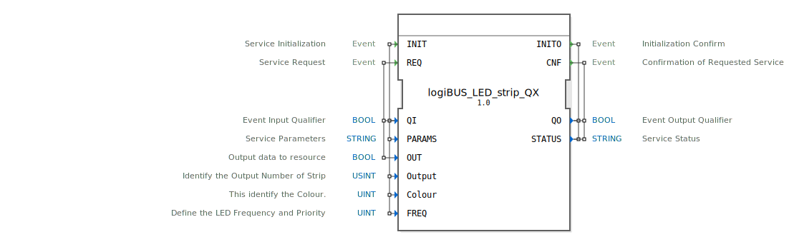

# logiBUS_LED_strip_QX

```{index} single: logiBUS_LED_strip_QX
```


* * * * * * * * * *

## Einleitung
Der Funktionsblock logiBUS_LED_strip_QX ist ein Ausgabeservice-Interface-Funktionsblock für boolesche Ausgabedaten, der speziell für die Ansteuerung von LED-Streifen entwickelt wurde. Er bietet umfangreiche Konfigurationsmöglichkeiten für verschiedene LED-Parameter wie Farbe, Frequenz und Ausgangsnummer.



## Schnittstellenstruktur

### **Ereignis-Eingänge**
- **INIT**: Service-Initialisierungsereignis
- **REQ**: Service-Anfrageereignis

### **Ereignis-Ausgänge**
- **INITO**: Initialisierungsbestätigung
- **CNF**: Bestätigung der angeforderten Service-Operation

### **Daten-Eingänge**
- **QI** (BOOL): Ereignis-Eingangsqualifizierer
- **PARAMS** (STRING): Service-Parameter
- **OUT** (BOOL): Ausgabedaten an die Ressource
- **Output** (USINT): Identifiziert die Ausgangsnummer des Streifens (Initialwert: LED_strip::Output_strip)
- **Colour** (UINT): Identifiziert die Farbe (Initialwert: LED_COLOURS::LED_GREEN)
- **FREQ** (UINT): Definiert die LED-Frequenz und Priorität (Initialwert: LED_FREQ::LED_OFF)

### **Daten-Ausgänge**
- **QO** (BOOL): Ereignis-Ausgangsqualifizierer
- **STATUS** (STRING): Service-Status

### **Adapter**
Keine Adapter-Schnittstellen vorhanden.

## Funktionsweise
Der Funktionsblock ermöglicht die Steuerung von LED-Streifen über eine standardisierte Schnittstelle. Bei der Initialisierung (INIT) werden die Konfigurationsparameter wie Ausgangsnummer, Farbe und Frequenz gesetzt. Über das REQ-Ereignis können Ausgabedaten (OUT) an den LED-Streifen gesendet werden. Der Block bestätigt jede Operation über die entsprechenden Ausgangsereignisse INITO und CNF.

## Technische Besonderheiten
- Unterstützung verschiedener LED-Farben über den Colour-Parameter
- Konfigurierbare Frequenzeinstellungen für Blinkfunktionen
- Mehrfachausgänge über den Output-Parameter unterstützt
- Initialwerte für schnelle Inbetriebnahme vordefiniert
- Statusrückmeldung über STRING-Parameter

## Zustandsübersicht
Der Funktionsblock verfügt über zwei Hauptzustände:
1. **Initialisierungszustand**: Wird durch INIT-Ereignis aktiviert
2. **Betriebszustand**: Verarbeitet REQ-Anfragen nach erfolgreicher Initialisierung

## Anwendungsszenarien
- Industrielle Beleuchtungssteuerung
- Statusanzeigen in Automatisierungsanlagen
- Warn- und Signallichtsteuerung
- Visualisierung von Prozesszuständen
- Gebäudeautomation mit LED-Beleuchtung

## Vergleich mit ähnlichen Bausteinen
Im Vergleich zu einfachen digitalen Ausgabeblöcken bietet logiBUS_LED_strip_QX erweiterte Funktionalität für LED-spezifische Anwendungen, insbesondere durch die integrierte Farb- und Frequenzsteuerung sowie die Möglichkeit, mehrere LED-Streifen unabhängig zu adressieren.


## Zugehörige Übungen

* [Uebung_032](../../../../../training1/Ventilsteuerung/4diacIDE-workspace/test_B/Uebungen_doc/Uebung_032.md)
* [Uebung_033_sub](../../../../../training1/Ventilsteuerung/4diacIDE-workspace/test_B/Uebungen_doc/Uebung_033_sub.md)

## Fazit
Der logiBUS_LED_strip_QX ist ein leistungsstarker Funktionsblock für die professionelle LED-Streifen-Steuerung in industriellen Automatisierungslösungen. Seine flexible Parametrierung und zuverlässige Statusrückmeldung machen ihn ideal für anspruchsvolle Beleuchtungsanwendungen.