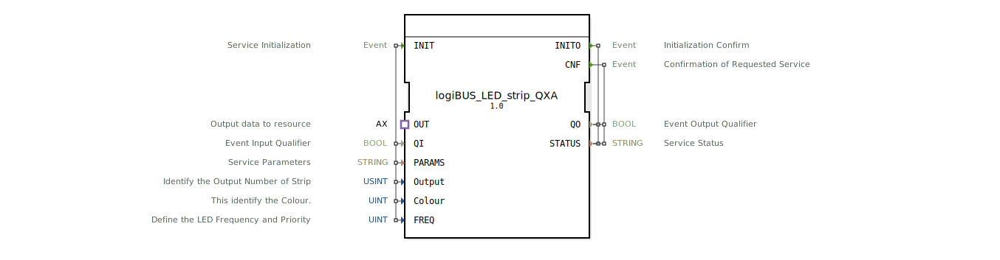

# logiBUS_LED_strip_QXA

* * * * * * * * * *

## Einleitung

Der Funktionsblock **logiBUS_LED_strip_QXA** ist ein Composite-FB zur Ansteuerung eines LED-Stripes über das logiBUS-Protokoll. Er kapselt die Kommunikation mit der Hardware und ermöglicht die farb- und frequenzabhängige Steuerung einzelner Ausgänge. Der Baustein eignet sich insbesondere für den Einsatz in der Agrartechnik, wo flexible LED-Signalisierung gefordert ist.

## Schnittstellenstruktur

### **Ereignis-Eingänge**

| Ereignis | Beschreibung | Mit |
|----------|--------------|-----|
| INIT     | Service-Initialisierung | QI, PARAMS, Output, Colour, FREQ |

### **Ereignis-Ausgänge**

| Ereignis | Beschreibung | Mit |
|----------|--------------|-----|
| INITO    | Bestätigung der Initialisierung | QO, STATUS |
| CNF      | Bestätigung einer ausgeführten Anforderung | QO, STATUS |

### **Daten-Eingänge**

| Name   | Typ    | Beschreibung | Initialwert |
|--------|--------|--------------|-------------|
| QI     | BOOL   | Freigabe der Verarbeitung (Ereignisqualifizierer) | - |
| PARAMS | STRING | Service-Parameter (z.B. Buskonfiguration) | - |
| Output | USINT  | Identifikation des Ausgangs (Strip-Nummer) | `LED_strip::Output_strip` |
| Colour | UINT   | Farbcode des LEDs | `LED_COLOURS::LED_GREEN` |
| FREQ   | UINT   | Frequenz/Priorität der LED-Anzeige | `LED_FREQ::LED_OFF` |

### **Daten-Ausgänge**

| Name   | Typ    | Beschreibung |
|--------|--------|--------------|
| QO     | BOOL   | Ausgangsqualifizierer (Status der Verarbeitung) |
| STATUS | STRING | Statusmeldung (z.B. Fehlercode) |

### **Adapter**

| Adapter | Typ | Beschreibung |
|---------|-----|--------------|
| OUT     | `adapter::types::unidirectional::AX` | Unidirektionale Adapter-Schnittstelle zur Datenübergabe an die Ressource (Ausgangsdaten zum logiBUS) |

## Funktionsweise

Der Baustein arbeitet als Composite-FB, der intern den Unterbaustein **logiBUS_LED_strip_QX** verwendet. Nach einem **INIT**-Ereignis werden die Parameter (QI, PARAMS, Output, Colour, FREQ) an den internen FB übergeben. Die Initialisierung wird über **INITO** quittiert.  

Sobald über den **OUT*-Adapter ein Ereignis (E1) eintrifft, wird im internen FB eine **REQ**-Anforderung ausgelöst. Die aktuellen Daten (Colour, FREQ) werden an den logiBUS-LED-Strip gesendet. Nach erfolgreicher Ausführung quittiert der interne FB mit **CNF**, was am äußeren Ausgang **CNF** erscheint.  

Datenflüsse:  
- **Out.D1** → interner FB.QX.OUT (Ausgangsdaten des Adapters)  
- **Qi**, **PARAMS**, **Output**, **Colour**, **FREQ** → entsprechend an QX weitergeleitet.  

Die Ausgänge **QO** und **STATUS** spiegeln den internen Zustand des Unterbausteins wider.

## Technische Besonderheiten

- Composite-FB: erleichtert die Wiederverwendung und Kapselung der Hardware-Ansteuerung.  
- Verwendung eines Adapters (OUT) für die unidirektionale Datenübergabe an die logiBUS-Ressource.  
- Initialwerte der Parameter sind als Konstanten (z.B. `LED_strip::Output_strip`, `LED_COLOURS::LED_GREEN`) vordefiniert, können aber zur Laufzeit überschrieben werden.  
- Der interne FB `logiBUS_LED_strip_QX` ist für die eigentliche Buskommunikation verantwortlich; dieser Baustein bietet nur eine vereinfachte Schnittstelle.  
- Copyright und Entwickler: HR Agrartechnik GmbH (Version 1.0, 2026-02-23).

## Zustandsübersicht

Der Baustein besitzt keine explizit modellierten Zustände, sein Verhalten ergibt sich aus der Ablaufsteuerung des Composite-Netzwerks:

1. **Initialisierungszustand**: Nach **INIT** werden der interne FB konfiguriert und die Busverbindung aufgebaut.  
2. **Bereitschaftszustand**: Nach erfolgreicher Initialisierung kann der Baustein über den Adapter (OUT.E1) angesprochen werden.  
3. **Ausführungszustand**: Die Anforderung wird an den LED-Strip gesendet, bis die Bestätigung (**CNF**) erfolgt.  
4. **Fehlerzustand**: Falls QO = FALSE oder STATUS einen Fehler enthält, ist die Kommunikation gestört.

## Anwendungsszenarien

- **Landwirtschaftliche Maschinen**: Farbcodierte Statusanzeigen (z.B. grün für Betriebsbereit, rot für Alarm) an LED-Strips.  
- **Feldrandbeleuchtung**: Ansteuerung mehrerer LED-Strip-Ausgänge mit unterschiedlichen Farben und Blinkfrequenzen.  
- **Benutzerdefinierte Signalisierung**: Einbindung in übergeordnete Steuerungen zur Visualisierung von Betriebszuständen.  
- **Entwicklung und Test**: Einsatz als einfacher Baustein zur Simulation und Inbetriebnahme von logiBUS-Komponenten.

## Vergleich mit ähnlichen Bausteinen

- **logiBUS_LED_strip_QX** (direkter FB): Bietet eine detailliertere Schnittstelle mit mehreren Ereignissen (REQ) und Daten. Der hier beschriebene Composite-FB **QXA** vereinfacht die Nutzung durch eine Adapter-Schnittstelle und klare Trennung von Initialisierung und Ausführung.  
- **logiBUS_DO_Bit**: Steuert einzelne Digitalausgänge, keine Farb-/Frequenzsteuerung.  
- **Composite-FBs im Allgemeinen**: Der QXA ist spezifisch für LED-Strip-Anwendungen konzipiert und reduziert den Verdrahtungsaufwand im übergeordneten Netzwerk.

## Fazit

Der **logiBUS_LED_strip_QXA** bietet eine komfortable und standardisierte Möglichkeit, LED-Strips über logiBUS farblich und in der Blinkfrequenz zu steuern. Durch die Adapter-basierte Schnittstelle lässt er sich leicht in größere Systeme integrieren, ohne dass Details der Buskommunikation bekannt sein müssen. Der Composite-Ansatz sorgt für Übersichtlichkeit und Wiederverwendbarkeit.