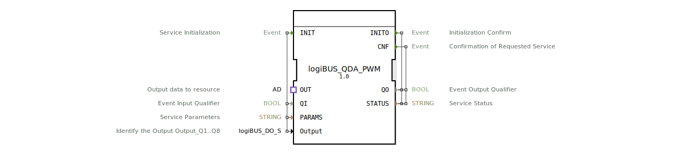

# logiBUS_QDA_PWM

* * * * * * * * * *
## Einleitung

Der Funktionsblock **logiBUS_QDA_PWM** ist ein Composite-Baustein zur Ansteuerung eines PWM-Ausgangs (Double Word) über ein logiBUS-System. Er kapselt die Initialisierung und die Triggerung eines internen PWM-Ausgangsbausteins und stellt eine Adapter-Schnittstelle zur Verfügung, um von außerhalb Aufträge (Ereignis und Daten) zu empfangen. Der Baustein wurde für den Einsatz in der Agrartechnik entwickelt und ist unter der EPL 2.0 lizenziert.

## Schnittstellenstruktur

### **Ereignis-Eingänge**

| Ereignis | Typ | Kommentar |
|----------|-----|-----------|
| INIT | EInit | Service-Initialisierung |
| *kein weiterer Ereignis-Eingang* | | *Alle Trigger erfolgen über den Adapter* |

### **Ereignis-Ausgänge**

| Ereignis | Typ | Kommentar |
|----------|-----|-----------|
| INITO | EInit | Bestätigung der Initialisierung |
| CNF | Event | Bestätigung eines angeforderten Dienstes |

### **Daten-Eingänge**

| Variable | Typ | Kommentar |
|----------|-----|-----------|
| QI | BOOL | Eingangs-Qualifier (Initialisierung freigeben) |
| PARAMS | STRING | Service-Parameter (z. B. Adressierung, Konfiguration) |
| Output | logiBUS::io::DQ::logiBUS_DO_S | Identifikation des Ausgangs (z. B. Output_Q1..Q8); Initialwert: *Invalid* |

### **Daten-Ausgänge**

| Variable | Typ | Kommentar |
|----------|-----|-----------|
| QO | BOOL | Ausgangs-Qualifier (Initialisierungsstatus) |
| STATUS | STRING | Dienststatus (Fehler-/Erfolgsmeldung) |

### **Adapter**

| Typ | Name | Richtung | Kommentar |
|-----|------|----------|-----------|
| adapter::types::unidirectional::AD | OUT | Socket | Empfängt Trigger-Ereignis (E1) und Ausgangsdaten (D1) von der Ressource |

## Funktionsweise

Der Funktionsblock ist als Composite realisiert und enthält eine interne Instanz des Bausteins `logiBUS::io::DQ::logiBUS_QD_PWM` (hier als *QX* bezeichnet). Die Logik lässt sich wie folgt beschreiben:

1. **Initialisierung:**  
   Ein INIT-Ereignis am Eingang löst die Initialisierung des internen Bausteins aus. Dabei werden die Daten-Eingänge *QI*, *PARAMS* und *Output* an den internen Baustein weitergeleitet. Nach erfolgreicher Initialisierung wird das Ereignis *INITO* ausgegeben, zusammen mit den Ausgangsdaten *QO* und *STATUS*.

2. **Triggerung über Adapter:**  
   Der Adapter *OUT* nimmt von außen ein Ereignis *E1* und einen Datenwert *D1* entgegen. Das Ereignis wird als *REQ* (Request) an den internen Baustein weitergegeben, die Daten *D1* als *OUT*-Wert. Der interne Baustein verarbeitet diese Anforderung und quittiert mit dem Ereignis *CNF*, das über den Ausgang *CNF* nach außen geleitet wird. Die zugehörigen Ausgangsdaten *QO* und *STATUS* werden aktualisiert.

Damit ermöglicht der Baustein eine saubere Trennung von Initialisierung und zyklischer Ausgabe: Die Konfiguration erfolgt einmalig über INIT, die eigentliche PWM-Ausgabe wird über den Adapter getriggert.

## Technische Besonderheiten

- **Composite-Baustein:** Der FB kapselt die gesamte Logik eines PWM-Ausgangsbausteins und bietet eine standardisierte Adapter-Schnittstelle für den Datenaustausch mit der Ressource.
- **Double-Word-Ausgabe:** Der Name deutet auf eine 32-Bit-Datenbreite hin, die über das Adapter-Datenelement *D1* übertragen wird.
- **Initialisierungsparameter:** Über *PARAMS* (STRING) können flexible Konfigurationsdaten übergeben werden, die für die Adressierung oder Parametrierung des logiBUS-Moduls notwendig sind.
- **Fehlerbehandlung:** Der Ausgang *STATUS* liefert eine textuelle Beschreibung des Dienstzustands (z. B. Fehlermeldungen bei ungültiger Konfiguration).

## Zustandsübersicht

Da es sich um einen Composite-Baustein ohne eigenen Zustandsautomaten handelt, wird der Zustand durch den internen Baustein *logiBUS_QD_PWM* definiert. Typische Zustände sind:

- **IDLE:** Warten auf Initialisierung oder Trigger.
- **INITIALIZING:** Während der Initialisierung (INIT empfangen, INITO noch nicht gesendet).
- **OPERATIONAL:** Bereit für zyklische Trigger (über Adapter).
- **ERROR:** Fehlerzustand, erkennbar an *QO = FALSE* oder *STATUS* mit Fehlertext.

Der interne FB wechselt zwischen diesen Zuständen abhängig von den Ereignissen und Daten.

## Anwendungsszenarien

- **Landwirtschaftliche Maschinen:** Steuerung von PWM-betriebenen Aktoren (z. B. Hydraulikventile, Motordrehzahl) über ein logiBUS-Netzwerk.
- **Automatisierungsanlagen:** Ausgabe von analogen oder pulsweitenmodulierten Signalen mit 32-Bit-Auflösung, gesteuert durch eine übergeordnete Steuerung.
- **Fernwartung und Konfiguration:** Über den Adapter können von einer übergeordneten Ressource (z. B. HMI oder SPS) neue PWM-Werte gesendet werden, ohne den Initialisierungsvorgang zu wiederholen.

## Vergleich mit ähnlichen Bausteinen

| Baustein | Typ | Besonderheit |
|----------|-----|--------------|
| logiBUS_QD_PWM | Composite/ Basic | Direkt ansteuerbar über INIT, REQ, CNF; ohne Adapter-Schnittstelle. |
| **logiBUS_QDA_PWM** | Composite | Wie logiBUS_QD_PWM, aber mit Adapter für externe Triggerung und Datenversorgung. |
| logiBUS_DO (einfach) | Basic | Einfacher digitaler Ausgang, keine PWM-Funktion. |

Der hier beschriebene Baustein bietet eine höhere Flexibilität, da die eigentliche Ausgabe über den Adapter asynchron von der Initialisierung erfolgen kann. Nachteilig ist die Abhängigkeit von der korrekten Bereitstellung der Adapter-Signale.

## Fazit

Der Funktionsblock **logiBUS_QDA_PWM** ist eine praktische Kapselung eines PWM-Ausgangs für logiBUS. Durch die Kombination von INIT-gestützter Konfiguration und adapterbasierter Triggerung eignet er sich besonders für Anwendungen, bei denen eine einmalige Parametrierung und eine anschließende zyklische oder ereignisgesteuerte Ausgabe erforderlich ist. Die Verwendung standardisierter Typen und die klare Trennung der Schnittstellen erleichtern die Integration in IEC 61499-basierte Steuerungssysteme.