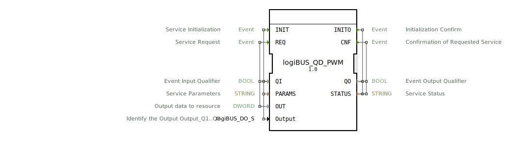

# logiBUS_QD_PWM

```{index} single: logiBUS_QD_PWM
```


* * * * * * * * * *

## Einleitung
Der Funktionsblock `logiBUS_QD_PWM` ist ein Ausgabeservice-Interface-Funktionsblock für doppelte Wort-Ausgabedaten. Er dient als Schnittstelle zur Steuerung von PWM-Ausgaben (Pulsweitenmodulation) über das logiBUS-System und ermöglicht die Ansteuerung von Ausgängen Q1 bis Q8.



## Schnittstellenstruktur

### **Ereignis-Eingänge**
- **INIT**: Service-Initialisierung
  - Verknüpft mit: QI, PARAMS, Output
- **REQ**: Service-Anforderung
  - Verknüpft mit: QI, OUT

### **Ereignis-Ausgänge**
- **INITO**: Initialisierungsbestätigung
  - Verknüpft mit: QO, STATUS
- **CNF**: Bestätigung der angeforderten Service-Operation
  - Verknüpft mit: QO, STATUS

### **Daten-Eingänge**
- **QI** (BOOL): Ereignis-Eingangsqualifizierer
- **PARAMS** (STRING): Service-Parameter
- **OUT** (DWORD): Ausgabedaten zur Ressource
- **Output** (logiBUS_DO_S): Identifiziert den Ausgang Output_Q1..Q8
  - Initialwert: `logiBUS_DO::Invalid`

### **Daten-Ausgänge**
- **QO** (BOOL): Ereignis-Ausgangsqualifizierer
- **STATUS** (STRING): Service-Status

### **Adapter**
Keine Adapter-Schnittstellen vorhanden.

## Funktionsweise
Der Funktionsblock ermöglicht die PWM-Steuerung von Ausgängen über das logiBUS-System. Bei der Initialisierung (INIT) werden die Service-Parameter konfiguriert und der spezifische Ausgang identifiziert. Über die REQ-Anforderung können PWM-Daten (DWORD) an den konfigurierten Ausgang gesendet werden. Der Block bestätigt sowohl Initialisierung als auch Service-Anforderungen über die entsprechenden Ausgangsereignisse.

## Technische Besonderheiten
- Verwendet DWORD-Datentyp für PWM-Ausgabedaten
- Unterstützt bis zu 8 Ausgänge (Q1-Q8) über die Output-Konfiguration
- String-basierte Parameterkonfiguration für flexible Service-Einstellungen
- Statusrückmeldung über STRING-Variable für detaillierte Fehlerinformationen

## Zustandsübersicht
Der Funktionsblock verfügt über zwei Hauptzustände:
1. **Nicht initialisiert**: Block wartet auf INIT-Ereignis
2. **Initialisiert und betriebsbereit**: Block kann REQ-Anforderungen verarbeiten und PWM-Daten ausgeben

## Anwendungsszenarien
- Steuerung von PWM-gesteuerten Aktoren (Motoren, Heizelemente)
- Ansteuerung von LED-Beleuchtung mit Helligkeitssteuerung
- Regelung von Ventilen mit proportionaler Steuerung
- Industrielle Automatisierungsanwendungen mit logiBUS-Hardware

## ⚖️ Vergleich mit ähnlichen Bausteinen
Im Vergleich zu einfachen digitalen Ausgabeblöcken bietet `logiBUS_QD_PWM` erweiterte PWM-Funktionalität mit 32-Bit-Auflösung (DWORD). Gegenüber analogen Ausgabeblöcken ermöglicht er die direkte PWM-Steuerung ohne zusätzliche Wandlung.


## 🛠️ Zugehörige Übungen

* [Uebung_034](../../../../../training1/Ventilsteuerung/4diacIDE-workspace/test_B/Uebungen_doc/Uebung_034.md)
* [Uebung_034a1_Q1](../../../../../training1/Ventilsteuerung/4diacIDE-workspace/test_B/Uebungen_doc/Uebung_034a1_Q1.md)
* [Uebung_034a1_Q2](../../../../../training1/Ventilsteuerung/4diacIDE-workspace/test_B/Uebungen_doc/Uebung_034a1_Q2.md)
* [Uebung_034a1_Q4](../../../../../training1/Ventilsteuerung/4diacIDE-workspace/test_B/Uebungen_doc/Uebung_034a1_Q4.md)
* [Uebung_034b](../../../../../training1/Ventilsteuerung/4diacIDE-workspace/test_B/Uebungen_doc/Uebung_034b.md)
* [Uebung_152](../../../../../training1/Ventilsteuerung/4diacIDE-workspace/test_B/Uebungen_doc/Uebung_152.md)
* [Uebung_153](../../../../../training1/Ventilsteuerung/4diacIDE-workspace/test_B/Uebungen_doc/Uebung_153.md)

## Fazit
Der `logiBUS_QD_PWM` Funktionsblock stellt eine leistungsstarke Schnittstelle für PWM-Ausgaben im logiBUS-System bereit. Durch die flexible Konfiguration und die Unterstützung für 32-Bit-PWM-Daten eignet er sich ideal für präzise Steuerungsanwendungen in industriellen Automatisierungssystemen.