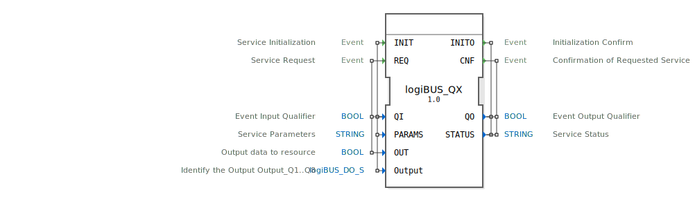

# logiBUS_QX

```{index} single: logiBUS_QX
```


* * * * * * * * * *

## Einleitung
Der logiBUS_QX Funktionsblock ist ein Ausgabeservice-Interface-Baustein für boolesche Ausgabedaten. Er dient als Schnittstelle zur Steuerung von digitalen Ausgängen über das logiBUS-System und ermöglicht die Kommunikation zwischen der Steuerungsanwendung und den physischen Ausgangskanälen.



## Schnittstellenstruktur

### **Ereignis-Eingänge**
- **INIT**: Service-Initialisierungsereignis
- **REQ**: Service-Anfrageereignis

### **Ereignis-Ausgänge**
- **INITO**: Initialisierungsbestätigung
- **CNF**: Bestätigung der angeforderten Service-Operation

### **Daten-Eingänge**
- **QI** (BOOL): Ereignis-Eingangsqualifizierer
- **PARAMS** (STRING): Service-Parameter
- **OUT** (BOOL): Ausgabedaten zur Ressource
- **Output** (logiBUS_DO_S): Identifiziert den Ausgang (Output_Q1..Q8), Initialwert: Invalid

### **Daten-Ausgänge**
- **QO** (BOOL): Ereignis-Ausgangsqualifizierer
- **STATUS** (STRING): Service-Statusinformation

### **Adapter**
Keine Adapter-Schnittstellen vorhanden.

## Funktionsweise
Der logiBUS_QX-Block verwaltet die Kommunikation mit digitalen Ausgangskanälen des logiBUS-Systems. Bei Initialisierung (INIT-Event) werden die Service-Parameter konfiguriert und der spezifische Ausgangskanal identifiziert. Über das REQ-Event können boolesche Werte (OUT) an den konfigurierten Ausgangskanal gesendet werden. Der Block bestätigt jede Operation über die entsprechenden Ausgangsereignisse INITO und CNF.

## Technische Besonderheiten
- Verwendet spezifische logiBUS-Datentypen für die Ausgangsidentifikation
- Unterstützt bis zu 8 digitale Ausgangskanäle (Q1-Q8)
- Bietet detaillierte Statusrückmeldungen über den STATUS-Ausgang
- Initialisiert Ausgänge mit einem ungültigen Zustand (Invalid)

## Zustandsübersicht
Der Block durchläuft folgende Hauptzustände:
1. **Nicht initialisiert**: Vor der ersten INIT-Operation
2. **Initialisiert**: Nach erfolgreicher INIT-Operation, bereit für REQ-Operationen
3. **Aktiv**: Während der Verarbeitung von REQ-Operationen

## Anwendungsszenarien
- Steuerung von digitalen Aktoren (Relais, Ventile, Lampen)
- Anbindung an logiBUS-Hardwareausgänge
- Automatisierungssysteme mit verteilten E/A-Komponenten
- Sicherheitsrelevante Schaltvorgänge mit Statusrückmeldung

## Vergleich mit ähnlichen Bausteinen
Im Vergleich zu standardmäßigen digitalen Ausgangsblöcken bietet logiBUS_QX:
- Spezifische Integration in logiBUS-Systeme
- Erweiterte Statusrückmeldungen
- Parametrierbare Ausgangskonfiguration
- Höhere Abstraktionsebene für Hardwarezugriffe


## Zugehörige Übungen

* [Uebung_001](../../../../../training1/Ventilsteuerung/4diacIDE-workspace/test_B/Uebungen_doc/Uebung_001.md)
* [Uebung_001c](../../../../../training1/Ventilsteuerung/4diacIDE-workspace/test_B/Uebungen_doc/Uebung_001c.md)
* [Uebung_002](../../../../../training1/Ventilsteuerung/4diacIDE-workspace/test_B/Uebungen_doc/Uebung_002.md)
* [Uebung_002a](../../../../../training1/Ventilsteuerung/4diacIDE-workspace/test_B/Uebungen_doc/Uebung_002a.md)
* [Uebung_002a2](../../../../../training1/Ventilsteuerung/4diacIDE-workspace/test_B/Uebungen_doc/Uebung_002a2.md)
* [Uebung_002a3](../../../../../training1/Ventilsteuerung/4diacIDE-workspace/test_B/Uebungen_doc/Uebung_002a3.md)
* [Uebung_002a4](../../../../../training1/Ventilsteuerung/4diacIDE-workspace/test_B/Uebungen_doc/Uebung_002a4.md)
* [Uebung_002a5b](../../../../../training1/Ventilsteuerung/4diacIDE-workspace/test_B/Uebungen_doc/Uebung_002a5b.md)
* [Uebung_002b2](../../../../../training1/Ventilsteuerung/4diacIDE-workspace/test_B/Uebungen_doc/Uebung_002b2.md)
* [Uebung_002b3](../../../../../training1/Ventilsteuerung/4diacIDE-workspace/test_B/Uebungen_doc/Uebung_002b3.md)
* [Uebung_003](../../../../../training1/Ventilsteuerung/4diacIDE-workspace/test_B/Uebungen_doc/Uebung_003.md)
* [Uebung_003a0](../../../../../training1/Ventilsteuerung/4diacIDE-workspace/test_B/Uebungen_doc/Uebung_003a0.md)
* [Uebung_003a_sub](../../../../../training1/Ventilsteuerung/4diacIDE-workspace/test_B/Uebungen_doc/Uebung_003a_sub.md)
* [Uebung_003b_sub](../../../../../training1/Ventilsteuerung/4diacIDE-workspace/test_B/Uebungen_doc/Uebung_003b_sub.md)
* [Uebung_003d](../../../../../training1/Ventilsteuerung/4diacIDE-workspace/test_B/Uebungen_doc/Uebung_003d.md)
* [Uebung_004a](../../../../../training1/Ventilsteuerung/4diacIDE-workspace/test_B/Uebungen_doc/Uebung_004a.md)
* [Uebung_004a2](../../../../../training1/Ventilsteuerung/4diacIDE-workspace/test_B/Uebungen_doc/Uebung_004a2.md)
* [Uebung_004a2_2](../../../../../training1/Ventilsteuerung/4diacIDE-workspace/test_B/Uebungen_doc/Uebung_004a2_2.md)
* [Uebung_004a2_3](../../../../../training1/Ventilsteuerung/4diacIDE-workspace/test_B/Uebungen_doc/Uebung_004a2_3.md)
* [Uebung_004a3](../../../../../training1/Ventilsteuerung/4diacIDE-workspace/test_B/Uebungen_doc/Uebung_004a3.md)
* [Uebung_004a4](../../../../../training1/Ventilsteuerung/4diacIDE-workspace/test_B/Uebungen_doc/Uebung_004a4.md)
* [Uebung_004a5](../../../../../training1/Ventilsteuerung/4diacIDE-workspace/test_B/Uebungen_doc/Uebung_004a5.md)
* [Uebung_004a6](../../../../../training1/Ventilsteuerung/4diacIDE-workspace/test_B/Uebungen_doc/Uebung_004a6.md)
* [Uebung_004a7](../../../../../training1/Ventilsteuerung/4diacIDE-workspace/test_B/Uebungen_doc/Uebung_004a7.md)
* [Uebung_004a8](../../../../../training1/Ventilsteuerung/4diacIDE-workspace/test_B/Uebungen_doc/Uebung_004a8.md)
* [Uebung_004a9](../../../../../training1/Ventilsteuerung/4diacIDE-workspace/test_B/Uebungen_doc/Uebung_004a9.md)
* [Uebung_004b](../../../../../training1/Ventilsteuerung/4diacIDE-workspace/test_B/Uebungen_doc/Uebung_004b.md)
* [Uebung_004b2](../../../../../training1/Ventilsteuerung/4diacIDE-workspace/test_B/Uebungen_doc/Uebung_004b2.md)
* [Uebung_004b3](../../../../../training1/Ventilsteuerung/4diacIDE-workspace/test_B/Uebungen_doc/Uebung_004b3.md)
* [Uebung_004c1](../../../../../training1/Ventilsteuerung/4diacIDE-workspace/test_B/Uebungen_doc/Uebung_004c1.md)
* [Uebung_004c2](../../../../../training1/Ventilsteuerung/4diacIDE-workspace/test_B/Uebungen_doc/Uebung_004c2.md)
* [Uebung_004c3](../../../../../training1/Ventilsteuerung/4diacIDE-workspace/test_B/Uebungen_doc/Uebung_004c3.md)
* [Uebung_004c4](../../../../../training1/Ventilsteuerung/4diacIDE-workspace/test_B/Uebungen_doc/Uebung_004c4.md)
* [Uebung_004c5](../../../../../training1/Ventilsteuerung/4diacIDE-workspace/test_B/Uebungen_doc/Uebung_004c5.md)
* [Uebung_004c6](../../../../../training1/Ventilsteuerung/4diacIDE-workspace/test_B/Uebungen_doc/Uebung_004c6.md)
* [Uebung_004c7](../../../../../training1/Ventilsteuerung/4diacIDE-workspace/test_B/Uebungen_doc/Uebung_004c7.md)
* [Uebung_005](../../../../../training1/Ventilsteuerung/4diacIDE-workspace/test_B/Uebungen_doc/Uebung_005.md)
* [Uebung_006](../../../../../training1/Ventilsteuerung/4diacIDE-workspace/test_B/Uebungen_doc/Uebung_006.md)
* [Uebung_006a](../../../../../training1/Ventilsteuerung/4diacIDE-workspace/test_B/Uebungen_doc/Uebung_006a.md)
* [Uebung_006a2](../../../../../training1/Ventilsteuerung/4diacIDE-workspace/test_B/Uebungen_doc/Uebung_006a2.md)
* [Uebung_006a3](../../../../../training1/Ventilsteuerung/4diacIDE-workspace/test_B/Uebungen_doc/Uebung_006a3.md)
* [Uebung_006a4](../../../../../training1/Ventilsteuerung/4diacIDE-workspace/test_B/Uebungen_doc/Uebung_006a4.md)
* [Uebung_006b](../../../../../training1/Ventilsteuerung/4diacIDE-workspace/test_B/Uebungen_doc/Uebung_006b.md)
* [Uebung_006c](../../../../../training1/Ventilsteuerung/4diacIDE-workspace/test_B/Uebungen_doc/Uebung_006c.md)
* [Uebung_006d](../../../../../training1/Ventilsteuerung/4diacIDE-workspace/test_B/Uebungen_doc/Uebung_006d.md)
* [Uebung_006e1](../../../../../training1/Ventilsteuerung/4diacIDE-workspace/test_B/Uebungen_doc/Uebung_006e1.md)
* [Uebung_006e2](../../../../../training1/Ventilsteuerung/4diacIDE-workspace/test_B/Uebungen_doc/Uebung_006e2.md)
* [Uebung_007](../../../../../training1/Ventilsteuerung/4diacIDE-workspace/test_B/Uebungen_doc/Uebung_007.md)
* [Uebung_007a1](../../../../../training1/Ventilsteuerung/4diacIDE-workspace/test_B/Uebungen_doc/Uebung_007a1.md)
* [Uebung_007a2](../../../../../training1/Ventilsteuerung/4diacIDE-workspace/test_B/Uebungen_doc/Uebung_007a2.md)
* [Uebung_007a3](../../../../../training1/Ventilsteuerung/4diacIDE-workspace/test_B/Uebungen_doc/Uebung_007a3.md)
* [Uebung_008](../../../../../training1/Ventilsteuerung/4diacIDE-workspace/test_B/Uebungen_doc/Uebung_008.md)
* [Uebung_009](../../../../../training1/Ventilsteuerung/4diacIDE-workspace/test_B/Uebungen_doc/Uebung_009.md)
* [Uebung_010](../../../../../training1/Ventilsteuerung/4diacIDE-workspace/test_B/Uebungen_doc/Uebung_010.md)
* [Uebung_010a](../../../../../training1/Ventilsteuerung/4diacIDE-workspace/test_B/Uebungen_doc/Uebung_010a.md)
* [Uebung_010a2](../../../../../training1/Ventilsteuerung/4diacIDE-workspace/test_B/Uebungen_doc/Uebung_010a2.md)
* [Uebung_010a3](../../../../../training1/Ventilsteuerung/4diacIDE-workspace/test_B/Uebungen_doc/Uebung_010a3.md)
* [Uebung_010b1](../../../../../training1/Ventilsteuerung/4diacIDE-workspace/test_B/Uebungen_doc/Uebung_010b1.md)
* [Uebung_010b2](../../../../../training1/Ventilsteuerung/4diacIDE-workspace/test_B/Uebungen_doc/Uebung_010b2.md)
* [Uebung_010b3](../../../../../training1/Ventilsteuerung/4diacIDE-workspace/test_B/Uebungen_doc/Uebung_010b3.md)
* [Uebung_010b4_sub](../../../../../training1/Ventilsteuerung/4diacIDE-workspace/test_B/Uebungen_doc/Uebung_010b4_sub.md)
* [Uebung_010b5_sub](../../../../../training1/Ventilsteuerung/4diacIDE-workspace/test_B/Uebungen_doc/Uebung_010b5_sub.md)
* [Uebung_010b6](../../../../../training1/Ventilsteuerung/4diacIDE-workspace/test_B/Uebungen_doc/Uebung_010b6.md)
* [Uebung_010b7](../../../../../training1/Ventilsteuerung/4diacIDE-workspace/test_B/Uebungen_doc/Uebung_010b7.md)
* [Uebung_010b8](../../../../../training1/Ventilsteuerung/4diacIDE-workspace/test_B/Uebungen_doc/Uebung_010b8.md)
* [Uebung_010b9](../../../../../training1/Ventilsteuerung/4diacIDE-workspace/test_B/Uebungen_doc/Uebung_010b9.md)
* [Uebung_010bA](../../../../../training1/Ventilsteuerung/4diacIDE-workspace/test_B/Uebungen_doc/Uebung_010bA.md)
* [Uebung_010bA2](../../../../../training1/Ventilsteuerung/4diacIDE-workspace/test_B/Uebungen_doc/Uebung_010bA2.md)
* [Uebung_010bA3](../../../../../training1/Ventilsteuerung/4diacIDE-workspace/test_B/Uebungen_doc/Uebung_010bA3.md)
* [Uebung_010bA4](../../../../../training1/Ventilsteuerung/4diacIDE-workspace/test_B/Uebungen_doc/Uebung_010bA4.md)
* [Uebung_010c](../../../../../training1/Ventilsteuerung/4diacIDE-workspace/test_B/Uebungen_doc/Uebung_010c.md)
* [Uebung_010c2](../../../../../training1/Ventilsteuerung/4diacIDE-workspace/test_B/Uebungen_doc/Uebung_010c2.md)
* [Uebung_010c3_sub](../../../../../training1/Ventilsteuerung/4diacIDE-workspace/test_B/Uebungen_doc/Uebung_010c3_sub.md)
* [Uebung_010c4_sub](../../../../../training1/Ventilsteuerung/4diacIDE-workspace/test_B/Uebungen_doc/Uebung_010c4_sub.md)
* [Uebung_013](../../../../../training1/Ventilsteuerung/4diacIDE-workspace/test_B/Uebungen_doc/Uebung_013.md)
* [Uebung_019b](../../../../../training1/Ventilsteuerung/4diacIDE-workspace/test_B/Uebungen_doc/Uebung_019b.md)
* [Uebung_019c](../../../../../training1/Ventilsteuerung/4diacIDE-workspace/test_B/Uebungen_doc/Uebung_019c.md)
* [Uebung_020a](../../../../../training1/Ventilsteuerung/4diacIDE-workspace/test_B/Uebungen_doc/Uebung_020a.md)
* [Uebung_020b](../../../../../training1/Ventilsteuerung/4diacIDE-workspace/test_B/Uebungen_doc/Uebung_020b.md)
* [Uebung_020c](../../../../../training1/Ventilsteuerung/4diacIDE-workspace/test_B/Uebungen_doc/Uebung_020c.md)
* [Uebung_020c2](../../../../../training1/Ventilsteuerung/4diacIDE-workspace/test_B/Uebungen_doc/Uebung_020c2.md)
* [Uebung_020c3](../../../../../training1/Ventilsteuerung/4diacIDE-workspace/test_B/Uebungen_doc/Uebung_020c3.md)
* [Uebung_020d](../../../../../training1/Ventilsteuerung/4diacIDE-workspace/test_B/Uebungen_doc/Uebung_020d.md)
* [Uebung_020e](../../../../../training1/Ventilsteuerung/4diacIDE-workspace/test_B/Uebungen_doc/Uebung_020e.md)
* [Uebung_020e2](../../../../../training1/Ventilsteuerung/4diacIDE-workspace/test_B/Uebungen_doc/Uebung_020e2.md)
* [Uebung_020f](../../../../../training1/Ventilsteuerung/4diacIDE-workspace/test_B/Uebungen_doc/Uebung_020f.md)
* [Uebung_020f2](../../../../../training1/Ventilsteuerung/4diacIDE-workspace/test_B/Uebungen_doc/Uebung_020f2.md)
* [Uebung_020f3](../../../../../training1/Ventilsteuerung/4diacIDE-workspace/test_B/Uebungen_doc/Uebung_020f3.md)
* [Uebung_020g](../../../../../training1/Ventilsteuerung/4diacIDE-workspace/test_B/Uebungen_doc/Uebung_020g.md)
* [Uebung_020h](../../../../../training1/Ventilsteuerung/4diacIDE-workspace/test_B/Uebungen_doc/Uebung_020h.md)
* [Uebung_020i](../../../../../training1/Ventilsteuerung/4diacIDE-workspace/test_B/Uebungen_doc/Uebung_020i.md)
* [Uebung_021](../../../../../training1/Ventilsteuerung/4diacIDE-workspace/test_B/Uebungen_doc/Uebung_021.md)
* [Uebung_022](../../../../../training1/Ventilsteuerung/4diacIDE-workspace/test_B/Uebungen_doc/Uebung_022.md)
* [Uebung_023](../../../../../training1/Ventilsteuerung/4diacIDE-workspace/test_B/Uebungen_doc/Uebung_023.md)
* [Uebung_024](../../../../../training1/Ventilsteuerung/4diacIDE-workspace/test_B/Uebungen_doc/Uebung_024.md)
* [Uebung_025](../../../../../training1/Ventilsteuerung/4diacIDE-workspace/test_B/Uebungen_doc/Uebung_025.md)
* [Uebung_026_sub](../../../../../training1/Ventilsteuerung/4diacIDE-workspace/test_B/Uebungen_doc/Uebung_026_sub.md)
* [Uebung_028](../../../../../training1/Ventilsteuerung/4diacIDE-workspace/test_B/Uebungen_doc/Uebung_028.md)
* [Uebung_035](../../../../../training1/Ventilsteuerung/4diacIDE-workspace/test_B/Uebungen_doc/Uebung_035.md)
* [Uebung_035a](../../../../../training1/Ventilsteuerung/4diacIDE-workspace/test_B/Uebungen_doc/Uebung_035a.md)
* [Uebung_035a2](../../../../../training1/Ventilsteuerung/4diacIDE-workspace/test_B/Uebungen_doc/Uebung_035a2.md)
* [Uebung_035a3](../../../../../training1/Ventilsteuerung/4diacIDE-workspace/test_B/Uebungen_doc/Uebung_035a3.md)
* [Uebung_035b](../../../../../training1/Ventilsteuerung/4diacIDE-workspace/test_B/Uebungen_doc/Uebung_035b.md)
* [Uebung_035c](../../../../../training1/Ventilsteuerung/4diacIDE-workspace/test_B/Uebungen_doc/Uebung_035c.md)
* [Uebung_036](../../../../../training1/Ventilsteuerung/4diacIDE-workspace/test_B/Uebungen_doc/Uebung_036.md)
* [Uebung_037](../../../../../training1/Ventilsteuerung/4diacIDE-workspace/test_B/Uebungen_doc/Uebung_037.md)
* [Uebung_038](../../../../../training1/Ventilsteuerung/4diacIDE-workspace/test_B/Uebungen_doc/Uebung_038.md)
* [Uebung_039_sub_Outputs](../../../../../training1/Ventilsteuerung/4diacIDE-workspace/test_B/Uebungen_doc/Uebung_039_sub_Outputs.md)
* [Uebung_039a_sub_Outputs](../../../../../training1/Ventilsteuerung/4diacIDE-workspace/test_B/Uebungen_doc/Uebung_039a_sub_Outputs.md)
* [Uebung_039b](../../../../../training1/Ventilsteuerung/4diacIDE-workspace/test_B/Uebungen_doc/Uebung_039b.md)
* [Uebung_040](../../../../../training1/Ventilsteuerung/4diacIDE-workspace/test_B/Uebungen_doc/Uebung_040.md)
* [Uebung_040_2](../../../../../training1/Ventilsteuerung/4diacIDE-workspace/test_B/Uebungen_doc/Uebung_040_2.md)
* [Uebung_041](../../../../../training1/Ventilsteuerung/4diacIDE-workspace/test_B/Uebungen_doc/Uebung_041.md)
* [Uebung_049](../../../../../training1/Ventilsteuerung/4diacIDE-workspace/test_B/Uebungen_doc/Uebung_049.md)
* [Uebung_051](../../../../../training1/Ventilsteuerung/4diacIDE-workspace/test_B/Uebungen_doc/Uebung_051.md)
* [Uebung_052](../../../../../training1/Ventilsteuerung/4diacIDE-workspace/test_B/Uebungen_doc/Uebung_052.md)
* [Uebung_053](../../../../../training1/Ventilsteuerung/4diacIDE-workspace/test_B/Uebungen_doc/Uebung_053.md)
* [Uebung_054](../../../../../training1/Ventilsteuerung/4diacIDE-workspace/test_B/Uebungen_doc/Uebung_054.md)
* [Uebung_055](../../../../../training1/Ventilsteuerung/4diacIDE-workspace/test_B/Uebungen_doc/Uebung_055.md)
* [Uebung_056](../../../../../training1/Ventilsteuerung/4diacIDE-workspace/test_B/Uebungen_doc/Uebung_056.md)
* [Uebung_060_sub_Outputs](../../../../../training1/Ventilsteuerung/4diacIDE-workspace/test_B/Uebungen_doc/Uebung_060_sub_Outputs.md)
* [Uebung_071](../../../../../training1/Ventilsteuerung/4diacIDE-workspace/test_B/Uebungen_doc/Uebung_071.md)
* [Uebung_071a](../../../../../training1/Ventilsteuerung/4diacIDE-workspace/test_B/Uebungen_doc/Uebung_071a.md)
* [Uebung_071b](../../../../../training1/Ventilsteuerung/4diacIDE-workspace/test_B/Uebungen_doc/Uebung_071b.md)
* [Uebung_072b](../../../../../training1/Ventilsteuerung/4diacIDE-workspace/test_B/Uebungen_doc/Uebung_072b.md)
* [Uebung_080](../../../../../training1/Ventilsteuerung/4diacIDE-workspace/test_B/Uebungen_doc/Uebung_080.md)
* [Uebung_080b](../../../../../training1/Ventilsteuerung/4diacIDE-workspace/test_B/Uebungen_doc/Uebung_080b.md)
* [Uebung_080c](../../../../../training1/Ventilsteuerung/4diacIDE-workspace/test_B/Uebungen_doc/Uebung_080c.md)
* [Uebung_081](../../../../../training1/Ventilsteuerung/4diacIDE-workspace/test_B/Uebungen_doc/Uebung_081.md)
* [Uebung_082](../../../../../training1/Ventilsteuerung/4diacIDE-workspace/test_B/Uebungen_doc/Uebung_082.md)
* [Uebung_083](../../../../../training1/Ventilsteuerung/4diacIDE-workspace/test_B/Uebungen_doc/Uebung_083.md)
* [Uebung_084](../../../../../training1/Ventilsteuerung/4diacIDE-workspace/test_B/Uebungen_doc/Uebung_084.md)
* [Uebung_085](../../../../../training1/Ventilsteuerung/4diacIDE-workspace/test_B/Uebungen_doc/Uebung_085.md)
* [Uebung_087](../../../../../training1/Ventilsteuerung/4diacIDE-workspace/test_B/Uebungen_doc/Uebung_087.md)
* [Uebung_087a1](../../../../../training1/Ventilsteuerung/4diacIDE-workspace/test_B/Uebungen_doc/Uebung_087a1.md)
* [Uebung_087a2](../../../../../training1/Ventilsteuerung/4diacIDE-workspace/test_B/Uebungen_doc/Uebung_087a2.md)
* [Uebung_088](../../../../../training1/Ventilsteuerung/4diacIDE-workspace/test_B/Uebungen_doc/Uebung_088.md)
* [Uebung_089](../../../../../training1/Ventilsteuerung/4diacIDE-workspace/test_B/Uebungen_doc/Uebung_089.md)
* [Uebung_090a1](../../../../../training1/Ventilsteuerung/4diacIDE-workspace/test_B/Uebungen_doc/Uebung_090a1.md)
* [Uebung_090a2](../../../../../training1/Ventilsteuerung/4diacIDE-workspace/test_B/Uebungen_doc/Uebung_090a2.md)
* [Uebung_091](../../../../../training1/Ventilsteuerung/4diacIDE-workspace/test_B/Uebungen_doc/Uebung_091.md)
* [Uebung_093](../../../../../training1/Ventilsteuerung/4diacIDE-workspace/test_B/Uebungen_doc/Uebung_093.md)
* [Uebung_093b](../../../../../training1/Ventilsteuerung/4diacIDE-workspace/test_B/Uebungen_doc/Uebung_093b.md)
* [Uebung_094](../../../../../training1/Ventilsteuerung/4diacIDE-workspace/test_B/Uebungen_doc/Uebung_094.md)
* [Uebung_094a](../../../../../training1/Ventilsteuerung/4diacIDE-workspace/test_B/Uebungen_doc/Uebung_094a.md)
* [Uebung_095](../../../../../training1/Ventilsteuerung/4diacIDE-workspace/test_B/Uebungen_doc/Uebung_095.md)
* [Uebung_110](../../../../../training1/Ventilsteuerung/4diacIDE-workspace/test_B/Uebungen_doc/Uebung_110.md)
* [Uebung_111](../../../../../training1/Ventilsteuerung/4diacIDE-workspace/test_B/Uebungen_doc/Uebung_111.md)
* [Uebung_160](../../../../../training1/Ventilsteuerung/4diacIDE-workspace/test_B/Uebungen_doc/Uebung_160.md)
* [Uebung_160b](../../../../../training1/Ventilsteuerung/4diacIDE-workspace/test_B/Uebungen_doc/Uebung_160b.md)
* [Uebung_160b2](../../../../../training1/Ventilsteuerung/4diacIDE-workspace/test_B/Uebungen_doc/Uebung_160b2.md)
* [Uebung_177](../../../../../training1/Ventilsteuerung/4diacIDE-workspace/test_B/Uebungen_doc/Uebung_177.md)
* [Uebung_178](../../../../../training1/Ventilsteuerung/4diacIDE-workspace/test_B/Uebungen_doc/Uebung_178.md)
* [Uebung_179](../../../../../training1/Ventilsteuerung/4diacIDE-workspace/test_B/Uebungen_doc/Uebung_179.md)
* [Uebung_180](../../../../../training1/Ventilsteuerung/4diacIDE-workspace/test_B/Uebungen_doc/Uebung_180.md)

## Fazit
Der logiBUS_QX Funktionsblock stellt eine robuste und zuverlässige Schnittstelle für die Ansteuerung digitaler Ausgänge in logiBUS-basierten Automatisierungssystemen dar. Durch seine klare Ereignisstruktur und umfassende Statusrückmeldungen eignet er sich besonders für Anwendungen, die hohe Zuverlässigkeit und Nachverfolgbarkeit der Ausgabeoperationen erfordern.