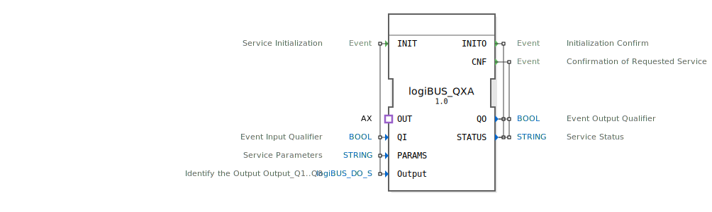

# logiBUS_QXA

```{index} single: logiBUS_QXA
```


* * * * * * * * * *

## Einleitung
Der logiBUS_QXA ist ein zusammengesetzter Funktionsblock für die Ausgabe von booleschen Daten. Er dient als Schnittstelle für digitale Ausgabefunktionen und ermöglicht die Steuerung von bis zu 8 digitalen Ausgängen über ein standardisiertes Protokoll.



## Schnittstellenstruktur

### **Ereignis-Eingänge**
- **INIT**: Service-Initialisierungsereignis mit den zugehörigen Daten QI, PARAMS und Output

### **Ereignis-Ausgänge**
- **INITO**: Initialisierungsbestätigung mit den Daten QO und STATUS
- **CNF**: Bestätigung des angeforderten Services mit den Daten QO und STATUS

### **Daten-Eingänge**
- **QI**: Boolescher Ereigniseingangsqualifizierer
- **PARAMS**: Service-Parameter als Zeichenkette
- **Output**: Identifizierung der Ausgänge Q1 bis Q8 vom Typ logiBUS_DO_S mit Initialwert "Invalid"

### **Daten-Ausgänge**
- **QO**: Boolescher Ereignisausgangsqualifizierer
- **STATUS**: Service-Status als Zeichenkette

### **Adapter**
- **OUT**: Unidirektionaler Adapter vom Typ AX für die Ausgabekommunikation

## Funktionsweise
Der logiBUS_QXA fungiert als Wrapper für den logiBUS_QX-Funktionsblock und bietet eine vereinheitlichte Schnittstelle für digitale Ausgabefunktionen. Bei Initialisierung (INIT-Ereignis) werden die Konfigurationsparameter übergeben und die Ausgänge entsprechend konfiguriert. Der Block ermöglicht die Steuerung von bis zu 8 digitalen Ausgängen über die Output-Datenstruktur.

## Technische Besonderheiten
- Verwendet den logiBUS_QX-Kernfunktionsblock für die eigentliche Ausgabelogik
- Unterstützt bis zu 8 digitale Ausgänge (Q1 bis Q8)
- Initialisierung mit spezifischen Parametern über die PARAMS-Eingabe
- Rückmeldung des Betriebszustands über STATUS-Ausgabe

## Zustandsübersicht
Der Funktionsblock durchläuft folgende Zustände:
1. **Nicht initialisiert**: Vor dem INIT-Ereignis
2. **Initialisierung**: Während der Verarbeitung des INIT-Ereignis
3. **Betriebsbereit**: Nach erfolgreicher Initialisierung (INITO-Bestätigung)
4. **Aktiver Betrieb**: Verarbeitung von Ausgabeanforderungen über den OUT-Adapter

## Anwendungsszenarien
- Steuerung von digitalen Aktoren in Automatisierungssystemen
- Anbindung von Ausgabemodulen in verteilten Steuerungssystemen
- Integration in logiBUS-basierte Steuerungsarchitekturen
- Industrielle Automatisierung mit booleschen Ausgabesignalen

## Vergleich mit ähnlichen Bausteinen
Im Vergleich zu einfachen digitalen Ausgabeblöcken bietet logiBUS_QXA:
- Erweiterte Parametrierungsmöglichkeiten
- Statusrückmeldungen für Fehlerdiagnose
- Standardisierte Schnittstelle über Adapter
- Unterstützung für multiple Ausgänge in einer Struktur


## Zugehörige Übungen

* [Uebung_001_AX](../../../../../training1/Ventilsteuerung/4diacIDE-workspace/test_AX/Uebungen_doc/Uebung_001_AX.md)
* [Uebung_001_AX_b](../../../../../training1/Ventilsteuerung/4diacIDE-workspace/test_AX/Uebungen_doc/Uebung_001_AX_b.md)
* [Uebung_001c_AX](../../../../../training1/Ventilsteuerung/4diacIDE-workspace/test_AX/Uebungen_doc/Uebung_001c_AX.md)
* [Uebung_002_AX](../../../../../training1/Ventilsteuerung/4diacIDE-workspace/test_AX/Uebungen_doc/Uebung_002_AX.md)
* [Uebung_002a2_AX](../../../../../training1/Ventilsteuerung/4diacIDE-workspace/test_AX/Uebungen_doc/Uebung_002a2_AX.md)
* [Uebung_002a3_AX](../../../../../training1/Ventilsteuerung/4diacIDE-workspace/test_AX/Uebungen_doc/Uebung_002a3_AX.md)
* [Uebung_002a5_AX](../../../../../training1/Ventilsteuerung/4diacIDE-workspace/test_AX/Uebungen_doc/Uebung_002a5_AX.md)
* [Uebung_002a5b_AX](../../../../../training1/Ventilsteuerung/4diacIDE-workspace/test_AX/Uebungen_doc/Uebung_002a5b_AX.md)
* [Uebung_002a6_AX](../../../../../training1/Ventilsteuerung/4diacIDE-workspace/test_AX/Uebungen_doc/Uebung_002a6_AX.md)
* [Uebung_002a7_AX](../../../../../training1/Ventilsteuerung/4diacIDE-workspace/test_AX/Uebungen_doc/Uebung_002a7_AX.md)
* [Uebung_002a_AX](../../../../../training1/Ventilsteuerung/4diacIDE-workspace/test_AX/Uebungen_doc/Uebung_002a_AX.md)
* [Uebung_002b3_AX](../../../../../training1/Ventilsteuerung/4diacIDE-workspace/test_AX/Uebungen_doc/Uebung_002b3_AX.md)
* [Uebung_003_AX](../../../../../training1/Ventilsteuerung/4diacIDE-workspace/test_AX/Uebungen_doc/Uebung_003_AX.md)
* [Uebung_003a0_AX](../../../../../training1/Ventilsteuerung/4diacIDE-workspace/test_AX/Uebungen_doc/Uebung_003a0_AX.md)
* [Uebung_003a_AX_sub](../../../../../training1/Ventilsteuerung/4diacIDE-workspace/test_AX/Uebungen_doc/Uebung_003a_AX_sub.md)
* [Uebung_003d_AX](../../../../../training1/Ventilsteuerung/4diacIDE-workspace/test_AX/Uebungen_doc/Uebung_003d_AX.md)
* [Uebung_004a2_AX](../../../../../training1/Ventilsteuerung/4diacIDE-workspace/test_AX/Uebungen_doc/Uebung_004a2_AX.md)
* [Uebung_004a3_AX](../../../../../training1/Ventilsteuerung/4diacIDE-workspace/test_AX/Uebungen_doc/Uebung_004a3_AX.md)
* [Uebung_004a4_AX](../../../../../training1/Ventilsteuerung/4diacIDE-workspace/test_AX/Uebungen_doc/Uebung_004a4_AX.md)
* [Uebung_004a5_AX](../../../../../training1/Ventilsteuerung/4diacIDE-workspace/test_AX/Uebungen_doc/Uebung_004a5_AX.md)
* [Uebung_004a6_AX](../../../../../training1/Ventilsteuerung/4diacIDE-workspace/test_AX/Uebungen_doc/Uebung_004a6_AX.md)
* [Uebung_004a7_AX](../../../../../training1/Ventilsteuerung/4diacIDE-workspace/test_AX/Uebungen_doc/Uebung_004a7_AX.md)
* [Uebung_004a8_AX](../../../../../training1/Ventilsteuerung/4diacIDE-workspace/test_AX/Uebungen_doc/Uebung_004a8_AX.md)
* [Uebung_004a9_AX](../../../../../training1/Ventilsteuerung/4diacIDE-workspace/test_AX/Uebungen_doc/Uebung_004a9_AX.md)
* [Uebung_004a_AX](../../../../../training1/Ventilsteuerung/4diacIDE-workspace/test_AX/Uebungen_doc/Uebung_004a_AX.md)
* [Uebung_004b_AX](../../../../../training1/Ventilsteuerung/4diacIDE-workspace/test_AX/Uebungen_doc/Uebung_004b_AX.md)
* [Uebung_004b_AX_ASR](../../../../../training1/Ventilsteuerung/4diacIDE-workspace/test_AX/Uebungen_doc/Uebung_004b_AX_ASR.md)
* [Uebung_004b_AX_ASR_X](../../../../../training1/Ventilsteuerung/4diacIDE-workspace/test_AX/Uebungen_doc/Uebung_004b_AX_ASR_X.md)
* [Uebung_004c1_AX](../../../../../training1/Ventilsteuerung/4diacIDE-workspace/test_AX/Uebungen_doc/Uebung_004c1_AX.md)
* [Uebung_004c2_AX](../../../../../training1/Ventilsteuerung/4diacIDE-workspace/test_AX/Uebungen_doc/Uebung_004c2_AX.md)
* [Uebung_004c3_AX](../../../../../training1/Ventilsteuerung/4diacIDE-workspace/test_AX/Uebungen_doc/Uebung_004c3_AX.md)
* [Uebung_004c4_AX](../../../../../training1/Ventilsteuerung/4diacIDE-workspace/test_AX/Uebungen_doc/Uebung_004c4_AX.md)
* [Uebung_004c5_AX](../../../../../training1/Ventilsteuerung/4diacIDE-workspace/test_AX/Uebungen_doc/Uebung_004c5_AX.md)
* [Uebung_004c6_AX](../../../../../training1/Ventilsteuerung/4diacIDE-workspace/test_AX/Uebungen_doc/Uebung_004c6_AX.md)
* [Uebung_004c7_AX](../../../../../training1/Ventilsteuerung/4diacIDE-workspace/test_AX/Uebungen_doc/Uebung_004c7_AX.md)
* [Uebung_005_AX](../../../../../training1/Ventilsteuerung/4diacIDE-workspace/test_AX/Uebungen_doc/Uebung_005_AX.md)
* [Uebung_006_AX](../../../../../training1/Ventilsteuerung/4diacIDE-workspace/test_AX/Uebungen_doc/Uebung_006_AX.md)
* [Uebung_006a2_AX](../../../../../training1/Ventilsteuerung/4diacIDE-workspace/test_AX/Uebungen_doc/Uebung_006a2_AX.md)
* [Uebung_006a3_AX](../../../../../training1/Ventilsteuerung/4diacIDE-workspace/test_AX/Uebungen_doc/Uebung_006a3_AX.md)
* [Uebung_006a4_AX](../../../../../training1/Ventilsteuerung/4diacIDE-workspace/test_AX/Uebungen_doc/Uebung_006a4_AX.md)
* [Uebung_006a_AX](../../../../../training1/Ventilsteuerung/4diacIDE-workspace/test_AX/Uebungen_doc/Uebung_006a_AX.md)
* [Uebung_006b_AX](../../../../../training1/Ventilsteuerung/4diacIDE-workspace/test_AX/Uebungen_doc/Uebung_006b_AX.md)
* [Uebung_006d_AX](../../../../../training1/Ventilsteuerung/4diacIDE-workspace/test_AX/Uebungen_doc/Uebung_006d_AX.md)
* [Uebung_006e1_AX](../../../../../training1/Ventilsteuerung/4diacIDE-workspace/test_AX/Uebungen_doc/Uebung_006e1_AX.md)
* [Uebung_006e2_AX](../../../../../training1/Ventilsteuerung/4diacIDE-workspace/test_AX/Uebungen_doc/Uebung_006e2_AX.md)
* [Uebung_007_AX](../../../../../training1/Ventilsteuerung/4diacIDE-workspace/test_AX/Uebungen_doc/Uebung_007_AX.md)
* [Uebung_007a1_AX](../../../../../training1/Ventilsteuerung/4diacIDE-workspace/test_AX/Uebungen_doc/Uebung_007a1_AX.md)
* [Uebung_007a2_AX](../../../../../training1/Ventilsteuerung/4diacIDE-workspace/test_AX/Uebungen_doc/Uebung_007a2_AX.md)
* [Uebung_007a3_AX](../../../../../training1/Ventilsteuerung/4diacIDE-workspace/test_AX/Uebungen_doc/Uebung_007a3_AX.md)
* [Uebung_008_AX](../../../../../training1/Ventilsteuerung/4diacIDE-workspace/test_AX/Uebungen_doc/Uebung_008_AX.md)
* [Uebung_009_AX](../../../../../training1/Ventilsteuerung/4diacIDE-workspace/test_AX/Uebungen_doc/Uebung_009_AX.md)
* [Uebung_010_AX](../../../../../training1/Ventilsteuerung/4diacIDE-workspace/test_AX/Uebungen_doc/Uebung_010_AX.md)
* [Uebung_010a2_AX](../../../../../training1/Ventilsteuerung/4diacIDE-workspace/test_AX/Uebungen_doc/Uebung_010a2_AX.md)
* [Uebung_010a3_AX](../../../../../training1/Ventilsteuerung/4diacIDE-workspace/test_AX/Uebungen_doc/Uebung_010a3_AX.md)
* [Uebung_010a_AX](../../../../../training1/Ventilsteuerung/4diacIDE-workspace/test_AX/Uebungen_doc/Uebung_010a_AX.md)
* [Uebung_010b1_AX](../../../../../training1/Ventilsteuerung/4diacIDE-workspace/test_AX/Uebungen_doc/Uebung_010b1_AX.md)
* [Uebung_010b2_AX](../../../../../training1/Ventilsteuerung/4diacIDE-workspace/test_AX/Uebungen_doc/Uebung_010b2_AX.md)
* [Uebung_010b3_AX](../../../../../training1/Ventilsteuerung/4diacIDE-workspace/test_AX/Uebungen_doc/Uebung_010b3_AX.md)
* [Uebung_010b4_sub_AX](../../../../../training1/Ventilsteuerung/4diacIDE-workspace/test_AX/Uebungen_doc/Uebung_010b4_sub_AX.md)
* [Uebung_010b5_sub_AX](../../../../../training1/Ventilsteuerung/4diacIDE-workspace/test_AX/Uebungen_doc/Uebung_010b5_sub_AX.md)
* [Uebung_010b6_AX](../../../../../training1/Ventilsteuerung/4diacIDE-workspace/test_AX/Uebungen_doc/Uebung_010b6_AX.md)
* [Uebung_010b7_AX](../../../../../training1/Ventilsteuerung/4diacIDE-workspace/test_AX/Uebungen_doc/Uebung_010b7_AX.md)
* [Uebung_010b8_AX](../../../../../training1/Ventilsteuerung/4diacIDE-workspace/test_AX/Uebungen_doc/Uebung_010b8_AX.md)
* [Uebung_010b9_AX](../../../../../training1/Ventilsteuerung/4diacIDE-workspace/test_AX/Uebungen_doc/Uebung_010b9_AX.md)
* [Uebung_010bA2_AX](../../../../../training1/Ventilsteuerung/4diacIDE-workspace/test_AX/Uebungen_doc/Uebung_010bA2_AX.md)
* [Uebung_010bA3_AX](../../../../../training1/Ventilsteuerung/4diacIDE-workspace/test_AX/Uebungen_doc/Uebung_010bA3_AX.md)
* [Uebung_010bA4_AX](../../../../../training1/Ventilsteuerung/4diacIDE-workspace/test_AX/Uebungen_doc/Uebung_010bA4_AX.md)
* [Uebung_010bA_AX](../../../../../training1/Ventilsteuerung/4diacIDE-workspace/test_AX/Uebungen_doc/Uebung_010bA_AX.md)
* [Uebung_010c2_AX](../../../../../training1/Ventilsteuerung/4diacIDE-workspace/test_AX/Uebungen_doc/Uebung_010c2_AX.md)
* [Uebung_010c3_sub_AX](../../../../../training1/Ventilsteuerung/4diacIDE-workspace/test_AX/Uebungen_doc/Uebung_010c3_sub_AX.md)
* [Uebung_010c4_sub_AX](../../../../../training1/Ventilsteuerung/4diacIDE-workspace/test_AX/Uebungen_doc/Uebung_010c4_sub_AX.md)
* [Uebung_010c_AX](../../../../../training1/Ventilsteuerung/4diacIDE-workspace/test_AX/Uebungen_doc/Uebung_010c_AX.md)
* [Uebung_013_AX](../../../../../training1/Ventilsteuerung/4diacIDE-workspace/test_AX/Uebungen_doc/Uebung_013_AX.md)
* [Uebung_020a_AX](../../../../../training1/Ventilsteuerung/4diacIDE-workspace/test_AX/Uebungen_doc/Uebung_020a_AX.md)
* [Uebung_020b_AX](../../../../../training1/Ventilsteuerung/4diacIDE-workspace/test_AX/Uebungen_doc/Uebung_020b_AX.md)
* [Uebung_020c3_AX](../../../../../training1/Ventilsteuerung/4diacIDE-workspace/test_AX/Uebungen_doc/Uebung_020c3_AX.md)
* [Uebung_020c_AX](../../../../../training1/Ventilsteuerung/4diacIDE-workspace/test_AX/Uebungen_doc/Uebung_020c_AX.md)
* [Uebung_020d_AX](../../../../../training1/Ventilsteuerung/4diacIDE-workspace/test_AX/Uebungen_doc/Uebung_020d_AX.md)
* [Uebung_020e2_AX](../../../../../training1/Ventilsteuerung/4diacIDE-workspace/test_AX/Uebungen_doc/Uebung_020e2_AX.md)
* [Uebung_020e_AX](../../../../../training1/Ventilsteuerung/4diacIDE-workspace/test_AX/Uebungen_doc/Uebung_020e_AX.md)
* [Uebung_020f2_AX](../../../../../training1/Ventilsteuerung/4diacIDE-workspace/test_AX/Uebungen_doc/Uebung_020f2_AX.md)
* [Uebung_020f3_AX](../../../../../training1/Ventilsteuerung/4diacIDE-workspace/test_AX/Uebungen_doc/Uebung_020f3_AX.md)
* [Uebung_020f_AX](../../../../../training1/Ventilsteuerung/4diacIDE-workspace/test_AX/Uebungen_doc/Uebung_020f_AX.md)
* [Uebung_020g_AX](../../../../../training1/Ventilsteuerung/4diacIDE-workspace/test_AX/Uebungen_doc/Uebung_020g_AX.md)
* [Uebung_020h_AX](../../../../../training1/Ventilsteuerung/4diacIDE-workspace/test_AX/Uebungen_doc/Uebung_020h_AX.md)
* [Uebung_020i_AX](../../../../../training1/Ventilsteuerung/4diacIDE-workspace/test_AX/Uebungen_doc/Uebung_020i_AX.md)
* [Uebung_020j2_AX](../../../../../training1/Ventilsteuerung/4diacIDE-workspace/test_AX/Uebungen_doc/Uebung_020j2_AX.md)
* [Uebung_020j_AX](../../../../../training1/Ventilsteuerung/4diacIDE-workspace/test_AX/Uebungen_doc/Uebung_020j_AX.md)
* [Uebung_035a1_AX](../../../../../training1/Ventilsteuerung/4diacIDE-workspace/test_AX/Uebungen_doc/Uebung_035a1_AX.md)
* [Uebung_035a1b_AX](../../../../../training1/Ventilsteuerung/4diacIDE-workspace/test_AX/Uebungen_doc/Uebung_035a1b_AX.md)
* [Uebung_035a2_AX](../../../../../training1/Ventilsteuerung/4diacIDE-workspace/test_AX/Uebungen_doc/Uebung_035a2_AX.md)
* [Uebung_035a3_AX](../../../../../training1/Ventilsteuerung/4diacIDE-workspace/test_AX/Uebungen_doc/Uebung_035a3_AX.md)
* [Uebung_038_AX](../../../../../training1/Ventilsteuerung/4diacIDE-workspace/test_AX/Uebungen_doc/Uebung_038_AX.md)
* [Uebung_040_AX](../../../../../training1/Ventilsteuerung/4diacIDE-workspace/test_AX/Uebungen_doc/Uebung_040_AX.md)
* [Uebung_083_AX](../../../../../training1/Ventilsteuerung/4diacIDE-workspace/test_AX/Uebungen_doc/Uebung_083_AX.md)
* [Uebung_090a1_AX](../../../../../training1/Ventilsteuerung/4diacIDE-workspace/test_AX/Uebungen_doc/Uebung_090a1_AX.md)
* [Uebung_090a2_AX](../../../../../training1/Ventilsteuerung/4diacIDE-workspace/test_AX/Uebungen_doc/Uebung_090a2_AX.md)
* [Uebung_094a_AX](../../../../../training1/Ventilsteuerung/4diacIDE-workspace/test_AX/Uebungen_doc/Uebung_094a_AX.md)
* [Uebung_095_AX](../../../../../training1/Ventilsteuerung/4diacIDE-workspace/test_AX/Uebungen_doc/Uebung_095_AX.md)
* [Uebung_103](../../../../../training1/Ventilsteuerung/4diacIDE-workspace/test_B/Uebungen_doc/Uebung_103.md)
* [Uebung_103c](../../../../../training1/Ventilsteuerung/4diacIDE-workspace/test_B/Uebungen_doc/Uebung_103c.md)
* [Uebung_103c2](../../../../../training1/Ventilsteuerung/4diacIDE-workspace/test_B/Uebungen_doc/Uebung_103c2.md)
* [Uebung_150_AX](../../../../../training1/Ventilsteuerung/4diacIDE-workspace/test_AX/Uebungen_doc/Uebung_150_AX.md)
* [Uebung_151_AX](../../../../../training1/Ventilsteuerung/4diacIDE-workspace/test_AX/Uebungen_doc/Uebung_151_AX.md)
* [Uebung_160_AX](../../../../../training1/Ventilsteuerung/4diacIDE-workspace/test_AX/Uebungen_doc/Uebung_160_AX.md)
* [Uebung_160b2_AX](../../../../../training1/Ventilsteuerung/4diacIDE-workspace/test_AX/Uebungen_doc/Uebung_160b2_AX.md)
* [Uebung_160b_AX](../../../../../training1/Ventilsteuerung/4diacIDE-workspace/test_AX/Uebungen_doc/Uebung_160b_AX.md)
* [Uebung_171_AX](../../../../../training1/Ventilsteuerung/4diacIDE-workspace/test_AX/Uebungen_doc/Uebung_171_AX.md)
* [Uebung_177_AX](../../../../../training1/Ventilsteuerung/4diacIDE-workspace/test_AX/Uebungen_doc/Uebung_177_AX.md)
* [Uebung_178_AX](../../../../../training1/Ventilsteuerung/4diacIDE-workspace/test_AX/Uebungen_doc/Uebung_178_AX.md)

## Fazit
Der logiBUS_QXA ist ein robuster und flexibler Funktionsblock für digitale Ausgabefunktionen in industriellen Automatisierungssystemen. Durch seine standardisierte Schnittstelle und umfassende Parametrierungsmöglichkeiten eignet er sich ideal für den Einsatz in komplexen Steuerungsarchitekturen mit hohen Anforderungen an Zuverlässigkeit und Diagnosefähigkeit.