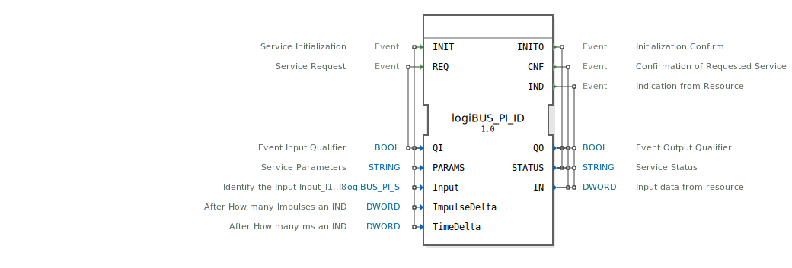

# logiBUS_PI_ID

```{index} single: logiBUS_PI_ID
```


* * * * * * * * * *
## Einleitung
Der Funktionsblock `logiBUS_PI_ID` ist ein Eingabeservice-Interface-Baustein für 32-Bit-DWORT-Eingabedaten. Er dient als Schnittstelle zu einem physischen Eingabemodul (vermutlich Teil des logiBUS-Systems) und ermöglicht die Initialisierung, zyklische Abfrage (Polling) und ereignisgesteuerte (Interrupt) Ausgabe von digitalen Eingangswerten. Der Baustein kann so konfiguriert werden, dass er Statusänderungen entweder nach einer bestimmten Anzahl von Impulsen oder nach einem definierten Zeitintervall meldet.



## Schnittstellenstruktur

### **Ereignis-Eingänge**
*   **`INIT`**: Initialisiert den Service. Begleitet von den Daten `QI`, `PARAMS`, `Input`, `ImpulseDelta` und `TimeDelta`.
*   **`REQ`**: Löst eine zyklische Abfrage (Polling) des Eingangswerts aus. Begleitet von dem Daten `QI`.

### **Ereignis-Ausgänge**
*   **`INITO`**: Bestätigt die Initialisierung. Liefert die Daten `QO` und `STATUS`.
*   **`CNF`**: Bestätigt eine angeforderte Abfrage (`REQ`). Liefert die Daten `QO`, `STATUS` und den aktuellen Eingangswert `IN`.
*   **`IND`**: Zeigt eine ereignisgesteuerte Statusänderung (Interrupt) an. Liefert die Daten `QO`, `STATUS` und den neuen Eingangswert `IN`.

### **Daten-Eingänge**
*   **`QI` (BOOL)**: Qualifiziert den zugehörigen Ereigniseingang. Bei `TRUE` wird der Service aktiviert/ausgeführt, bei `FALSE` deaktiviert.
*   **`PARAMS` (STRING)**: Enthält service-spezifische Parameter für die Initialisierung (z.B. Hardware-Adresse, Kanal-Konfiguration).
*   **`Input` (logiBUS_PI_S)**: Identifiziert den konkreten physischen Eingang (z.B. I1..I8). Der Initialwert ist `logiBUS_PI::Invalid`.
*   **`ImpulseDelta` (DWORD)**: Definiert, nach wie vielen aufeinanderfolgenden Zustandsänderungen (Impulsen) ein `IND`-Ereignis generiert werden soll.
*   **`TimeDelta` (DWORD)**: Definiert das Zeitintervall in Millisekunden, nach dem ein `IND`-Ereignis generiert werden soll, wenn sich der Wert geändert hat.

### **Daten-Ausgänge**
*   **`QO` (BOOL)**: Zeigt den Status der Serviceausführung an. `TRUE` bedeutet erfolgreich, `FALSE` signalisiert einen Fehler.
*   **`STATUS` (STRING)**: Liefert eine detaillierte Status- oder Fehlermeldung vom Service.
*   **`IN` (DWORD)**: Enthält den aktuellen, vom physischen Eingang gelesenen 32-Bit-Wert.

### **Adapter**
Dieser Funktionsblock verfügt über keine Adapterschnittstellen.

## Funktionsweise
Der Baustein arbeitet in zwei grundlegenden Modi, die durch die Ereignisse `REQ` und `IND` gesteuert werden:
1.  **Polling-Modus**: Durch ein `REQ`-Ereignis wird der aktuelle Eingangswert abgefragt und das Ergebnis mit einem `CNF`-Ereignis zurückgemeldet.
2.  **Interrupt-Modus**: Nach erfolgreicher Initialisierung (`INIT`/`INITO`) überwacht der Baustein den Eingang kontinuierlich. Bei einer Zustandsänderung werden die Parameter `ImpulseDelta` und `TimeDelta` ausgewertet. Wird eines der Kriterien erfüllt (z.B. die definierte Anzahl an Impulsen erreicht oder das Zeitintervall überschritten *und* der Wert hat sich geändert), wird automatisch ein `IND`-Ereignis mit dem neuen Wert ausgelöst.

Die Initialisierung (`INIT`) ist Voraussetzung für beide Betriebsarten. Dabei werden die Hardware-Ressource über `PARAMS` und der spezifische Eingang über `Input` konfiguriert.

## Technische Besonderheiten
*   **Datentyp**: Verarbeitet 32-Bit-Eingabedaten (`DWORD`).
*   **Strukturierter Eingang**: Der Eingang wird nicht über einen einfachen Index, sondern über einen strukturierten Datentyp (`logiBUS_PI_S`) identifiziert, was eine typsichere und eindeutige Adressierung ermöglicht.
*   **Flexible Ereignisauslösung**: Die Bedingungen für die automatische Ereignisgenerierung (`IND`) können sowohl impuls- als auch zeitbasiert konfiguriert werden.
*   **Service-Interface**: Folgt dem typischen Muster eines 4diac-Service-Interface-FBs mit `QI`/`QO` und `STATUS`-Variablen für einheitliches Fehlerhandling.

## Zustandsübersicht
1.  **Inaktiv**: Nach dem Start oder bei `QI=FALSE`.
2.  **Initialisierung**: Bei Empfang von `INIT` mit `QI=TRUE`. Konfiguriert die Hardware-Schnittstelle. Endet mit `INITO` (`QO` zeigt Erfolg/Fehler an).
3.  **Bereit (Polling)**: Nach erfolgreicher Initialisierung. Auf `REQ`-Ereignisse wird mit `CNF` und dem aktuellen Wert geantwortet.
4.  **Bereit (Überwachung)**: Nach erfolgreicher Initialisierung. Überwacht den Eingang kontinuierlich und löst `IND`-Ereignisse gemäß der konfigurierten `ImpulseDelta`- und `TimeDelta`-Parameter aus.

## Anwendungsszenarien
*   **Einlesen von Zählersignalen**: Erfassung von Impulsen eines Drehgebers oder Encoders, wobei `ImpulseDelta` für eine Vorverarbeitung (z.B. jede 10. Umdrehung melden) genutzt wird.
*   **Überwachung von Statusgruppen**: Lesen eines 32-Bit-Statusworts eines angeschlossenen Geräts, wobei Änderungen nur in bestimmten Zeitabständen (`TimeDelta`) gemeldet werden müssen, um die CPU-Last zu reduzieren.
*   **Zyklische Abfrage von Schalterbänken**: Polling mehrerer digitaler Eingänge, die zu einem DWORD zusammengefasst sind, über regelmäßige `REQ`-Ereignisse.

## Vergleich mit ähnlichen Bausteinen
*   **Gegenüber `E_DEMUX` oder `E_SELECT`**: Diese Bausteine leiten Ereignisse weiter oder selektieren Daten. `logiBUS_PI_ID` ist spezifisch für die Hardware-Kommunikation und beinhaltet Treiberlogik sowie Initialisierung.
*   **Gegenüber generischen I/O-FBs (z.B. `WAGO_750_5xx_DI`)**: Ähnliche Funktion, aber herstellerspezifisch (hier logiBUS). Die Konfiguration erfolgt über den strukturierten `Input`-Parameter und `PARAMS` anstelle fester Kanalnummern.
*   **Gegenüber einfacheren Eingabeblöcken**: Bietet erweiterte Funktionen wie filternde Ereignisgenerierung (`IND`) über `ImpulseDelta`/`TimeDelta`, die in einfachen "Read"-Blöcken typischerweise nicht vorhanden sind.


## Zugehörige Übungen

* [Uebung_150](../../../../../training1/Ventilsteuerung/4diacIDE-workspace/test_B/Uebungen_doc/Uebung_150.md)
* [Uebung_150_AX](../../../../../training1/Ventilsteuerung/4diacIDE-workspace/test_AX/Uebungen_doc/Uebung_150_AX.md)
* [Uebung_151](../../../../../training1/Ventilsteuerung/4diacIDE-workspace/test_B/Uebungen_doc/Uebung_151.md)
* [Uebung_151_AX](../../../../../training1/Ventilsteuerung/4diacIDE-workspace/test_AX/Uebungen_doc/Uebung_151_AX.md)
* [Uebung_152](../../../../../training1/Ventilsteuerung/4diacIDE-workspace/test_B/Uebungen_doc/Uebung_152.md)
* [Uebung_153](../../../../../training1/Ventilsteuerung/4diacIDE-workspace/test_B/Uebungen_doc/Uebung_153.md)

## Fazit
Der `logiBUS_PI_ID`-Funktionsblock ist ein leistungsfähiges und flexibles Interface für 32-Bit-Digitaleingänge innerhalb des logiBUS-Ökosystems. Durch die Kombination von Polling (`REQ`/`CNF`) und ereignisgesteuerter Abfrage (`IND`) mit konfigurierbaren Auslösekriterien eignet er sich für eine Vielzahl von Anwendungen, von der einfachen Statusabfrage bis zur komplexen Impulsauswertung. Die strikte Trennung von Initialisierungs- und Betriebslogik sowie das umfangreiche Status-Reporting machen ihn zu einem robusten Baustein für industrielle Steuerungsanwendungen.