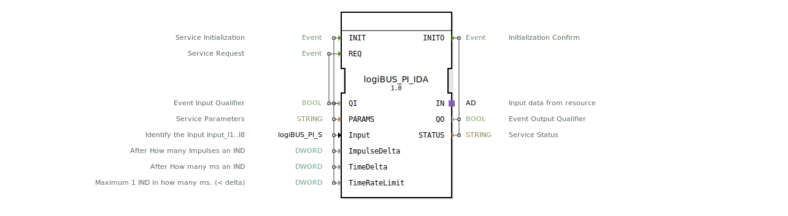

# logiBUS_PI_IDA

* * * * * * * * * *

## Einleitung

Der **logiBUS_PI_IDA** ist ein Composite Funktionsblock (FB) zur Verarbeitung von Doppelwort-Eingangsdaten (DWORD). Er dient als Schnittstelle zwischen einem logiBUS-Feldbus und der Steuerungslogik. Der FB ermöglicht die parametrierbare Überwachung von Impuls- und Zeitänderungen an einem digitalen Eingang. Durch die Konfiguration von Impuls-Delta, Zeit-Delta und einer Ratenbegrenzung kann das Meldeverhalten exakt auf die Anwendung abgestimmt werden. Der Baustein initialisiert den internen Unterbaustein `logiBUS_PI_ID` und stellt dessen Ergebnisse über einen unidirektionalen Adapter bereit.

## Schnittstellenstruktur

### **Ereignis-Eingänge**

| Name | Typ | Kommentar |
|------|-----|-----------|
| INIT | EInit | Service Initialization – Parametrierung und Start |
| REQ  | Event | Service Request – löst eine Verarbeitung aus |

### **Ereignis-Ausgänge**

| Name | Typ | Kommentar |
|------|-----|-----------|
| INITO | EInit | Initialization Confirm – bestätigt erfolgreiche Initialisierung |

### **Daten-Eingänge**

| Name | Typ | Initialwert | Kommentar |
|------|-----|-------------|-----------|
| QI            | BOOL   | – | Event Input Qualifier (freigeben/sperren) |
| PARAMS        | STRING | – | Service Parameters (z. B. Busadresse, Kanalkonfiguration) |
| Input         | logiBUS::io::PI::logiBUS_PI_S | `Invalid` | Identifiziert den physikalischen Eingang (Input_I1..I8) |
| ImpulseDelta  | DWORD  | – | Anzahl der Impulse, nach denen eine Indikation (IND) ausgelöst wird |
| TimeDelta     | DWORD  | `250` | Zeit in ms, nach der eine periodische Indikation (IND) ausgelöst wird |
| TimeRateLimit | DWORD  | `100` | Minimaler Abstand in ms zwischen zwei Indikationen (Rate Limiting) |

### **Daten-Ausgänge**

| Name | Typ | Kommentar |
|------|-----|-----------|
| QO     | BOOL   | Event Output Qualifier – Status der letzten Verarbeitung |
| STATUS | STRING | Service Status – Fehler- oder Diagnosemeldung |

### **Adapter**

| Name | Typ | Kommentar |
|------|-----|-----------|
| IN | adapter::types::unidirectional::AD | Ausgangsdaten des FB – liefert die verarbeiteten Ereignisse und Werte an die Anwendung |

Der Adapter `IN` wird mit den Ereignissen `IND` (Indikation) und `CNF` (Bestätigung) sowie dem Datenwert `D1` des internen FB `logiBUS_PI_ID` verbunden.

## Funktionsweise

Der FB arbeitet als Composite, der die gesamte Initialisierungs- und Verarbeitungslogik an den internen FB `logiBUS_PI_ID` delegiert.  

1. **Initialisierung (INIT):**  
   Beim Eintreffen von `INIT` werden die Parameter `QI`, `PARAMS`, `Input`, `ImpulseDelta`, `TimeDelta` und `TimeRateLimit` an den internen FB weitergeleitet. Dieser konfiguriert den Hardwareeingang und startet die Überwachung. Nach erfolgreicher Initialisierung wird `INITO` ausgegeben.

2. **Verarbeitung (REQ):**  
   Ein `REQ`-Ereignis löst eine Abfrage des Eingangswertes aus. Der interne FB prüft, ob die konfigurierten Schwellen (Impulszähler, Zeitschranke) erreicht oder überschritten wurden. Falls ja, werden die Ereignisse `IND` und/oder `CNF` über den Adapter `IN` an die nachgeschaltete Logik gesendet.

3. **Meldeverhalten:**  
   - **Impulsabhängig:** Wenn `ImpulseDelta > 0`, wird nach jeder Änderung des Eingangssignals ein interner Impulszähler erhöht. Erreicht der Zähler den Wert von `ImpulseDelta`, wird eine Indikation (`IND`) ausgelöst und der Zähler zurückgesetzt.  
   - **Zeitabhängig:** Zusätzlich oder alternativ wird nach Ablauf von `TimeDelta` Millisekunden eine periodische Indikation erzeugt.  
   - **Sperrlogik:** Ist `ImpulseDelta = 0`, darf `TimeDelta` nicht 0 sein (Fehlervermeidung). Wird `TimeDelta = 0xFFFFFFFF` gesetzt, wird die zyklische Verarbeitung deaktiviert – es werden nur reine Wertänderungen gemeldet.  
   - **Ratenbegrenzung:** `TimeRateLimit` verhindert zu häufige Indikationen; es wird sichergestellt, dass zwischen zwei aufeinanderfolgenden `IND`-Ereignissen mindestens die angegebene Zeit in ms liegt.

## Technische Besonderheiten

- Der FB nutzt intern den Baustein `logiBUS_PI_ID`, der die eigentliche Hardwareanbindung und Zähllogik kapselt.
- Falls `ImpulseDelta = 0`, muss `TimeDelta > 0` gesetzt werden, andernfalls ist das Verhalten undefiniert (siehe Lizenzbemerkung).
- Ein `TimeDelta` von `0xFFFFFFFF` schaltet die zeitgesteuerte Indikation ab – nur impulsgesteuerte oder reine Wertänderungen werden weitergegeben.
- Der Adapter `IN` stellt die Ausgabedaten als unidirektionalen Datenstrom bereit, der in der übergeordneten Applikation weiterverarbeitet wird.
- Die Initialwerte (`Input`: `Invalid`, `TimeDelta`: `250`, `TimeRateLimit`: `100`) sind sinnvoll voreingestellt, um einen schnellen Betrieb ohne zusätzliche Konfiguration zu ermöglichen.

## Zustandsübersicht

Da der FB ein Composite ist und die Zustandslogik vollständig im internen FB `logiBUS_PI_ID` gekapselt ist, wird hier eine allgemeine Zustandsbeschreibung gegeben:

- **IDLE** – Nach Reset oder fehlgeschlagener Initialisierung. Keine Verarbeitung.
- **INIT** – Initialisierung läuft (Warten auf Hardware-Rückmeldung).
- **RUN** – Normalbetrieb: Überwachung von Impulsen und Zeit, Auslösen von Indikationen.
- **ERROR** – Fehlerzustand (z. B. ungültige Parameter, Hardwarefehler). Wird über `STATUS` signalisiert.

Übergänge werden durch `INIT`, `REQ` sowie interne Fehler ausgelöst. Der interne FB verwendet vermutlich eine ECC (Execution Control Chart), die diese Zustände realisiert.

## Anwendungsszenarien

- **Überwachung von digitalen Eingängen:** Anschluss von Tastern, Schaltern oder Endlagenschaltern, wobei sowohl schnelle Impulsänderungen als auch regelmäßige Statusmeldungen gefordert sind.
- **Impulszählung:** Z. B. Erfassung von Durchflusssensoren oder Drehgebern; der FB meldet nach jeder definierten Impulsanzahl einen Messwert.
- **Zeitgesteuerte Abfragen:** In Anwendungen, in denen der Eingangswert regelmäßig (alle `TimeDelta` ms) abgefragt werden muss, z. B. für Langzeitüberwachung oder sicherheitstechnische Prüfungen.
- **Ratenbegrenzung:** Verhindert eine Überlastung der Buskommunikation bei hochfrequenten Signaländerungen.

## Vergleich mit ähnlichen Bausteinen

| Baustein | Unterschied |
|----------|-------------|
| `logiBUS_PI` | Einfacherer Eingangsbaustein ohne Impuls- und Zeit-Delta-Filter; nur rohe Wertänderungen. |
| `logiBUS_PI_ID` | Vorgänger ohne Composite-Struktur und ohne Adapter-Schnittstelle; direkte Ereignisausgänge. |
| `logiBUS_PI_IDA` (dieser FB) | Bietet zusätzlich einen **Adapter** für eine flexible Weiterverarbeitung und kombiniert Impuls-, Zeit- und Ratenlogik in einem Composite. |

Der `logiBUS_PI_IDA` stellt eine erweiterte und modularere Variante dar, die sich besonders für komplexe Automatisierungsprojekte mit standardisierten Schnittstellen eignet.

## Fazit

Der **logiBUS_PI_IDA** ist ein leistungsfähiger Composite Funktionsblock für die parametrierbare Erfassung digitaler Eingangssignale über den logiBUS. Durch die Kombination von Impuls- und Zeit-Delta sowie einer Ratenbegrenzung lässt er sich flexibel an unterschiedlichste Anforderungen anpassen. Die Kapselung der Logik im internen Baustein und die Adapter-Schnittstelle erleichtern die Wiederverwendung und Integration in übergeordnete Steuerungsprogramme. Der FB ist ideal für Anwendungen, die eine präzise und konfigurierbare Signalauswertung mit minimalem Ressourcenaufwand benötigen.