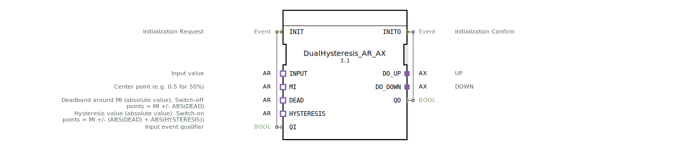

# DualHysteresis_AR_AX

* * * * * * * * * *
## Einleitung
Der Funktionsblock **DualHysteresis_AR_AX** führt eine zweiseitige Analog-Digital-Wandlung mit einstellbarer Hysterese durch.  
Aus einem analogen Eingangswert werden zwei binäre Ausgangssignale (`DO_UP`, `DO_DOWN`) erzeugt, die abhängig von der Lage des Eingangssignals relativ zu drei Parametern geschaltet werden:  
- **MI** – Mittelwert (Sollwertmitte)  
- **DEAD** – Totband (Absolutwert)  
- **HYSTERESIS** – Hysterese (Absolutwert)  

Die Schaltpunkte berechnen sich wie folgt:  
- **Einschalten UP**: `INPUT.D1 >= MI.D1 + ABS(DEAD.D1) + ABS(HYSTERESIS.D1)`  
- **Ausschalten UP**: `INPUT.D1 < MI.D1 + ABS(DEAD.D1)`  
- **Einschalten DOWN**: `INPUT.D1 <= MI.D1 - ABS(DEAD.D1) - ABS(HYSTERESIS.D1)`  
- **Ausschalten DOWN**: `INPUT.D1 > MI.D1 - ABS(DEAD.D1)`  

Damit wird ein sicheres Schaltverhalten mit verminderter Schaltfrequenz erreicht, typisch für Regelstrecken mit Schaltschwelle und Rückführhysterese.

## Schnittstellenstruktur
### **Ereignis-Eingänge**
| Ereignis | Typ | Beschreibung |
|----------|-----|--------------|
| `INIT`   | EInit | Initialisierungsanforderung, begleitet von Daten-Eingang `QI` |

### **Ereignis-Ausgänge**
| Ereignis | Typ | Beschreibung |
|----------|-----|--------------|
| `INITO`  | EInit | Initialisierungsbestätigung, begleitet von Daten-Ausgang `QO` |

### **Daten-Eingänge**
| Daten | Typ | Beschreibung |
|-------|-----|--------------|
| `QI`  | BOOL | Eingangsqualifikator – steuert die Aktivierung des Bausteins. Bei `TRUE` wird die Hysterese-Logik ausgeführt, bei `FALSE` werden Ausgänge zurückgesetzt. |

### **Daten-Ausgänge**
| Daten | Typ | Beschreibung |
|-------|-----|--------------|
| `QO`  | BOOL | Ausgangsqualifikator – wird auf den Wert von `QI` gesetzt, spiegelt den Betriebszustand wider. |

### **Adapter**
**Sockets (Eingangsadapter):**
| Adapter | Typ | Beschreibung |
|---------|-----|--------------|
| `INPUT` | adapter::types::unidirectional::AR | Analoger Eingangswert (z. B. 0…1 oder anderer Bereich) |
| `MI`    | adapter::types::unidirectional::AR | Zentrumspunkt (z. B. 0.5 für 50 %) |
| `DEAD`  | adapter::types::unidirectional::AR | Totband (Absolutwert) – bestimmt die Ausschaltpunkte |
| `HYSTERESIS` | adapter::types::unidirectional::AR | Hysterese (Absolutwert) – erweitert die Ausschaltpunkte zu den Einschaltpunkten |

**Plugs (Ausgangsadapter):**
| Adapter | Typ | Beschreibung |
|---------|-----|--------------|
| `DO_UP`   | adapter::types::unidirectional::AX | Binärausgang für den **UP**-Zustand (Einschalten bei Überschreiten der oberen Schwelle) |
| `DO_DOWN` | adapter::types::unidirectional::AX | Binärausgang für den **DOWN**-Zustand (Einschalten bei Unterschreiten der unteren Schwelle) |

## Funktionsweise
Nach einer erfolgreichen Initialisierung (`INIT` mit `QI = TRUE`) wechselt der FB in den **Neutral**-Zustand. In diesem Zustand sind beide Ausgänge (`DO_UP`, `DO_DOWN`) auf `FALSE`.

Sobald über den Adapter `INPUT` ein neuer Wert eintrifft (Ereignis `E1`), wird die Hysterese-Logik ausgewertet:

1. **UP einschalten**: Wenn `INPUT.D1 >= MI.D1 + ABS(DEAD.D1) + ABS(HYSTERESIS.D1)`, wird der Zustand **UP** aktiv. Dann gilt: `DO_UP = TRUE`, `DO_DOWN = FALSE`.
2. **DOWN einschalten**: Wenn `INPUT.D1 <= MI.D1 - ABS(DEAD.D1) - ABS(HYSTERESIS.D1)`, wird der Zustand **DOWN** aktiv. Dann gilt: `DO_UP = FALSE`, `DO_DOWN = TRUE`.
3. **Rückkehr zu Neutral**:  
   - Aus **UP** erfolgt der Rückfall bei `INPUT.D1 < MI.D1 + ABS(DEAD.D1)` (strenge Bedingung).  
   - Aus **DOWN** erfolgt der Rückfall bei `INPUT.D1 > MI.D1 - ABS(DEAD.D1)` (strenge Bedingung).

Ist `QI = FALSE` bei einem `INIT`-Ereignis, wird der FB deinitialisiert und beide Ausgänge werden auf `FALSE` gesetzt. Ein erneutes `INIT` mit `QI = TRUE` startet den Ablauf neu.

## Technische Besonderheiten
- **Verwendung von Absolutwerten**: Die Parameter `DEAD` und `HYSTERESIS` werden intern mit `ABS()` behandelt, sodass negative Werte nicht zu unerwünschtem Verhalten führen.  
- **Symmetrische Schaltpunkte**: Die Schwellen liegen symmetrisch um den Mittelwert `MI`.  
- **Qualifikator `QI`**: Der FB arbeitet nur bei `QI = TRUE`. Bei `FALSE` werden alle Ausgänge zwangsweise zurückgesetzt (Safe State).  
- **Ereignisgesteuerte Verarbeitung**: Die Hysterese-Logik wird nur bei jedem neuen `INPUT.E1`-Ereignis ausgewertet – keine zyklische Abfrage.

## Zustandsübersicht
| Zustand   | Beschreibung |
|-----------|--------------|
| `START`   | Initialer Ruhezustand nach Systemstart. |
| `Init`    | Initialisierung bei `INIT` mit `QI = TRUE`. Setzt Ausgänge zurück und gibt `INITO`. |
| `Neutral` | Normalzustand: beide Ausgänge sind `FALSE`. Wartet auf neuen Eingangswert. |
| `UP`      | Oberer Schwellwert überschritten: `DO_UP = TRUE`, `DO_DOWN = FALSE`. |
| `DOWN`    | Unterer Schwellwert unterschritten: `DO_UP = FALSE`, `DO_DOWN = TRUE`. |
| `DeInit`  | Deinitialisierung bei `INIT` mit `QI = FALSE`. Setzt alle Ausgänge auf `FALSE` und gibt `INITO`. |

**Transitionen:**  
- `START` → `Init` (bei `INIT` mit `QI = TRUE`)  
- `Init` → `Neutral` (nach erstem `INPUT.E1`)  
- `Neutral` → `UP` / `DOWN` (abhängig vom Eingangswert)  
- `UP` → `Neutral` (bei Unterschreiten der Totbandgrenze)  
- `DOWN` → `Neutral` (bei Überschreiten der Totbandgrenze)  
- `Neutral` → `DeInit` (bei `INIT` mit `QI = FALSE`)  
- `DeInit` → `START` (automatisch)

## Anwendungsszenarien
- **Temperaturregelung mit zwei Stufen**: Ein Heiz- und ein Kühlkreis können mit eigenen Hysteresen betrieben werden, z. B. Heizung unterhalb von 18 °C einschalten, oberhalb von 22 °C ausschalten; Kühlung oberhalb von 30 °C einschalten, unterhalb von 26 °C ausschalten.  
- **Füllstandsüberwachung**: Zwei Schaltpunkte (MIN/MAX) mit Hysterese zur Vermeidung von Prellen bei Pumpen- oder Ventilsteuerungen.  
- **Grenzwertüberwachung mit zwei Alarmschwellen**: Oberer und unterer Alarm mit Ein-/Ausschaltverzögerung durch Hysterese.

## Vergleich mit ähnlichen Bausteinen
Der **DualHysteresis_AR_AX** erweitert eine einfache Hysterese (Einschaltpunkt = Ausschaltpunkt + Hysterese) um eine zweite, inverse Richtung.  
- **Einfache Hysterese**: nur ein Ausgang, eine Schaltschwelle.  
- **DualHysteresis**: zwei Ausgänge, zwei entgegengesetzte Schwellen mit gemeinsamem Totband. Dadurch lassen sich z. B. Heizung und Kühlung getrennt ansteuern, ohne Überlappungen.  

Im Vergleich zu einem PID-Regler ist dieser FB rein schaltend – er erzeugt keine stetigen Stellsignale, eignet sich aber hervorragend für einfache Zweipunkt-Regelungen.

## Fazit
Der Funktionsblock **DualHysteresis_AR_AX** ist eine robuste, ereignisgesteuerte Lösung zur Umwandlung eines analogen Signals in zwei digitale Ausgänge mit einstellbarer Hysterese. Dank der Verwendung von Absolutwerten und der klaren Schaltlogik ist er einfach parametrierbar und vermeidet Schaltspiele. Er eignet sich besonders für industrielle Anwendungen, bei denen zwei gegenläufige Aktoren (z. B. Heizen/Kühlen, Öffnen/Schließen) mit definiertem Schaltabstand betrieben werden müssen.