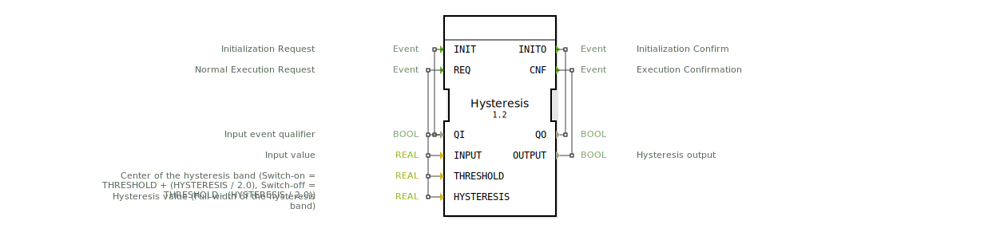

# Hysteresis

* * * * * * * * * *

## Einleitung

Der Funktionsblock **Hysteresis** wandelt ein analoges Eingangssignal (REAL) in ein digitales Ausgangssignal (BOOL) um. Er arbeitet mit einer einstellbaren Hystereseschwelle, um ein stabiles Schaltverhalten zu gewährleisten und Oszillationen am Schwellwert zu vermeiden. Die Schaltpunkte sind symmetrisch um einen Mittelwert (THRESHOLD) angeordnet.

## Schnittstellenstruktur

### **Ereignis-Eingänge**

| Ereignis | Typ   | Beschreibung                                           | Mit Daten                 |
|----------|-------|--------------------------------------------------------|---------------------------|
| INIT     | EInit | Initialisierungsanforderung; schaltet den Baustein aktiv oder deaktiv. | QI                        |
| REQ      | Event | Normale Verarbeitungsanforderung; führt die Hysterese-Berechnung aus.   | QI, INPUT, THRESHOLD, HYSTERESIS |

### **Ereignis-Ausgänge**

| Ereignis | Typ   | Beschreibung                                                | Mit Daten                 |
|----------|-------|-------------------------------------------------------------|---------------------------|
| INITO    | EInit | Bestätigung der Initialisierungs-/Deinitialisierungsanforderung. | QO                        |
| CNF      | Event | Bestätigung der normalen Verarbeitung; gibt das Hysterese-Ergebnis aus. | OUTPUT                    |

### **Daten-Eingänge**

| Name       | Typ   | Initialwert | Beschreibung                                                                                       |
|------------|-------|-------------|---------------------------------------------------------------------------------------------------|
| QI         | BOOL  | –           | Eingangsqualifizierer; schaltet den Baustein ein (TRUE) oder aus (FALSE).                         |
| INPUT      | REAL  | –           | Analoger Eingangswert, der überwacht wird.                                                        |
| THRESHOLD  | REAL  | 0.0         | Mitte des Hysteresebandes. Der Schwellwert zum Einschalten liegt bei THRESHOLD + (HYSTERESIS / 2). |
| HYSTERESIS | REAL  | 0.1         | Breite des Hysteresebandes. Durch Verwendung von ABS(HYSTERESIS) wird stets ein positiver Abstand garantiert. |

### **Daten-Ausgänge**

| Name   | Typ   | Beschreibung                                                     |
|--------|-------|------------------------------------------------------------------|
| QO     | BOOL  | Ausgangsqualifizierer; übernimmt den Wert von QI bei aktiver Verarbeitung. |
| OUTPUT | BOOL  | Hysterese-Ausgang; TRUE, wenn der Eingang den Einschaltpunkt überschreitet, FALSE bis zum Unterschreiten des Ausschaltpunkts. |

### **Adapter**

Keine Adapter vorhanden.

## Funktionsweise

Der Baustein realisiert eine **Analog-Digital-Umwandlung mit Hysterese**. Die Schaltpunkte werden wie folgt berechnet:

- **Einschaltpunkt** (Switch-on): `THRESHOLD + ABS(HYSTERESIS) / 2.0`  
  (inklusiver Vergleich: `INPUT >= ...`)
- **Ausschaltpunkt** (Switch-off): `THRESHOLD - ABS(HYSTERESIS) / 2.0`  
  (strikter Vergleich: `INPUT < ...`)

Durch die Verwendung von `ABS(HYSTERESIS)` bleibt die Hysterese symmetrisch, auch wenn ein negativer Wert übergeben wird. Der strikte Ausschaltvergleich (strenge Ungleichung) verhindert Oszillationen am Schaltpunkt.

Die Initialisierung (`INIT`) und die normale Verarbeitung (`REQ`) werden über den Qualifizierer `QI` gesteuert. Solange `QI = TRUE` ist, arbeitet der Baustein; bei `QI = FALSE` wird er deinitialisiert (Ausgänge gehen auf FALSE).

## Technische Besonderheiten

- **Symmetrische Hysterese**: Durch `ABS(HYSTERESIS)` wird die Hysteresebreite stets positiv verwendet.
- **Strikte Ausschaltbedingung**: Die Bedingung `INPUT < THRESHOLD - (ABS(HYSTERESIS) / 2.0)` verhindert ein springendes Verhalten bei exakt gleichen Werten.
- **Zustandssteuerung über QI**: Ein `INIT`-Ereignis mit `QI = FALSE` deaktiviert den Baustein und setzt alle Ausgänge zurück.
- **Fehlertoleranz**: Bei deaktiviertem Baustein (`QI = FALSE`) wird der Ausgang `OUTPUT` auf FALSE gesetzt.

## Zustandsübersicht

Der Baustein durchläuft folgende Zustände:

| Zustand | Beschreibung                                                                                     |
|---------|-------------------------------------------------------------------------------------------------|
| START   | Initialer Ruhezustand nach dem Einschalten. Wartet auf ein INIT-Ereignis mit QI=TRUE.            |
| Init    | Initialisierung: Setzt `QO = QI` und `OUTPUT = FALSE`. Sendet INITO.                             |
| sOFF    | Normalzustand bei ausgeschaltetem Ausgang (OUTPUT=FALSE). Wartet auf REQ oder INIT mit QI=FALSE.   |
| sON     | Zustand bei eingeschaltetem Ausgang (OUTPUT=TRUE). Wartet auf REQ, um den Ausschaltpunkt zu prüfen. |
| DeInit  | Deinitialisierung: Setzt `QO = FALSE` und `OUTPUT = FALSE`. Sendet INITO und kehrt zu START zurück. |

**Transitionen:**

- `START → Init` bei `INIT[QI = TRUE]`
- `Init → sOFF` bei `REQ`
- `sOFF → sON` bei `REQ[INPUT >= THRESHOLD + ABS(HYSTERESIS)/2.0]` (Einschalten)
- `sON → sOFF` bei `REQ[INPUT < THRESHOLD - ABS(HYSTERESIS)/2.0]` (Ausschalten)
- `sOFF → DeInit` bei `INIT[QI = FALSE]`
- `DeInit → START` sofort nach Deinitialisierung

## Anwendungsszenarien

- **Temperaturregelung**: Ein Heizungssystem schaltet bei Erreichen einer oberen Schwelle ein und bei Unterschreiten einer unteren Schwelle aus, um häufiges Ein-/Ausschalten zu vermeiden.
- **Füllstandsüberwachung**: Signalisiert „voll“ oder „leer“ mit Hysterese, um Pumpen vor dauerndem Takten zu schützen.
- **Druckschalter**: Auslösen von Alarmen oder Ventilen bei Drucküberschreitung mit definiertem Rücksetzpunkt.
- **Lichtsensor**: Hysterese verhindert Flackern bei Umgebungslicht nahe der Schaltschwelle.

## Vergleich mit ähnlichen Bausteinen

| Baustein                       | Eigenschaft                                                                                     |
|--------------------------------|-------------------------------------------------------------------------------------------------|
| **Hysteresis** (dieser FB)     | Bietet eine symmetrische Hysterese um einen Mittelwert, flexible Einstellung von Breite und Schaltpunkt, strikte Ausschaltbedingung. |
| **Einfacher Schwellwertschalter** | Keine Hysterese; schaltet am exakten Schwellwert, was zu Oszillation führen kann.                 |
| **Schmitt-Trigger**            | Besitzt zwei feste Schwellen (obere und untere); ähnlich der Hysterese, aber oft ohne einstellbare Breite. |
| **Komparator mit Flipflop**    | Kombiniert einen Komparator mit einem Flipflop; realisiert ebenfalls Hysterese, benötigt aber mehr Logik. |

## Fazit

Der Funktionsblock **Hysteresis** bietet eine robuste, einstellbare Analog-Digital-Wandlung mit Hysterese. Die Verwendung von `ABS(HYSTERESIS)` und der strikten Ausschaltbedingung gewährleistet ein stabiles und vorhersagbares Schaltverhalten. Durch die Steuerung über `QI` und die Zustandsmaschine ist er sowohl für Initialisierungsphasen als auch für den Dauerbetrieb geeignet. Er ist ideal für alle Anwendungen, die einen digitalen Ausgang mit definierten Schaltschwellen benötigen.