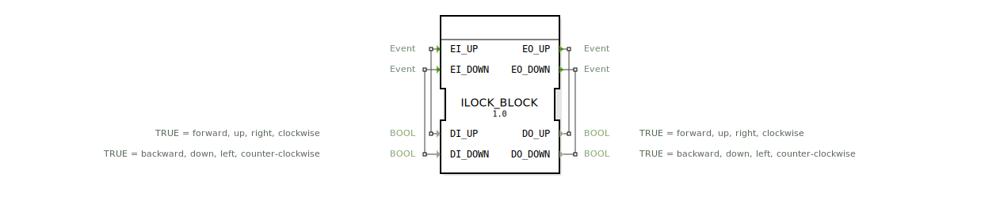

# ILOCK_BLOCK

* * * * * * * * * *
## Einleitung
Der Funktionsblock **ILOCK_BLOCK** realisiert eine Verriegelung (Interlock) zwischen zwei gegenläufigen Signalen. Er priorisiert das zuerst eintreffende aktive Signal und ignoriert alle nachfolgenden widersprüchlichen Signale, bis das initiale Signal wieder freigegeben wird. Dadurch wird sichergestellt, dass sich zwei gegensätzliche Aktionen (z. B. Auf/Ab, Rechts/Links) niemals gleichzeitig aktivieren.

## Schnittstellenstruktur
### **Ereignis-Eingänge**
| Ereignis | Mit Variable | Beschreibung |
|----------|--------------|--------------|
| `EI_UP`  | `DI_UP`      | Ereignis zum Setzen der UP-Richtung |
| `EI_DOWN`| `DI_DOWN`    | Ereignis zum Setzen der DOWN-Richtung |

### **Ereignis-Ausgänge**
| Ereignis  | Mit Variable | Beschreibung |
|-----------|--------------|--------------|
| `EO_UP`   | `DO_UP`      | Wird ausgelöst, wenn die UP-Richtung aktiv geschaltet wird oder wenn sie deaktiviert wird |
| `EO_DOWN` | `DO_DOWN`    | Wird ausgelöst, wenn die DOWN-Richtung aktiv geschaltet wird oder wenn sie deaktiviert wird |

### **Daten-Eingänge**
| Variable   | Typ  | Kommentar |
|------------|------|-----------|
| `DI_UP`    | BOOL | TRUE = vorwärts, aufwärts, rechts, im Uhrzeigersinn |
| `DI_DOWN`  | BOOL | TRUE = rückwärts, abwärts, links, gegen den Uhrzeigersinn |

### **Daten-Ausgänge**
| Variable   | Typ  | Kommentar |
|------------|------|-----------|
| `DO_UP`    | BOOL | TRUE = vorwärts, aufwärts, rechts, im Uhrzeigersinn |
| `DO_DOWN`  | BOOL | TRUE = rückwärts, abwärts, links, gegen den Uhrzeigersinn |

### **Adapter**
Keine.

## Funktionsweise
Der Baustein besitzt zwei Aktivierungszustände (UP, DOWN) und zwei Zwischenzustände (UP_STOP, DOWN_STOP) zum Abmelden. Die Steuerung erfolgt ausschließlich über die Ereignis-Eingänge in Verbindung mit den Daten-Eingängen.

- **In den Ruhezustand (STOP)** werden beide Ausgänge auf FALSE gesetzt.
- **UP-Aktivierung:** Trifft das Ereignis `EI_UP` mit `DI_UP = TRUE` ein, wechselt der Zustand nach **UP**. Dabei werden `DO_UP = TRUE` und `DO_DOWN = FALSE` gesetzt und `EO_UP` wird ausgegeben.
- **DOWN-Aktivierung:** Trifft das Ereignis `EI_DOWN` mit `DI_DOWN = TRUE` ein, wechselt der Zustand nach **DOWN**. Dabei werden `DO_UP = FALSE` und `DO_DOWN = TRUE` gesetzt und `EO_DOWN` wird ausgegeben.
- **Stilllegung eines aktiven Zustands:**
  - Im Zustand UP wird ein erneutes `EI_UP` mit `DI_UP = FALSE` erwartet (Freigabe). Danach wechselt der Zustand über **UP_STOP** sofort zurück zu STOP; dabei wird `EO_UP` noch einmal ausgelöst (Signalisierung des Stopps).
  - Analog wird im Zustand DOWN ein erneutes `EI_DOWN` mit `DI_DOWN = FALSE` benötigt, um über **DOWN_STOP** zurück zu STOP zu gelangen; dabei wird `EO_DOWN` ausgegeben.
- **Ignorieren widersprüchlicher Signale:** Solange der Baustein aktiv ist (UP oder DOWN), werden Ereignisse der entgegengesetzten Richtung vollständig ignoriert (keine Zustandsänderung). Dadurch wird die Priorität des ersten Signals gewahrt.

## Technische Besonderheiten
- Die Zustandsübergänge erfolgen ereignisgesteuert und sofort (keine Verzögerungen).
- Im Gegensatz zu einem einfachen Set/Reset-Baustein wird die zweite Eingangsrichtung während der Verriegelung nicht akzeptiert; die Verriegelung kann nur durch das ursprüngliche Ereignis selbst aufgehoben werden.
- Alle Ausgänge werden nach einem Stopp wieder auf FALSE gesetzt.

## Zustandsübersicht
| Zustand      | Beschreibung                                                                                                                                 |
|--------------|------------------------------------------------------------------------------------------------------------------------------------------------|
| **STOP**     | Ruhezustand. Beide Ausgänge FALSE. Warte auf Aktivierung.                                                                                     |
| **UP**       | UP-Richtung aktiv. DO_UP = TRUE, DO_DOWN = FALSE. Warte auf Freigabe durch `EI_UP` mit `DI_UP = FALSE`.                                       |
| **DOWN**     | DOWN-Richtung aktiv. DO_UP = FALSE, DO_DOWN = TRUE. Warte auf Freigabe durch `EI_DOWN` mit `DI_DOWN = FALSE`.                                 |
| **UP_STOP**  | Zwischenzustand nach Freigabe von UP. Führt sofort den STOP-Algorithmus aus, sendet `EO_UP` und wechselt zurück zu STOP.                      |
| **DOWN_STOP**| Zwischenzustand nach Freigabe von DOWN. Führt sofort den STOP-Algorithmus aus, sendet `EO_DOWN` und wechselt zurück zu STOP.                  |

**Übergangsmatrix (vereinfacht):**
- `STOP → UP` : `EI_UP` & `DI_UP = TRUE`
- `STOP → DOWN` : `EI_DOWN` & `DI_DOWN = TRUE`
- `UP → UP_STOP` : `EI_UP` & `DI_UP = FALSE`
- `DOWN → DOWN_STOP` : `EI_DOWN` & `DI_DOWN = FALSE`
- `UP_STOP → STOP` : immer (sofort)
- `DOWN_STOP → STOP` : immer (sofort)

## Anwendungsszenarien
- **Motorsteuerung (z. B. Hebebühne, Kran):** Verhindert gleichzeitiges Fahren in entgegengesetzte Richtungen.
- **Ventilsteuerung:** Schützt vor gleichzeitigem Öffnen und Schließen eines Prozessventils.
- **Richtungsverriegelung in Förderanlagen:** Sorgt dafür, dass ein Band nur eine Drehrichtung gleichzeitig aktiviert.
- **Sicherheitskritische Steuerungen:** Erzwingt eine eindeutige, priorisierte Signalfolge.

## Vergleich mit ähnlichen Bausteinen
- **Set/Reset (SR/R-SR):** Erlaubt das gleichzeitige Setzen beider Richtungen, was zu undefinierten Zuständen führen kann. Der ILOCK_BLOCK verhindert dies durch strikte Verriegelung.
- **Zustandsautomat (z. B. mit mehreren Zuständen):** Bietet mehr Flexibilität, erfordert aber manuelle Implementierung der Priorisierungslogik. Der ILOCK_BLOCK kapselt diese Logik direkt.
- **Einfacher Interlock über UND-Gatter:** Reine Signalverknüpfung ignoriert die zeitliche Reihenfolge. Der ILOCK_BLOCK reagiert ereignisgesteuert auf die erste gültige Aktivierung.

## Fazit
Der **ILOCK_BLOCK** ist ein spezialisierter Funktionsbaustein für Verriegelungsanwendungen mit Priorisierung des ersten aktiven Eingangs. Durch seine klare Zustandsmaschine und die ereignisgesteuerte Verarbeitung eignet er sich besonders für zeitkritische und sicherheitsrelevante Steuerungen, bei denen widersprüchliche Signale streng ausgeschlossen werden müssen. Er bietet eine robuste Alternative zu klassischen Set/Reset-Logiken und reduziert den Implementierungsaufwand erheblich.