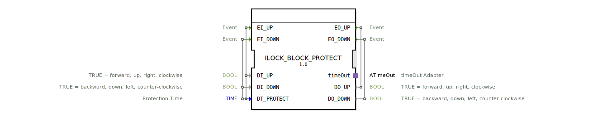

# ILOCK_BLOCK_PROTECT

* * * * * * * * * *
## Einleitung

Der Funktionsblock `ILOCK_BLOCK_PROTECT` realisiert eine interlock-geschützte Richtungssteuerung mit einstellbarer Totzeit. Sobald ein aktiver Eingang (z. B. `EI_UP` mit `DI_UP = TRUE`) erkannt wird, wird dieser priorisiert und alle gegensätzlichen Signale werden solange ignoriert, bis der aktive Eingang zurückgesetzt wird. Nach dem Rücksetzen läuft eine konfigurierbare Schutzzeit (`DT_PROTECT`) ab, bevor eine neue Richtung aktiviert werden kann. Dadurch werden unerwünschte Richtungswechsel oder Kurzschlusszustände sicher verhindert.

## Schnittstellenstruktur

### **Ereignis-Eingänge**

| Ereignis | mit Variablen | Beschreibung |
|----------|---------------|--------------|
| `EI_UP`  | `DI_UP`, `DT_PROTECT` | Ereignis zur Aktivierung der Vorwärts-Richtung |
| `EI_DOWN`| `DI_DOWN`, `DT_PROTECT` | Ereignis zur Aktivierung der Rückwärts-Richtung |

### **Ereignis-Ausgänge**

| Ereignis | mit Variablen | Beschreibung |
|----------|---------------|--------------|
| `EO_UP`  | `DO_UP`       | Quittierung der aktiven Vorwärts-Richtung |
| `EO_DOWN`| `DO_DOWN`     | Quittierung der aktiven Rückwärts-Richtung |

### **Daten-Eingänge**

| Variable     | Typ    | Initialwert | Beschreibung |
|--------------|--------|-------------|--------------|
| `DI_UP`      | BOOL   | –           | `TRUE` = vorwärts, aufwärts, rechts, im Uhrzeigersinn |
| `DI_DOWN`    | BOOL   | –           | `TRUE` = rückwärts, abwärts, links, gegen Uhrzeigersinn |
| `DT_PROTECT` | TIME   | `T#50ms`    | Schutzzeit (Totzeit) nach Rücksetzen einer Richtung |

### **Daten-Ausgänge**

| Variable  | Typ  | Beschreibung |
|-----------|------|--------------|
| `DO_UP`   | BOOL | `TRUE` = Vorwärts-Richtung aktiv |
| `DO_DOWN` | BOOL | `TRUE` = Rückwärts-Richtung aktiv |

### **Adapter**

| Adapter   | Typ                            | Beschreibung |
|-----------|--------------------------------|--------------|
| `timeOut` | `iec61499::events::ATimeOut`   | Adapter für die zeitliche Steuerung der Totzeit |

## Funktionsweise

Der Baustein arbeitet nach dem Prinzip der **ersten Priorität**:

1. **Initialzustand (`STOP`)**  
   Beide Ausgänge sind `FALSE`. Wird ein Ereignis mit gültiger Bedingung empfangen (z. B. `EI_UP` bei `DI_UP = TRUE`), wechselt der Zustand in die entsprechende Richtung (`UP` oder `DOWN`).

2. **Richtungszustände (`UP` / `DOWN`)**  
   Der zugehörige Ausgang (`DO_UP` oder `DO_DOWN`) wird auf `TRUE` gesetzt, der andere auf `FALSE`.  
   Solange der aktive Eingang bestehen bleibt, werden neue Ereignisse ignoriert (insbesondere gegensätzliche).  
   Ein neues Ereignis mit demselben Eingang wird nur dann verarbeitet, wenn der Eingang zuvor auf `FALSE` gefallen ist (negative Flanke) – siehe `UP_STOP`/`DOWN_STOP`.

3. **Rückstellen in die Schutzphase (`UP_STOP` / `DOWN_STOP`)**  
   Wird der aktive Eingang zurückgesetzt (z. B. `DI_UP` von `TRUE` auf `FALSE`), so wird der Ausgang sofort auf `FALSE` gesetzt und der Timer `timeOut` gestartet. Die Totzeit `DT_PROTECT` beginnt zu laufen.

4. **Auswertungszustand (`EVAL`)**  
   Nach Ablauf der Totzeit verlässt der Baustein die Schutzphase und geht in den `EVAL`-Zustand. Hier wird anhand der aktuellen Eingänge entschieden:
   - `DI_UP = TRUE` und `DI_DOWN = FALSE` → Übergang nach `UP`
   - `DI_DOWN = TRUE` und `DI_UP = FALSE` → Übergang nach `DOWN`
   - Beide `FALSE` oder beide `TRUE` → Rückkehr in `STOP`

**Wichtig:** Solange im Zustand `UP`/`DOWN` ein neues Ereignis eintrifft, während der zugehörige Eingang noch `TRUE` ist, wird dieses Ereignis ignoriert (kein Zustandswechsel). Erst bei negativer Flanke wird die Stopp-Phase eingeleitet.

## Technische Besonderheiten

- **Interner Zeitgeber** über den Adapter `timeOut` (Typ `ATimeOut`) – die Schutzzeit wird durch jeden Zustandsübergang, der eine Richtung deaktiviert, gestartet.
- **Keine gleichzeitigen Ausgänge** – zu keiner Zeit sind `DO_UP` und `DO_DOWN` gleichzeitig `TRUE`. Im `EVAL`-Zustand sind beide Ausgänge `FALSE`.
- **Konfigurierbare Totzeit** über den Eingang `DT_PROTECT` (Werksvorgabe 50 ms).
- **Kompakte Implementierung** als Basic Function Block mit endlicher Zustandsmaschine (6 Zustände).
- Die Verriegelung verhindert nicht nur gegensätzliche Kommandos, sondern erzwingt auch eine Mindestpause zwischen zwei Richtungswechseln.

## Zustandsübersicht

| Zustand      | Beschreibung |
|--------------|--------------|
| `STOP`       | Ruhezustand: beide Ausgänge `FALSE`, warten auf erstes gültiges Ereignis |
| `UP`         | Vorwärts-Richtung aktiv: `DO_UP = TRUE`, `DO_DOWN = FALSE` |
| `DOWN`       | Rückwärts-Richtung aktiv: `DO_DOWN = TRUE`, `DO_UP = FALSE` |
| `UP_STOP`    | Schutzphase nach Rücksetzen der Vorwärts-Richtung: `DO_UP` auf `FALSE`, Timer läuft |
| `DOWN_STOP`  | Schutzphase nach Rücksetzen der Rückwärts-Richtung: `DO_DOWN` auf `FALSE`, Timer läuft |
| `EVAL`       | Auswertungszustand nach Timerablauf: Entscheidung über nächste Richtung oder Rückkehr zu `STOP` |

## Anwendungsszenarien

- **Richtungssteuerung von Motoren** (z. B. Förderbänder, Hubwerke, Drehtore) – verhindert gleichzeitige Ansteuerung in beide Richtungen und erzwungene Totzeit für den mechanischen Richtungswechsel.
- **Verriegelung von Ventilen oder Klappen** – z. B. Auf/Zu-Steuerung mit Schutz vor schnellem Wechsel, um mechanische Belastung zu vermeiden.
- **Sicherheitsgerichtete Steuerungen** – als Teil einer einfachen Interlock-Logik, wenn kein sicherheitszertifizierter Baustein erforderlich ist.
- **Steuerung von Zuführungen** in der Agrartechnik (siehe Copyright HR Agrartechnik GmbH) oder in der Fördertechnik.

## Vergleich mit ähnlichen Bausteinen

| Baustein | Eigenschaften |
|----------|---------------|
| **SR-Flipflop** | Einfache Set/Reset-Logik, keine Totzeit, kein Schutz gegen gleichzeitige Signale |
| **ILOCK_BLOCK_PROTECT** | Priorisierung des ersten aktiven Eingangs, Totzeit nach jedem Richtungswechsel, beide Ausgänge nie gleichzeitig `TRUE` |
| **Interlock-Baustein ohne Timer** | Nur Sperrlogik, sofortige Umschaltung möglich, keine Schutzzeit |
| **RS-Sperre mit Zeitverzögerung** | Ähnlich, aber oft weniger konfigurierbar und ereignisgesteuert |

Der `ILOCK_BLOCK_PROTECT` bietet eine integrierte, konfigurierbare Totzeit und ist speziell für ereignisgesteuerte Systeme nach IEC 61499 optimiert.

## Fazit

Der `ILOCK_BLOCK_PROTECT` eignet sich ideal für Anwendungen, die eine zuverlässige Richtungsverriegelung mit einstellbarer Schutzzeit erfordern. Durch die klare Zustandsmaschine und die Nutzung des Standard-`ATimeOut`-Adapters ist er einfach in größere Steuerungsprojekte integrierbar. Die Priorisierung des ersten aktiven Eingangs sorgt für deterministisches Verhalten, und die erzwungene Totzeit schützt sowohl Mechanik als auch Steuerungslogik vor unerwünschten Zuständen.