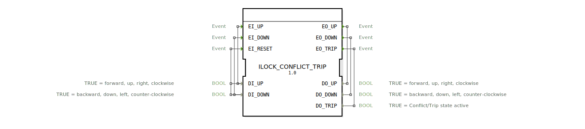

# ILOCK_CONFLICT_TRIP

* * * * * * * * * *
## Einleitung

Der Funktionsblock **ILOCK_CONFLICT_TRIP** dient der **priorisierten Verriegelung** mit **Konflikterkennung**. Er wertet zwei gegensätzliche Binärsignale (z. B. „Vor“ und „Zurück“) aus und gibt nur einen der beiden Befehle aktiv weiter, solange diese nicht gleichzeitig anliegen. Bei gleichzeitiger Aktivität beider Eingänge wird ein **Trip-Zustand** (Fehler/Sperre) ausgelöst, der nur durch einen expliziten Reset (bei inaktiven Eingängen) aufgehoben werden kann. Der Baustein ist speziell für sicherheitskritische Anwendungen ausgelegt, bei denen widersprüchliche Steuerbefehle zuverlässig erkannt werden müssen.

## Schnittstellenstruktur

### **Ereignis-Eingänge**

| Ereignis | Beschreibung |
|----------|--------------|
| **EI_UP**   | Ereignis zur Verarbeitung einer „Aufwärts“-Anforderung (mit Daten `DI_UP`) |
| **EI_DOWN** | Ereignis zur Verarbeitung einer „Abwärts“-Anforderung (mit Daten `DI_DOWN`) |
| **EI_RESET** | Ereignis zum Zurücksetzen des Trip-Zustands (liest beide Dateneingänge) |

### **Ereignis-Ausgänge**

| Ereignis | Beschreibung |
|----------|--------------|
| **EO_UP**   | Bestätigt die Ausgabe des „Aufwärts“-Befehls (bei aktivem Zustand UP) |
| **EO_DOWN** | Bestätigt die Ausgabe des „Abwärts“-Befehls (bei aktivem Zustand DOWN) |
| **EO_TRIP** | Zeigt an, dass ein Trip-Zustand vorliegt (bei aktivem Zustand TRIP) |

### **Daten-Eingänge**

| Name     | Typ    | Beschreibung |
|----------|--------|--------------|
| **DI_UP**   | BOOL | TRUE = vorwärts, aufwärts, rechts, im Uhrzeigersinn |
| **DI_DOWN** | BOOL | TRUE = rückwärts, abwärts, links, gegen den Uhrzeigersinn |

### **Daten-Ausgänge**

| Name      | Typ    | Beschreibung |
|-----------|--------|--------------|
| **DO_UP**   | BOOL | TRUE = Ausgabe „Aufwärts“ aktiv |
| **DO_DOWN** | BOOL | TRUE = Ausgabe „Abwärts“ aktiv |
| **DO_TRIP** | BOOL | TRUE = Konflikt/Trip-Zustand aktiv |

### **Adapter**

Keine Adapter vorhanden.

## Funktionsweise

Der Funktionsblock besitzt vier Betriebszustände: **STOP**, **UP**, **DOWN** und **TRIP**.

- **STOP (Ruhezustand):** Beide Datenausgänge sind FALSE.  
  - Bei `EI_UP` mit `DI_UP = TRUE` und `DI_DOWN = FALSE` wechselt der Baustein in den Zustand **UP**.  
  - Bei `EI_DOWN` mit `DI_DOWN = TRUE` und `DI_UP = FALSE` wechselt er in **DOWN**.  
  - Bei `EI_UP` oder `EI_DOWN`, wenn beide Dateneingänge TRUE sind, wechselt er direkt in **TRIP** (Konflikt).

- **UP (Aufwärts aktiv):** `DO_UP = TRUE`, `DO_DOWN = FALSE`, `DO_TRIP = FALSE`.  
  - Bei einem erneuten `EI_UP`, wenn `DI_UP = FALSE` wird, wechselt er zurück nach **STOP** (Deaktivierung).  
  - Bei `EI_DOWN`, wenn `DI_DOWN = TRUE` wird, wechselt er in **TRIP** (während der Fahrt wird eine entgegengesetzte Anforderung erkannt).

- **DOWN (Abwärts aktiv):** `DO_DOWN = TRUE`, `DO_UP = FALSE`, `DO_TRIP = FALSE`.  
  - Bei erneutem `EI_DOWN`, wenn `DI_DOWN = FALSE` wird, wechselt er nach **STOP**.  
  - Bei `EI_UP`, wenn `DI_UP = TRUE` wird, wechselt er in **TRIP**.

- **TRIP (Fehler/Sperre):** `DO_TRIP = TRUE`, beide Richtungsausgänge FALSE.  
  - **Einzige Möglichkeit, den Trip zu verlassen:** Ein `EI_RESET`-Ereignis, bei dem `DI_UP = FALSE` und `DI_DOWN = FALSE` sind. Dann geht es zurück in **STOP**.

**Priorisierungsmechanismus:** Der zuerst eintreffende gültige Eingang wird bedient, bis er zurückgenommen wird oder ein Konflikt mit dem anderen Eingang auftritt. Gleichzeitige TRUE-Werte auf beiden Dateneingängen führen sofort in den Trip-Zustand.

## Technische Besonderheiten

- **Reset nur im Trip erlaubt:** Der Baustein kann nur aus dem TRIP-Zustand heraus durch `EI_RESET` in den STOP-Zustand zurückgesetzt werden. Ein Reset während der Normalzustände (UP/DOWN/STOP) ist wirkungslos.
- **Bedingungen für Trip-Übergänge:** 
  - Aus STOP: `(EI_UP UND DI_UP UND DI_DOWN)` ODER `(EI_DOWN UND DI_UP UND DI_DOWN)`
  - Aus UP: `(EI_DOWN UND DI_DOWN)`
  - Aus DOWN: `(EI_UP UND DI_UP)`
- **Quittierung von Ereignissen:** Die Ereignisausgänge werden **immer** gemeinsam mit den Datenausgängen ausgegeben (siehe `With`-Verknüpfungen), sodass der Aufrufer den neuen Zustand sofort abgreifen kann.
- **Verwendung von 4diac (IEC 61499):** Der FB ist als Basic Function Block mit eigenem ECC (Execution Control Chart) realisiert.

## Zustandsübersicht

| Zustand | DO_UP | DO_DOWN | DO_TRIP | Beschreibung |
|---------|-------|---------|---------|--------------|
| **STOP** | FALSE | FALSE | FALSE | Ruhezustand, keine Richtung aktiv |
| **UP**   | TRUE  | FALSE | FALSE | Aufwärts-Richtung aktiv |
| **DOWN** | FALSE | TRUE  | FALSE | Abwärts-Richtung aktiv |
| **TRIP** | FALSE | FALSE | TRUE  | Konflikt/Sperre aktiv |

## Anwendungsszenarien

- **Motorsteuerung für Lineareinheiten oder Drehantriebe:** Verhinderung gleichzeitiger Vor-/Rücklauf-Befehle.
- **Hydraulikventil-Steuerung:** Absicherung gegen widersprüchliche Schaltbefehle (z. B. Heben und Senken gleichzeitig).
- **Sicherheitsverriegelung in der Automatisierung:** Erkennung von Fehlbedienungen und Auslösen eines sicheren Stopps.
- **SPS-Nachbildung in verteilten Systemen:** Als Teil einer Steuerungslogik, die widersprüchliche Zustände vermeiden muss.

## Vergleich mit ähnlichen Bausteinen

- **SR-Latch / Flip-Flop:** Ein einfacher SR-Latch speichert einen Zustand, erkennt aber keine Konflikte bei gleichzeitigen „Set“- und „Reset“-Signalen. ILOCK_CONFLICT_TRIP geht in den Trip-Zustand, anstatt einen undefinierten Zustand zu erzeugen.
- **F_TRIG / R_TRIG (Flankenerkennung):** Diese Bausteine erkennen nur Signalflanken, besitzen jedoch keine Verriegelungslogik.
- **Standard Interlock-Bausteine (z. B. aus IEC 61131-3):** Viele bieten eine einfache gegenseitige Verriegelung (z. B. Motorverriegelung), aber keinen dedizierten Trip-Zustand mit Reset-Erfordernis. Der ILOCK_CONFLICT_TRIP ist robuster bei Fehlersituationen.

## Fazit

Der **ILOCK_CONFLICT_TRIP** ist ein kompakter, sicherheitsorientierter Funktionsblock für die robuste Verriegelung zweier gegensätzlicher Stellsignale. Er bietet eine klare Priorisierung des ersten aktivierten Eingangs, erkennt Konflikte durch gleichzeitige Aktivität und erzwingt einen expliziten Reset nach einem Fehlerfall. Seine Zustandsmaschine ist einfach nachvollziehbar und eignet sich hervorragend für Anwendungen, in denen widersprüchliche Steuerbefehle zuverlässig abgefangen werden müssen – z. B. in der Maschinen- oder Fahrzeugsteuerung.