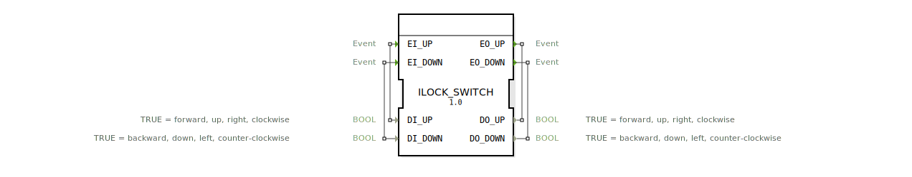

# ILOCK_SWITCH

* * * * * * * * * *
## Einleitung

Der Funktionsbaustein **ILOCK_SWITCH** dient als prioritätsgesteuerte Weiche mit Verriegelungsfunktion. Er wertet zwei Ereignissignale (**EI_UP** und **EI_DOWN**) in Kombination mit zugehörigen booleschen Datenwerten aus und setzt die Ausgänge **DO_UP** und **DO_DOWN** entsprechend. Dabei wird stets der zuletzt aktive Eingang priorisiert – eine gleichzeitige Aktivierung beider Ausgänge ist ausgeschlossen. Die Logik verhindert Oszillationen und sorgt für einen definierten Zustand auch bei ungültigen oder widersprüchlichen Eingangsbelegungen.

## Schnittstellenstruktur

### **Ereignis-Eingänge**

| Ereignis | mit Daten | Beschreibung |
|----------|-----------|--------------|
| **EI_UP** | DI_UP | Ereignis zur Anforderung der Aufwärts‑/Vorwärts‑Richtung. |
| **EI_DOWN** | DI_DOWN | Ereignis zur Anforderung der Abwärts‑/Rückwärts‑Richtung. |

### **Ereignis-Ausgänge**

| Ereignis | mit Daten | Beschreibung |
|----------|-----------|--------------|
| **EO_UP** | DO_UP | Wird bei Aktivierung der Aufwärts‑Richtung oder beim Verlassen des UP‑Zustands getriggert. |
| **EO_DOWN** | DO_DOWN | Wird bei Aktivierung der Abwärts‑Richtung oder beim Verlassen des DOWN‑Zustands getriggert. |

### **Daten-Eingänge**

| Name | Typ | Kommentar |
|------|-----|-----------|
| **DI_UP** | BOOL | TRUE = vorwärts, aufwärts, rechts, im Uhrzeigersinn |
| **DI_DOWN** | BOOL | TRUE = rückwärts, abwärts, links, gegen Uhrzeigersinn |

### **Daten-Ausgänge**

| Name | Typ | Kommentar |
|------|-----|-----------|
| **DO_UP** | BOOL | TRUE = vorwärts, aufwärts, rechts, im Uhrzeigersinn |
| **DO_DOWN** | BOOL | TRUE = rückwärts, abwärts, links, gegen Uhrzeigersinn |

### **Adapter**
Keine.

## Funktionsweise

Der Baustein realisiert einen endlichen Automaten mit sechs Zuständen. Die grundlegende Idee: **Der zuletzt eingetroffene gültige Befehl setzt den Ausgangszustand**. Dabei wird ein Befehl nur dann als gültig betrachtet, wenn der zugehörige boolesche Datenwert **TRUE** ist.

- **STOP** (Ruhezustand): Beide Ausgänge sind **FALSE**.
- **UP**: DO_UP = TRUE, DO_DOWN = FALSE.  
  Wird erreicht, wenn im STOP‑Zustand **EI_UP** mit **DI_UP = TRUE** eintritt.
- **DOWN**: DO_UP = FALSE, DO_DOWN = TRUE.  
  Wird erreicht, wenn im STOP‑Zustand **EI_DOWN** mit **DI_DOWN = TRUE** eintritt.
- **UP_STOP**: Zwischenzustand, der eingenommen wird, wenn während des UP‑Zustands ein **EI_UP** eintritt, aber **DI_UP = FALSE** (und auch **DI_DOWN = FALSE**).  
  In UP_STOP werden beide Ausgänge auf FALSE gesetzt und anschließend sofort nach STOP zurückgegangen.
- **DOWN_STOP**: Analog zu UP_STOP für den DOWN‑Zustand bei **EI_DOWN** mit **DI_DOWN = FALSE**.
- Direkte Umschaltungen sind möglich:  
  Von **UP** → **DOWN**, wenn **EI_DOWN** mit **DI_DOWN = TRUE** eintrifft oder **EI_UP** mit **DI_UP = FALSE** und **DI_DOWN = TRUE** (implizite Anforderung der Gegenrichtung).  
  Von **DOWN** → **UP** analog.

Durch diese Logik wird sichergestellt, dass stets nur eine Richtung aktiv ist und bei ungültigen Signalen (FALSE-Werte) der Baustein sauber in den Ruhezustand zurückfällt.

## Technische Besonderheiten

- **Verriegelung durch Zustandsautomaten**: Keine Möglichkeit, beide Ausgänge gleichzeitig auf TRUE zu setzen – selbst bei zeitgleichen Ereignissen wird sequenziell geschaltet.
- **Zwischenzustände (UP_STOP, DOWN_STOP)**: Diese vermeiden unerwünschtes Flackern der Ausgänge, indem sie bei ungültigen Signalen sofort die Ausgänge zurücksetzen und nach STOP übergehen.
- **Implizite Umschaltung**: Ein Ereignis, dessen Datenwert die Gegenrichtung anfordert (z. B. EI_UP mit DI_UP=FALSE und DI_DOWN=TRUE), bewirkt direkt den Richtungswechsel, ohne dass ein separates EI_DOWN‑Ereignis nötig ist.

## Zustandsübersicht

| Zustand | DO_UP | DO_DOWN | Erreicht durch |
|---------|-------|---------|----------------|
| STOP | FALSE | FALSE | Start / nach UP_STOP und DOWN_STOP |
| UP | TRUE | FALSE | EI_UP mit DI_UP=TRUE aus STOP oder DOWN |
| DOWN | FALSE | TRUE | EI_DOWN mit DI_DOWN=TRUE aus STOP oder UP |
| UP_STOP | FALSE | FALSE | EI_UP mit DI_UP=FALSE und DI_DOWN=FALSE im Zustand UP |
| DOWN_STOP | FALSE | FALSE | EI_DOWN mit DI_DOWN=FALSE und DI_UP=FALSE im Zustand DOWN |

Die Übergänge zwischen den Zuständen erfolgen immer über ein eingehendes Ereignis und die Auswertung der aktuellen Datenwerte.

## Anwendungsszenarien

- **Motorsteuerung für Lineartriebe, Schwenkarme oder Hubvorrichtungen**, bei denen eine gleichzeitige Bewegung in beide Richtungen mechanisch oder sicherheitstechnisch ausgeschlossen werden muss.
- **Verriegelung von Ventilantrieben** (Öffnen / Schließen) mit Rückmeldung über Endschalter.
- **Bedienschnittstellen mit Tastern für „Auf“ und „Ab“**, wobei der letzte Tastendruck Vorrang hat und eine dauerhafte Blockade vermieden wird.

## Vergleich mit ähnlichen Bausteinen

- Ein einfaches **AND- / OR-Gatter** kann keine Verriegelung realisieren und würde bei gleichzeitigen TRUE-Signalen beide Ausgänge aktivieren.
- Ein **RS‑Flipflop** speichert einen Zustand, erlaubt aber unter Umständen beide Setz‑/Rücksetz-Eingänge gleichzeitig (metastabil). ILOCK_SWITCH vermeidet dies durch die starre Übergangslogik.
- Ein **Mux** würde nur einen Datenwert durchschalten, kann aber keine ereignisgesteuerte Priorisierung mit Zwischenzuständen abbilden. ILOCK_SWITCH bietet eine speziell für Antriebsverriegelungen optimierte Lösung.

## Fazit

Der **ILOCK_SWITCH** ist ein robuster, ereignisgesteuerter Funktionsbaustein zur verriegelten Richtungsansteuerung. Durch die Kombination von Zustandsautomat, Datenabhängigkeit und expliziten Zwischenzuständen werden typische Probleme wie gleichzeitige Aktivierung beider Ausgänge oder Oszillationen zuverlässig ausgeschlossen. Er eignet sich besonders für sicherheitskritische Steuerungen in der Automatisierungstechnik, bei denen eine eindeutige und rücksetzbare Vorranglogik gefordert ist.