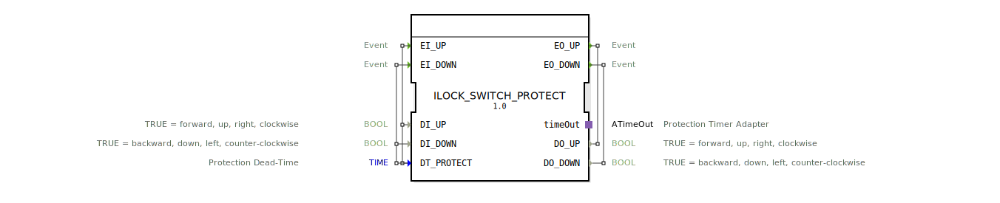

# ILOCK_SWITCH_PROTECT

* * * * * * * * * *
## Einleitung

Der Funktionsblock **ILOCK_SWITCH_PROTECT** realisiert eine priorisierte Verriegelung (Interlock) zwischen zwei Schaltrichtungen – z. B. Auf/Ab, Vor/Rück oder Rechts/Links. Er besitzt eine konfigurierbare Schutzverzögerung (Dead‑Time), die ein sofortiges erneutes Umschalten nach einer Richtungsänderung verhindert. Der Baustein wertet die beiden binären Eingänge aus und gibt nur dann ein Schaltsignal aus, wenn der zuletzt aktive Eingang nach Ablauf der Schutzzeit noch immer ansteht. Dies verhindert kurzzeitige Pendelzustände und schützt angeschlossene Aktoren.

## Schnittstellenstruktur

### **Ereignis‑Eingänge**

| Name    | Mit Parametern                 | Beschreibung                                         |
|---------|--------------------------------|------------------------------------------------------|
| EI_UP   | `DI_UP`, `DT_PROTECT`          | Ereignis zum Anfordern der Richtung „Auf“            |
| EI_DOWN | `DI_DOWN`, `DT_PROTECT`        | Ereignis zum Anfordern der Richtung „Ab“             |

### **Ereignis‑Ausgänge**

| Name    | Mit Parametern | Beschreibung                                         |
|---------|----------------|------------------------------------------------------|
| EO_UP   | `DO_UP`        | Bestätigung, dass die Richtung „Auf“ aktiviert wurde |
| EO_DOWN | `DO_DOWN`      | Bestätigung, dass die Richtung „Ab“ aktiviert wurde  |

### **Daten‑Eingänge**

| Name       | Datentyp | Initialwert | Beschreibung                                          |
|------------|----------|-------------|-------------------------------------------------------|
| DI_UP      | BOOL     | –           | TRUE = vorwärts, auf, rechts, im Uhrzeigersinn        |
| DI_DOWN    | BOOL     | –           | TRUE = rückwärts, ab, links, gegen Uhrzeigersinn      |
| DT_PROTECT | TIME     | T#50ms      | Schutzverzögerung (Totzeit) vor einem Richtungswechsel|

### **Daten‑Ausgänge**

| Name    | Datentyp | Beschreibung                                          |
|---------|----------|-------------------------------------------------------|
| DO_UP   | BOOL     | TRUE = Ausgang für Richtung „Auf“ aktiv               |
| DO_DOWN | BOOL     | TRUE = Ausgang für Richtung „Ab“ aktiv                |

### **Adapter**

| Name    | Typ                            | Beschreibung                                  |
|---------|--------------------------------|-----------------------------------------------|
| timeOut | `iec61499::events::ATimeOut`   | Adapter zur Realisierung der Schutzverzögerung |

## Funktionsweise

Der Baustein arbeitet als endlicher Automat mit fünf Zuständen:

1. **STOP** – Ruhezustand. Beide Ausgänge sind FALSE.  
   - Bei einem Ereignis mit gültigem Eingang (`EI_UP[DI_UP]` oder `EI_DOWN[DI_DOWN]`) wird direkt in den entsprechenden Zustand geschaltet.

2. **UP** – Richtung „Auf“ ist aktiv. `DO_UP = TRUE`, `DO_DOWN = FALSE`.  
   - Ein erneutes `EI_UP` mit inaktiver Anforderung (`NOT DI_UP`) oder ein `EI_DOWN` mit aktiver Anforderung (`DI_DOWN`) führt in den Schutz‑Zustand.

3. **DOWN** – Richtung „Ab“ ist aktiv. `DO_UP = FALSE`, `DO_DOWN = TRUE`.  
   - Analog: `EI_DOWN[NOT DI_DOWN]` oder `EI_UP[DI_UP]` leitet den Schutz ein.

4. **PROTECT** – Schutz‑Zustand. Beide Ausgänge werden sofort zurückgesetzt (FALSE) und der Timer des Adapters `timeOut` wird gestartet.  
   - Erst nach Ablauf der konfigurierten Zeit (`DT_PROTECT`) wird in den Evaluierungs‑Zustand gewechselt.

5. **EVAL** – Evaluierung nach der Schutzzeit.  
   - Anhand der aktuellen Eingänge wird entschieden:  
     - `DI_UP AND NOT DI_DOWN` → **UP**  
     - `DI_DOWN AND NOT DI_UP` → **DOWN**  
     - `NOT DI_UP AND NOT DI_DOWN` → **STOP**  
     - `DI_UP AND DI_DOWN` (beide gleichzeitig aktiv) → erneut **PROTECT** (Ungültigkeits‑Fall)

Die Auslösung der Ereignisausgänge erfolgt zusammen mit dem jeweils ausgeführten Algorithmus. In den Zuständen UP, DOWN und PROTECT werden **beide** Ereignisausgänge (EO_UP und EO_DOWN) nacheinander gesendet – dies ist ein spezifisches Verhalten dieses Bausteins.

## Technische Besonderheiten

- **Adapterbasierte Timer‑Implementierung**: Die Schutzverzögerung wird über den standardisierten IEC 61499‑Adapter `ATimeOut` realisiert. Dadurch ist die Zeitsteuerung plattformunabhängig und kann in verschiedenen Laufzeitumgebungen genutzt werden.
- **Voreinstellung der Totzeit**: Die Zeit `DT_PROTECT` wird in den Algorithmen der Zustände UP, DOWN und STOP gesetzt, bevor der Timer ggf. gestartet wird. So ist sichergestellt, dass auch bei wiederholtem Wechsel in den Schutz‑Zustand stets die aktuelle Zeitkonfiguration gilt.
- **Sperre bei gleichzeitigen Anforderungen**: Wenn beide Eingänge (`DI_UP` und `DI_DOWN`) gleichzeitig TRUE sind, verharrt der Baustein im Schutz‑Zustand, bis die Anforderung aufgelöst ist.

## Zustandsübersicht

| Zustand  | Beschreibung                                                     | DO_UP | DO_DOWN | Ausgelöste Ereignisausgänge |
|----------|------------------------------------------------------------------|-------|---------|------------------------------|
| **STOP** | Warten auf gültige Anforderung; Ausgänge inaktiv                 | FALSE | FALSE   | –                            |
| **UP**   | Richtung Auf aktiv; Umschalten blockiert ohne Zwischenschritt    | TRUE  | FALSE   | EO_UP, EO_DOWN               |
| **DOWN** | Richtung Ab aktiv; Umschalten blockiert ohne Zwischenschritt     | FALSE | TRUE    | EO_DOWN, EO_UP               |
| **PROTECT** | Schutzverzögerung läuft; alle Ausgänge deaktiviert           | FALSE | FALSE   | EO_UP, EO_DOWN, timeOut.START|
| **EVAL** | Nach Ablauf der Schutzzeit werden die Eingänge ausgewertet       | –     | –       | – (Zustandswechsel)          |

## Anwendungsszenarien

- **Antriebssteuerung**: Verhindert schnelle Richtungswechsel bei Motoren, die eine mechanische oder elektrische Totzeit benötigen (z. B. Ventilatoren, Förderbänder, Schiebetore).
- **Ventil‑ oder Klappenansteuerung**: Stellt sicher, dass vor einem Richtungswechsel (Öffnen/Schließen) eine definierte Pause eingehalten wird, um Druckschläge oder Kavitation zu vermeiden.
- **Sicherheitsgerichtete Verriegelung**: Der Baustein kann verwendet werden, um konkurrierende Steuersignale zu entprellen und nur den zuletzt anstehenden Befehl nach einer festgelegten Haltezeit zu übernehmen.

## Vergleich mit ähnlichen Bausteinen

| Baustein                     | Besonderheit                                           |
|------------------------------|--------------------------------------------------------|
| **SR‑Latch**                 | Einfaches Set‑Reset‑Flipflop ohne Verzögerung          |
| **Interlock‑Baustein (einfach)** | Schaltet sofort um, keine Totzeit                    |
| **ILOCK_SWITCH_PROTECT**     | Konfigurierbare Schutzverzögerung, Auswertung nach der Verzögerung, Behandlung gleichzeitiger Anforderungen |

Gegenüber einfachen Verriegelungen bietet **ILOCK_SWITCH_PROTECT** eine kontrollierte Umschaltung, die insbesondere bei induktiven Lasten oder mechanisch trägen Systemen Vorteile bringt.

## Fazit

Der Funktionsblock **ILOCK_SWITCH_PROTECT** ist ein robuster IEC 61499‑Baustein für Anwendungen, die eine zeitverzögerte, priorisierte Umschaltung zwischen zwei Zuständen erfordern. Durch die einstellbare Totzeit, die Adapter‑basierte Timer‑Implementierung und die klare Zustandslogik eignet er sich besonders für industrielle Steuerungen, bei denen Zuverlässigkeit und Schutzmechanismen im Vordergrund stehen. Die gleichzeitige Aktivierung beider Ereignisausgänge in den Aktionszuständen sollte bei der Integration beachtet werden.