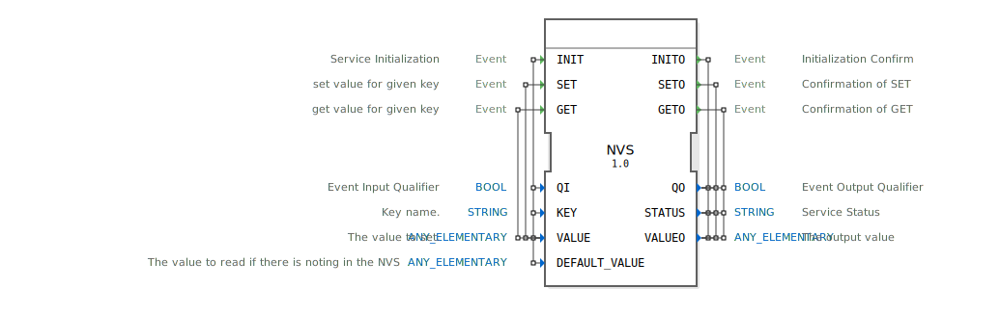

# NVS

```{index} single: NVS
```


* * * * * * * * * *
## Einleitung
Der NVS-Funktionsblock (Non-Volatile Storage) ermöglicht das persistente Speichern und Laden von Daten auf einem ESP32-Mikrocontroller. Er nutzt den nichtflüchtigen Speicher (NVS) des ESP32, um Werte unter einem definierten Schlüssel (Key) abzulegen und bei Bedarf wieder abzurufen. Dieser Baustein ist besonders für Anwendungen geeignet, bei denen Konfigurationsdaten, Kalibrierwerte oder Zustandsinformationen über einen Neustart des Geräts hinweg erhalten bleiben müssen.



## Schnittstellenstruktur

### **Ereignis-Eingänge**
*   **INIT**: Initialisiert den Funktionsblock. Löst den Lesevorgang des mit `KEY` angegebenen Wertes aus. Wenn kein Wert gespeichert ist, wird der `DEFAULT_VALUE` zurückgegeben.
*   **SET**: Speichert den an `VALUE` übergebenen Wert unter dem zuvor konfigurierten Schlüssel (`KEY`) im NVS.
*   **GET**: Liest den Wert, der unter dem konfigurierten Schlüssel (`KEY`) im NVS gespeichert ist.

### **Ereignis-Ausgänge**
*   **INITO**: Bestätigt die Ausführung der Initialisierung (INIT) und liefert das Ergebnis.
*   **SETO**: Bestätigt die Ausführung des Schreibvorgangs (SET) und liefert den Status.
*   **GETO**: Bestätigt die Ausführung des Lesevorgangs (GET) und liefert den gelesenen Wert.

### **Daten-Eingänge**
*   **QI** (BOOL): Qualifiziert den INIT-Ereigniseingang. Bei `TRUE` wird der Dienst aktiviert, bei `FALSE` deaktiviert.
*   **KEY** (STRING): Der eindeutige Schlüsselname, unter dem der Wert im NVS gespeichert oder von dem er gelesen wird. Dieser Wert muss während der INIT-Phase gesetzt sein.
*   **VALUE** (ANY_ELEMENTARY): Der zu speichernde Datensatz. Kann einen beliebigen elementaren Datentyp (z.B. BOOL, INT, REAL, STRING) annehmen.
*   **DEFAULT_VALUE** (ANY_ELEMENTARY): Der Standardwert, der bei einem Lesevorgang (INIT oder GET) zurückgegeben wird, wenn unter dem angegebenen Schlüssel noch kein Wert im NVS gespeichert ist.

### **Daten-Ausgänge**
*   **QO** (BOOL): Gibt den aktuellen Betriebszustand des Funktionsblocks wider (`TRUE` = bereit/erfolgreich, `FALSE` = nicht bereit/Fehler).
*   **STATUS** (STRING): Enthält eine Statusmeldung, die den Erfolg oder die Art eines Fehlers bei der letzten Operation beschreibt (z.B. "OK", "Key not found", "Storage full").
*   **VALUEO** (ANY_ELEMENTARY): Der tatsächlich gelesene Wert aus dem NVS oder, falls kein Wert vorhanden war, der `DEFAULT_VALUE`.

### **Adapter**
Dieser Funktionsblock verwendet keine Adapter.

## Funktionsweise
Der NVS-Block arbeitet zustandsbasiert. Bei der Initialisierung (INIT mit `QI=TRUE`) wird der angegebene `KEY` festgelegt. Anschließend wird automatisch versucht, den zugehörigen Wert aus dem NVS zu lesen. Das Ergebnis (gespeicherter Wert oder `DEFAULT_VALUE`) wird zusammen mit dem Status über `INITO` ausgegeben.

Danach kann der Block zwei Hauptoperationen ausführen:
1.  **Schreiben (SET)**: Der an `VALUE` anliegende Wert wird unter dem festgelegten Schlüssel (`KEY`) im NVS gespeichert. Die Bestätigung erfolgt über `SETO`.
2.  **Lesen (GET)**: Der aktuell unter dem Schlüssel gespeicherte Wert wird aus dem NVS gelesen und über `VALUEO` am Ausgang `GETO` bereitgestellt.

Die Datentypen der Ein- und Ausgänge `VALUE`, `DEFAULT_VALUE` und `VALUEO` müssen konsistent sein. Der Block ist für den wiederholten Zugriff auf denselben Schlüssel ausgelegt.

## Technische Besonderheiten
*   **ESP32-spezifisch**: Dieser Block nutzt direkt die NVS-API des ESP32-IDF und ist daher nur auf ESP32-basierten Zieltplattformen lauffähig.
*   **Typflexibilität**: Die Verwendung des generischen Datentyps `ANY_ELEMENTARY` erlaubt es, verschiedene elementare Datentypen zu speichern. Der konkrete Typ wird bei der ersten Verwendung (INIT) festgelegt und muss bei allen folgenden Operationen beibehalten werden.
*   **Persistenz**: Daten im NVS überleben einen Neustart des Mikrocontrollers und bleiben auch nach einem Stromausfall erhalten (je nach Konfiguration des NVS-Speichers).

## Zustandsübersicht
1.  **Nicht initialisiert**: Der Block ist nach dem Start inaktiv. Der Schlüssel (`KEY`) ist nicht gesetzt.
2.  **Initialisiert/Bereit**: Nach erfolgreichem `INIT`-Ereignis ist der Block betriebsbereit. Der Schlüssel ist konfiguriert und ein initialer Wert (aus NVS oder Standard) wurde geladen. Der Block wartet auf `SET`- oder `GET`-Ereignisse.
3.  **Schreibvorgang**: Während der Verarbeitung eines `SET`-Ereignisses.
4.  **Lesevorgang**: Während der Verarbeitung eines `GET`-Ereignisses oder des impliziten Lesevorgangs während `INIT`.

## Anwendungsszenarien
*   **Gerätekonfiguration**: Speichern von Netzwerk-Credentials (SSID, Passwort), IP-Adressen oder anderen Parametern, die nach einem Reset erhalten bleiben sollen.
*   **Betriebsdatenerfassung**: Persistente Zählung von Betriebsstunden, Zykluszahlen oder produzierten Einheiten.
*   **Kalibrierdaten**: Ablegen von sensor- oder actuatorspezifischen Kalibrierwerten.
*   **Letzter bekannter Zustand**: Speichern des Systemzustands vor einem unerwarteten Abschalten, um diesen beim nächsten Start wiederherzustellen.

## ⚖️ Vergleich mit ähnlichen Bausteinen
*   **E_R_TRIG / F_TRIG**: Diese sind reine Ereignis-Trigger und bieten keine persistente Datenspeicherung.
*   **BLINK / DELAY**: Zeitbasierte Blöcke ohne Speicherfunktionalität.
*   **E_EEPROM**: Ein generischer EEPROM-Baustein. Der NVS-Block ist spezifisch für die ESP32-Plattform und nutzt dessen optimiertes, wear-leveling-fähiges Dateisystem (NVS), während ein generischer E_EEPROM-Block hardwareabhängig und oft auf einfacherem Speicher operieren würde.


## 🛠️ Zugehörige Übungen

* [Uebung_012](../../../../../training1/Ventilsteuerung/4diacIDE-workspace/test_B/Uebungen_doc/Uebung_012.md)
* [Uebung_012a_sub](../../../../../training1/Ventilsteuerung/4diacIDE-workspace/test_B/Uebungen_doc/Uebung_012a_sub.md)
* [Uebung_020c2_sub](../../../../../training1/Ventilsteuerung/4diacIDE-workspace/test_B/Uebungen_doc/Uebung_020c2_sub.md)

## Fazit
Der NVS-Funktionsblock stellt eine einfache und robuste Schnittstelle zum nichtflüchtigen Speicher des ESP32 bereit. Durch die klare Trennung von Lese- und Schreiboperationen sowie die typflexible Datenverarbeitung eignet er sich ideal für eine Vielzahl von Anwendungen, die persistente Daten auf eingebetteten ESP32-Systemen benötigen. Seine Integration in die 4diac-IDE ermöglicht eine plattformspezifische Funktionalität innerhalb des portablen IEC 61499-Modells.