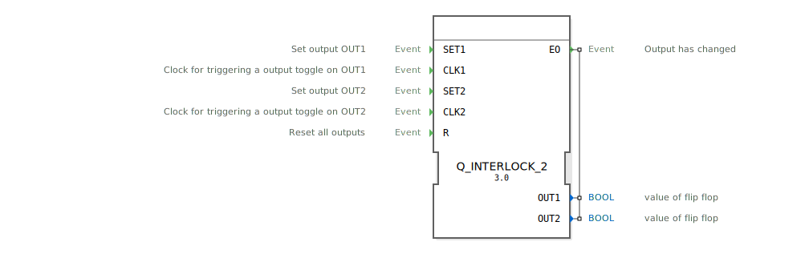

# Q_INTERLOCK_2

```{index} single: Q_INTERLOCK_2
```


* * * * * * * * * *
## Einleitung
Der Funktionsblock `Q_INTERLOCK_2` ist ein ereignisgesteuerter, bistabiler Speicher mit Toggle-Funktionalität und dualer Verriegelung. Er dient der Steuerung zweier gegenseitig ausschließender Ausgänge (`OUT1` und `OUT2`). Der Baustein kann sowohl über direkte Setz-Ereignisse als auch über Takt-Ereignisse (für eine Toggle-Funktion) angesteuert werden und stellt sicher, dass immer nur einer der beiden Ausgänge aktiv sein kann. Ein gemeinsames Reset-Ereignis setzt beide Ausgänge zurück.



## Schnittstellenstruktur

### **Ereignis-Eingänge**
*   **SET1**: Setzt den Ausgang `OUT1` auf `TRUE` und `OUT2` auf `FALSE`.
*   **CLK1**: Fungiert als Takt und schaltet den Ausgang `OUT1` bei jedem Ereignis um (von `FALSE` auf `TRUE` bzw. `TRUE` auf `FALSE`). Gleichzeitig wird `OUT2` auf `FALSE` gesetzt.
*   **SET2**: Setzt den Ausgang `OUT2` auf `TRUE` und `OUT1` auf `FALSE`.
*   **CLK2**: Fungiert als Takt und schaltet den Ausgang `OUT2` bei jedem Ereignis um. Gleichzeitig wird `OUT1` auf `FALSE` gesetzt.
*   **R**: Setzt beide Ausgänge (`OUT1` und `OUT2`) auf `FALSE`.

### **Ereignis-Ausgänge**
*   **EO**: Wird bei jeder Zustandsänderung eines der Ausgänge (`OUT1` oder `OUT2`) ausgelöst. Dieses Ereignis tritt immer dann auf, wenn einer der Algorithmen `SET1`, `SET2` oder `RESET` ausgeführt wird.

### **Daten-Eingänge**
*   Dieser Funktionsblock besitzt keine Daten-Eingänge.

### **Daten-Ausgänge**
*   **OUT1**: Boolescher Wert des ersten Flip-Flops.
*   **OUT2**: Boolescher Wert des zweiten Flip-Flops.

### **Adapter**
*   Dieser Funktionsblock verwendet keine Adapter.

## Funktionsweise
Der `Q_INTERLOCK_2` ist als Basic Function Block (BFB) implementiert und besitzt einen Execution Control Chart (ECC) mit vier Zuständen: `START`, `SET1`, `SET2` und `RESET`.

1.  **Initialzustand (`START`)**: Beide Ausgänge sind `FALSE`.
2.  **Zustandsübergänge**: Bei Eintreffen eines Ereignises wird der entsprechende Übergang im ECC ausgewertet.
    *   `SET1` oder `CLK1` führen zum Zustand `SET1`.
    *   `SET2` oder `CLK2` führen zum Zustand `SET2`.
    *   `R` führt zum Zustand `RESET`.
3.  **Algorithmusausführung**: Im Zielzustand wird der zugehörige Algorithmus ausgeführt, der die Ausgangsvariablen setzt.
    *   **Algorithmus `SET1`**: `OUT1 := TRUE; OUT2 := FALSE;`
    *   **Algorithmus `SET2`**: `OUT1 := FALSE; OUT2 := TRUE;`
    *   **Algorithmus `RESET`**: `OUT1 := FALSE; OUT2 := FALSE;`
4.  **Ereignisausgabe**: Nach Ausführung des Algorithmus wird das Ausgangsereignis `EO` ausgelöst, um nachfolgende Blöcke über die Änderung zu informieren.
5.  **Rückkehr**: Nach Ausführung des Algorithmus und dem Senden von `EO` kehrt der ECC immer in den `START`-Zustand zurück.

Die **Toggle-Funktion** wird durch die Ereignisse `CLK1` und `CLK2` realisiert. Ein `CLK1`-Ereignis führt immer zur Ausführung von `SET1`. Wenn `OUT1` bereits `TRUE` war, hat dies keine sichtbare Änderung zur Folge (es bleibt `TRUE`). Wenn `OUT1` jedoch `FALSE` war, wird es auf `TRUE` gesetzt. Das Verhalten für `CLK2` ist analog. Die gegenseitige Sperre (Interlock) ist in den Algorithmen `SET1` und `SET2` hart verdrahtet: Wird einer der Ausgänge gesetzt, wird der andere immer explizit zurückgesetzt.

## Technische Besonderheiten
*   **Duale Verriegelung (Dual Interlock)**: Die Ausgänge `OUT1` und `OUT2` sind streng gegenseitig ausschließend. Die Algorithmen garantieren, dass nie beide gleichzeitig `TRUE` sein können.
*   **Kombinierte Set-/Toggle-Eingänge**: Der Baustein bietet für jeden Ausgang sowohl einen direkten Set- als auch einen Toggle-Eingang, was die Flexibilität erhöht.
*   **Globales Reset**: Das `R`-Ereignis hat Vorrang vor allen Set- oder Toggle-Operationen im selben Zyklus und setzt beide Ausgänge zurück.
*   **Ereignisgesteuert**: Jede Änderung der Ausgänge wird durch ein eingehendes Ereignis ausgelöst und selbst mit einem Ausgangsereignis (`EO`) quittiert.

## Zustandsübersicht
Der ECC besteht aus vier Zuständen:
1.  **START**: Wartezustand, Ausgänge entsprechen dem letzten gespeicherten Wert.
2.  **SET1**: Aktiver Zustand, in dem Algorithmus `SET1` ausgeführt wird.
3.  **SET2**: Aktiver Zustand, in dem Algorithmus `SET2` ausgeführt wird.
4.  **RESET**: Aktiver Zustand, in dem Algorithmus `RESET` ausgeführt wird.

Nach Verlassen der aktiven Zustände (`SET1`, `SET2`, `RESET`) erfolgt ein automatischer, bedingungsloser Übergang zurück in den `START`-Zustand.

## Anwendungsszenarien
*   **Steuerung gegenseitig ausschließender Aktoren**: Z.B. Wahl zwischen "Heizen" und "Kühlen" in einer Klimaanlage, wo nie beide Funktionen gleichzeitig aktiv sein dürfen.
*   **Betriebsartenschaltung**: Umschalten zwischen zwei verschiedenen Maschinen- oder Anlagenzuständen (z.B. "Automatik" vs. "Handbetrieb"), wobei ein Wechsel nur auf explizite Anforderung erfolgt.
*   **Toggle-Schalter mit Priorität**: Ein Tastendruck (`CLK1`/`CLK2`) schaltet eine Funktion ein, ein Druck auf die andere Taste schaltet die erste aus und die zweite ein. Ein Not-Aus (`R`) schaltet alles ab.

## Vergleich mit ähnlichen Bausteinen
*   **E_SR (Set-Reset)**: Der klassische SR-Flipflop hat separate `S1`/`S2` und `R1`/`R2` Eingänge. `Q_INTERLOCK_2` kombiniert dies mit Toggle-Funktionalität (`CLK1`/`CLK2`) und erzwingt die gegenseitige Ausschließlichkeit bereits intern. Bei `E_SR` kann durch gleichzeitiges Setzen beider Eingänge ein undefinierter Zustand entstehen, was hier durch das Interlock verhindert wird.
*   **E_RS (Reset-Set)**: Ähnlich wie `E_SR`, jedoch mit priorisiertem Reset. `Q_INTERLOCK_2` hat ein globales Reset `R` mit höchster Priorität, aber die Set-Eingänge sind untereinander gleichberechtigt (das zuletzt ausgelöste Set- oder Toggle-Ereignis gewinnt).
*   **E_T (T-Flipflop)**: Ein reiner Toggle-Baustein ohne Set-Funktion und ohne zweiten, gesperrten Ausgang. `Q_INTERLOCK_2` erweitert dies um die duale, verriegelte Struktur.

## Fazit
Der `Q_INTERLOCK_2` ist ein vielseitiger und robuster Funktionsblock für Steuerungsaufgaben, bei denen zwei Zustände gegeneinander verriegelt werden müssen. Die Kombination aus direkter Setz- und Toggle-Funktionalität sowie ein globales Reset machen ihn für eine Vielzahl von Applikationen geeignet. Die interne Implementierung der Verriegelung entlastet den Anwender von der Fehleranfälligkeit, diese Logik extern nachbilden zu müssen. Er ist ideal für klare, zustandsbasierte Steuerungen mit gegenseitigem Ausschluss.