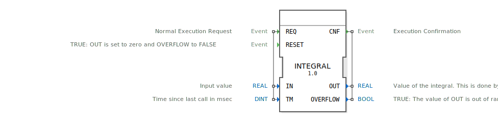

# INTEGRAL

```{index} single: INTEGRAL
```


* * * * * * * * * *
## Einleitung
Der Funktionsblock `INTEGRAL` berechnet näherungsweise das zeitliche Integral eines Eingangssignals. Die Integration erfolgt durch die Summation von Teilflächen, die sich aus dem Produkt des Eingangswertes und der seit dem letzten Aufruf verstrichenen Zeit ergeben. Der Baustein ist nützlich für Anwendungen, in denen kumulative Werte wie verbrauchte Energie, geförderte Mengen oder zurückgelegte Wege bestimmt werden müssen.



## Schnittstellenstruktur

### **Ereignis-Eingänge**
*   **REQ**: Startet die normale Ausführung der Integration. Die mit diesem Ereignis verbundenen Daten `IN` und `TM` werden verarbeitet.
*   **RESET**: Setzt den Integrator zurück. Der Ausgang `OUT` wird auf Null gesetzt und das Überlauf-Flag `OVERFLOW` auf `FALSE`.

### **Ereignis-Ausgänge**
*   **CNF**: Signalisiert die Bestätigung der Ausführung. Dieses Ereignis wird sowohl nach einem `REQ` als auch nach einem `RESET` ausgelöst und liefert die aktuellen Werte von `OUT` und `OVERFLOW`.

### **Daten-Eingänge**
*   **IN** (`REAL`, Initialwert: `0.0`): Der Eingangswert, der integriert werden soll.
*   **TM** (`DINT`, Initialwert: `0`): Die seit dem letzten Aufruf verstrichene Zeit in Millisekunden (ms). Dieser Wert muss positiv sein, damit eine Integration stattfindet.

### **Daten-Ausgänge**
*   **OUT** (`REAL`, Initialwert: `0.0`): Der aktuelle Wert des Integrals. Er wird durch Aufsummieren aller Teilintegrale (`IN * TM`) berechnet. Die Einheit ist `[IN] * Sekunden`, da der Zeitwert `TM` intern von Millisekunden in Sekunden umgerechnet wird.
*   **OVERFLOW** (`BOOL`, Initialwert: `FALSE`): Zeigt einen Überlauf an. Wenn dieser Ausgang `TRUE` ist, hat der Wert von `OUT` den darstellbaren Bereich des `REAL`-Datentyps verlassen. Die Integrationsfunktion ist blockiert, bis sie durch ein `RESET`-Ereignis neu initialisiert wird.

### **Adapter**
Dieser Funktionsblock verwendet keine Adapter.

## Funktionsweise
Der `INTEGRAL`-FB besitzt zwei primäre Betriebszustände, die durch die eintreffenden Ereignisse gesteuert werden:
1.  **Integration (`REQ`)**: Bei einem `REQ`-Ereignis wird der Algorithmus `REQ` ausgeführt. Zunächst wird geprüft, ob kein vorheriger Überlauf (`OVERFLOW = FALSE`) vorliegt. Anschließend wird eine Überlaufprüfung durchgeführt: Falls die Addition des nächsten Teilintegrals (`IN * TM`) zum aktuellen `OUT`-Wert die Grenzen des `REAL`-Datentyps (ca. ±1.0E38) überschreiten würde, wird `OVERFLOW` auf `TRUE` gesetzt. Andernfalls, und nur wenn die Zeitdifferenz `TM` größer als 0 ist, wird das Teilintegral berechnet, in Sekunden umgerechnet (`/ 1000.0`) und zum Gesamtintegral `OUT` addiert.
2.  **Reset (`RESET`)**: Bei einem `RESET`-Ereignis wird der Algorithmus `RESET` ausgeführt. Dieser setzt den Integralwert `OUT` auf `0.0` und das Überlauf-Flag `OVERFLOW` auf `FALSE` zurück.

Nach der Ausführung des jeweiligen Algorithmus wird stets ein `CNF`-Ausgangsereignis mit den aktuellen Werten generiert.

## Technische Besonderheiten
*   **Überlaufbehandlung**: Der Baustein verfügt über eine integrierte Überlauferkennung. Bei Erkennung eines potenziellen Überlaufs wird die Integration gestoppt (`OVERFLOW = TRUE`), um undefiniertes Verhalten zu vermeiden. Ein manueller Reset ist erforderlich, um den Betrieb fortzusetzen.
*   **Zeitbasis**: Die Integration basiert auf der vom Anwender bereitgestellten Zeitdifferenz `TM` in Millisekunden. Der Baustein selbst besitzt keinen internen Timer. Dies ermöglicht eine flexible Anpassung an verschiedene Zykluszeiten des umgebenden Steuerungsprogramms.
*   **Initialisierung**: Bei der ersten Initialisierung des Bausteins sind `OUT = 0.0` und `OVERFLOW = FALSE`.

## Zustandsübersicht
Der Funktionsblock ist ein Simple FB und besitzt explizit definierte Ausführungszustände (ECStates) für die beiden möglichen Ereignisse:
*   **Zustand REQ**: Wird bei Eintreffen des `REQ`-Ereignisses aktiviert. Führt den Integrationsalgorithmus aus.
*   **Zustand RESET**: Wird bei Eintreffen des `RESET`-Ereignisses aktiviert. Führt den Reset-Algorithmus aus.
Beide Zustände führen nach ihrer Ausführung zur Ausgabe des `CNF`-Ereignisses.

## Anwendungsszenarien
*   **Energiemessung**: Berechnung des Gesamtenergieverbrauchs aus einer momentanen Leistungsmessung (`IN` = Leistung in kW, `OUT` = Energie in kWh).
*   **Durchflussmessung**: Ermittlung der insgesamt geförderten Flüssigkeits- oder Gasmenge aus einem Durchflusssensor (`IN` = Durchfluss in l/min, `OUT` = Volumen in l).
*   **Geschwindigkeitsintegration**: Bestimmung der zurückgelegten Strecke aus einem Geschwindigkeitssignal (`IN` = Geschwindigkeit in m/s, `OUT` = Weg in m).
*   **Ladungsberechnung**: Integration eines Stromsignals zur Ermittlung der geflossenen Ladung (`IN` = Strom in A, `OUT` = Ladung in Ah).

## ⚖️ Vergleich mit ähnlichen Bausteinen
Im Vergleich zu einfacheren Summierbausteinen (z.B. `ADD`) zeichnet sich `INTEGRAL` durch die explizite Berücksichtigung der Zeit als Integrationsvariable aus. Im Gegensatz zu komplexeren Regelbausteinen mit integrierten Timern (wie z.B. bestimmten PID-Implementierungen) ist `INTEGRAL` ein reiner, zeitdiskreter Integrator, der die Zeitdifferenz als Eingangsvariable erwartet und somit extern getaktet wird. Dies macht ihn flexibler in Systemen mit variabler oder nicht-periodischer Zykluszeit.


## 🛠️ Zugehörige Übungen

* [Uebung_072c](../../../../../training1/Ventilsteuerung/4diacIDE-workspace/test_B/Uebungen_doc/Uebung_072c.md)

## Fazit
Der `INTEGRAL`-Funktionsblock ist ein grundlegendes und robustes Werkzeug zur zeitlichen Integration von Signalen in IEC 61499-Steuerungen. Seine klare Schnittstelle, die integrierte Überlaufsicherung und die flexible Handhabung der Zeitdifferenz machen ihn zu einer zuverlässigen Komponente für eine Vielzahl von Mess- und Regelaufgaben. Die Notwendigkeit, die verstrichene Zeit extern zu ermitteln und bereitzustellen, bietet maximale Flexibilität, erfordert aber auch eine korrekte Implementierung im umgebenden Anwendungsprogramm.