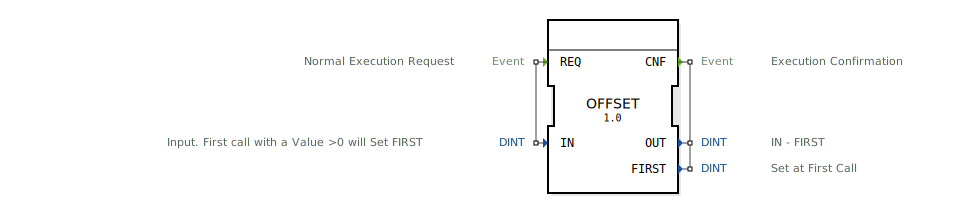

# OFFSET

```{index} single: OFFSET
```


* * * * * * * * * *
## Einleitung
Der OFFSET-Funktionsblock dient dazu, einen Offset-Wert zu ermitteln und anzuwenden. Bei der ersten Verarbeitung eines Ereignisses mit einem Eingangswert größer als Null wird dieser Wert als Referenzpunkt (`FIRST`) gespeichert. Bei jedem Aufruf berechnet der Baustein die Differenz zwischen dem aktuellen Eingangswert und diesem gespeicherten Referenzwert. Dieser Baustein ist nützlich, um relative Änderungen gegenüber einem initialen Startwert zu messen.



## Schnittstellenstruktur

### **Ereignis-Eingänge**
*   **REQ**: Startet die normale Ausführung des Bausteins. Wird mit dem Daten-Eingang `IN` verknüpft.

### **Ereignis-Ausgänge**
*   **CNF**: Signalisiert den Abschluss der Berechnung. Wird mit den Daten-Ausgängen `OUT` und `FIRST` verknüpft.

### **Daten-Eingänge**
*   **IN** (DINT): Der Eingangswert. Beim ersten Aufruf, bei dem dieser Wert größer als 0 ist, wird er als Referenzwert (`FIRST`) gespeichert. Initialwert ist 0.

### **Daten-Ausgänge**
*   **OUT** (DINT): Das Ergebnis der Berechnung `IN - FIRST`. Initialwert ist 0.
*   **FIRST** (DINT): Der beim ersten relevanten Aufruf gespeicherte Referenzwert. Initialwert ist 0.

### **Adapter**
Dieser Funktionsblock verwendet keine Adapter.

## Funktionsweise
Der OFFSET-Baustein ist ein einfacher Funktionsblock mit einem einzigen Zustand (`REQ`) und einem Algorithmus gleichen Namens.

Bei jedem Eintreffen eines `REQ`-Ereignisses wird der Algorithmus `REQ` ausgeführt:
1.  **Prüfung und Setzen des Referenzwerts:** Es wird geprüft, ob der Ausgang `FIRST` noch seinen Initialwert 0 hat. Falls ja **und** der aktuelle Eingangswert `IN` größer als 0 ist, wird `FIRST` auf den Wert von `IN` gesetzt. Diese Bedingung (`IN > 0`) ist im Algorithmus implizit durch die Logik enthalten, da `FIRST` nur bei der ersten Verarbeitung eines `IN > 0` von 0 auf einen anderen Wert geändert wird.
2.  **Berechnung des Offsets:** Unabhängig vom vorherigen Schritt wird der Ausgang `OUT` als Differenz zwischen dem aktuellen Eingang `IN` und dem gespeicherten Referenzwert `FIRST` berechnet (`OUT := IN - FIRST`).
3.  **Bestätigung:** Nach der Berechnung wird das `CNF`-Ereignis ausgelöst, wobei die aktuellen Werte von `OUT` und `FIRST` mitgegeben werden.

## Technische Besonderheiten
*   Der Referenzwert `FIRST` wird genau einmal gesetzt, und zwar beim ersten `REQ`-Ereignis, bei dem der Daten-Eingang `IN` einen Wert größer als 0 aufweist. Solange `IN` bei den ersten Aufrufen 0 oder kleiner ist, bleibt `FIRST` auf 0.
*   Nachdem `FIRST` einmal gesetzt wurde, bleibt er für die gesamte weitere Laufzeit des Bausteins unverändert.
*   Die Berechnung `OUT = IN - FIRST` findet bei *jedem* Aufruf statt, auch wenn `FIRST` noch 0 ist. Dies bedeutet, dass `OUT` solange identisch mit `IN` ist, bis der Referenzwert gesetzt wird.

## Zustandsübersicht
Der Baustein besitzt einen einzigen, namensgebenden Zustand:
*   **REQ:** Dieser Zustand ist immer aktiv. Jedes eintreffende `REQ`-Ereignis führt zur Ausführung des zugehörigen Algorithmus und löst sofort das `CNF`-Ereignis aus. Es gibt keine internen Zustandsübergänge.

## Anwendungsszenarien
*   **Inkrementelle Weg- oder Positionsmessung:** Setzen eines Nullpunkts (`FIRST`) nach einer Referenzfahrt und anschließende Messung der relativen Bewegung (`OUT`).
*   **Kompensation von Grundlasten oder Nullabweichungen:** Erfassen eines initialen Basiswerts (z.B. Sensor-Grundlast) und Berechnung der reinen Änderung gegenüber dieser Basis.
*   **Relative Zeitmessung:** Speichern eines Startzeitpunkts und Berechnung der vergangenen Zeit seit diesem Start.

## ⚖️ Vergleich mit ähnlichen Bausteinen
*   **SUB / DINT_SUB:** Ein reiner Subtrahierer berechnet stets die Differenz zweier aktueller Eingangswerte. OFFSET hingegen speichert einen der Werte intern als konstanten Referenzpunkt.
*   **DELAY / TON:** Zeitverzögerungsbausteine arbeiten auf der Zeitachse. OFFSET arbeitet mit Datenwerten und hat kein zeitbasiertes Verhalten.
*   **SR / RS:** Speicherbausteine (Set/Reset) halten einen binären Zustand. OFFSET speichert einen ganzzahligen (`DINT`) Wert und verwendet ihn für eine arithmetische Operation.

## Fazit
Der OFFSET-Baustein ist ein spezialisierter und einfacher Funktionsblock zur Ermittlung eines relativen Offsets. Seine Stärke liegt in der einmaligen, automatischen Erfassung eines Start- oder Referenzwerts und der fortlaufenden Berechnung der Abweichung davon. Er eignet sich besonders für Anwendungen, bei denen ein System initial "genullt" werden muss und anschließend nur noch Änderungen relevant sind.