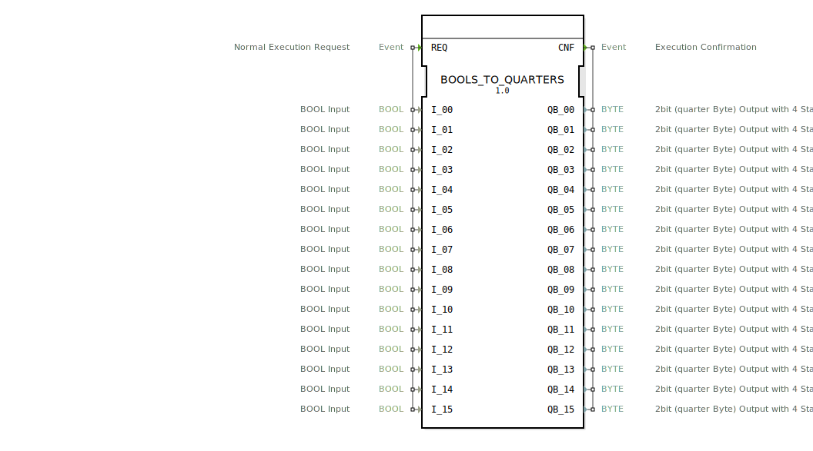

# BOOLS_TO_QUARTERS

## 🎧 Podcast

* [QUARTER](https://podcasters.spotify.com/pod/show/iec-61499-grundkurs-de/episodes/QUARTER-e36741d)

---- 
```{index} single: BOOLS_TO_QUARTERS
```


* * * * * * * * * *
## Einleitung
Der Funktionsblock `BOOLS_TO_QUARTERS` ist ein zusammengesetzter Baustein (Composite FB), der 16 einzelne boolesche Eingangssignale in ein spezielles 2-Bit-Format, genannt "Quarter Byte", umwandelt. Er dient als Bündelung und serielle Abarbeitung mehrerer grundlegender Konvertierungsfunktionen und ist für Anwendungen vorgesehen, in denen viele binäre Zustände in ein kompaktes, mehrwertiges Steuerformat überführt werden müssen.



## Schnittstellenstruktur

### **Ereignis-Eingänge**
*   **REQ (Normal Execution Request):** Startet die Verarbeitungskette. Bei einem eingehenden REQ-Ereignis werden alle mitgeführten Daten-Eingänge (`I_00` bis `I_15`) eingelesen und die Konvertierung initiiert.

### **Ereignis-Ausgänge**
*   **CNF (Execution Confirmation):** Dieses Ereignis wird ausgegeben, nachdem alle 16 internen Konvertierungen abgeschlossen sind. Es bestätigt die Beendigung der Operation und liefert die berechneten Quarter-Byte-Werte (`QB_00` bis `QB_15`) an die nachgelagerte Applikation.

### **Daten-Eingänge**
*   **I_00 bis I_15 (BOOL Input):** 16 unabhängige boolesche Eingänge (`BOOL`). Jeder repräsentiert einen binären Schaltzustand (TRUE/FALSE). Der Initialwert aller Eingänge ist `FALSE`.

### **Daten-Ausgänge**
*   **QB_00 bis QB_15 (2bit (quarter Byte) Output):** 16 Ausgänge vom Typ `BYTE`. Jeder Ausgang kodiert das Ergebnis der Konvertierung des entsprechenden booleschen Eingangs in ein Quarter-Byte. Ein Quarter-Byte nutzt nur die unteren zwei Bits eines Bytes und kann theoretisch vier Zustände darstellen. In dieser Implementierung werden primär zwei Zustände genutzt, die durch die Konstanten `quarter::COMMAND_DISABLE` und ihr Gegenstück definiert sind. Der Initialwert aller Ausgänge ist `quarter::COMMAND_DISABLE`.

### **Adapter**
Dieser Funktionsblock verwendet keine Adapter-Schnittstellen.

## Funktionsweise
`BOOLS_TO_QUARTERS` ist ein Composite FB, der intern aus 16 Instanzen eines Basisfunktionsblocks `BOOL_TO_QUARTER` aufgebaut ist. Jede Instanz ist für die Konvertierung eines einzelnen booleschen Wertes zuständig.

Die Funktionsweise folgt einem seriellen Kettenprinzip:
1.  Das eingehende `REQ`-Ereignis triggert die erste interne Instanz `BOOL_TO_QUARTER_00`.
2.  Diese Instanz liest ihren zugeordneten Daten-Eingang `I_00`, führt die Konvertierung durch und setzt ihren Ausgang `QB_00`.
3.  Nach Abschluss ihrer Operation generiert `BOOL_TO_QUARTER_00` ein `CNF`-Ereignis, das direkt als `REQ`-Ereignis für die nächste Instanz (`BOOL_TO_QUARTER_01`) weitergeleitet wird.
4.  Dieser Prozess setzt sich kaskadenartig durch alle 16 Instanzen fort.
5.  Die letzte Instanz (`BOOL_TO_QUARTER_15`) leitet ihr abschließendes `CNF`-Ereignis an den `CNF`-Ausgang des umschließenden `BOOLS_TO_QUARTERS`-Blocks weiter. Zu diesem Zeitpunkt liegen alle 16 Quarter-Byte-Ausgänge (`QB_00` bis `QB_15`) mit ihren neuen Werten vor.

Die Datenpfade sind parallel organisiert: Jeder boolesche Eingang `I_xx` ist direkt mit dem entsprechenden `I`-Eingang der internen Instanz verbunden, und jeder `QB`-Ausgang einer Instanz ist direkt mit dem entsprechenden `QB_xx`-Ausgang des Composite FB verbunden.

## Technische Besonderheiten
*   **Serielle Ausführung:** Die 16 Konvertierungen werden nacheinander, nicht parallel, ausgeführt. Dies führt zu einer definierten, aber nicht gleichzeitigen Aktualisierung der Ausgänge. Die Gesamtzykluszeit ist die Summe der Ausführungszeiten aller 16 internen Blöcke.
*   **Konstanten-Nutzung:** Die Initialwerte und die konkreten Ausgabewerte der Konvertierung basieren auf vordefinierten Konstanten aus dem `quarter`-Namespace (z.B. `quarter::COMMAND_DISABLE`). Die genaue Semantik der möglichen Quarter-Byte-Zustände (z.B. `COMMAND_DISABLE` vs. `COMMAND_ENABLE`) muss der Dokumentation des zugrundeliegenden `BOOL_TO_QUARTER`-Blocks oder der `quarter`-Bibliothek entnommen werden.
*   **Komposite Struktur:** Der Block dient primär der Bündelung und Vereinfachung der Verdrahtung in übergeordneten Applikationen. Die eigentliche Logik liegt in den eingebetteten `BOOL_TO_QUARTER`-Funktionsblöcken.

## Zustandsübersicht
Als Composite FB ohne eigene, explizite Zustandsmaschine besitzt `BOOLS_TO_QUARTERS` keinen internen Zustand im engeren Sinne. Sein Verhalten wird vollständig durch die Kaskade der untergeordneten Blöcke und deren Zustände bestimmt. Der Block kann sich in einem von zwei makroskopischen Zuständen befinden:
1.  **Idle:** Warten auf ein `REQ`-Ereignis. Alle Ausgänge behalten ihren letzten Wert.
2.  **Verarbeitend (Processing):** Ein `REQ`-Ereignis läuft durch die Kaskade der 16 internen Blöcke. Während dieser Phase werden die Ausgänge nacheinander aktualisiert.

## Anwendungsszenarien
*   **Ansteuerung von kompakten Mehrwert-Aktoren:** Bei Aktoren oder Treibern, die Steuerbefehle nicht als einfache Ein-/Aus-Signale, sondern als 2-Bit-Kommandos (z.B. Ein/Aus/Fehlerreset/Notstop) erwarten.
*   **Datenkomprimierung für Bus-Kommunikation:** Vor der Übertragung über Feldbusse, wo viele binäre Signale in ein platzsparendes Byte- oder Wort-orientiertes Protokoll gepackt werden müssen.
*   **Schnittstelle zu Legacy-Systemen:** Als Adapter zwischen modernen IEC 61499-Steuerungen und älteren Systemen, die Daten in einem speziellen Quarter-Byte-Format erwarten oder liefern.

## ⚖️ Vergleich mit ähnlichen Bausteinen
*   **Gegenüber `BOOL_TO_QUARTER`:** `BOOLS_TO_QUARTERS` ist im Wesentlichen ein Array aus 16 `BOOL_TO_QUARTER`-Blöcken mit einer fest verdrahteten seriellen Ereigniskette. Während `BOOL_TO_QUARTER` eine einzelne Konvertierung durchführt, aggregiert `BOOLS_TO_QUARTERS` viele solcher Konvertierungen in einem wiederverwendbaren Baustein.
*   **Gegenüber generischen Pack-Blöcken (z.B. `BOOLx_TO_BYTE`):** Blöcke wie `BOOL8_TO_BYTE` packen mehrere BOOL-Werte in die Bits eines einzelnen BYTEs. `BOOLS_TO_QUARTERS` hingegen erzeugt für jeden Eingang ein eigenes (wenn auch nur teilweise genutztes) BYTE. Es findet keine Bit-Packung in ein gemeinsames Byte statt, sondern eine 1:1-Abbildung auf ein spezielles Kodierungsformat.


## 🛠️ Zugehörige Übungen

* [Uebung_060](../../../../../training1/Ventilsteuerung/4diacIDE-workspace/test_B/Uebungen_doc/Uebung_060.md)

## Fazit
Der `BOOLS_TO_QUARTERS`-Funktionsblock bietet eine praktische und vorkonfektionierte Lösung, um eine große Anzahl boolescher Signale seriell in das Quarter-Byte-Format zu konvertieren. Seine komposite Natur macht ihn einfach zu verstehen und zu verwenden, da er die Verdrahtung von 16 einzelnen Blöcken und ihrer Ereignislogik abstrahiert. Die serielle Abarbeitung ist ein entscheidendes Merkmal, das bei Echtzeitanforderungen berücksichtigt werden muss. Der Block ist ideal für spezifische Anwendungen, die das Quarter-Byte-Format erfordern, weniger jedoch für allgemeine Bit-Pack- oder -Unpack-Operationen.