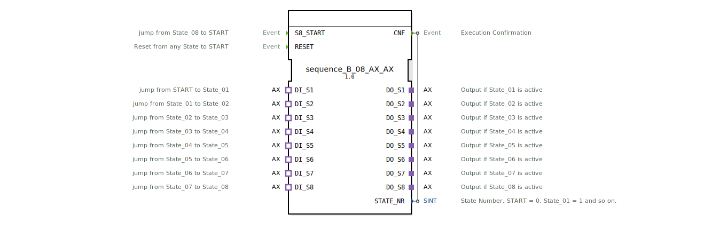

# sequence_B_08_AX_AX

* * * * * * * * * *
## Einleitung

Der Funktionsblock **sequence_B_08_AX_AX** realisiert eine sequenzielle Ablaufsteuerung mit acht Ausgängen. Die Zustandsübergänge erfolgen pegelgesteuert über BOOL-Signale, die über einen AX-Adapter bereitgestellt werden. Der Baustein ist für unterbrechungssichere Anwendungen ausgelegt und erlaubt eine Wiederherstellung des laufenden Zustands nach einem Stromausfall. Er eignet sich besonders für Ablaufsteuerungen in der Automatisierungstechnik, bei denen mehrere Schaltvorgänge nacheinander ausgeführt werden müssen.

## Schnittstellenstruktur

### **Ereignis-Eingänge**

| Name | Beschreibung |
|------|--------------|
| `S8_START` | Ereignis, das einen Sprung von Zustand 8 zurück zum Startzustand auslöst. |
| `RESET` | Ereignis, das aus jedem aktiven Zustand einen sofortigen Reset auslöst. |

### **Ereignis-Ausgänge**

| Name | Beschreibung |
|------|--------------|
| `CNF` | Bestätigungsereignis, das nach jedem Zustandswechsel die aktuelle Zustandsnummer ausgibt. (Mit `STATE_NR`) |

### **Daten-Eingänge**

Der FB besitzt keine direkten Dateneingänge. Die Übergangsbedingungen werden ausschließlich über die Socket-Adapter eingelesen.

### **Daten-Ausgänge**

| Name | Typ | Beschreibung |
|------|-----|--------------|
| `STATE_NR` | SINT | Nummer des aktuellen Zustands: 0 = Start, 1…8 = State_01…State_08, 9 = State_00 (Ende). |

### **Adapter**

**Plugs (Ausgänge – Typ `adapter::types::unidirectional::AX`)**  

| Name | Beschreibung |
|------|--------------|
| `DO_S1` | Ausgang aktiv, wenn Zustand 1 aktiv ist. |
| `DO_S2` | Ausgang aktiv, wenn Zustand 2 aktiv ist. |
| `DO_S3` | Ausgang aktiv, wenn Zustand 3 aktiv ist. |
| `DO_S4` | Ausgang aktiv, wenn Zustand 4 aktiv ist. |
| `DO_S5` | Ausgang aktiv, wenn Zustand 5 aktiv ist. |
| `DO_S6` | Ausgang aktiv, wenn Zustand 6 aktiv ist. |
| `DO_S7` | Ausgang aktiv, wenn Zustand 7 aktiv ist. |
| `DO_S8` | Ausgang aktiv, wenn Zustand 8 aktiv ist. |

**Sockets (Eingänge – Typ `adapter::types::unidirectional::AX`)**  

| Name | Beschreibung |
|------|--------------|
| `DI_S1` | Signal für Übergang vom Startzustand zu Zustand 1. |
| `DI_S2` | Signal für Übergang von Zustand 1 zu Zustand 2. |
| `DI_S3` | Signal für Übergang von Zustand 2 zu Zustand 3. |
| `DI_S4` | Signal für Übergang von Zustand 3 zu Zustand 4. |
| `DI_S5` | Signal für Übergang von Zustand 4 zu Zustand 5. |
| `DI_S6` | Signal für Übergang von Zustand 5 zu Zustand 6. |
| `DI_S7` | Signal für Übergang von Zustand 6 zu Zustand 7. |
| `DI_S8` | Signal für Übergang von Zustand 7 zu Zustand 8. |

## Funktionsweise

Der FB arbeitet auf Basis eines Ereignisgesteuerten Ablaufzustandsautomaten (ECC). Beim Start befindet er sich im Zustand `xSTART`. Von dort werden die Eingangssignale `DI_S1` bis `DI_S8` (jeweils das Attribut `.D1` des Adapters) auf ihren BOOL-Wert geprüft. Trifft ein Signal zu (TRUE), so wechselt der Automat in den entsprechenden Zustand (`sState_01` … `sState_08`). Ist kein Signal gesetzt, wird der Zustand `sState_00` erreicht (Ende der Sequenz).

Jeder Zustand führt beim Betreten folgende Aktionen aus:

1. **Deaktivieren des vorherigen Ausgangs**: Der Ausgangsadapter des vorherigen Zustands wird auf `FALSE` gesetzt (Algorithmus `State_n_X`).
2. **Aktualisieren der Zustandsnummer**: `STATE_NR` wird auf die Konstante des aktuellen Zustands gesetzt (z. B. `sequence::State_01`).
3. **Aktivieren des neuen Ausgangs**: Der Wert des zugehörigen Eingangs (`DI_Sn.D1`) wird auf den Ausgang (`DO_Sn.D1`) übertragen (Algorithmus `State_n_E`).
4. **Ausgabe des Bestätigungsereignisses**: `CNF` wird ausgelöst.

Von Zustand 8 führt das Ereignis `S8_START` zurück zum Startzustand (`xSTART`). Das Ereignis `RESET` kann aus jedem aktiven Zustand (1…8) eine sofortige Rückkehr zum Zustand `sState_00` erzwingen – dabei werden alle Ausgänge auf `FALSE` gesetzt.

Nach einem Reset (`RESET`) durchläuft der Automat kurz den Zustand `sRESET`, der alle Ausgänge deaktiviert, und springt dann sofort in den Zustand `sState_00`.

## Technische Besonderheiten

- **Pegelgesteuerte Übergänge**: Die Transitionen werden durch den anliegenden BOOL-Wert des jeweiligen Eingangs ausgelöst (nicht flankengetriggert). Dies ermöglicht eine einfache Wiederherstellung nach einem Spannungsausfall, da der Zustand beim Wiedereinschalten direkt erkannt und fortgesetzt werden kann.
- **Verwendung von AX-Adaptern**: Die Schnittstellen sind als unidirektionale AX-Adapter ausgeführt, was eine lose Kopplung und einfache Wiederverwendung der Ein-/Ausgänge erlaubt.
- **Konfigurierbare Konstanten**: Die Zustandsnummern werden über die Konstante `sequence::State_nn` aus dem Paket `logiBUS::utils::sequence::const::sequence` bezogen – dadurch können sie zentral definiert und geändert werden.
- **Typsicherheit**: Alle Ausgänge werden explizit auf `FALSE` gesetzt, wenn ein Zustand verlassen wird, und erhalten beim Betreten den Wert des zugehörigen Eingangs. Dies verhindert Logikfehler durch hängende Werte.

## Zustandsübersicht

| Zustand (ECC) | Zustandsnummer | Ausgang aktiv | Übergangsbedingung (zum nächsten Zustand) |
|---------------|----------------|---------------|-------------------------------------------|
| `xSTART` | 0 | – | `DI_S1.D1` → sState_01 `DI_S2.D1` → sState_02 … `DI_S8.D1` → sState_08  sonst → sState_00 |
| `sState_01` | 1 | `DO_S1` | `DI_S2.D1` → sState_02 `RESET` → sState_00 |
| `sState_02` | 2 | `DO_S2` | `DI_S3.D1` → sState_03 `RESET` → sState_00 |
| `sState_03` | 3 | `DO_S3` | `DI_S4.D1` → sState_04 `RESET` → sState_00 |
| `sState_04` | 4 | `DO_S4` | `DI_S5.D1` → sState_05 `RESET` → sState_00 |
| `sState_05` | 5 | `DO_S5` | `DI_S6.D1` → sState_06 `RESET` → sState_00 |
| `sState_06` | 6 | `DO_S6` | `DI_S7.D1` → sState_07 `RESET` → sState_00 |
| `sState_07` | 7 | `DO_S7` | `DI_S8.D1` → sState_08 `RESET` → sState_00 |
| `sState_08` | 8 | `DO_S8` | `S8_START` → xSTART `RESET` → sState_00 |
| `sState_00` | 9 | – | `DI_S1.D1` → sState_01 (Neustart der Sequenz) |

*Hinweis: Der Zustand `sRESET` dient nur der Bereinigung aller Ausgänge und wird automatisch verlassen.*

## Anwendungsszenarien

- **Ablaufsteuerung in landwirtschaftlichen Maschinen**: Beispielsweise das sequenzielle Ein- und Ausschalten von acht hydraulischen Ventilen oder Beleuchtungseinheiten.
- **Förderband-Steuerung**: Aktivierung von Bandabschnitten nacheinander, wobei die Übergänge durch Füllstandssensoren (BOOL) angesteuert werden.
- **Laborautomation**: Schrittweise Freigabe von Reagenz-Dosiereinheiten, gesteuert durch Pegelsignale von Durchflusssensoren.
- **Unterbrechungssichere Abläufe**: Da der Zustand nach einem Spannungsausfall anhand der Eingangssignale wiederhergestellt werden kann, eignet sich der FB für sicherheitskritische Prozesse.

## Vergleich mit ähnlichen Bausteinen

- **Timer-basierte Sequenzer**: Übergänge werden nicht durch Pegel, sondern durch Zeitabläufe ausgelöst. `sequence_B_08_AX_AX` reagiert dagegen direkt auf externe Signale und eignet sich für ereignisgesteuerte Prozesse.
- **Flankengetriggerte Sequenzer**: Würden nur auf steigende Flanken reagieren. Der hier vorgestellte FB erkennt dagegen dauerhafte Pegel, was die Wiederanlauf-Fähigkeit verbessert.
- **Adapterlose Bausteine**: Viele Standard-FBs verwenden einfache BOOL-Eingänge. Durch den Einsatz von AX-Adaptern wird eine höhere Modularität und Austauschbarkeit der Signalquellen/-senken erreicht.

## Fazit

Der Funktionsblock `sequence_B_08_AX_AX` bietet eine robuste und flexible Möglichkeit zur Realisierung einer achtstufigen Ablaufsteuerung mit pegelgesteuerten Übergängen. Die Verwendung unidirektionaler AX-Adapter vereinfacht die Integration in komplexe Automatisierungssysteme, während die explizite Zustandsverwaltung und das Reset-Verhalten eine hohe Betriebssicherheit gewährleisten. Dank der Wiederherstellungsfähigkeit nach Stromausfällen eignet er sich besonders für Anwendungen in der Landtechnik und industriellen Fertigung.