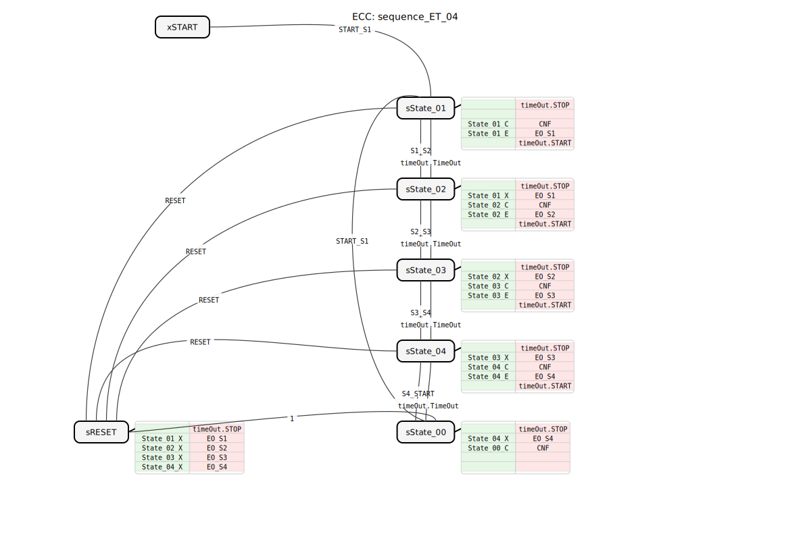
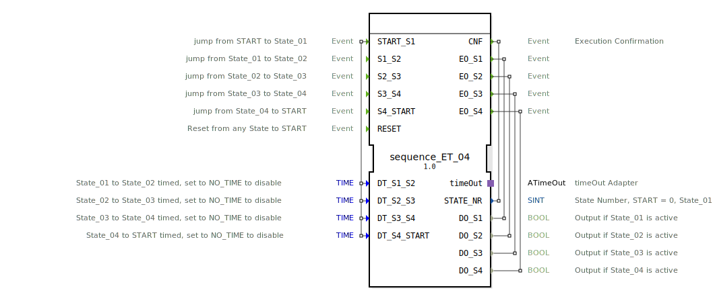

# sequence_ET_04

```{index} single: sequence_ET_04
```




* * * * * * * * * *
## Einleitung
Der Funktionsblock `sequence_ET_04` ist ein Sequenzer mit vier Ausgabezuständen. Er ermöglicht die Steuerung einer zyklischen Abfolge von vier Schritten (State_01 bis State_04), wobei der Übergang zwischen den Zuständen entweder durch ein externes Ereignis oder nach Ablauf einer einstellbaren Zeit erfolgen kann. Der Baustein ist für Anwendungen konzipiert, bei denen Prozessschritte sequenziell und mit zeitlicher oder ereignisgesteuerter Flexibilität ausgeführt werden müssen.



## Schnittstellenstruktur

### **Ereignis-Eingänge**
*   **`START_S1`**: Wechselt von `START` oder `State_00` in den ersten Zustand `State_01`. Überträgt die Zeitparameter für alle Zustandsübergänge (`DT_S1_S2`, `DT_S2_S3`, `DT_S3_S4`, `DT_S4_START`).
*   **`S1_S2`**: Manueller Übergang von `State_01` zu `State_02`.
*   **`S2_S3`**: Manueller Übergang von `State_02` zu `State_03`.
*   **`S3_S4`**: Manueller Übergang von `State_03` zu `State_04`.
*   **`S4_START`**: Manueller Übergang von `State_04` zurück in den `START`-Zustand (über `State_00`).
*   **`RESET`**: Setzt den Baustein aus jedem beliebigen Zustand sofort in den `START`-Zustand zurück.

### **Ereignis-Ausgänge**
*   **`CNF`**: Ausführungsbestätigung. Wird bei jedem Zustandswechsel ausgelöst und liefert die neue Zustandsnummer (`STATE_NR`).
*   **`EO_S1`**: Wird bei Eintritt in `State_01` ausgelöst und liefert den Ausgangswert `DO_S1`.
*   **`EO_S2`**: Wird bei Eintritt in `State_02` ausgelöst und liefert den Ausgangswert `DO_S2`.
*   **`EO_S3`**: Wird bei Eintritt in `State_03` ausgelöst und liefert den Ausgangswert `DO_S3`.
*   **`EO_S4`**: Wird bei Eintritt in `State_04` ausgelöst und liefert den Ausgangswert `DO_S4`.

### **Daten-Eingänge**
*   **`DT_S1_S2`** (Typ: `TIME`): Zeit für den automatischen Übergang von `State_01` zu `State_02`. Der Wert `NO_TIME` deaktiviert den Zeitübergang für diesen Schritt.
*   **`DT_S2_S3`** (Typ: `TIME`): Zeit für den automatischen Übergang von `State_02` zu `State_03`. Der Wert `NO_TIME` deaktiviert den Zeitübergang für diesen Schritt.
*   **`DT_S3_S4`** (Typ: `TIME`): Zeit für den automatischen Übergang von `State_03` zu `State_04`. Der Wert `NO_TIME` deaktiviert den Zeitübergang für diesen Schritt.
*   **`DT_S4_START`** (Typ: `TIME`): Zeit für den automatischen Übergang von `State_04` zurück zum `START`-Zustand. Der Wert `NO_TIME` deaktiviert den Zeitübergang für diesen Schritt.

### **Daten-Ausgänge**
*   **`STATE_NR`** (Typ: `SINT`): Aktuelle Zustandsnummer gemäß der Konstanten `sequence::State_XX` (START = 0, State_01 = 1, State_02 = 2, State_03 = 3, State_04 = 4).
*   **`DO_S1`** (Typ: `BOOL`): Ist `TRUE`, wenn `State_01` aktiv ist.
*   **`DO_S2`** (Typ: `BOOL`): Ist `TRUE`, wenn `State_02` aktiv ist.
*   **`DO_S3`** (Typ: `BOOL`): Ist `TRUE`, wenn `State_03` aktiv ist.
*   **`DO_S4`** (Typ: `BOOL`): Ist `TRUE`, wenn `State_04` aktiv ist.

### **Adapter**
*   **`timeOut`** (Typ: `ATimeOut`): Ein Stecker (`Plug`) für einen Timeout-Adapter. Dieser Adapter wird intern verwendet, um die zeitgesteuerten Zustandsübergänge zu realisieren.

## Funktionsweise
Der Baustein implementiert einen endlichen Automaten (ECC) mit den Zuständen `START`, `State_01` bis `State_04`, `State_00` und `RESET`. Der Zyklus beginnt im Zustand `START`. Ein `START_S1`-Ereignis startet die Sequenz und wechselt in `State_01`.

In jedem aktiven Zustand (State_01 bis State_04) werden folgende Aktionen ausgeführt:
1.  Der interne Timer (`timeOut`) wird gestoppt.
2.  Der Ausgang des vorherigen Zustands wird deaktiviert (Exit-Algorithmus `State_XX_X`).
3.  Die Bestätigung `CNF` mit der neuen Zustandsnummer wird gesendet und die Zeit für den nächsten möglichen automatischen Übergang wird an den Timer übergeben (Confirmation-Algorithmus `State_XX_C`).
4.  Der Ausgang des aktuellen Zustands wird aktiviert (Entry-Algorithmus `State_XX_E`).
5.  Der interne Timer mit der für diesen Zustand konfigurierten Zeit (`DT_...`) wird gestartet.

Ein Zustandswechsel kann auf zwei Arten erfolgen:
*   **Ereignisgesteuert**: Durch das entsprechende Eingangsereignis (z.B. `S1_S2`).
*   **Zeitgesteuert**: Durch ein `TimeOut`-Ereignis des Adapters, sofern die Zeit `DT_...` nicht auf `NO_TIME` gesetzt ist.

Nach `State_04` wechselt der Baustein in den Zustand `State_00` (von wo aus die Sequenz mit `START_S1` neu gestartet werden kann) oder via `RESET` direkt zurück in den `START`-Zustand. Ein `RESET`-Ereignis deaktiviert sofort alle aktiven Ausgänge und bringt den Baustein in den Ausgangszustand zurück.

## Technische Besonderheiten
*   **Hybride Übergänge**: Jeder Zustandsübergang kann individuell als rein ereignisgesteuert, rein zeitgesteuert oder als Kombination aus beidem konfiguriert werden. Ein zeitgesteuerter Übergang hat Vorrang, sofern die Zeit nicht `NO_TIME` ist.
*   **Initialwerte**: Alle Zeit-Eingänge (`DT_...`) sind standardmäßig mit `NO_TIME` vorbelegt, was bedeutet, dass die Sequenz nach dem Start zunächst rein ereignisgesteuert abläuft.
*   **Adapter-Nutzung**: Die Zeitsteuerung wird vollständig über den gekoppelten `ATimeOut`-Adapter abgewickelt, was eine klare Trennung der Funktionalität und potenzielle Wiederverwendbarkeit ermöglicht.
*   **Zustandsrückmeldung**: Die Ausgabe `STATE_NR` bietet eine einfache Möglichkeit, den aktuellen Schritt extern zu überwachen oder zu visualisieren.

## Zustandsübersicht
1.  **`START`**: Initialer, inaktiver Zustand. Alle Ausgänge sind `FALSE`.
2.  **`State_01`**: Erster Sequenzschritt. `DO_S1` ist `TRUE`. Übergang zu `State_02` via `S1_S2`-Ereignis oder nach Zeit `DT_S1_S2`.
3.  **`State_02`**: Zweiter Sequenzschritt. `DO_S2` ist `TRUE`. Übergang zu `State_03` via `S2_S3`-Ereignis oder nach Zeit `DT_S2_S3`.
4.  **`State_03`**: Dritter Sequenzschritt. `DO_S3` ist `TRUE`. Übergang zu `State_04` via `S3_S4`-Ereignis oder nach Zeit `DT_S3_S4`.
5.  **`State_04`**: Vierter Sequenzschritt. `DO_S4` ist `TRUE`. Übergang zu `State_00` via `S4_START`-Ereignis oder nach Zeit `DT_S4_START`.
6.  **`State_00`**: Wartezustand nach Sequenzende. Alle Ausgänge sind `FALSE`. Von hier aus kann mit `START_S1` eine neue Sequenz gestartet werden.
7.  **`sRESET`**: Übergangszustand für den Reset. Deaktiviert alle Ausgänge und wechselt automatisch zu `State_00`.

## Anwendungsszenarien
*   **Steuerung von Batch-Prozessen**: Sequenzielle Aktivierung von Ventilen, Pumpen oder Heizungen in einem chemischen oder verfahrenstechnischen Prozess.
*   **Automatisierte Handhabungsgeräte**: Steuerung der einzelnen Schritte eines Pick-and-Place-Roboters (Greifen, Bewegen, Positionieren, Ablegen).
*   **Verpackungsmaschinen**: Koordination der Abläufe wie Produktzuführung, Verpacken, Etikettieren und Ausstoßen.
*   **Teststände**: Automatisierte Abfolge von Prüf- und Messschritten an einem Bauteil.

## ⚖️ Vergleich mit ähnlichen Bausteinen
Im Gegensatz zu einfachen Timer-Bausteinen (`TON`) oder reinen Zustandsmaschinen (`E_SR`) kombiniert `sequence_ET_04` beides in einem spezialisierten Baustein. Er bietet eine vordefinierte, vierstufige Struktur mit dedizierten Ausgängen für jeden Schritt, was die Programmierung im Vergleich zur manuellen Verknüpfung mehrerer Einzelbausteine vereinfacht und übersichtlicher macht. Bausteine wie `E_CYCLE` bieten zyklische Ereignisauslösung, aber keine individuellen, zustandsabhängigen Datenausgänge oder hybride Trigger.


## 🛠️ Zugehörige Übungen

* [Uebung_035](../../../../../../training1/Ventilsteuerung/4diacIDE-workspace/test_B/Uebungen_doc/Uebung_035.md)
* [Uebung_035b](../../../../../../training1/Ventilsteuerung/4diacIDE-workspace/test_B/Uebungen_doc/Uebung_035b.md)
* [Uebung_035c](../../../../../../training1/Ventilsteuerung/4diacIDE-workspace/test_B/Uebungen_doc/Uebung_035c.md)
* [Uebung_036](../../../../../../training1/Ventilsteuerung/4diacIDE-workspace/test_B/Uebungen_doc/Uebung_036.md)

## Fazit
Der `sequence_ET_04` ist ein praktischer und flexibler Funktionsblock für alle Anwendungen, die eine klare, zyklische Schrittkette erfordern. Die Kombination aus ereignis- und zeitgesteuerten Übergängen sowie die klare Schnittstelle mit separaten Ausgängen für jeden Zustand machen ihn besonders wartungsfreundlich und einfach in übergeordnete Steuerungen zu integrieren. Die Verwendung eines Standard-Adapters für die Zeitfunktion hält den Baustein schlank und kompatibel.