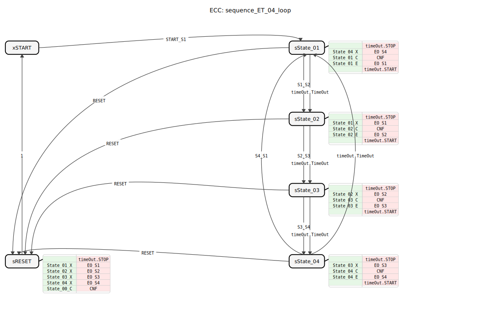
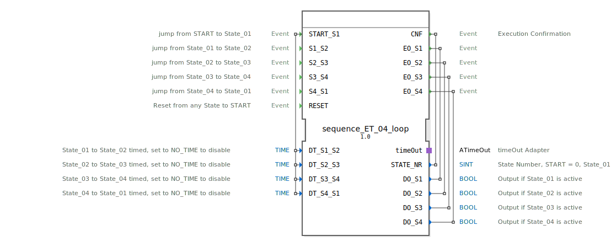

# sequence_ET_04_loop

```{index} single: sequence_ET_04_loop
```




* * * * * * * * * *
## Einleitung
Der Funktionsblock `sequence_ET_04_loop` implementiert eine zyklische Sequenz mit vier Zuständen. Der Übergang zwischen den Zuständen kann entweder durch ein externes Ereignis oder nach Ablauf einer einstellbaren Zeit erfolgen. Der Block ist darauf ausgelegt, wiederkehrende Abläufe in Steuerungsanwendungen zu realisieren, bei denen Aktionen nacheinander und in einer Schleife ausgeführt werden müssen.



## Schnittstellenstruktur
### **Ereignis-Eingänge**
*   `START_S1`: Startet die Sequenz und wechselt vom `START`-Zustand in den Zustand `State_01`. Überträgt die vier Zeitparameter `DT_S1_S2`, `DT_S2_S3`, `DT_S3_S4` und `DT_S4_S1`.
*   `S1_S2`: Löst den Übergang von `State_01` zu `State_02` aus.
*   `S2_S3`: Löst den Übergang von `State_02` zu `State_03` aus.
*   `S3_S4`: Löst den Übergang von `State_03` zu `State_04` aus.
*   `S4_S1`: Löst den Übergang von `State_04` zurück zu `State_01` aus (Schleife).
*   `RESET`: Setzt die Sequenz von jedem beliebigen Zustand zurück in den `START`-Zustand.

### **Ereignis-Ausgänge**
*   `CNF`: Bestätigungsereignis, das bei jedem Zustandswechsel (einschließlich Reset) ausgelöst wird. Überträgt die aktuelle Zustandsnummer `STATE_NR`.
*   `EO_S1`: Wird beim Eintritt in `State_01` ausgelöst. Überträgt den Ausgangswert `DO_S1`.
*   `EO_S2`: Wird beim Eintritt in `State_02` ausgelöst. Überträgt den Ausgangswert `DO_S2`.
*   `EO_S3`: Wird beim Eintritt in `State_03` ausgelöst. Überträgt den Ausgangswert `DO_S3`.
*   `EO_S4`: Wird beim Eintritt in `State_04` ausgelöst. Überträgt den Ausgangswert `DO_S4`.

### **Daten-Eingänge**
*   `DT_S1_S2` (TIME): Zeit für den automatischen Übergang von `State_01` zu `State_02`. Wert `NO_TIME` deaktiviert den Zeitübergang.
*   `DT_S2_S3` (TIME): Zeit für den automatischen Übergang von `State_02` zu `State_03`. Wert `NO_TIME` deaktiviert den Zeitübergang.
*   `DT_S3_S4` (TIME): Zeit für den automatischen Übergang von `State_03` zu `State_04`. Wert `NO_TIME` deaktiviert den Zeitübergang.
*   `DT_S4_S1` (TIME): Zeit für den automatischen Übergang von `State_04` zurück zu `State_01`. Wert `NO_TIME` deaktiviert den Zeitübergang.

### **Daten-Ausgänge**
*   `STATE_NR` (SINT): Aktuelle Zustandsnummer (`0`=START, `1`=State_01, `2`=State_02, `3`=State_03, `4`=State_04).
*   `DO_S1` (BOOL): Ist `TRUE`, wenn `State_01` aktiv ist.
*   `DO_S2` (BOOL): Ist `TRUE`, wenn `State_02` aktiv ist.
*   `DO_S3` (BOOL): Ist `TRUE`, wenn `State_03` aktiv ist.
*   `DO_S4` (BOOL): Ist `TRUE`, wenn `State_04` aktiv ist.

### **Adapter**
*   `timeOut` (Plug, Typ: `iec61499::events::ATimeOut`): Wird intern für die Realisierung der zeitgesteuerten Zustandsübergänge verwendet.

## Funktionsweise
Der FB arbeitet als Basic-FB mit einer endlichen Zustandsmaschine (ECC). Die Sequenz durchläuft die Zustände `State_01` -> `State_02` -> `State_03` -> `State_04` und springt dann wieder zurück zu `State_01`. Jeder Zustand hat drei Hauptaktionen:
1.  **Exit-Aktion (X)**: Setzt den zugehörigen booleschen Ausgang (`DO_Sx`) auf `FALSE`.
2.  **Confirmation-Aktion (C)**: Setzt die Zustandsnummer (`STATE_NR`) und konfiguriert den `timeOut`-Adapter mit der für den nächsten Übergang vorgesehenen Zeit (`DT_...`). Löst das `CNF`-Ereignis aus.
3.  **Entry-Aktion (E)**: Setzt den zugehörigen booleschen Ausgang (`DO_Sx`) auf `TRUE` und löst das entsprechende Ausgangsereignis (`EO_Sx`) aus.

Ein Zustandswechsel kann auf zwei Arten erfolgen:
1.  **Durch Ereignis**: Durch das entsprechende Eingangsereignis (z.B. `S1_S2`).
2.  **Durch Zeit**: Nach Ablauf der im aktuellen Zustand im `timeOut`-Adapter eingestellten Zeit, sofern diese nicht `NO_TIME` ist.

Der `RESET`-Eingang führt immer in den speziellen `sRESET`-Zustand, der alle aktiven Ausgänge ausschaltet, die Zustandsnummer auf 0 setzt und dann in den `START`-Zustand zurückkehrt.

## Technische Besonderheiten
*   **Hybride Triggerung**: Jeder Zustandsübergang kann individuell entweder ereignis- oder zeitgesteuert konfiguriert werden. Dies ermöglicht maximale Flexibilität innerhalb einer Sequenz.
*   **Initialwerte**: Die Zeitparameter sind standardmäßig auf `NO_TIME` initialisiert, was bedeutet, dass alle zeitgesteuerten Übergänge zunächst deaktiviert sind und auf ein externes Ereignis warten.
*   **Adapter-Nutzung**: Die Zeitsteuerung wird konsequent über den standardisierten `ATimeOut`-Adapter abgewickelt, was die Wiederverwendbarkeit und Klarheit erhöht.
*   **Zustandsrückmeldung**: Die aktuelle Position in der Sequenz ist über den `STATE_NR`-Ausgang stets nach außen sichtbar.

## Zustandsübersicht
Die ECC besteht aus sechs Zuständen:
1.  **xSTART**: Initialer, inaktiver Zustand. Wartet auf `START_S1`.
2.  **sState_01**: Aktiver Zustand 1. Setzt `DO_S1`. Kann via `S1_S2`-Ereignis oder Timeout zu `sState_02` wechseln.
3.  **sState_02**: Aktiver Zustand 2. Setzt `DO_S2`. Kann via `S2_S3`-Ereignis oder Timeout zu `sState_03` wechseln.
4.  **sState_03**: Aktiver Zustand 3. Setzt `DO_S3`. Kann via `S3_S4`-Ereignis oder Timeout zu `sState_04` wechseln.
5.  **sState_04**: Aktiver Zustand 4. Setzt `DO_S4`. Kann via `S4_S1`-Ereignis oder Timeout zurück zu `sState_01` wechseln (Schleife).
6.  **sRESET**: Reset-Zustand. Schaltet alle Ausgänge aus, setzt `STATE_NR` auf 0 und wechselt automatisch zurück zu `xSTART`.

## Anwendungsszenarien
*   **Steuerung zyklischer Prozesse**: Steuerung von Maschinen, die einen sich wiederholenden Arbeitszyklus mit mehreren Schritten durchführen (z.B. Befüllen, Erhitzen, Mischen, Entleeren).
*   **Ampelschaltungen**: Modellierung einer einfachen Lichtsignalanlage mit mehreren Phasen, wobei jede Phase eine feste Zeit dauern oder vorzeitig beendet werden kann.
*   **Batch-Prozesse**: Abarbeitung von Chargenprozessen, bei denen einzelne Schritte entweder durch Sensoren (Ereignisse) oder nach einer Mindestzeit beendet werden.

## ⚖️ Vergleich mit ähnlichen Bausteinen
Im Gegensatz zu einfachen Timer-Blöcken oder Flip-Flops orchestriert dieser FB eine komplette, zustandsbasierte Sequenz. Im Vergleich zu einem `E_CYCLE`-Block bietet er eine explizite Zustandslogik mit klaren Übergangsbedingungen und der Möglichkeit, jeden Schritt individuell zu triggern. Er ist spezialisierter und strukturierter als eine selbst programmierte Sequenz aus `E_SR`- und `E_DELAY`-Blöcken.


## 🛠️ Zugehörige Übungen

* [Uebung_037](../../../../../../training1/Ventilsteuerung/4diacIDE-workspace/test_B/Uebungen_doc/Uebung_037.md)

## Fazit
Der `sequence_ET_04_loop` ist ein robuster und flexibler Baustein zur Implementierung von zyklischen 4-Schritt-Sequenzen. Seine Stärke liegt in der hybriden Triggerung, die für jeden Schritt zwischen Ereignis- und Zeitsteuerung wählen lässt. Die klare Zustandsmaschine, die Rückmeldung des aktuellen Zustands und der integrierte Reset machen ihn zu einer zuverlässigen Komponente für wiederkehrende Steuerungsaufgaben in der Automatisierungstechnik.