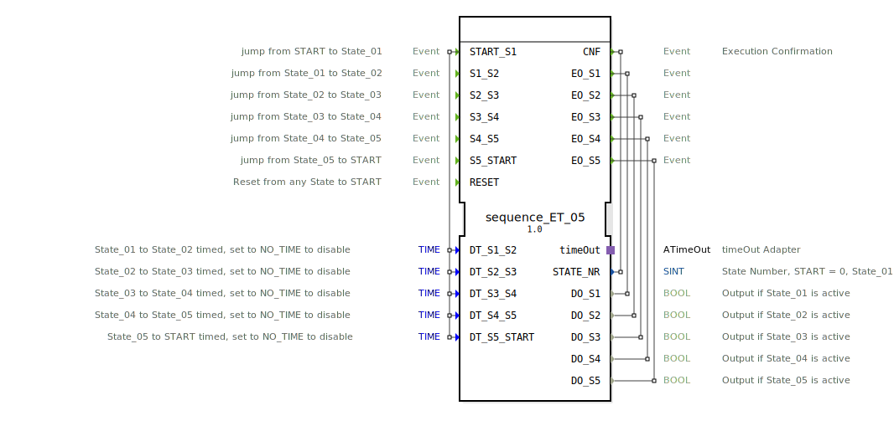

# sequence_ET_05

```{index} single: sequence_ET_05
```


* * * * * * * * * *
## Einleitung
Der Funktionsblock `sequence_ET_05` implementiert eine sequenzielle Steuerung mit fünf definierten Zuständen (State_01 bis State_05) und einem Startzustand (START). Der Übergang zwischen den Zuständen kann entweder durch ein externes Ereignis oder nach Ablauf einer einstellbaren Zeit erfolgen. Der Baustein ist für Anwendungen konzipiert, die eine schrittweise Abfolge von Aktionen mit flexiblen Übergangsbedingungen erfordern.



## Schnittstellenstruktur

### **Ereignis-Eingänge**
*   **`START_S1`**: Wechselt vom Zustand START oder State_00 in den Zustand State_01. Überträgt die Zeitparameter für alle Zustandsübergänge.
*   **`S1_S2`**: Manueller Übergang von State_01 zu State_02.
*   **`S2_S3`**: Manueller Übergang von State_02 zu State_03.
*   **`S3_S4`**: Manueller Übergang von State_03 zu State_04.
*   **`S4_S5`**: Manueller Übergang von State_04 zu State_05.
*   **`S5_START`**: Manueller Übergang von State_05 zurück in den Zustand State_00 (repräsentiert START).
*   **`RESET`**: Führt von jedem beliebigen Zustand sofort zum Zustand State_00 (START) zurück und deaktiviert alle Ausgänge.

### **Ereignis-Ausgänge**
*   **`CNF`**: Ausführungsbestätigung. Wird bei jedem Zustandswechsel ausgelöst und liefert die neue Zustandsnummer (`STATE_NR`).
*   **`EO_S1`**: Wird beim Eintritt in State_01 ausgelöst und liefert den aktiven Ausgang `DO_S1`.
*   **`EO_S2`**: Wird beim Eintritt in State_02 ausgelöst und liefert den aktiven Ausgang `DO_S2`.
*   **`EO_S3`**: Wird beim Eintritt in State_03 ausgelöst und liefert den aktiven Ausgang `DO_S3`.
*   **`EO_S4`**: Wird beim Eintritt in State_04 ausgelöst und liefert den aktiven Ausgang `DO_S4`.
*   **`EO_S5`**: Wird beim Eintritt in State_05 ausgelöst und liefert den aktiven Ausgang `DO_S5`.

### **Daten-Eingänge**
*   **`DT_S1_S2`** (TIME): Verweilzeit in State_01 vor automatischem Übergang zu State_02. Initialwert: `NO_TIME` (deaktiviert).
*   **`DT_S2_S3`** (TIME): Verweilzeit in State_02 vor automatischem Übergang zu State_03. Initialwert: `NO_TIME` (deaktiviert).
*   **`DT_S3_S4`** (TIME): Verweilzeit in State_03 vor automatischem Übergang zu State_04. Initialwert: `NO_TIME` (deaktiviert).
*   **`DT_S4_S5`** (TIME): Verweilzeit in State_04 vor automatischem Übergang zu State_05. Initialwert: `NO_TIME` (deaktiviert).
*   **`DT_S5_START`** (TIME): Verweilzeit in State_05 vor automatischem Übergang zurück zu State_00 (START). Initialwert: `NO_TIME` (deaktiviert).

### **Daten-Ausgänge**
*   **`STATE_NR`** (SINT): Aktuelle Zustandsnummer (START = 0, State_01 = 1, ..., State_05 = 5).
*   **`DO_S1`** (BOOL): Ist `TRUE`, wenn State_01 aktiv ist.
*   **`DO_S2`** (BOOL): Ist `TRUE`, wenn State_02 aktiv ist.
*   **`DO_S3`** (BOOL): Ist `TRUE`, wenn State_03 aktiv ist.
*   **`DO_S4`** (BOOL): Ist `TRUE`, wenn State_04 aktiv ist.
*   **`DO_S5`** (BOOL): Ist `TRUE`, wenn State_05 aktiv ist.

### **Adapter**
*   **`timeOut`** (Plug, Typ: `iec61499::events::ATimeOut`): Wird intern für die zeitgesteuerten Zustandsübergänge verwendet. Der FB startet und stoppt den Timer und setzt dessen Laufzeit (`DT`).

## Funktionsweise
Der FB arbeitet als Basic-FB mit einer ECC (Execution Control Chart). Der initiale Zustand ist `xSTART`. Bei einem `START_S1`-Ereignis wechselt der FB in den Zustand `sState_01`. In jedem aktiven Zustand (sState_01 bis sState_05) werden folgende Aktionen ausgeführt:
1.  Der `timeOut`-Adapter wird gestoppt.
2.  Der Ausgang des vorherigen Zustands wird deaktiviert (Exit-Algorithmus `X`).
3.  Die Zustandsnummer `STATE_NR` wird aktualisiert und die Verweilzeit für den *nächsten* Übergang an den Timer übergeben (Confirmation-Algorithmus `C`). Das `CNF`-Ereignis wird ausgelöst.
4.  Der Ausgang des aktuellen Zustands wird aktiviert (Entry-Algorithmus `E`). Das entsprechende `EO_Sx`-Ereignis wird ausgelöst.
5.  Der `timeOut`-Adapter mit der zuvor gesetzten Zeit wird gestartet.

Ein Zustandswechsel kann nun auf zwei Arten erfolgen:
1.  **Ereignisgesteuert:** Durch das entsprechende manuelle Ereignis (z.B. `S1_S2`).
2.  **Zeitgesteuert:** Durch das `timeOut.TimeOut`-Ereignis des Adapters, sofern die Zeit (`DT_Sx_Sy`) nicht auf `NO_TIME` gesetzt ist.

Das `RESET`-Ereignis führt immer in den speziellen Zustand `sRESET`, in dem alle Ausgänge deaktiviert werden, und von dort sofort in den Zustand `sState_00` (repräsentiert den logischen START-Zustand mit `STATE_NR = 0`).

## Technische Besonderheiten
*   **Flexible Übergänge:** Jeder Zustandsübergang kann unabhängig als ereignis- oder zeitgesteuert konfiguriert werden. Die Zeitsteuerung wird deaktiviert, indem der entsprechende `DT_`-Eingang auf die Konstante `NO_TIME` gesetzt wird.
*   **Sofortiger Reset:** Der `RESET`-Eingang hat jederzeit Priorität und unterbricht die aktuelle Sequenz sofort.
*   **Klar definierte Schnittstelle:** Die Zustandsnummer und die aktiven Ausgänge sind stets als Datenausgänge verfügbar und werden bei jedem Schritt per Ereignis bestätigt.
*   **Adapter-basierte Zeitsteuerung:** Die Nutzung eines standardisierten TimeOut-Adapters macht die interne Zeitverwaltung robust und wiederverwendbar.

## Zustandsübersicht
Die ECC umfasst folgende Zustände:
*   **xSTART:** Initialer Idle-Zustand.
*   **sState_01 ... sState_05:** Die fünf sequenziellen Arbeitszustände.
*   **sState_00:** Repräsentiert den logischen START-Zustand nach Abschluss der Sequenz oder nach einem Reset. Hier ist kein Ausgang aktiv.
*   **sRESET:** Zwischenzustand zur Deaktivierung aller Ausgänge während einer Reset-Operation.

## Anwendungsszenarien
*   **Steuerung von Batch-Prozessen:** Schrittweise Abarbeitung von Rezepten in Misch- oder Füllanlagen, wobei ein Schritt manuell quittiert oder nach einer definierten Zeit automatisch weiter geschaltet wird.
*   **Verkettete Maschinenabläufe:** Steuerung einer Maschine, deren Zyklus aus mehreren nacheinander geschalteten Aktionen besteht (z.B. Einlegen, Bearbeiten, Prüfen, Auswerfen).
*   **Testsequenzen:** Automatisierte Prüfstände, die eine Reihe von Tests nacheinander durchführen, wobei jeder Test eine feste Dauer haben oder manuell bestätigt werden kann.

## Vergleich mit ähnlichen Bausteinen
Im Vergleich zu einfachen Timer-Ketten oder Zählern bietet `sequence_ET_05` eine vollständig gekapselte Zustandsmaschine mit klaren Eingangs-/Ausgangsereignissen und der flexiblen Kombination aus Zeit- und Ereignissteuerung. Gegenüber einem generischen `E_SR`- oder `E_CTUD`-Baustein in einer Ad-hoc-Verknüpfung stellt er eine vordefinierte, getestete und leicht zu parametrierende Lösung für eine häufige Steuerungsaufgabe dar.


## Zugehörige Übungen

* [Uebung_039](../../../../../../training1/Ventilsteuerung/4diacIDE-workspace/test_B/Uebungen_doc/Uebung_039.md)
* [Uebung_039a](../../../../../../training1/Ventilsteuerung/4diacIDE-workspace/test_B/Uebungen_doc/Uebung_039a.md)

## Fazit
Der `sequence_ET_05` ist ein gut strukturierter und flexibler Funktionsblock zur Implementierung von 5-stufigen Sequenzen. Die klare Trennung von Steuerfluss (Ereignisse) und Parametern (Zeiten) sowie die Möglichkeit, jeden Übergang wahlweise manuell oder automatisch zu gestalten, machen ihn für eine Vielzahl von Steuerungsaufgaben in der Automatisierungstechnik geeignet. Die Nutzung standardisierter Adapter und die ausführliche Dokumentation der Schnittstellen erleichtern die Integration in größere Anwendungen.