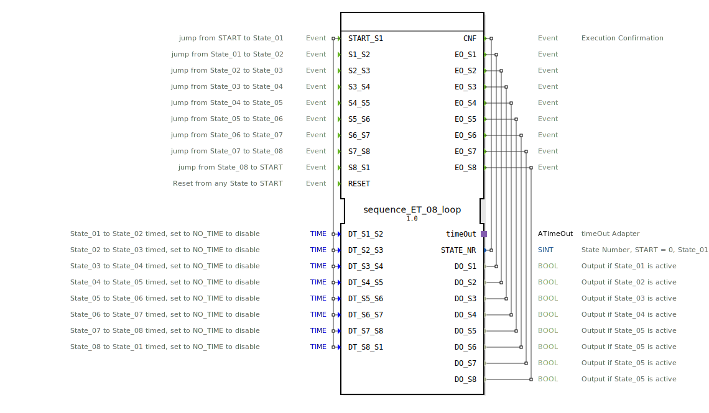

# sequence_ET_08_loop

```{index} single: sequence_ET_08_loop
```


* * * * * * * * * *
## Einleitung
Der Funktionsblock `sequence_ET_08_loop` ist ein Sequenzer mit acht Ausgangszuständen, der in einer Schleife arbeitet. Er ermöglicht den Übergang zwischen den Zuständen entweder durch ein externes Ereignis oder zeitgesteuert nach einem einstellbaren Zeitintervall. Der Baustein ist für Steuerungsaufgaben konzipiert, bei denen eine festgelegte Abfolge von Aktionen (repräsentiert durch die Ausgänge `DO_S1` bis `DO_S8`) durchlaufen werden muss. Ein zentrales Merkmal ist die Möglichkeit, jeden Zustandsübergang individuell als ereignis- oder zeitgesteuert zu konfigurieren.



## Schnittstellenstruktur

### **Ereignis-Eingänge**
*   **`START_S1`**: Startet die Sequenz und führt vom `START`-Zustand in den Zustand `State_01`. Überträgt alle Zeitdaten (`DT_S1_S2` bis `DT_S8_S1`).
*   **`S1_S2` bis `S8_S1`**: Führen den Übergang vom entsprechenden Quell- zum nächsten Zielzustand durch (z.B. `S1_S2` von `State_01` nach `State_02`). Diese Übergänge sind nur wirksam, wenn die Zeitsteuerung für diesen Schritt deaktiviert ist.
*   **`RESET`**: Setzt die Sequenz aus jedem beliebigen Zustand zurück in den initialen `START`-Zustand.

### **Ereignis-Ausgänge**
*   **`CNF`**: Allgemeines Bestätigungsereignis (Execution Confirmation), das bei jedem Zustandswechsel ausgelöst wird. Überträgt die aktuelle Zustandsnummer `STATE_NR`.
*   **`EO_S1` bis `EO_S8`**: Zustandsspezifische Ausgangsereignisse, die beim Eintritt in den entsprechenden Zustand (`State_01` bis `State_08`) ausgelöst werden. Jedes Ereignis überträgt den zugehörigen booleschen Datenausgang (`DO_Sx`).

### **Daten-Eingänge**
*   **`DT_S1_S2` bis `DT_S8_S1`** (Typ: `TIME`): Definieren die Zeitdauer, für die der jeweilige Zustand aktiv bleibt, bevor ein automatischer, zeitgesteuerter Übergang zum nächsten Zustand erfolgt. Um die Zeitsteuerung für einen bestimmten Übergang zu deaktivieren und auf rein ereignisgesteuerte Übergänge umzuschalten, muss der Wert auf die Konstante `NO_TIME` gesetzt werden. Initial sind alle Zeiteingänge auf `NO_TIME` voreingestellt.

### **Daten-Ausgänge**
*   **`STATE_NR`** (Typ: `SINT`): Gibt die Nummer des aktuell aktiven Zustands aus (START = 0, State_01 = 1, ..., State_08 = 8).
*   **`DO_S1` bis `DO_S8`** (Typ: `BOOL`): Die physischen Ausgänge der Sequenz. Jeder Ausgang wird auf `TRUE` gesetzt, wenn sich der FB im entsprechenden Zustand befindet (`DO_S1` in `State_01`, usw.), andernfalls ist er `FALSE`.

### **Adapter**
*   **`timeOut`** (Typ: `ATimeOut`): Ein eingesteckter (Plug) Timeout-Adapter, der für die Realisierung der zeitgesteuerten Zustandsübergänge genutzt wird. Der FB startet und stoppt den Timer und übergibt ihm die jeweilige Zeiteinstellung (`DT_Sx_Sy`).

## Funktionsweise
Der FB ist als Basic Function Block (BFB) mit einer Execution Control Chart (ECC) implementiert. Die ECC besteht aus den Zuständen `xSTART` (Initialzustand), `sState_01` bis `sState_08` (aktive Sequenzzustände) und `sRESET` (Reset-Zustand).

Beim Eintritt in einen aktiven Zustand (z.B. `sState_01`) werden nacheinander folgende Aktionen ausgeführt:
1.  Der `timeOut`-Timer wird gestoppt.
2.  Der Exit-Algorithmus (`X`) des vorherigen Zustands wird ausgeführt (setzt den vorherigen Ausgang `DO_Sx` auf `FALSE`).
3.  Der Confirmation-Algorithmus (`C`) des neuen Zustands wird ausgeführt (setzt `STATE_NR` und konfiguriert den `timeOut`-Adapter mit der für diesen Zustand eingestellten Zeit `DT`).
4.  Der Entry-Algorithmus (`E`) des neuen Zustands wird ausgeführt (setzt den zugehörigen Ausgang `DO_Sx` auf `TRUE` und löst das Ereignis `EO_Sx` aus).
5.  Der `timeOut`-Timer wird mit der eingestellten Zeit gestartet.

Ein Zustandswechsel kann auf zwei Arten ausgelöst werden:
1.  **Ereignisgesteuert:** Durch das entsprechende Ereignis `Sx_Sy`, sofern der Timer für diesen Übergang deaktiviert (`DT = NO_TIME`) ist.
2.  **Zeitgesteuert:** Durch das `TimeOut`-Ereignis des Adapters, sofern eine gültige Zeit (`DT != NO_TIME`) eingestellt ist.

Das `RESET`-Ereignis führt in den `sRESET`-Zustand, deaktiviert alle Ausgänge und bestätigt den Zustand `0` (`START`), bevor der FB zurück in `xSTART` wechselt.

## Technische Besonderheiten
*   **Hybride Triggerung:** Jeder Zustandsübergang kann individuell konfiguriert werden. Dies bietet maximale Flexibilität für Sequenzen, die teils sensor-, teils zeitgesteuert ablaufen.
*   **Initiale Konfiguration:** Standardmäßig sind alle Übergänge ereignisgesteuert (`NO_TIME`), was eine explizite Konfiguration der Zeitwerte erforderlich macht, um Zeitsteuerung zu nutzen.
*   **Zustandsbestätigung:** Das `CNF`-Ereignis mit `STATE_NR` ermöglicht eine einfache Überwachung und Visualisierung der aktuellen Sequenzposition.
*   **Geschlossene Schleife:** Die Sequenz läuft von `State_08` automatisch zurück zu `State_01`, wodurch zyklische Prozesse realisiert werden können.

## Zustandsübersicht
Der FB durchläuft folgende Zustände in der ECC:
*   **`xSTART`:** Inaktiver Initialzustand. Wartet auf `START_S1`.
*   **`sState_01` bis `sState_08`:** Aktive Arbeitszustände. Jeder Zustand aktiviert seinen spezifischen Ausgang (`DO_Sx`) und wartet auf Trigger für den Übergang zum nächsten Zustand.
*   **`sRESET`:** Reset-Zustand. Wird bei `RESET`-Ereignis aus jedem Zustand angesprungen, deaktiviert alle Ausgänge und führt zurück zu `xSTART`.

Die Übergangsbedingungen sind in der ECC definiert und kombinieren die Ereignisse `Sx_Sy`, `timeOut.TimeOut` und `RESET`.

## Anwendungsszenarien
*   **Steuerung von Batch-Prozessen:** Ablaufsteuerung für Misch-, Heiz- oder Abfüllvorgänge, bei denen einzelne Schritte unterschiedlich lange dauern.
*   **Verkettete Maschinenabläufe:** Steuerung einer Maschine, deren Arbeitszyklus aus mehreren nacheinander geschalteten Positionen oder Funktionen besteht (z.B. Drehen, Bohren, Fräsen).
*   **Teststände:** Automatisierte Durchführung von Testsequenzen, bei denen Prüfungen (ereignisgesteuert) mit Wartezeiten (zeitgesteuert) kombiniert werden.
*   **Verpackungsmaschinen:** Steuerung des Zyklus "Produkt zuführen - Verpackung schließen - Etikettieren - Austragen".

## Vergleich mit ähnlichen Bausteinen
Im Vergleich zu einfacheren Timern oder Flip-Flops bietet dieser FB eine vordefinierte, robuste Zustandsmaschine für 8-Schritt-Sequenzen. Gegenüber einer individuell programmierten SFC (Sequential Function Chart) in einem Service- oder Composite-FB stellt `sequence_ET_08_loop` eine sofort einsatzbereite, getestete und wiederverwendbare Komponente dar, die die Entwicklung beschleunigt und die Fehleranfälligkeit verringert. Bausteine mit fester Zustandsanzahl sind oft performanter und einfacher zu konfigurieren als vollständig frei programmierbare Sequenzer.

## Fazit
Der `sequence_ET_08_loop` ist ein leistungsstarker und flexibler Funktionsblock für die Steuerung zyklischer 8-Stufen-Sequenzen. Seine Stärke liegt in der hybriden Triggerung, die für jede Stufe frei wählbar ist, und der klaren, ereignisbasierten Schnittstelle nach IEC 61499. Durch die integrierte Zeitsteuerung und die direkten booleschen Ausgänge eignet er sich ideal für die direkte Ansteuerung von Aktoren in einem übergeordneten Steuerungsnetzwerk.