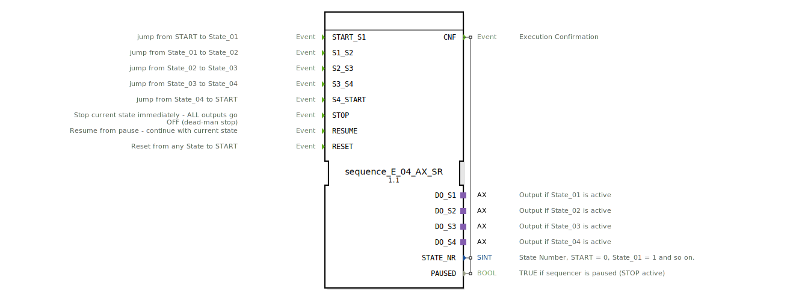

# sequence_E_04_AX_SR

* * * * * * * * * *
## Einleitung
Der Funktionsblock `sequence_E_04_AX_SR` realisiert einen ereignisgesteuerten Sequenzer mit vier Ausgängen über AX-Adapter. Er bietet zusätzlich einen Sicherheitsstopp (STOP), eine Wiederaufnahme (RESUME) und einen Reset (RESET). Die Sequenz durchläuft die Zustände State_00, State_01, State_02, State_03, State_04 und kann zyklisch betrieben werden.

## Schnittstellenstruktur
### **Ereignis-Eingänge**

| Ereignis | Beschreibung |
|----------|--------------|
| `START_S1` | Übergang von START/State_00 nach State_01 |
| `S1_S2`   | Übergang von State_01 nach State_02 |
| `S2_S3`   | Übergang von State_02 nach State_03 |
| `S3_S4`   | Übergang von State_03 nach State_04 |
| `S4_START`| Übergang von State_04 zurück zu State_00 |
| `STOP`    | Unterbricht den aktuellen Zustand sofort – alle Ausgänge werden ausgeschaltet (Dead-Man-Stop) |
| `RESUME`  | Setzt die Sequenz aus dem pausierten Zustand fort (Ausgänge werden wieder aktiviert) |
| `RESET`   | Setzt die Sequenz aus jedem Zustand zurück in den START-Zustand (State_00) |

### **Ereignis-Ausgänge**

| Ereignis | Beschreibung |
|----------|--------------|
| `CNF` | Bestätigung der Ausführung. Mitgeführte Ausgabedaten: `STATE_NR`, `PAUSED` |

### **Daten-Eingänge**
Keine externen Dateneingänge.

### **Daten-Ausgänge**

| Variable | Typ   | Beschreibung |
|----------|-------|--------------|
| `STATE_NR` | SINT | Aktuelle Zustandsnummer: START = 0, State_01 = 1, …, State_04 = 4 |
| `PAUSED`   | BOOL | `TRUE`, wenn der Sequenzer pausiert ist (STOP aktiv) |

### **Adapter**

| Adapter  | Typ                                | Beschreibung |
|----------|------------------------------------|--------------|
| `DO_S1`  | `adapter::types::unidirectional::AX` | Ausgang, der in State_01 aktiv ist (D1 = TRUE) |
| `DO_S2`  | `adapter::types::unidirectional::AX` | Ausgang, der in State_02 aktiv ist |
| `DO_S3`  | `adapter::types::unidirectional::AX` | Ausgang, der in State_03 aktiv ist |
| `DO_S4`  | `adapter::types::unidirectional::AX` | Ausgang, der in State_04 aktiv ist |

## Funktionsweise
Der Sequenzer arbeitet nach einem endlichen Automaten (ECC). Die fünf sequenziellen Zustände sind:
- `State_00` (START)
- `State_01`
- `State_02`
- `State_03`
- `State_04`

Der normale Ablauf beginnt mit `START_S1` (entweder aus `xSTART` oder aus `State_00`), wodurch in `State_01` gewechselt wird. Bei jedem Schritt schaltet der FB den entsprechenden Adapterausgang ein (z. B. DO_S1.D1 = TRUE in State_01) und über den Ereignisausgang `CNF` werden die aktuellen Werte von `STATE_NR` und `PAUSED` mitgegeben. Der Übergang zum nächsten Zustand erfolgt durch die entsprechenden Ereignisse (`S1_S2`, `S2_S3`, `S3_S4`) und von `State_04` zurück zu `State_00` mit `S4_START`.

Wird `STOP` empfangen, deaktiviert der FB sofort den aktuellen Ausgang (Exit-Step) und speichert den aktuellen Zustand in der internen Variable `savedState`. Der Zustand wechselt in einen der pausierten Zustände (`sPAUSED_S1` bis `sPAUSED_S4` oder `sPAUSED_S0`). Der Ausgang `PAUSED` wird auf `TRUE` gesetzt. Ein `RESUME`-Ereignis stellt den gespeicherten Zustand wieder her und aktiviert den entsprechenden Ausgang erneut.

Der `RESET`-Befehl bringt den Sequenzer unabhängig vom aktuellen Zustand in einen Reset-Zustand, in dem alle vier Ausgänge explizit ausgeschaltet werden, und wechselt dann sofort nach `State_00`.

## Technische Besonderheiten
- **AX-Adapter**: Die vier Ausgänge werden über unidirektionale AX-Adapter realisiert, die je einen booleschen Wert `D1` besitzen. Die Ausgänge werden nur in den aktiven Zuständen gesetzt, bei Verlassen oder beim Stopp sofort zurückgesetzt.
- **Pause/Resume-Mechanismus**: Die interne Variable `savedState` speichert den Zustand zum Zeitpunkt des Stopps, sodass nach `RESUME` exakt der gleiche Zustand fortgesetzt werden kann.
- **Sicherheitsstopp**: Der `STOP`-Ereignis bewirkt ein sofortiges Abschalten aller Ausgänge (auch ohne Eintreten in einen pausierten Zustand), was als Dead-Man-Stop ausgelegt ist.
- **Verwendung von Konstanten aus dem Paket `sequence`**: Die Zustandsnummern (`State_00`, `State_01`, …) sind als benannte Konstanten im Package `logiBUS::utils::sequence::const::sequence` definiert.
- **Reset-Verhalten**: Der `RESET` schaltet vor dem Rücksprung nach State_00 alle vier Ausgänge aus, wodurch ein definierter Ausgangszustand gewährleistet wird.

## Zustandsübersicht

| Zustand          | Aktiver Ausgang | `STATE_NR` | `PAUSED` |
|------------------|-----------------|------------|----------|
| xSTART           | keiner          | 0          | FALSE    |
| sState_00        | keiner          | 0          | FALSE    |
| sState_01        | DO_S1          | 1          | FALSE    |
| sState_02        | DO_S2          | 2          | FALSE    |
| sState_03        | DO_S3          | 3          | FALSE    |
| sState_04        | DO_S4          | 4          | FALSE    |
| sPAUSED_S0       | keiner          | gespeichert | TRUE     |
| sPAUSED_S1       | keiner          | gespeichert | TRUE     |
| sPAUSED_S2       | keiner          | gespeichert | TRUE     |
| sPAUSED_S3       | keiner          | gespeichert | TRUE     |
| sPAUSED_S4       | keiner          | gespeichert | TRUE     |
| sRESET           | keiner          | –           | –        |

## Anwendungsszenarien
- **Steuerung sequenzieller Prozesse**: z. B. eine Maschine, die nacheinander vier Arbeitsschritte ausführt, wobei jeder Schritt einen eigenen Aktor ansteuert.
- **Sicherheitskritische Anwendungen**: Wenn ein `STOP`-Signal sofort alle Aktoren abschalten muss (z. B. Not-Halt), und nach Freigabe der genaue Zustand wiederhergestellt wird.
- **Zyklische Abläufe**: von Schritt 1 bis 4 und zurück zu Schritt 0 (z. B. in Verpackungsmaschinen).
- **Manuelles Eingreifen**: über `RESET` kann der Ablauf jederzeit auf den Anfang zurückgesetzt werden.

## Vergleich mit ähnlichen Bausteinen
Im Gegensatz zu einfacheren Sequenzern (z. B. ohne STOP/RESUME) bietet `sequence_E_04_AX_SR`:
- **Sicherheitsunterbrechung mit definiertem Ausschalten** aller Ausgänge.
- **Pause- und Resume-Funktion**, die den aktuellen Zustand speichert.
- **Zyklische Rücksprungmöglichkeit** von Schritt 4 zu Schritt 0.
- **Ausgabe des aktuellen Zustands** als Zahl und Pausenstatus.

Andere Bausteine mit gleicher Ausgangsanzahl, aber ohne STOP/RESUME, sind einfacher in der Handhabung, bieten jedoch keine Sicherheitsfunktion.

## Fazit
Der Funktionsblock `sequence_E_04_AX_SR` ist ein vielseitiger, sicherheitsbewusster Sequenzer für vier Schritte. Er eignet sich besonders für Steuerungen, bei denen ein unterbrechbarer Ablauf mit definierten Ausgangszuständen und Wiederaufnahmeoption erforderlich ist. Die Schnittstelle ist klar strukturiert, die Implementierung robust und durch den Einsatz von AX-Adaptern gut in Automatisierungsumgebungen integrierbar.