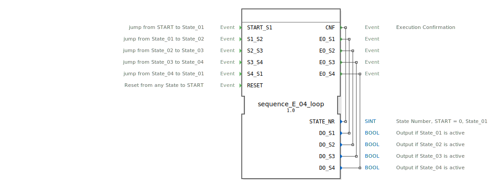

# sequence_E_04_loop

```{index} single: sequence_E_04_loop
```


* * * * * * * * * *
## Einleitung
Der Funktionsblock `sequence_E_04_loop` implementiert eine zyklische Sequenz mit vier Zuständen. Die Zustandsübergänge werden ausschließlich durch externe Ereignisse ausgelöst. Der Baustein ist für Steuerungsaufgaben konzipiert, bei denen eine feste Abfolge von Aktionen (repräsentiert durch die Ausgänge `DO_S1` bis `DO_S4`) durchlaufen werden muss und ein Rücksetzen von jedem Zustand aus möglich sein soll.



## Schnittstellenstruktur

### **Ereignis-Eingänge**
*   **`START_S1`**: Wechselt vom initialen `START`-Zustand in den ersten aktiven Zustand `State_01`.
*   **`S1_S2`**: Wechselt von `State_01` zu `State_02`.
*   **`S2_S3`**: Wechselt von `State_02` zu `State_03`.
*   **`S3_S4`**: Wechselt von `State_03` zu `State_04`.
*   **`S4_S1`**: Wechselt von `State_04` zurück zu `State_01` und schließt damit den Zyklus.
*   **`RESET`**: Setzt den Baustein von jedem beliebigen aktiven Zustand (`State_01` bis `State_04`) zurück in den initialen `START`-Zustand.

### **Ereignis-Ausgänge**
*   **`CNF`**: Wird bei jedem Zustandswechsel ausgelöst und bestätigt die Ausführung. Transportiert den aktuellen Zustandscode über `STATE_NR`.
*   **`EO_S1`**: Wird beim Eintritt in `State_01` ausgelöst. Transportiert den Wert `TRUE` für `DO_S1`.
*   **`EO_S2`**: Wird beim Eintritt in `State_02` ausgelöst. Transportiert den Wert `TRUE` für `DO_S2`.
*   **`EO_S3`**: Wird beim Eintritt in `State_03` ausgelöst. Transportiert den Wert `TRUE` für `DO_S3`.
*   **`EO_S4`**: Wird beim Eintritt in `State_04` ausgelöst. Transportiert den Wert `TRUE` für `DO_S4`.

### **Daten-Eingänge**
*   Dieser Funktionsblock besitzt keine Dateneingänge.

### **Daten-Ausgänge**
*   **`STATE_NR`** (SINT): Gibt die Nummer des aktuellen Zustands aus. Die Kodierung lautet: START = 0, State_01 = 1, State_02 = 2, State_03 = 3, State_04 = 4.
*   **`DO_S1`** (BOOL): Ist `TRUE`, wenn der Zustand `State_01` aktiv ist.
*   **`DO_S2`** (BOOL): Ist `TRUE`, wenn der Zustand `State_02` aktiv ist.
*   **`DO_S3`** (BOOL): Ist `TRUE`, wenn der Zustand `State_03` aktiv ist.
*   **`DO_S4`** (BOOL): Ist `TRUE`, wenn der Zustand `State_04` aktiv ist.

### **Adapter**
*   Dieser Funktionsblock verwendet keine Adapter.

## Funktionsweise
Der Baustein ist als Basic Function Block (BFB) mit einer Execution Control Chart (ECC) implementiert. Die interne Logik basiert auf sechs Zuständen: einem initialen Zustand (`xSTART`), vier aktiven Arbeitszuständen (`sState_01` bis `sState_04`) und einem speziellen Reset-Zustand (`sRESET`).

Bei einem Zustandswechsel werden drei Aktionen nacheinander ausgeführt:
1.  **Exit-Algorithmus (X)**: Der Ausgang des vorherigen Zustands wird auf `FALSE` gesetzt.
2.  **Confirmation-Algorithmus (C)**: Die Zustandsnummer `STATE_NR` wird aktualisiert und das `CNF`-Ereignis wird ausgelöst.
3.  **Entry-Algorithmus (E)**: Der Ausgang des neuen Zustands wird auf `TRUE` gesetzt und das entsprechende Ereignis (`EO_Sx`) wird ausgelöst.

Ein `RESET`-Ereignis führt immer in den `sRESET`-Zustand, wo alle Ausgänge (`DO_S1` bis `DO_S4`) deaktiviert werden, die Zustandsnummer auf 0 (`START`) gesetzt und ein `CNF` gesendet wird. Anschließend wechselt der Baustein automatisch zurück in den initialen `xSTART`-Zustand.

## Technische Besonderheiten
*   **Ereignisgesteuerte Transitionen**: Im Gegensatz zu zeit- oder bedingungsgesteuerten Sequenzern erfolgen alle Zustandsübergänge nur bei Eintreffen des spezifischen Ereignisses. Es gibt keine automatischen oder zeitgesteuerten Weiter schaltungen.
*   **Explizite Reset-Logik**: Der Reset-Vorgang ist als eigener Zustand (`sRESET`) modelliert, der alle Ausgänge sauber zurücksetzt, bevor der Startzustand wieder erreicht wird.
*   **Zustandskodierung**: Die Verwendung der Konstanten aus `sequence::State_xx` für die Zuweisung an `STATE_NR` erhöht die Wartbarkeit und Lesbarkeit des Codes.

## Zustandsübersicht
1.  **xSTART**: Initialer, inaktiver Zustand. Alle Ausgänge sind `FALSE`, `STATE_NR` ist 0.
2.  **sState_01**: Erster aktiver Zustand. `DO_S1 = TRUE`, `STATE_NR = 1`.
3.  **sState_02**: Zweiter aktiver Zustand. `DO_S2 = TRUE`, `STATE_NR = 2`.
4.  **sState_03**: Dritter aktiver Zustand. `DO_S3 = TRUE`, `STATE_NR = 3`.
5.  **sState_04**: Vierter aktiver Zustand. `DO_S4 = TRUE`, `STATE_NR = 4`.
6.  **sRESET**: Temporärer Reset-Zustand. Setzt alle Aktor-Ausgänge (`DO_Sx`) auf `FALSE` und `STATE_NR` auf 0.

Die erlaubten Übergänge sind: `START -> S1 -> S2 -> S3 -> S4 -> (S1)` sowie von jedem Zustand `S1-S4` via `RESET` zurück zu `START`.

## Anwendungsszenarien
*   **Schrittkettensteuerungen**: Steuerung von Maschinenabläufen, bei denen jeder Schritt manuell oder durch ein Sensorsignal freigegeben werden muss (z.B. manuelle Bestückungsstationen).
*   **Taktgesteuerte Prozesse**: In Produktionslinien, wo ein zentraler Taktgeber (`Sx_Sy`-Ereignisse) den Fortschritt der Baugruppe von Station zu Station signalisiert.
*   **Test- und Inbetriebnahmesequenzen**: Strukturierte Abfolge von Tests, die vom Bediener bestätigt werden müssen.

## Vergleich mit ähnlichen Bausteinen
Im Vergleich zu einem **Zyklischen Sequenzer mit Timer** (z.B. `E_CYCLE`) fehlt hier die integrierte Zeitsteuerung; die Weiter schaltung erfolgt rein ereignisbasiert. Gegenüber einem **Binären Schieberegister** oder Zähler bietet dieser Baustein eine explizite, leicht nachvollziehbare Zustandsmaschine mit klaren Entry/Exit-Aktionen und einem dedizierten Reset-Pfad, was die Fehlersuche vereinfacht.

## Fazit
Der `sequence_E_04_loop` ist ein robuster und klar strukturierter Funktionsblock zur Implementierung einer ereignisgesteuerten 4-Zustands-Sequenz. Seine Stärken liegen in der expliziten Modellierung jedes Zustandsübergangs, der sauberen Reset-Logik und der klaren Trennung von Entry-, Exit- und Bestätigungsaktionen. Er eignet sich ideal für Anwendungen, bei denen die Ablaufsteuerung durch externe Signale (Taster, Sensoren, übergeordnete Steuerungen) erfolgen soll.