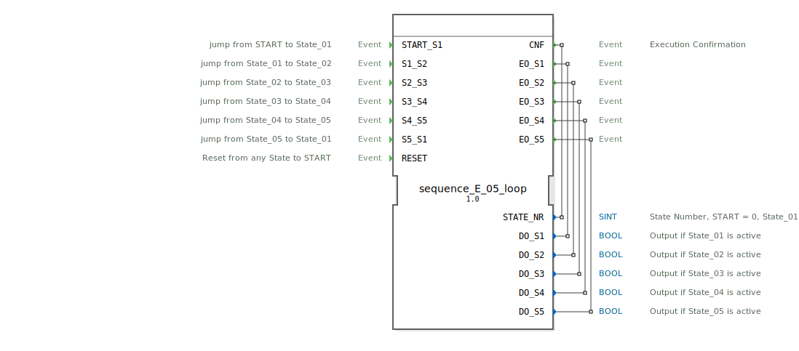

# sequence_E_05_loop

```{index} single: sequence_E_05_loop
```


* * * * * * * * * *
## Einleitung
Der Funktionsblock `sequence_E_05_loop` implementiert eine zyklische Sequenz mit fünf Zuständen. Der Übergang zwischen den einzelnen Zuständen erfolgt ausschließlich über externe Ereignisse. Der Baustein ist für Anwendungen konzipiert, in denen ein Prozessschritt erst nach Abschluss eines vorherigen Schritts und dem Eintreffen eines spezifischen Freigabesignals beginnen darf. Die Sequenz kann von jedem Zustand aus in den initialen Startzustand zurückgesetzt werden.



## Schnittstellenstruktur
### **Ereignis-Eingänge**
*   `START_S1`: Wechselt vom Startzustand (`START`) in den ersten aktiven Zustand (`State_01`).
*   `S1_S2`: Wechselt von `State_01` zu `State_02`.
*   `S2_S3`: Wechselt von `State_02` zu `State_03`.
*   `S3_S4`: Wechselt von `State_03` zu `State_04`.
*   `S4_S5`: Wechselt von `State_04` zu `State_05`.
*   `S5_S1`: Wechselt von `State_05` zurück zu `State_01` (Zyklus).
*   `RESET`: Setzt die Sequenz von jedem beliebigen Zustand in den initialen Startzustand (`START`) zurück.

### **Ereignis-Ausgänge**
*   `CNF`: Allgemeines Bestätigungsereignis, das bei jedem Zustandswechsel ausgelöst wird. Es liefert die aktuelle Zustandsnummer (`STATE_NR`) mit.
*   `EO_S1`: Wird beim Eintritt in `State_01` ausgelöst und liefert den zugehörigen Datenausgang `DO_S1` mit.
*   `EO_S2`: Wird beim Eintritt in `State_02` ausgelöst und liefert den zugehörigen Datenausgang `DO_S2` mit.
*   `EO_S3`: Wird beim Eintritt in `State_03` ausgelöst und liefert den zugehörigen Datenausgang `DO_S3` mit.
*   `EO_S4`: Wird beim Eintritt in `State_04` ausgelöst und liefert den zugehörigen Datenausgang `DO_S4` mit.
*   `EO_S5`: Wird beim Eintritt in `State_05` ausgelöst und liefert den zugehörigen Datenausgang `DO_S5` mit.

### **Daten-Eingänge**
*   Dieser Funktionsblock besitzt keine Dateneingänge.

### **Daten-Ausgänge**
*   `STATE_NR` (SINT): Gibt die Nummer des aktuell aktiven Zustands aus. Die Kodierung lautet: START = 0, State_01 = 1, State_02 = 2, ..., State_05 = 5.
*   `DO_S1` (BOOL): Ist `TRUE`, wenn `State_01` aktiv ist.
*   `DO_S2` (BOOL): Ist `TRUE`, wenn `State_02` aktiv ist.
*   `DO_S3` (BOOL): Ist `TRUE`, wenn `State_03` aktiv ist.
*   `DO_S4` (BOOL): Ist `TRUE`, wenn `State_04` aktiv ist.
*   `DO_S5` (BOOL): Ist `TRUE`, wenn `State_05` aktiv ist.

### **Adapter**
*   Dieser Funktionsblock verwendet keine Adapter.

## Funktionsweise
Der FB ist als Basic Function Block (BFB) mit einer Execution Control Chart (ECC) implementiert. Die interne Logik basiert auf sieben Zuständen: einem initialen Startzustand (`xSTART`), fünf aktiven Zuständen (`sState_01` bis `sState_05`) und einem separaten Reset-Zustand (`sRESET`).

Bei Eintritt in einen aktiven Zustand werden drei Aktionen nacheinander ausgeführt:
1.  **Exit-Aktion des vorherigen Zustands:** Der entsprechende `State_XX_X`-Algorithmus setzt den zugehörigen Datenausgang (`DO_Sx`) auf `FALSE`.
2.  **Confirmation-Aktion:** Der `State_XX_C`-Algorithmus setzt die Zustandsnummer `STATE_NR` und löst das `CNF`-Ereignis aus.
3.  **Entry-Aktion des neuen Zustands:** Der `State_XX_E`-Algorithmus setzt den zugehörigen Datenausgang (`DO_Sx`) auf `TRUE` und löst das entsprechende Ereignis `EO_Sx` aus.

Ein `RESET`-Ereignis führt in den `sRESET`-Zustand. Hier werden alle potenziell aktiven Ausgänge (`DO_S1` bis `DO_S5`) über die jeweiligen Exit-Algorithmen deaktiviert, die Zustandsnummer auf 0 (`START`) gesetzt und ein `CNF`-Ereignis ausgelöst. Anschließend wechselt der FB automatisch (Bedingung = `1`, also immer wahr) zurück in den initialen `xSTART`-Zustand.

## Technische Besonderheiten
*   **Ereignisgesteuerte Transitionen:** Jeder Zustandsübergang muss explizit durch das entsprechende Eingangsereignis ausgelöst werden. Es gibt keine zeit- oder datengesteuerten automatischen Übergänge.
*   **Entkoppelte Signale:** Die booleschen Zustandsausgänge (`DO_Sx`) und die zugehörigen Ereignisausgänge (`EO_Sx`) werden synchron gesetzt und ausgelöst. Dies erlaubt eine flexible Anbindung an nachfolgende Logik.
*   **Explizite Reset-Logik:** Der Reset-Vorgang deaktiviert systematisch alle Ausgänge, bevor der Startzustand wiederhergestellt wird, was ein sauberes und definiertes Verhalten gewährleistet.
*   **Konstanten für Zustandsnummern:** Die Zustandsnummern werden über den importierten Namensraum `sequence::` (z.B. `sequence::State_01`) zugewiesen, was die Wartbarkeit und Lesbarkeit des Codes erhöht.

## Zustandsübersicht
Die ECC besteht aus folgenden Zuständen und möglichen Übergängen:
*   **xSTART:** Initialer, inaktiver Zustand. Übergang zu `sState_01` via `START_S1`.
*   **sState_01:** Erster aktiver Zustand. Übergänge zu `sState_02` via `S1_S2` oder zu `sRESET` via `RESET`.
*   **sState_02:** Zweiter aktiver Zustand. Übergänge zu `sState_03` via `S2_S3` oder zu `sRESET` via `RESET`.
*   **sState_03:** Dritter aktiver Zustand. Übergänge zu `sState_04` via `S3_S4` oder zu `sRESET` via `RESET`.
*   **sState_04:** Vierter aktiver Zustand. Übergänge zu `sState_05` via `S4_S5` oder zu `sRESET` via `RESET`.
*   **sState_05:** Fünfter aktiver Zustand. Übergänge zu `sState_01` via `S5_S1` (Zyklus) oder zu `sRESET` via `RESET`.
*   **sRESET:** Reset-Zustand. Führt Reset-Aktionen aus und wechselt anschließend bedingungslos zurück zu `xSTART`.

## Anwendungsszenarien
*   **Schrittkettensteuerungen:** Steuerung von Maschinenabläufen, bei denen jeder Schritt manuell oder durch ein Sensorsignal freigegeben werden muss (z.B. Handarbeitsplatz mit Freigabetaster).
*   **Batch-Prozesse:** Durchführung von Rezeptschritten, bei denen der Operator oder ein übergeordnetes System den nächsten Schritt bestätigen muss.
*   **Sicherheitskritische Sequenzen:** Prozesse, bei denen ein unkontrollierter automatischer Wechsel vermieden werden soll.
*   **Test- und Inbetriebnahmesequenzen:** Manuelles Durchschalten von einzelnen Funktionen eines Systems.

## ⚖️ Vergleich mit ähnlichen Bausteinen
Im Gegensatz zu **zyklisch ablaufenden Sequenzern** (z.B. `E_CYCLE`) oder **zeitgesteuerten Sequenzern** (mit `DELAY`-Blöcken) verharrt dieser Baustein in jedem Zustand, bis das spezifische Wechselereignis eintrifft. Er bietet damit maximale externe Kontrolle. Im Vergleich zu einem generischen **Zähler** (`CTU`) mit nachgelagerter Dekodierlogik bietet dieser FB eine vollständig gekapselte, zustandsbasierte Lösung mit klaren Entry/Exit-Aktionen und einem integrierten Reset-Mechanismus.

## Fazit
Der `sequence_E_05_loop` ist ein robuster und einfach zu konfigurierender Funktionsblock für ereignisgesteuerte Schrittketten mit fünf Zuständen. Seine klare Schnittstelle, die saubere Trennung von Entry-/Exit-Logik und der zuverlässige Reset-Mechanismus machen ihn ideal für Anwendungen, bei denen jeder Prozessschritt explizit freigegeben werden muss. Die mitgeführten Datenausgänge und Bestätigungsereignisse ermöglichen eine einfache Integration in übergeordnete Steuerungs- und Visualisierungssysteme.