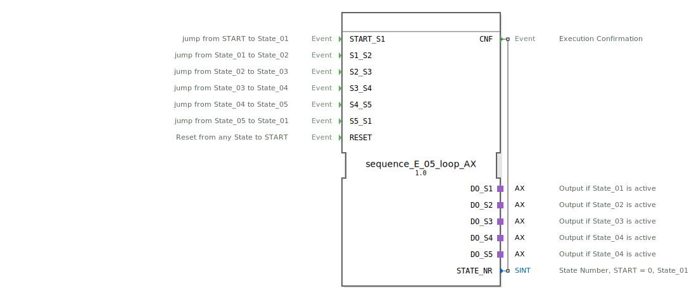

# sequence_E_05_loop_AX

```{index} single: sequence_E_05_loop_AX
```

* * * * * * * * * *
## Einleitung
`sequence_E_05_loop_AX` ist eine Variante des `sequence_E_05_loop`, die zusätzlich Adapter (`AX`) für die Ausgänge verwendet. Er steuert eine rein ereignisgesteuerte, zyklische Sequenz mit 5 Ausgabezuständen.



## Schnittstellenstruktur

### **Ereignis-Eingänge**
*   **START_S1**: Startet die Sequenz bei State_01.
*   **S1_S2**: Übergang State_01 -> State_02.
*   **S2_S3**: Übergang State_02 -> State_03.
*   **S3_S4**: Übergang State_03 -> State_04.
*   **S4_S5**: Übergang State_04 -> State_05.
*   **S5_S1**: Übergang State_05 -> State_01 (Loop).
*   **RESET**: Setzt die Sequenz zurück.

### **Ereignis-Ausgänge**
*   **CNF**: Bestätigung der Ausführung.

### **Daten-Eingänge**
*   Keine.

### **Daten-Ausgänge**
*   **STATE_NR** (SINT): Aktuelle Zustandsnummer.

### **Adapter**
*   **DO_S1** (adapter::types::unidirectional::AX): Ausgangsadapter für State_01.
*   **DO_S2** (adapter::types::unidirectional::AX): Ausgangsadapter für State_02.
*   **DO_S3** (adapter::types::unidirectional::AX): Ausgangsadapter für State_03.
*   **DO_S4** (adapter::types::unidirectional::AX): Ausgangsadapter für State_04.
*   **DO_S5** (adapter::types::unidirectional::AX): Ausgangsadapter für State_05.

## Funktionsweise
Entspricht `sequence_E_05_loop`, verwendet jedoch Adapter für die Ausgänge.

## Technische Besonderheiten
*   Verwendung von `adapter::types::unidirectional::AX`.

## Zustandsübersicht
Siehe `sequence_E_05_loop`.

## Anwendungsszenarien
Für zyklische ereignisgesteuerte 5-stufige Sequenzen mit Adapteranbindung.

## Vergleich mit ähnlichen Bausteinen
*   **sequence_E_05_loop**: Standardvariante ohne Adapter.

## Fazit
Adapter-Variante des 5-Schritt-Loop-Ereignis-Sequenzers.